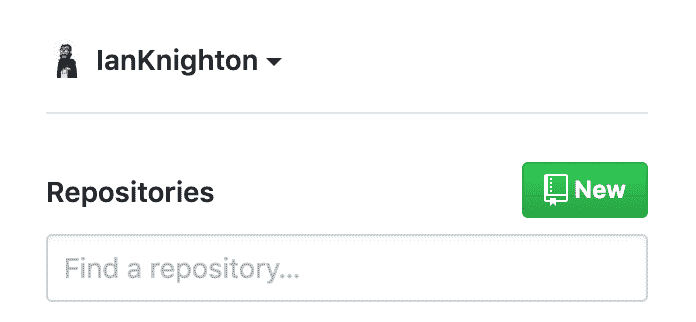
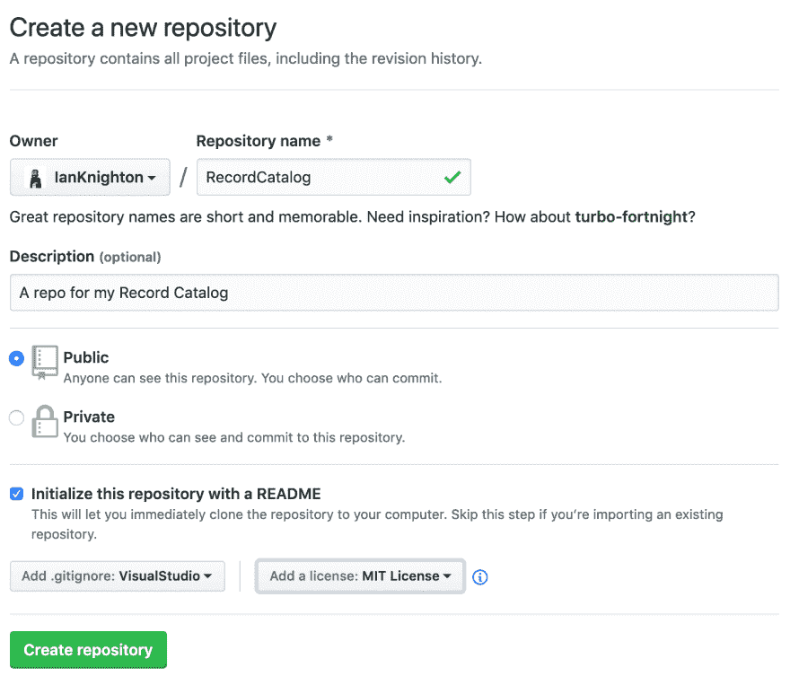
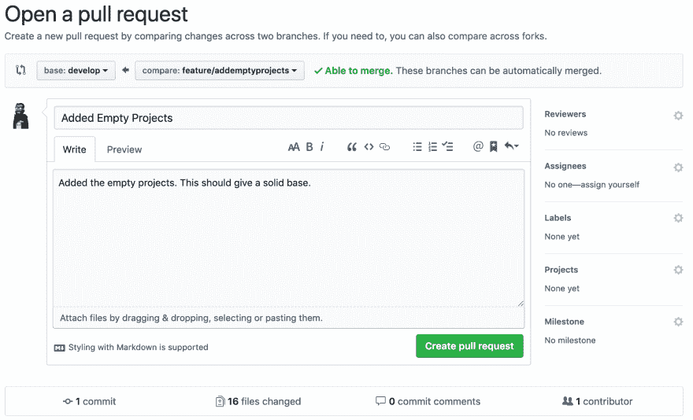

# 让我们建立:一个记录目录-第一部分

> 原文：<https://dev.to/ianknighton/lets-build-a-record-catalog---part-one-1af2>

[](https://res.cloudinary.com/practicaldev/image/fetch/s--7lwxBDtl--/c_limit%2Cf_auto%2Cfl_progressive%2Cq_auto%2Cw_880/https://images.unsplash.com/photo-1481358758723-4601c3107e65%3Fixlib%3Drb-1.2.1%26q%3D80%26fm%3Djpg%26crop%3Dentropy%26cs%3Dtinysrgb%26w%3D1080%26fit%3Dmax%26ixid%3DeyJhcHBfaWQiOjExNzczfQ)

在我们进入“有趣的东西”之前，我们需要确保我们正在一个坚实的基础上工作。

更重要的是，我们需要能够在备份所有内容时恢复更改。

## GitHub

我知道，如果你已经做到这一步，你可能已经看过和使用 GitHub 几百次了...但为了以防万一，我们要这么做。

### 创建知识库

在 GitHub 接口中有很多方法可以做到这一点。你实际上只是在寻找到处都藏着的“新”按钮。

[](https://res.cloudinary.com/practicaldev/image/fetch/s--BWm4FWjI--/c_limit%2Cf_auto%2Cfl_progressive%2Cq_auto%2Cw_880/https://ianknighton.com/conteimg/2019/03/Screenshot-2019-03-11-13.09.30.png)

这将带您进入创建存储库的屏幕。通常，我使用我最喜欢的播客之一的代号，但是既然我公开了这个，我想给它一个可识别的名字是个好主意。

[](https://res.cloudinary.com/practicaldev/image/fetch/s--w5HVKlvs--/c_limit%2Cf_auto%2Cfl_progressive%2Cq_auto%2Cw_880/https://ianknighton.com/conteimg/2019/03/Screenshot-2019-03-11-13.10.34.png)

值得注意的是，我已经选择用一个`README.md`、一个`.gitignore`文件(对于 Visual Studio)和一个许可证来初始化存储库。这通常会建立一个良好的前进路径，并帮助您在提交和推送时保持几乎所有的东西都是干净的。

一旦建立了存储库，您只需使用`git` CLI 将其克隆到您的机器上。 *( [假设你已经安装了 GIT](https://git-scm.com/book/en/v2/Getting-Started-Installing-Git))*

```
git clone https://github.com/IanKnighton/RecordCatalog.git 
```

## 轮毂流量

我在这里不是要尝试并宣扬任何管理代码的特定方法。然而，我确实认为在你的代码中始终实践某种工作流是很重要的。是的，当你独自工作的时候，完全有可能在所有的时间都投入进去，但是当你为别人工作或者和别人一起工作的时候，投入进去是一个坏习惯。

HubFlow 是一个工具，它使用了 T2 的文森特·德瑞森的想法和 T4 的 Git 分支的方法，使得它很容易应用到像 GitHub 这样的远程仓库。这是一个非常方便的工具，我用在我所有的项目上，不管有多小或多傻。

首先，您需要克隆并安装 HubFlow。可以在他们的 [GitHub 库](https://github.com/datasift/gitflow)上找到说明。

安装后，导航到您克隆的存储库并初始化 HubFlow。

```
git hf init 
```

该命令的输出应该如下所示:

```
Using default branch names.

Which branch should be used for tracking production releases?
   - master
Branch name for production releases: [master] 
Branch name for "next release" development: [develop] 

How to name your supporting branch prefixes?
Feature branches? [feature/] 
Release branches? [release/] 
Hotfix branches? [hotfix/] 
Support branches? [support/] 
Version tag prefix? [] 
Total 0 (delta 0), reused 0 (delta 0)
remote: 
remote: Create a pull request for 'develop' on GitHub by visiting:
remote: https://github.com/IanKnighton/RecordCatalog/pull/new/develop
remote: 
To github.com:IanKnighton/RecordCatalog.git
 * [new branch] develop -> develop 
```

这应该让我们开始。

我会努力记住，但今后我们要做的大多数事情都应该在一个功能分支中完成，然后在整个过程中合并。

## 添加空项目

现在我们将只添加空项目。想法是我们将有一个数据库项目，一个 API 项目，和一个 web 应用程序项目。我们还将添加一组空的测试，但是我们会看到在这个过程中我们能找到多少可测试性。我们还将添加一个解决方案文件。这使得将所有东西链接在一起成为可能，这是 Visual Studio 所需要的，但也很方便，因为您可以使用`dotnet build`并且它将一次构建所有的项目。

我希望文件夹看起来像这样:

```
RecordCatalog/
+-- API/
+-- Database/
+-- LICENSE
+-- README.md
+-- RecordCatalog.sln
+-- Tests/
+-- WebApplication 
```

此时，值得注意的是我正在。网芯 3 预览版。所以如果你还在吸毒。Net Core 2.x 或者如果你在这之后读到这篇文章。网芯 3 是出于预览，有些事情可能会有所不同。

让我们开始创建空的应用程序。首先，我们将创建一个特征分支。

```
git hf feature start addemptyprojects 
```

其输出应该如下所示:

```
Fetching origin
Switched to a new branch 'feature/addemptyprojects'
Total 0 (delta 0), reused 0 (delta 0)
remote: 
remote: Create a pull request for 'feature/addemptyprojects' on GitHub by visiting:
remote: https://github.com/IanKnighton/RecordCatalog/pull/new/feature/addemptyprojects
remote: 
To github.com:IanKnighton/RecordCatalog.git
 * [new branch] feature/addemptyprojects -> feature/addemptyprojects

Summary of actions:
- A new branch 'feature/addemptyprojects' was created, based on 'develop'
- The branch 'feature/addemptyprojects' has been pushed up to 'origin/feature/addemptyprojects'
- You are now on branch 'feature/addemptyprojects'

Now, start committing on your feature. When done, create a
pull request on GitHub. Once that has been merged, use:

     git hf feature finish addemptyprojects 
```

### 数据库项目

为了使用 DbUp，我们需要创建一个控制台应用程序。

```
dotnet new console --name Database 
```

### API 项目

对于 API，我们将使用 web API 的内置项目配置。

```
dotnet new webapi --name WebAPI 
```

### Web App 项目

web 应用程序我们将从一个完全空的 web 应用程序开始。我们最终会添加 MVC 结构，但是 MVC 项目中有一堆我不想要的东西。

```
dotnet new web --name WebApplication 
```

### 测试

现在我们将添加一个`XUnit`测试项目。

```
dotnet new xunit --name Tests 
```

### 解决方案文件

最后，我们将把所有内容绑定到一个解决方案文件中。

```
dotnet new sln 
```

这将在您的根目录下创建一个名为`RecordCatalog.sln`的文件。

为了将您的其他文件链接到解决方案，您将使用带有到`.csproj`文件的链接的`dotnet sln add`。

```
dotnet sln add Database/Database.csproj
dotnet sln add Tests/Tests.csproj
dotnet sln add WebAPI/WebAPI.csproj
dotnet sln add WebApplication/WebApplication.csproj 
```

从根文件夹中，我们现在应该能够用`dotnet build`构建所有东西，并得到类似的输出。

```
Microsoft (R) Build Engine version 16.0.443+g5775d0d6bb for .NET Core
Copyright (C) Microsoft Corporation. All rights reserved.

  Persisting no-op dg to /Users/ianknighton/Documents/GitHub/RecordCatalog/Database/obj/Database.csproj.nuget.dgspec.json
  Persisting no-op dg to /Users/ianknighton/Documents/GitHub/RecordCatalog/WebApplication/obj/WebApplication.csproj.nuget.dgspec.json
  Persisting no-op dg to /Users/ianknighton/Documents/GitHub/RecordCatalog/WebAPI/obj/WebAPI.csproj.nuget.dgspec.json
  Persisting no-op dg to /Users/ianknighton/Documents/GitHub/RecordCatalog/Tests/obj/Tests.csproj.nuget.dgspec.json
  Restore completed in 29.54 ms for /Users/ianknighton/Documents/GitHub/RecordCatalog/WebApplication/WebApplication.csproj.
  Restore completed in 29.55 ms for /Users/ianknighton/Documents/GitHub/RecordCatalog/Database/Database.csproj.
  Restore completed in 30.67 ms for /Users/ianknighton/Documents/GitHub/RecordCatalog/Tests/Tests.csproj.
  Restore completed in 29.55 ms for /Users/ianknighton/Documents/GitHub/RecordCatalog/WebAPI/WebAPI.csproj.
/usr/local/share/dotnet/sdk/3.0.100-preview3-010431/Sdks/Microsoft.NET.Sdk/targets/Microsoft.NET.RuntimeIdentifierInference.targets(151,5): message NETSDK1057: You are using a preview version of .NET Core. See: https://aka.ms/dotnet-core-preview [/Users/ianknighton/Documents/GitHub/RecordCatalog/WebApplication/WebApplication.csproj]
/usr/local/share/dotnet/sdk/3.0.100-preview3-010431/Sdks/Microsoft.NET.Sdk/targets/Microsoft.NET.RuntimeIdentifierInference.targets(151,5): message NETSDK1057: You are using a preview version of .NET Core. See: https://aka.ms/dotnet-core-preview [/Users/ianknighton/Documents/GitHub/RecordCatalog/Tests/Tests.csproj]
/usr/local/share/dotnet/sdk/3.0.100-preview3-010431/Sdks/Microsoft.NET.Sdk/targets/Microsoft.NET.RuntimeIdentifierInference.targets(151,5): message NETSDK1057: You are using a preview version of .NET Core. See: https://aka.ms/dotnet-core-preview [/Users/ianknighton/Documents/GitHub/RecordCatalog/WebAPI/WebAPI.csproj]
/usr/local/share/dotnet/sdk/3.0.100-preview3-010431/Sdks/Microsoft.NET.Sdk/targets/Microsoft.NET.RuntimeIdentifierInference.targets(151,5): message NETSDK1057: You are using a preview version of .NET Core. See: https://aka.ms/dotnet-core-preview [/Users/ianknighton/Documents/GitHub/RecordCatalog/Database/Database.csproj]
  Database -> /Users/ianknighton/Documents/GitHub/RecordCatalog/Database/bin/Debug/netcoreapp3.0/Database.dll
  WebApplication -> /Users/ianknighton/Documents/GitHub/RecordCatalog/WebApplication/bin/Debug/netcoreapp3.0/WebApplication.dll
  WebAPI -> /Users/ianknighton/Documents/GitHub/RecordCatalog/WebAPI/bin/Debug/netcoreapp3.0/WebAPI.dll
  Tests -> /Users/ianknighton/Documents/GitHub/RecordCatalog/Tests/bin/Debug/netcoreapp3.0/Tests.dll

Build succeeded.
    0 Warning(s)
    0 Error(s)

Time Elapsed 00:00:02.82 
```

在这一点上，我们应该有了构建基础所需的一切。让我们提交更改并将其上传到 GitHub。

```
git add .
git commit -a -m "Added Empty Projects"
git hf push 
```

这将所有内容放入 GitHub，现在我们需要转到 GitHub repo 并发出一个 pull 请求，将其合并到`develop`分支中。

[](https://res.cloudinary.com/practicaldev/image/fetch/s--zvbS6u_P--/c_limit%2Cf_auto%2Cfl_progressive%2Cq_auto%2Cw_880/https://ianknighton.com/conteimg/2019/03/Screenshot-2019-03-12-08.46.23.png)

完成合并后，关闭要素分支。

```
git hf feature finish addemptyprojects 
```

## 在关闭

现在，我们有很多东西，但很多都没有。在下一篇文章中，我们将开始构建数据库。至少足够让我们开始把事情联系起来。

下周见！