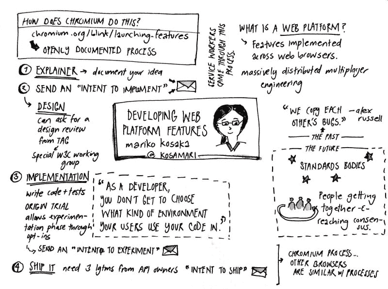

# #jskongress 2019 草图和幻灯片

> 原文：<https://dev.to/jskongress/jskongress-2019-in-sketches-and-slides-4dmh>

感谢社区，有了 2019 版的可视化时间表。请在这里找到幻灯片集合的链接，以及解释讲座内容的草图。

<figure> 

<figcaption>素描笔记作者[纳比尔·阿里](https://medium.com/u/d6ce560fde7e)关于[真理子小坂](https://medium.com/u/12579b0cb1b5)的谈话《开发 web 平台特性》</figcaption>

</figure>

### 幻灯片来自#jskongress 2019

sebastian Eck([@ Twitter 上的 codeshambles](https://twitter.com/codeshambles))开始收集幻灯片。“非常感谢，”塞巴斯蒂安！https://github.com/code-shambles/jskongress2019请添加你的或者如果你发现其他的

### 演讲，在素描笔记中形象化

我们非常兴奋地发现，两位艺术家也是议会的观众:[安德烈·科瓦奇](https://medium.com/u/6cda1bd50850)和[纳比尔拉·阿里](https://medium.com/u/d6ce560fde7e)通过他们的素描笔记，让我们更容易理解会谈的内容。非常感谢两位！ 

#### 2019 年 3 月 11 日

10:30–11:00[开幕主题演讲|一切都是插件:从内到外理解 web pack](https://js-kongress.com/sessions/opening-keynote-understanding-webpack/)作者 Sean Larkin

> 在 [#jskongress](https://twitter.com/hashtag/jskongress?src=hash&ref_src=twsrc%5Etfw) 的演讲中， [@TheLarkInn](https://twitter.com/TheLarkInn?ref_src=twsrc%5Etfw) 出色的手绘视觉效果。这些是我在听他讲述 webpack 插件如何工作时做的笔记。[pic.twitter.com/UaoBnaVuaG](https://t.co/UaoBnaVuaG)
> 
> 安德烈·科瓦奇康安德(@ andrekovac)[2019 年 3 月 12 日](https://twitter.com/andrekovac/status/1105391443101827072?ref_src=twsrc%5Etfw)

12:00–12:30[如何在 Node.js 服务器中结合事件源架构](https://js-kongress.com/sessions/how-to-combine-event-sourcing-architecture-in-your-node-js-server/)Tamar Twena-Stern

> 像专家一样处理事件流和她的 3 个孩子！  
> 
> 伟大的演讲在！[pic.twitter.com/3dTOQM815x](https://t.co/3dTOQM815x)
> 
> 安德烈·科瓦奇康安德(@ andrekovac)[2019 年 3 月 12 日](https://twitter.com/andrekovac/status/1105472348256456704?ref_src=twsrc%5Etfw)

12:30–13:00[一个 web 平台特性诞生了！—真理子·小坂的大型分布式多人工程](https://2019.js-kongress.com/sessions/a-web-platform-feature-is-born-massively-distributed-multiplayer-engineering/)

> 来自 [@kosamari](https://twitter.com/kosamari?ref_src=twsrc%5Etfw) 的伟大的 [#jskongress](https://twitter.com/hashtag/jskongress?src=hash&ref_src=twsrc%5Etfw) 关于 web 平台特性诞生的演讲。【pic.twitter.com/p1gWZczQw5 T4】
> 
> —Nabeelah Ali([@ nabeelahali](https://dev.to/nabeelahali))[2019 年 3 月 11 日](https://twitter.com/nabeelahali/status/1105089157003644929?ref_src=twsrc%5Etfw)

14:00–14:30[驯服反应节点. js:带有嵌套的面向流的架构](https://js-kongress.com/sessions/taming-reactive-node-js-stream-oriented-architecture-with-nest/)Kamil myliwiec

> [@kammysliwiec](https://twitter.com/kammysliwiec?ref_src=twsrc%5Etfw) 通过 [@nestframework](https://twitter.com/nestframework?ref_src=twsrc%5Etfw) 讲述在 [#JSKongress](https://twitter.com/hashtag/JSKongress?src=hash&ref_src=twsrc%5Etfw) 用面向流的架构屠龙。[pic.twitter.com/GKMCOlddSf](https://t.co/GKMCOlddSf)
> 
> —Nabeelah Ali([@ nabeelahali](https://dev.to/nabeelahali))[2019 年 3 月 11 日](https://twitter.com/nabeelahali/status/1105099189602660352?ref_src=twsrc%5Etfw)

15:00–15:30[咚咚咚，谁在那里？使用 JSON Web 令牌验证您的单页面应用程序。山姆·贝伦](https://js-kongress.com/sessions/knock-knock-whos-there-authenticating-your-single-page-apps-using-json-web-tokens/)

> [@sambego](https://twitter.com/sambego?ref_src=twsrc%5Etfw) 在 [#JSKongress](https://twitter.com/hashtag/JSKongress?src=hash&ref_src=twsrc%5Etfw) 上关于使用 JSON Web 令牌进行认证的原因和方法的信息性演讲。【pic.twitter.com/l83gxkQcn9 T4】
> 
> —Nabeelah Ali([@ nabeelahali](https://dev.to/nabeelahali))[2019 年 3 月 11 日](https://twitter.com/nabeelahali/status/1105113936351973376?ref_src=twsrc%5Etfw)

16:00–16:30[像外科医生一样——第一次解剖一个完全功能反应的 JavaScript 应用程序](https://js-kongress.com/sessions/like-a-surgeon-dissecting-a-completely-functional-reactive-javascript-app-for-the-very-first-time/)作者 Netta Bondy

> 喜欢 [@_bondit_](https://twitter.com/_bondit_?ref_src=twsrc%5Etfw) 在 [#JSKongress](https://twitter.com/hashtag/JSKongress?src=hash&ref_src=twsrc%5Etfw) 上关于函数式反应式编程的演讲！超级好的解释，非常幽默！pic.twitter.com/s6FaV8YCA3我对她的讲话的简要记录
> 
> 安德烈·科瓦奇康安德(@ andrekovac)[2019 年 3 月 12 日](https://twitter.com/andrekovac/status/1105389167561846784?ref_src=twsrc%5Etfw)

17:00–17:30[精心制作状态管理—基于原则的架构](https://js-kongress.com/sessions/crafting-state-management-a-principle-based-architecture/)作者:Michael Hladky

> 关于你在 [#jskongress](https://twitter.com/hashtag/jskongress?src=hash&ref_src=twsrc%5Etfw) 遵循 [@Michael_Hladky](https://twitter.com/Michael_Hladky?ref_src=twsrc%5Etfw) 的 [#flux](https://twitter.com/hashtag/flux?src=hash&ref_src=twsrc%5Etfw) 架构时应该如何管理[#前端](https://twitter.com/hashtag/FrontEnd?src=hash&ref_src=twsrc%5Etfw)中的状态的精彩总结。我的笔记。[pic.twitter.com/Begf64Riej](https://t.co/Begf64Riej)
> 
> 安德烈·科瓦奇康安德(@ andrekovac)[2019 年 3 月 12 日](https://twitter.com/andrekovac/status/1105392450535915520?ref_src=twsrc%5Etfw)

#### 2019 年 3 月 12 日

10:30–11:00[分解与超越:大规模前端工程](https://js-kongress.com/sessions/decomposition-and-beyond-frontend-engineering-at-scale/)Nadia Makarevich 著

> @nadia_jsdev 谈论在 [#atlassian](https://twitter.com/hashtag/atlassian?src=hash&ref_src=twsrc%5Etfw) 重写吉拉前端期间的经验教训，以及如何与众多分布式开发者 [@JSKongress](https://twitter.com/JSKongress?ref_src=twsrc%5Etfw) 结盟。【pic.twitter.com/g4kYIGs8bh T4】
> 
> —Nabeelah Ali([@ nabeelahali](https://dev.to/nabeelahali))[2019 年 3 月 12 日](https://twitter.com/nabeelahali/status/1105414015302488064?ref_src=twsrc%5Etfw)

11:30–12:00[Angular、React、Vue 和 co .——得益于 Manfred Steyer 的 Web 组件和微应用程序](https://js-kongress.com/sessions/angular-react-vue-and-co-peacefully-united-thanks-to-web-components-and-micro-apps/),和平地联合在一起

> 微应用 ftw！感谢您在 pic.twitter.com/jnp6cCFpZK[【女记者](https://twitter.com/hashtag/JSKongress?src=hash&ref_src=twsrc%5Etfw)的精彩演讲
> 
> 安德烈·科瓦奇康安德(@ andrekovac)[2019 年 3 月 12 日](https://twitter.com/andrekovac/status/1105461298995871744?ref_src=twsrc%5Etfw)

12:00–12:30[埃里克·温德尔用 Kubernetes 和 Docker](https://js-kongress.com/sessions/scaling-node-js-applications-with-kubernetes-and-docker/) 扩展 Node.js 应用程序

> @erickwendel_ 在 [#jskongress](https://twitter.com/hashtag/jskongress?src=hash&ref_src=twsrc%5Etfw) 关于 [#Docker](https://twitter.com/hashtag/Docker?src=hash&ref_src=twsrc%5Etfw) 和[# Kubernetes](https://twitter.com/hashtag/Kubernetes?src=hash&ref_src=twsrc%5Etfw)[pic.twitter.com/LBxAHMWhuX](https://t.co/LBxAHMWhuX)的演讲中充满了力量和激情
> 
> 安德烈·科瓦奇康安德(@ andrekovac)[2019 年 3 月 12 日](https://twitter.com/andrekovac/status/1105489140529971200?ref_src=twsrc%5Etfw)

12:30–13:00[超越 JavaScript:现代网络语言](https://2019.js-kongress.com/sessions/beyond-javascript/)Julian Antonielli 著

> 3 个编译成 [#javascript](https://twitter.com/hashtag/javascript?src=hash&ref_src=twsrc%5Etfw) 的可选函数示例，一个漂亮的实时演示，一个关于为什么这些工具在 [#JSKongress](https://twitter.com/hashtag/JSKongress?src=hash&ref_src=twsrc%5Etfw) 非常有用的演示！谢谢@_jjant 让你的第一次会议演讲如此精彩！[pic.twitter.com/1eIhLBOehW](https://t.co/1eIhLBOehW)
> 
> 安德烈·科瓦奇康安德(@ andrekovac)[2019 年 3 月 12 日](https://twitter.com/andrekovac/status/1105466662306922496?ref_src=twsrc%5Etfw)

14:00–14:30[编织工人的网](https://js-kongress.com/sessions/weaving-webs-of-workers/)特伦特·威利斯

> 哇！网络工作者的世界即将迎来伟大的事情！在 pic.twitter.com/oAG2xTb2Wq[#女记者](https://twitter.com/hashtag/JSKongress?src=hash&ref_src=twsrc%5Etfw)的 [@trentmwillis](https://twitter.com/trentmwillis?ref_src=twsrc%5Etfw) 精彩介绍
> 
> 安德烈·科瓦奇康安德(@ andrekovac)[2019 年 3 月 12 日](https://twitter.com/andrekovac/status/1105463197996339202?ref_src=twsrc%5Etfw)

14:30–15:00[让你的用户决定他们想要什么](https://js-kongress.com/sessions/let-your-users-decide-what-they-want/)纳伦德拉·谢蒂

> [@narendra_shetty](https://twitter.com/narendra_shetty?ref_src=twsrc%5Etfw) 关于 A/B 测试有很多话要说！在 pic.twitter.com/omcakC3LH0[的演讲](https://t.co/omcakC3LH0)
> 
> 安德烈·科瓦奇康安德(@ andrekovac)[2019 年 3 月 12 日](https://twitter.com/andrekovac/status/1105486268908093441?ref_src=twsrc%5Etfw)

16:30–17:00[流式 HTTP 和 graph QL](https://js-kongress.com/sessions/streaming-http-and-graphql/)Rob Richard

> 在 [@rob_richard](https://twitter.com/rob_richard?ref_src=twsrc%5Etfw) 的 HTTP 流对话 [#jskongress](https://twitter.com/hashtag/jskongress?src=hash&ref_src=twsrc%5Etfw) 中了解到“ [@defer](https://twitter.com/defer?ref_src=twsrc%5Etfw) ”。很酷的东西！[pic.twitter.com/mHFhFYKhLu](https://t.co/mHFhFYKhLu)
> 
> 安德烈·科瓦奇康安德(@ andrekovac)[2019 年 3 月 12 日](https://twitter.com/andrekovac/status/1105568585844432899?ref_src=twsrc%5Etfw)

* * *

增加了可视时间表或在网上找到了一些幻灯片？请在此添加视觉效果，并添加到[https://github.com/code-shambles/jskongress2019](https://github.com/code-shambles/jskongress2019)的幻灯片的链接

更多视频将很快在我们的 [YouTube 频道](https://www.youtube.com/jskongress)(一有视频就订阅通知)——所有的演讲都已录制完毕，所有发言者都同意发布。我们的摄制组正在进行后期制作，我们将在接下来的几周内陆续发布这些录像。

草图和幻灯片中的帖子[# JS KONGRESS 2019](https://js-kongress.com/2019/03/15/jskongress-2019-in-sketches-and-slides/)最早出现在 [JS KONGRESS 2020:扩展 JS——推动极限:大规模平台、数据驱动的架构和现代 API。](https://js-kongress.com)。