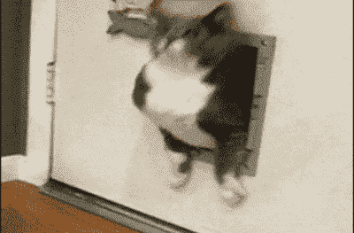

# 初学者的递归函数

> 原文：<https://dev.to/jessicabetts/recursive-functions-for-beginners-1j8g>

如果你已经读到这一页，你可能正在为递归的概念而挣扎。你并不孤单。作为程序员，我们首先学习基本的迭代循环结构。当被要求用递归完成同样的任务时，我发现很难知道从哪里开始。我选择写这个主题来强迫自己学习更多的相关知识，并练习写递归函数！

递归函数本质上与迭代循环相同。他们都重复做一个程序，但方式不同。递归函数不使用 while、for 或 do 循环，而是通过调用自身来重复一个过程。但是，我所说的称呼本身是什么意思呢？让我们看一些例子...

下面是一个传统的 while 循环，它会显示一条消息告诉用户“猫仍然很饿”，直到没有剩下更多的罐头食品。

```
def feedCat(cans_of_food)
  while cans_of_food > 0
    puts "The cat is still hungry"
    cans_of_food -= 1
  end
  puts "There are no more cans of food, the cat is full... hopefully"
end

feedCat(4) #feed your cat 4 times to make them full! 
```

通过做一些小的调整，我们可以使用递归
编写相同的函数

```
def feedCat(cans_of_food)
  if cans_of_food > 0 # recursive case
    puts "cat is still hungry"
    feedCat(cans_of_food - 1)
  end
  # base case, cans_of_food <= 0
  puts "There are no more cans of food, the cat is full... hopefully" 
end

feedCat(4) 
```

你可以看到代码实际上看起来非常类似于上面的迭代循环。代码不再返回到“when”循环的顶部，而是再次调用自己。我想指出的是，如果我们没有在递归调用的参数中增加 *cans_of_food* 的减量，我们就会陷入无限循环。猫会不断地被喂食，罐头食品永远不会减少....事实上，我认为猫会喜欢的....

[](https://i.giphy.com/media/xUe3hdl4MY59NcMyjy/giphy.gif)

## 将迭代转化为递归

经验法则:如果你被困住了，首先构建你的迭代循环！

1.  在上面的例子*中用 if 条件
    替换循环的开始，而 can _ of _ food>0*被改为*if can _ of _ food>0*T5】这是**递归情况**。它告诉你在什么情况下你会继续下去。

2.  用递归调用替换迭代变量 line 上例中的
    *cans _ of _ food-= 1*改为 *feedCat(cans_of_food - 1)*

3.  确定**基本情况**，也称为结束条件。基本情况非常类似于迭代循环的条件。没有它，函数将永远重复！！在上面的例子中，基本情况是*if cans_of_food < = 0 *。我们也可以先写我们的递归函数来获得基本情况！

```
def feedCat(cans_of_food)
  if cans_of_food <= 0 # base case
    puts "There are no more cans of food, the cat is full... hopefully"
  else #recursive case, cans_of_food > 0
    puts "cat is still hungry"
    feedCat(cans_of_food - 1)
  end 
end

feedCat(4) 
```

这种语法可能并不总是翻译准确，但它是一个很好的指导，以帮助新的“递归”。

上面喂猫的例子可以归类为直接递归，因为这个方法只调用它自己。还有间接递归函数，其中一个函数调用第二个函数，第二个函数调用第三个函数，第三个函数又调用第一个函数。

## 不是所有的长方形都是正方形

所有的迭代循环都可以变成递归函数。然而，并不是所有的递归函数都可以是迭代循环，或者它们至少**非常**复杂。在简单的应用程序中你找不到递归。然而，它们在数学编程、搜索算法和编译器中特别有用。

下面我们有星巴克饮料的例子....斐波那契数列的例子。纤维是 0 + 1 = 1，1 + 1 = 2，1 + 2 = 3，2 + 3 = 5，3 + 5 = 8...等等。将前面的两个数字相加得到当前的总数。

```
def fib(num)
  if num > 1 #recursive case
    return fib(num - 1) + fib(num - 2)
  end
  return num #base case, num <= 1
end

puts fib(10) 
```

另一个常见的例子是阶乘函数。如果给定 6 的阶乘，你得到 6 * 5 * 4 * 3 * 2 * 1 = 720。下面是你如何使用递归来解这个数学方程。

```
def fact(num)
    if num <= 1
        return n
    else
        return n * fact(n - 1)
    end
end

puts fact(6) 
```

## 你能做的事我也能做...更贵？

选择迭代还是递归时，请考虑您的选择。基本思想是，每次递归调用都要花费宝贵的时间和空间。所以在选择路线时要考虑潜在的性能问题。[点击此处](https://gist.github.com/abinoda/5593052)向阿比诺达了解更多！

## 有趣的行为

我不知道这种行为，直到摆弄代码。在下面代码片段的迭代循环版本中，您会期望输出看起来像 10，9，8，7...等等。通过单击 run 按钮，我们可以看到最小的数字 0 首先显示出来。

[https://repl.it/@jessicaannbetts/NervousPurpleFacts?lite=true](https://repl.it/@jessicaannbetts/NervousPurpleFacts?lite=true)

这是因为 puts 试图显示一个值，它必须首先完成对所有方法调用的评估。它试图打印，说好的，我们必须计算出 *printNum(num - 1)* 的值。然后它必须执行 *printNum(num - 1)* 直到它到达基本情况。我喜欢把这看作是深入代码层。比如你如何能更深地钻入地球的地层，接近地核。在最后一次调用 printNum 时，Num 为 0。此时，该函数打印它接收的第一个值 0(代码“core”)。所以它打印 0，然后沿着代码层向上运行。

递归层是先入后出(FILO)的一种形式，也称为堆栈。所以 num 10 是我们传递给* puts printNum(num - 1)*的第一个值，但是 10 打印值 10 是最后一个操作！

我希望这个小演示和例子能帮助你理解递归！

向一位迷人的绅士上一堂递归的历史课！[跟随链接！](https://www.youtube.com/watch?v=HXNhEYqFo0o&t=442s)