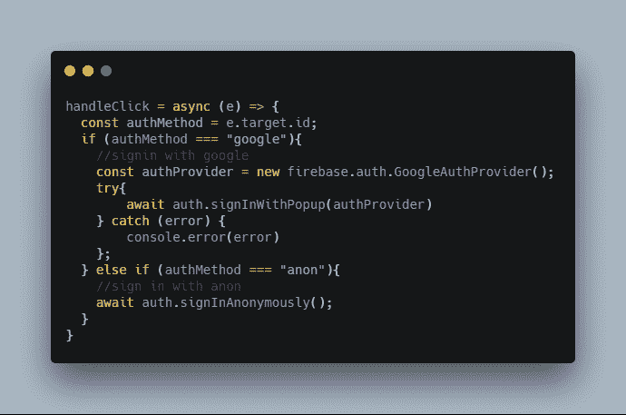
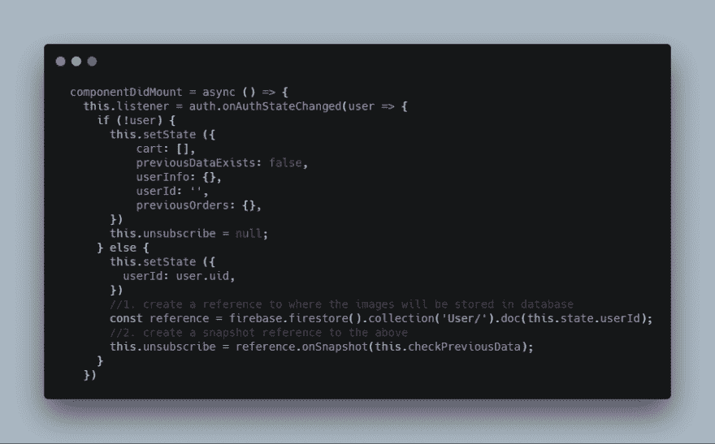
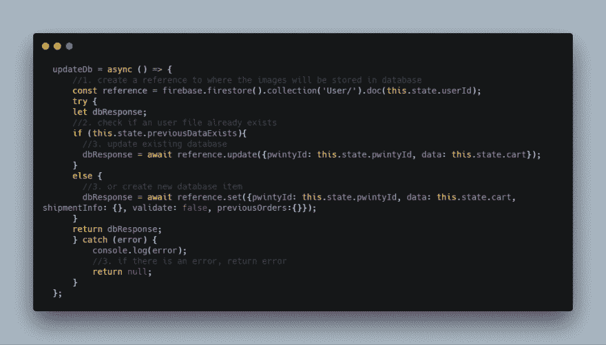
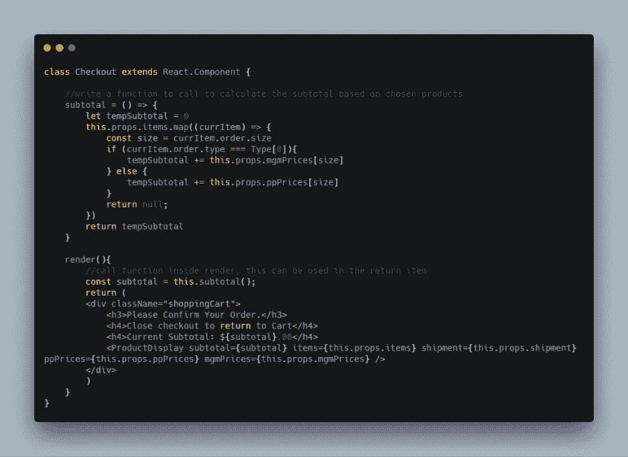
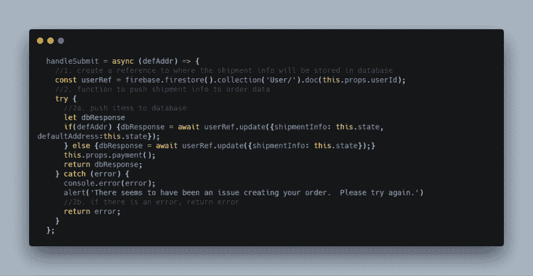
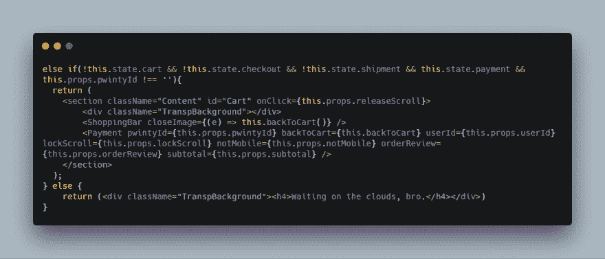
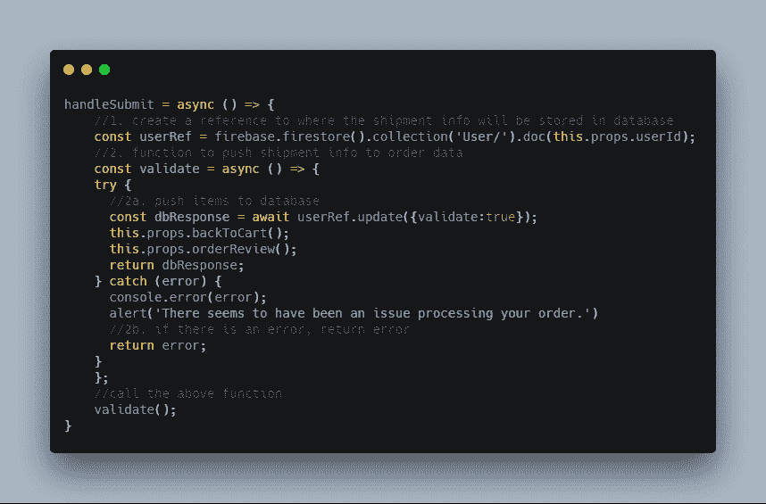

# React 和 Firebase 电子商务网站演练

> 原文：<https://dev.to/andersjr1984/react-and-firebase-ecommerce-site-walkthrough-2h5b>

### 电子商务网站演练:

几周前，我在 React 和 Firebase 上发布了一个简单的购物车。从那时起，我一直致力于完成该网站，现在它是一个主要功能的摄影商业网站。与其提供一个教程，我想不如向您展示一个商品从被添加到购物车，到被购买，最后利用 Pwinty 的 API 和所有相关代码创建一个照片订单的过程。我对此还是新手，所以如果你有任何意见或建议，请随时参与讨论。该网站尚未完成，您将不会创建任何实际订单，所以请随时遵循以下描述的每个步骤(如果您遇到任何困难，请让我知道)。对于像我这样的新手来说，如果你正试图完成以下任何一项，这篇文章将会帮助你:

*   将状态从子组件传递到父组件
*   对用户进行身份验证，并保存他们的状态以供后续登录事件使用。
*   使用 Firebase 的 Firestore 为一个站点创建一个简单的后端数据库
*   在数据库更新时触发后端 Firebase 功能
*   选择要使用的正确功能

如果你想在阅读前看到推车的动作，请访问[绿猫头鹰摄影](https://green-owl-photography.firebaseapp.com/)。
想给我工作的人，请访问我的[作品集](https://andersjr1984.github.io/portfolio/)。
如果你对购物车代码感兴趣，这也发布在 [GitHub](https://github.com/andersjr1984/ReactShoppingCart/releases/latest) 上。
在任何数据库更新中调用的 Firebase 函数都可以在这里看到[，它很长并且被大量注释，所以我不想中断流程并将其放在演练中。](https://andersjr1984.github.io/portfolio/static/media/updateTest.b05ea8f5.png)

我不想对创建 Pwinty 订单的 Firebase 函数做太多的详细描述，它本身就值得一篇文章来讨论。一旦我将条纹支付集成到沙盒中，我将会写一整篇关于使用 Firebase 函数创建 Pwinty 订单和处理支付的帖子！如果你愿意，你可以去我的网站，按照每个列表项目，看看你是否能打破一些东西(如果你做到了，请告诉我)。

1.  为了让自己熟悉这个项目的结构，有一个充当商店的主应用程序，一个指导你从登录到支付的订单处理页面，以及让你结账所需的所有页面。OrderProcessing.js 和所有引导您提交订单的页面都在 [GitHub](https://github.com/andersjr1984/ReactShoppingCart/releases/latest) 上。
2.  转到大格式或小格式页面，并添加一些物品到您的购物车。这只是更新了应用程序中的一个全局状态，该状态将作为 prop 传递到 OrderProcessing.js 文件中。
3.  转到页面的购物车部分，这是您需要登录的地方。选择您选择的登录方法。如果你想了解使用 Firebase 的 OAuth，我推荐你点击这里查看 Firebase 的 YouTube 视频。代码超级简单，见下图！

5.  在后台，应用程序正在监听授权状态的变化。一旦发生这种情况，它会用您的购物车信息更新 Firestore 数据库。

8.  你来到的第一页是“购物车”。在这里，您可以选择上面所选项目的大小、类型和数量。每一个变化都被立即发送到数据库进行更新，这是一种浪费，但我不认为发送一点点文本会破坏带宽。购物车的内部[工作有一个自己的](https://dev.to/andersjr1984/react-shopping-cart-tutorial-and-code-2609)post，在子组件与它们的父母和祖父母之间共享状态。因为购物车可以浏览页面，所以我在单页滚动上实现了一个滚动锁，可以通过在购物车内部单击来打开，通过在购物车外部单击来解锁。
9.  对购物车的任何更改都会调用 [Firebase 函数](https://andersjr1984.github.io/portfolio/static/media/updateTest.b05ea8f5.png)来查看是否需要发生什么。如果只添加、删除或调整图像，Firebase 将不会调用任何函数！
10.  更新完所有产品后，您将被转到一个查看订单页面，如有必要，该页面将让您返回购物车。该页面还共享购物车中商品的小计。以下是渲染组件:

12.  您的下一页将是您添加货件详细信息的地方。表单的验证相当粗略，它只检查用户是否留下了任何空白。如果我在沙盒之外部署它，我可能会花更多的时间来支持它。我做的一件很酷的事情是允许用户更新他们的“默认”地址。我是通过发送一个布尔值来做到这一点的，如果你点击下面的按钮来更新默认值，那么这个布尔值就是真的。

14.  一旦 DB 看到您已经输入了装运信息，它将创建您的 Pwinty 订单。在前端，我不会让客户端显示支付页面，直到母州收到您的 Pwinty 订单 ID。当我走得太快时，我犯了一些非常严重的错误，有时可能需要几秒钟来创建您的 Pwinty 订单。完整的代码可以在 [GitHub](https://github.com/andersjr1984/ReactShoppingCart/releases/latest) 上的 OrderProcessing.js 文件中看到。

16.  哦，孩子，现在你来了。过一会儿，云页面上的等待应该会消失，您应该会在页面顶部看到您的 Pwinty 订单 ID 和一个“承诺付款”按钮。单击该按钮后，您的订单将被验证，并在 Pwinty 上进行处理。这是你的图像发送到 Pwinty 的地方，我不想在这之前发送图像，因为我不想破坏 Pwinty 的带宽。

18.  一旦我实现了支付，我只会在后端验证支付后更新您的订单验证。基于我无知的观点，更新并允许在前端验证这个项目是自找麻烦。
19.  出于本演练的目的，我已经禁用了 Pwinty 函数调用。我不需要他们因为我(希望)给他们的数据库打了数百个电话而对我发火。相反，在五秒钟的超时后，每个订单都返回一个订单 ID 的随机数。
20.  现在您已经完成了订单，您将转到“查看订单”页面。如果您稍等片刻，将会显示您订单的详细信息。