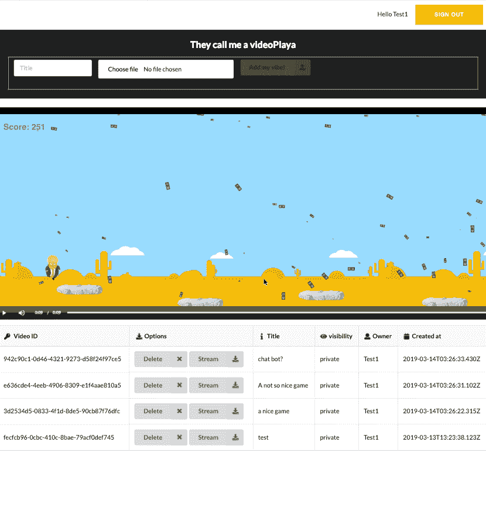
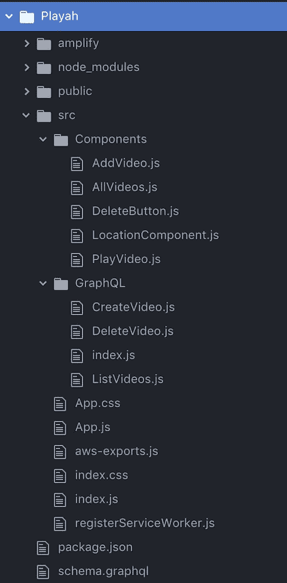
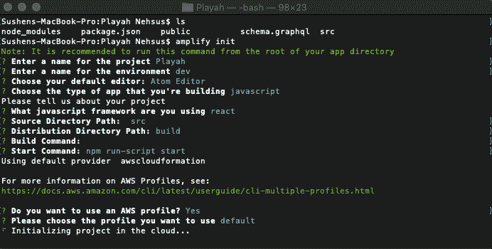
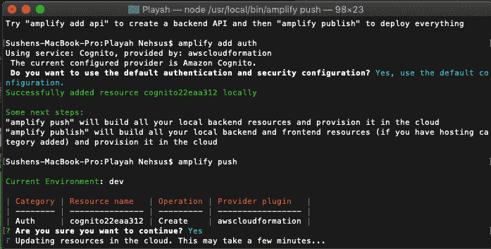
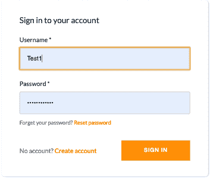

# 使用 React 和 AWS Amplify 的无服务器视频流

> 原文：<https://dev.to/nehsus/serverless-video-streaming-with-react-and-aws-amplify-5f8c>

是时候我们强调身份验证是每个移动和 web 应用程序中的一个重要组成部分了。构建一个强大而复杂的身份验证工作流通常需要考虑以下因素:

*   安全地认证大量用户。
*   显示一个现代化的用户界面，用一种相当简单的方式来定制用户体验。
*   应该跨应用程序的所有组件处理会话。

In this article, we will be achieving the tedious functions above, and more, in a simple web app written with React and AWS Amplify. Link to full repo: *coming soon!*

# 1.概观

Here's a quick look of what we are going to be building, a simple UI auth-flow with active video listings and streaming links.  How is this UI represented in the file hierarchy?

*   *src/* 将包含我们所有的源文件，包括组件和 GraphQL 的变异和查询
*   *amplify/* 保存我们所有的 AWS 信息，包括后端和认证细节。如果需要，可以在*amplify/back end/API/Playah/*上编辑 schema.graphql
*   我们所有的包都将保存在*节点模块/* 中
*   *public/* 包含要渲染的公共 index.html。
*   此外，根目录中的文件 schema.graphql 将定义一个带注释的 GraphQL SDL，以便我们与后端进行对话。

[](https://res.cloudinary.com/practicaldev/image/fetch/s--GxeMjqrz--/c_limit%2Cf_auto%2Cfl_progressive%2Cq_auto%2Cw_880/https://thepracticaldev.s3.amazonaws.com/i/c61br2arptfzqohb677t.png)

# 2.安装必备组件

让我们从设置依赖项和初始化名为 *Playah* 的新 react 应用开始。
要使用 *aws-amplify* ，我们需要配置相应的软件包:

T2`npm install -g @aws-amplify/cli
npm install --save aws-amplify-react
create-react-app Playa` 

如果您已经克隆了回购，请继续操作:

T2`npm install --save`

启动应用程序进行快速测试，您应该会收到 React 欢迎屏幕。

T2`react run start`

一旦我们的应用程序设置完毕，amplify CLI 安装完毕，我们需要对其进行配置，以便在我们的 AWS 帐户中添加资源。运行 *amplify configure* 以设置为新的 aws 用户或使用 api 密钥。添加您各自的 IAM 详细信息并继续。

T2`amplify configure` 

运行 *amplify init* 继续设置新的 AWS Amplify 和新的开发环境。
T3T5】

现在，我们将身份认证资源添加到我们的环境中。让我们使用以下方法来实现这一点:

T2`amplify add auth
amplify status`

选择默认身份验证配置并继续。完成后，我们需要通过运行以下命令将其推送到我们的帐户:

T2`amplify push`

[](https://res.cloudinary.com/practicaldev/image/fetch/s--pqXxdy5x--/c_limit%2Cf_auto%2Cfl_progressive%2Cq_auto%2Cw_880/https://thepracticaldev.s3.amazonaws.com/i/2atzum3k45vi357sarzv.png) 
运行*放大状态*再次检查认证状态。创建服务后，我们可以随时在 AWS 控制台的 Cognito 仪表板中查看它。在运行上面的命令时，会自动生成 *aws-exports.js* 文件。**不要在任何时候编辑该文件，它包含我们的 API 密钥和处理认证所需的其他客户端池信息；我们将简单地把这个文件导入到我们的 *App.js* 中。**

# 3.授权工作流程

让我们开始用 React 配置 Amplify，并用一个认证屏幕启动我们的第一个工作流。
现在我们已经生成了 *aws-exports.js* ，让我们将它导入到我们的 App.js 中，并编写一些代码来进行配置，包括一些新的导入，确保在导入之前 npm 安装所有的导入。
*App.js*

```
import awsconfig from './aws-exports';
import AWSAppSyncClient from 'aws-appsync';
import { Rehydrated } from 'aws-appsync-react'; 
import { ApolloProvider } from 'react-apollo';
//amplify init
Amplify.configure(awsconfig);

const GRAPHQL_API_REGION = awsconfig.aws_appsync_region
const GRAPHQL_API_ENDPOINT_URL = awsconfig.aws_appsync_graphqlEndpoint
const S3_BUCKET_REGION = awsconfig.aws_user_files_s3_bucket_region
const S3_BUCKET_NAME = awsconfig.aws_user_files_s3_bucket
const AUTH_TYPE = awsconfig.aws_appsync_authenticationType

const client = new AWSAppSyncClient({
  url: GRAPHQL_API_ENDPOINT_URL,
  region: GRAPHQL_API_REGION,
  auth: {
    type: AUTH_TYPE,
    // Get the currently logged in users credential.
    jwtToken: async () => (await Auth.currentSession()).getAccessToken().getJwtToken(),
  },
  complexObjectsCredentials: () => Auth.currentCredentials()
}); 
```

创建一个名为 *App.css* 的新文件，并将以下内容添加到 style 中:

```
.App {
  text-align: center;
}

.header {
  background-color: #222;
  color: #FFF;
  padding: 20px;
  margin-bottom: 20px;
  color: white;
}

.App-title {
  font-size: 1.5em;
} 
```

我们现在已经配置了我们的应用程序，因此它可以有效地与我们的 auth 和 api 后端对话。如前所述，我们将使用 GraphQL 来操作数据库中的对象，因此让我们分别设置 API 和存储的端点。
我们还将从 *aws-appsync* 安装并导入**awsapsyncplient**，因为它支持一些高级功能，同时为 **gql** 集成 **ApolloProvider** ，包括缓存，这将使事情变得容易得多。

' App.js '的其余部分看起来是这样的:
*App.js*

```
class App extends Component{
  render(){
    return(
      return (
        <div className="App">
          <header className="header">
          <h1 className="App-title">They call me a videoPlaya</h1>
          </header>
        </div>
      );
    )
  }
}
const AppWithAuth = withAuthenticator(App, true);
export default () => (
  <ApolloProvider client={client}>
    <Rehydrated>
      <AppWithAuth>
      </AppWithAuth>
    </Rehydrated>
  </ApolloProvider> ); 
```

**ApolloProvider** 是一个组件，它使我们的任何组件都可以使用 graphql()函数。**再水合**将确保我们等到应用程序缓存被读取，然后再渲染应用程序。

现在我们已经准备好了 App.js，让我们再修改一下，让它准备好接受身份验证。
用 amplify 处理认证有几种方法，但我们将使用带有认证者 **的*高阶组件开始。***该组件将整个认证机制抽象成最少的代码行。如上所示，我们的 App 组件简单地使用带有身份验证者的*组件进行包装。就是这样！让我们点击“刷新”,看看我们得到了什么！
[](https://res.cloudinary.com/practicaldev/image/fetch/s--4TYoDg08--/c_limit%2Cf_auto%2Cfl_progressive%2Cq_auto%2Cw_880/https://thepracticaldev.s3.amazonaws.com/i/v2q73iy0z1tn7likhuxc.png)*

点击“创建帐户”并输入您的详细信息进行注册。
这样，我们就创建了一个功能齐全、完善的身份认证工作流程。
登录后，您将返回到应用程序的主页。
感谢您阅读本文的第一部分。在**的下一部分**中，我们将讨论如何在视频和家庭组件之间**处理** **状态**，并配置我们的 *graphQL 模式*和 *aws-amplify* 来处理一些数据。
敬请期待！