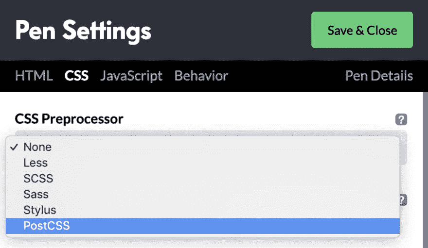
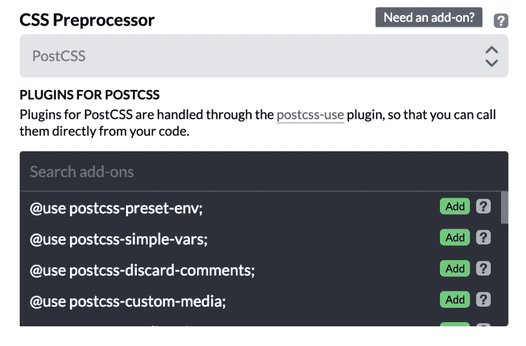

# 2019 年 PostCSS 入门

> 原文：<https://dev.to/bnevilleoneill/getting-started-with-postcss-in-2019-6k9>

[](https://res.cloudinary.com/practicaldev/image/fetch/s--yWmBEFW1--/c_limit%2Cf_auto%2Cfl_progressive%2Cq_auto%2Cw_880/https://cdn-images-1.medium.com/max/1024/1%2AjZHK_7MHJA7-2FqQeSnzIQ.jpeg)

如果您曾经想在代码中尝试新的、实验性的或非标准的 CSS 属性，那么您知道浏览器供应商要求您添加前缀以使它们工作，直到它们完全标准化。

```
.some-element {
 box-sizing: border-box;
 -webkit-box-sizing: border-box;  // chrome, safari prefix
 -moz-box-sizing: border-box;     // firefox
 -o-box-sizing: border-box;       // old opera versions
 -ms-box-sizing: border-box;      // IE, Microsoft Edge
} 
```

您必须监视不同的 CSS 属性，以了解浏览器供应商何时开始支持它们，此时您可以删除相应的前缀。

谢天谢地，现在我们有了[自动修复程序](https://github.com/postcss/autoprefixer)。这是一个来自 [npm](https://www.npmjs.com/) 的 CLI 工具，它扫描你的代码，并使用来自[我可以使用吗](https://caniuse.com)的值将供应商前缀添加到 CSS 规则中。Autoprefixer 是众多 PostCSS 插件中的一个，它抓住了 PostCSS 的精髓。

### 什么是 PostCSS，真的？

PostCSS 是一个用 JavaScript 插件转换 CSS 的工具。它通过其广泛的[插件生态系统](https://www.postcss.parts/)提供功能来帮助改善你的 CSS 编写体验。你可以选择你需要的插件，甚至为自己写一个定制的。

一般来说，PostCSS 插件允许你像平常一样编写普通的 CSS，一旦被调用，它们会扫描代码来执行所需的转换。

但是，请注意，有些 PostCSS 插件并不转换普通的 CSS，而是基于类似 Sass 的语法进行操作。一个例子是 [PostCSS 简单变量](https://github.com/postcss/postcss-simple-vars)插件，它允许您实现可以在整个代码中重用的变量(就像在 Sass 中一样),如下所示。

```
$color-brand: darkgrey;
$font-size: 1em;
body {
 color: $color-brand;
 font-size: $font-size;
} 
```

这个特性在这个时候不是特别相关，因为 */CSS variables/* 已经作为 CSS 中的一个固有特性发布了，PostCSS 可以将最新的 CSSNext 语法转换成旧浏览器可以理解的友好 CSS。

[](https://logrocket.com/signup/)

### 为什么要用 PostCSS？

让我们通过 PostCSS 插件的强大功能来看看它的一些用例。

#### 自粘

如前所述，Autoprefixer 插件将使用 Can I Use 中的值向 CSS 属性添加供应商前缀。这减少了代码中的混乱，提高了可读性。例如，这个输入:

```
:fullscreen {
} 
```

给出这个输出:

```
:-webkit-:full-screen {}
:-moz-:full-screen {}
:full-screen {} 
```

#### 使用浏览器理解的 CSSNext 特性

使用 [PostCSS Preset Env](https://github.com/csstools/postcss-preset-env) 插件，您可以编写未来的 CSS 语法，插件将通过制定必要的 polyfill 将其转换为浏览器可以理解的 CSS。比如这个输入:

```
@custom-media --med (width <= 50rem); 
```

```
@media (--med) {
  a { 
    &:hover {
      color: color-mod(black alpha(54%));
    }
  }
} 
```

给出这个输出:

```
@media (max-width: 50rem) {
  a:hover  { 
    color: rgba(0, 0, 0, 0.54);
  }
} 
```

#### 避免 CSS 中的错误

stylelint 插件指出你的 CSS 代码中的错误。它支持最新的 CSS 语法。比如这个输入:

```
a { 
  color: #d3;
} 
```

给出这个输出:

```
app.css
2:10 Invalid hex color 
```

#### 使用本地范围的 CSS 类名

使用 [CSS 模块](https://github.com/css-modules/css-modules)插件，你可以编写局部作用于组件的 CSS，这意味着无论你的 CSS 类名有多普通，它们之间都不会有任何冲突。比如这个输入:

```
.name {
  color: grey;
} 
```

给出这个输出:

```
.Logo__name__SVK0g {
  color: gray;
} 
```

#### 打造惊艳网格

[LostGrid](https://github.com/peterramsing/lost) 插件使用 *calc()* 根据你定义的分数创建网格，而不需要传递很多选项。比如这个输入:

```
div {
  lost-column: 1/3 
} 
```

给出这个输出:

```
div {
  width: calc(99.9% * 1/3 -  
  (30px - 30px * 1/3)); 
}
div:nth-child(1n) {
  float: left; 
  margin-right: 30px; 
  clear: none; 
}
div:last-child {
  margin-right: 0; 
}
div:nth-child(3n) {
  margin-right: 0; 
  float: right; 
}
div:nth-child(3n + 1) {
  clear: both; 
} 
```

### PostCSS、Sass 和 Less 的区别

postscs 可以做和 Sass、Less、Stylus 等预处理程序一样的工作，但是 postscs 是模块化的，而且以我的经验来看，速度更快。

PostCSS 和 CSS 预处理程序的主要区别在于你可以选择你需要的特性。Sass 和 Less 为您提供了许多您可能使用也可能不使用的特性，并且您无法扩展这些特性。

如果你想在当前堆栈中保留 Sass、Less 或 Stylus，但仍想让 PostCSS 执行 Sass 不能执行的其他功能(例如，自动修复或林挺)，[本文](https://webdesign.tutsplus.com/tutorials/using-postcss-together-with-sass-stylus-or-less--cms-24591)详细介绍了如何做。

还有像 [PostCSS Sass](https://www.npmjs.com/package/postcss-sass) 和 [PreCSS](https://github.com/jonathantneal/precss) 这样的 PostCSS 插件，本质上是 Sass 的完全替代。这意味着你可以用 PostCSS 编写你自己的预处理器。

### 使用 Codepen 进行快速 PostCSS 设置

首先登录 Codepen.io，并执行以下步骤:

1.  创建新钢笔。
2.  点击窗口顶部的**设置**，显示设置面板。

[](https://res.cloudinary.com/practicaldev/image/fetch/s--Ktt6z_M5--/c_limit%2Cf_auto%2Cfl_progressive%2Cq_auto%2Cw_880/https://cdn-images-1.medium.com/max/970/1%2Av0HUjCr8ooPxCztI3-1Qvw.png)

1.  从顶部选项卡中选择 **CSS** 以显示 CSS 设置。

[](https://res.cloudinary.com/practicaldev/image/fetch/s--XdCMx-Zq--/c_limit%2Cf_auto%2Cfl_progressive%2Cq_auto%2Cw_880/https://cdn-images-1.medium.com/max/1024/1%2ABfve9nrfgCzWw0PD1LUiGw.png)

1.  选择 **CSS 处理器**下拉菜单，然后从下拉菜单中选择**邮政 CSS** 。

[](https://res.cloudinary.com/practicaldev/image/fetch/s--lW3jSrim--/c_limit%2Cf_auto%2Cfl_progressive%2Cq_auto%2Cw_880/https://cdn-images-1.medium.com/max/1024/1%2AAjqFdTO2UeexWMmZL2guyQ.png)

1.  点击**需要一个附加组件吗？**显示出来的徽章。将显示一个插件列表，您可以从中搜索并选择所需的插件。让我们**添加**这个 **postcss-simple-vars** 插件来试验变量。选择**保存&关闭**。

[](https://res.cloudinary.com/practicaldev/image/fetch/s--ZuoxCm5j--/c_limit%2Cf_auto%2Cfl_progressive%2Cq_auto%2Cw_880/https://cdn-images-1.medium.com/max/1014/1%2ARitserMyV2SRaqRROuIb-w.png)

回到 CSS 窗口，你会注意到插件已经被引用使用。我们现在可以自由访问它的所有功能。

```
@use postcss-simple-vars; 
```

在 CSS 窗口中使用变量插入 HTML 和 CSS 示例:

[](https://res.cloudinary.com/practicaldev/image/fetch/s--rUJ39tkK--/c_limit%2Cf_auto%2Cfl_progressive%2Cq_auto%2Cw_880/https://cdn-images-1.medium.com/max/1024/1%2AnjYh2LLr36VG_09r1OVGvA.png)

#### 演示

[https://codepen.io/emmyyusufu/embed/ywLLeK?height=600&default-tab=result&embed-version=2](https://codepen.io/emmyyusufu/embed/ywLLeK?height=600&default-tab=result&embed-version=2)

### 其他设置方法

使用 [Gulp](https://github.com/postcss/postcss#gulp) 、 [Webpack](https://github.com/postcss/postcss#webpack) 或[package](https://github.com/postcss/postcss#parcel)等构建工具有[几种方式](https://github.com/postcss/postcss#usage)来设置 PostCSS。在这篇文章中，我将重点介绍如何使用 [PostCSS CLI](https://github.com/postcss/postcss-cli) 。

#### PostCSS CLI

安装了 **npm** 之后，在命令行上运行以下命令:

```
npm install -g postcss-cli 
```

或者用**纱** :

```
yarn global add postcss-cli 
```

您还可以使用 npm 向项目添加插件。例如:

```
yarn add --dev autoprefixer postcss-nested postcss-cli 
```

在我们的项目中，我们通常可以用 PostCSS 插件这样转换 CSS:

```
postcss --use autoprefixer -o main.css css/*.css 
```

上面的命令将运行 Autoprefixer 遍历包含在 */css/* 文件夹中的所有文件，并将转换后的 css 输出到 *main.css* 中。您也可以通过将别名添加到您的 *package.json* 文件
中的**脚本**来使用别名运行命令

```
{
...
"scripts": {
 "start": "node index.js",
 "postcss": "postcss --use autoprefixer -o main.css css/*.css"
  }
...
} 
```

#### 创建 React App 和 Vue

值得一提的是，搭建的 React 和 Vue 项目如 [Create React App](https://reactjs.org/blog/2018/10/01/create-react-app-v2.html) 和 [VueCLI](https://cli.vuejs.org/guide/css.html#postcss) 在内部使用 PostCSS。还要注意，内部 PostCSS 是用几个精选插件设置的；你可以用[更多配置](https://github.com/facebook/create-react-app/issues/5843#issuecomment-439662008)添加更多插件。

### 结论

PostCSS 是一个非常有用的工具，已经存在一段时间了。它鼓励你编写更多的普通 CSS，并允许你使用或编写自己的强大插件来转换它。学习这个工具，或者至少更加了解它的用途，会在 2019 年改善你的前端工作流程。

如果你想更深入地研究 PostCSS，我强烈推荐这个[教程系列](https://webdesign.tutsplus.com/series/postcss-deep-dive--cms-889)。感谢阅读🙏。

* * *

### Plug: [LogRocket](https://logrocket.com/signup/) ，一款适用于网络应用的 DVR

[](https://logrocket.com/signup/)

<figcaption>[https://logrocket.com/signup/](https://logrocket.com/signup/)</figcaption>

LogRocket 是一个前端日志工具，可以让你回放问题，就像它们发生在你自己的浏览器中一样。LogRocket 不需要猜测错误发生的原因，也不需要向用户询问截图和日志转储，而是让您重放会话以快速了解哪里出错了。它可以与任何应用程序完美配合，不管是什么框架，并且有插件可以记录来自 Redux、Vuex 和@ngrx/store 的额外上下文。

除了记录 Redux 操作和状态，LogRocket 还记录控制台日志、JavaScript 错误、堆栈跟踪、带有头+正文的网络请求/响应、浏览器元数据和自定义日志。它还使用 DOM 来记录页面上的 HTML 和 CSS，甚至为最复杂的单页面应用程序重新创建像素级完美视频。

[免费试用](https://logrocket.com/signup/)。

* * *

2019 年开始使用 PostCSS 的帖子[首先出现在](https://blog.logrocket.com/getting-started-with-postcss-in-2019-484262a4d725/) [LogRocket 博客](https://blog.logrocket.com)上。