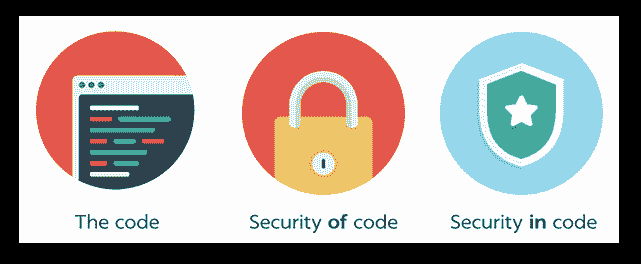
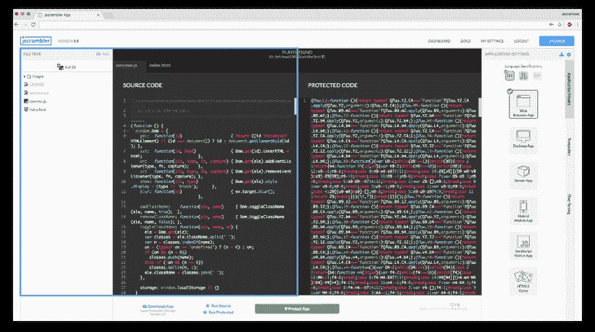
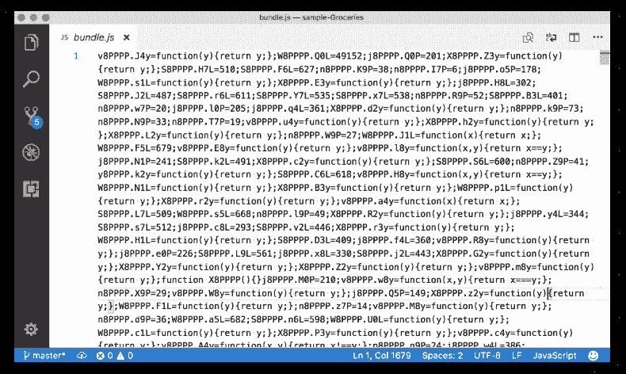

# 保护您的移动应用-第一集(保护代码)

> 原文：<https://dev.to/progress/secure-your-mobile-app---episode-one-protecting-the-code-58e>

无论您是开发传统的本机应用程序，还是使用 Appcelerator 或 Xamarin 等交叉编译的应用程序，使用 Ionic 的混合应用程序，或者使用 NativeScript 或 React Native 的 JavaScript-本机应用程序，贯穿其中的一个共同主题是应用程序安全性。

移动安全是一个不容忽视的问题。几乎每个人都随身携带敏感数据、公司机密和/或受保护的健康信息。

> 观看网络研讨会[保护您的移动应用的最佳实践](https://www.progress.com/campaigns/kinvey/best-practices-for-securing-your-mobile-apps),获取一些关于 NativeScript 安全性的提示和技巧！

## 有点历史

还记得 90 年代吗？我(大部分)有。我还记得在我做咨询的日子里，遇到过这样的问题:

*   以明文形式存储用户密码；
*   发送查询字符串中带有 SSN 的请求；
*   接受未启用 SSL 的信用卡支付。

美好时光！😬

传统上，用户依赖公共应用商店作为最终的应用看门人:充当病毒看守人，防止恶意的 API 使用。然而现实是，在我们部署下一个优秀的应用程序之前，我们开发人员有责任实现额外的安全考虑。

在 NativeScript 博客上的这个由四部分组成的系列中，我们将深入探讨一系列与安全相关的提示和技巧，供您应用于您的应用程序。大多数插件都非常容易实现，因为繁重的工作已经由我们杰出的插件开发者社区完成了。

*   **第一部分:**保护你的源代码(嘿就是这个！)
*   **第二部分:** [保护静态数据](https://dev.to/progress/secure-your-mobile-app---episode-two-securing-data-at-rest-4ami)
*   **第三部分:** [确保设备和服务器之间的数据完整性](https://dev.to/progress/secure-your-mobile-app---episode-three-securing-data-in-transit-491f)
*   **第四部分:** [企业用户认证和授权](https://dev.to/progress/secure-your-mobile-app---episode-four-secure-user-auth-5ep1)

> 查看来自[NativeScripting.com](https://nativescripting.com/course/securing-nativescript-applications)的关于移动应用安全的新课程，并通过代码:NSSECURE 获得 30%的折扣。

## 源代码安全...？

我们大多数人都有 web 开发背景。我们习惯于通过服务器将我们的代码发送到用户的浏览器。知识产权(代码复制)问题确实存在，但我们几乎无法阻止这些问题。另一方面，桌面和移动开发人员更习惯于将代码编译成大部分不可读的比特——保护代码并减少检测漏洞的努力。

那么，由 React Native 和 NativeScript 等技术构建的新一波“JavaScript 原生”应用程序是如何处理这些问题的呢？那么用 Ionic 构建的混合应用呢？

[](https://res.cloudinary.com/practicaldev/image/fetch/s--AevcBmrJ--/c_limit%2Cf_auto%2Cfl_progressive%2Cq_auto%2Cw_880/https://raw.githubusercontent.com/rdlauer/articles/master/nativescript/securing-app/1-code.png)

我不喜欢打破集体的幻想，但是**发送到客户端的源代码本质上是不安全的** -因为它在技术上可以被最终用户以某种方式读取。NativeScript、React Native 和 Cordova/Ionic——这些都没有编译成本机字节码。JavaScript 在设备上被解释，类似于网络浏览器的功能。

所以你是一个传统的本地应用开发者，并认为你是清白的？再想想——有无数种工具可以反编译你的代码，读取你的秘密。🤐

尽管如此，一切还没有结束！让我们来看看一些保护你的源代码和防止窥探你的产品的策略——保护你的知识产权和减轻对你的应用和后端系统的潜在攻击。

## 缩小和混淆

第一种，当然也是最不强大的保护代码的方法是通过缩小/混淆。这是一项由来已久的技术，可以让你的代码不被人看到。一个流行的混淆库， [Uglify](http://lisperator.net/uglifyjs/) ，可以像这样获取清晰的 JavaScript 代码:

```
const app = require("tns-core-modules/application");
const HomeViewModel = require("./home-view-model");

function onNavigatingTo(args) {
    const page = args.object;
    page.bindingContext = new HomeViewModel();
}

function onDrawerButtonTap(args) {
    const sideDrawer = app.getRootView();
    sideDrawer.showDrawer();
}

exports.onNavigatingTo = onNavigatingTo;
exports.onDrawerButtonTap = onDrawerButtonTap; 
```

Enter fullscreen mode Exit fullscreen mode

...并将其转换成可读性稍差的代码，如下所示:

```
const app=require("tns-core-modules/application"),HomeViewModel=require("./home-view-model");function onNavigatingTo(o){o.object.bindingContext=new HomeViewModel}function onDrawerButtonTap(o){app.getRootView().showDrawer()}exports.onNavigatingTo=onNavigatingTo,exports.onDrawerButtonTap=onDrawerButtonTap; 
```

Enter fullscreen mode Exit fullscreen mode

假设你已经在使用 [Webpack](https://docs.nativescript.org/performance-optimizations/bundling-with-webpack) (如果你没有，你应该使用！).只需发出以下命令来构建和修改您的代码:

```
tns build android|ios --bundle --env.uglify 
```

Enter fullscreen mode Exit fullscreen mode

**警告:**这相当于我们中学时用的廉价自行车锁！

[](https://res.cloudinary.com/practicaldev/image/fetch/s--JGzU089O--/c_limit%2Cf_auto%2Cfl_progressive%2Cq_auto%2Cw_880/https://raw.githubusercontent.com/rdlauer/articles/master/nativescript/securing-app/1-bikelock.png)

这将使偶尔的黑客远离我们的业务，但问题是有大量的“美化”资源，它们将获取丑陋的代码，并使其变得更加易读。在上述混淆代码上使用这些服务之一提供了以下内容:

```
const app = require("tns-core-modules/application"),
    HomeViewModel = require("./home-view-model");

function onNavigatingTo(o) {
    o.object.bindingContext = new HomeViewModel
}

function onDrawerButtonTap(o) {
    app.getRootView().showDrawer()
}
exports.onNavigatingTo = onNavigatingTo, exports.onDrawerButtonTap = onDrawerButtonTap; 
```

Enter fullscreen mode Exit fullscreen mode

好吧，好吧，这是个开始。但我认为我们可以做得更好。

> 许多人提到 progguard 也是一种选择。ProGuard 可以混淆*的 Java* 代码，但对*的 JavaScript* 却无能为力。

## Jscrambler(混淆++++)

在 NativeScript 团队，我们已经和 Jscrambler 的人保持联系很多年了，可以追溯到我们开发混合应用的时候。Jscrambler 是一种提供高级模糊处理的服务，即使经过美化，代码也难以辨认。

[](https://res.cloudinary.com/practicaldev/image/fetch/s--llVcxXfV--/c_limit%2Cf_auto%2Cfl_progressive%2Cq_auto%2Cw_880/https://raw.githubusercontent.com/rdlauer/articles/master/nativescript/securing-app/1-jscrambler.png)

Jscrambler 通过将您的 JavaScript 转换成一种形式，防止使用自动化静态分析攻击的逆向工程，从而防止您的代码被篡改。Jscrambler 还可以添加“代码陷阱”,限制 JavaScript 何时、何地以及由谁执行。

例如，我们可以在一个 NativeScript 应用程序中获取一些 JavaScript，通过 Jscrambler 运行它，得到如下结果:

[](https://res.cloudinary.com/practicaldev/image/fetch/s--fn5-oXaR--/c_limit%2Cf_auto%2Cfl_progressive%2Cq_auto%2Cw_880/https://raw.githubusercontent.com/rdlauer/articles/master/nativescript/securing-app/1-jscrambler-output.png)

👍👍

有了经过验证的 NativeScript 兼容性，很值得尝试一下 Jscrambler。在 jscrambler.com 开始您的免费试用。

> [查看这篇关于使用 Jscrambler 和 NativeScript 的深入教程](https://www.nativescript.org/blog/protecting-your-source-code-with-jscrambler)。

在这一点上，我们已经采取了一些非常坚实的步骤来保护我们交付给最终用户的代码。采取*额外步骤*来减少*的潜在足迹怎么样*甚至可以安装我们的应用程序？

## 限制通过私人应用商店的访问

公共应用商店对谁可以下载你的应用几乎没有任何限制。不管目的或受众是什么，澳大利亚 14 岁的孩子通常和亚利桑那州 80 岁的老人拥有相同的访问权限。

> 诚然，你可以通过年龄和地理限制来限制你的应用程序，使它们在某些国家可用，但这与应用程序的安全性没有什么关系。

如果您正在开发一个只需要交付给单个实体(即一组用户或单个公司/组织)的应用**，一个更好的选择可能是一个私人应用商店**。

### 企业 MAM/MDM 选项

如果您是一个足够大的组织的一部分，那么您的公司很有可能依靠移动应用管理(MAM)或移动设备管理(MDM)软件来帮助保护您的内部应用和/或设备。有了 MAM 提供商，如 [MobileIron](https://www.mobileiron.com/en/modern-security-modern-work) 或 [AirWatch](https://www.air-watch.com/) ，你就有了一个内部的“企业”应用商店，所以你不必担心未经授权的第三方有能力下载你的应用。

不过，还有其他更便宜、侵入性更低的选择:

### 苹果开发者企业计划

[苹果企业开发者计划](https://developer.apple.com/programs/enterprise/)允许你绕过公共的 iOS 应用商店，将你的应用直接交付给你组织的用户。虽然成本高于传统的开发者协议(299 美元/年对 99 美元/年)，但分发的灵活性是无价的。

代码签名和配置文件生成的过程与标准方法完全相同。您只需为内部/临时应用部署提供一个额外的独立配置选项。

轻松点。但在某些方面，Android 让这变得更加容易:

### 安卓私配

在 Google Play 之外部署应用时，谷歌的限制要少得多。你可以建立自己的私人应用程序市场(甚至创建自己的*应用程序*作为应用程序商店),而不会像在苹果公司那样惹怒他人。谷歌甚至允许你通过电子邮件、你自己的网站，甚至是由 T2 管理的 Google Play 商店来分发应用程序。

> **注意:**如果不使用 Google Play，就无法使用应用内计费和授权服务。

唯一的诀窍是，你的最终用户必须[选择安装未知应用](https://developer.android.com/distribute/marketing-tools/alternative-distribution#unknown-sources)。

如果你不想自己动手，也有很多服务提供类似的功能。应用程序就是这种服务的一个例子。

## 将业务逻辑保存在云端

与其试图保护设备上的私有业务逻辑，为什么不把它卸载到后端系统呢？类似于 web 应用程序倾向于在后端保留复杂的业务逻辑，您也可以对您的移动应用程序做同样的事情。

对于许多场景，无论是为了安全还是性能，将敏感的业务逻辑从应用程序转移到云上可能会好得多。

使用 NativeScript 实现这一点的一个简单方法是使用[flex services](https://devcenter.kinvey.com/nativescript/guides/flex-services)—[Progress Kinvey](https://www.progress.com/kinvey)提供的轻量级 Node.js 微服务。

> **提示:** Kinvey 为众多移动框架提供 SDK，如 [Ionic](https://devcenter.kinvey.com/phonegap/reference) 、 [Xamarin](https://devcenter.kinvey.com/xamarin/reference) 、[原生 iOS](https://devcenter.kinvey.com/ios/reference) 、[原生 Android](https://devcenter.kinvey.com/android/reference) ，当然还有[原生脚本](https://devcenter.kinvey.com/nativescript/reference)！

您可能偶尔会将一些专有的业务逻辑存储在您的应用程序中，这些逻辑最好存储在云中(无论是出于 IP 保护还是性能考虑，甚至是在服务器上隐藏*其他* API 键！).因此，你可以用 Kinvey 编写一个 FlexService，而不是在你的应用程序中保留这个逻辑。

[](https://res.cloudinary.com/practicaldev/image/fetch/s--CCSDixWy--/c_limit%2Cf_auto%2Cfl_progressive%2Cq_auto%2Cw_880/https://raw.githubusercontent.com/rdlauer/articles/master/nativescript/securing-app/1-flexservice.png)

例如，以下 FlexService(由杰出的 [TJ VanToll](https://twitter.com/tjvantoll) 提供)读取金融交易数据，并根据专有算法对您的表现进行评分:

```
const sdk = require('kinvey-flex-sdk');

function getTransactions(modules) {
  return new Promise((resolve, reject) => {
    const store = modules.dataStore({ useUserContext: false });
    const collection = store.collection('Transactions');
    const query = new modules.Query();

    collection.find(query, (err, result) => {
      if (err) {
        reject(err);
      } else {
        resolve(result);
      }
    });
  });
}

function determineScore(transactions) {
  var score = 100;
  transactions.forEach((transaction) => {
    if (transaction.amount < 0) {
      score -= 5;
    }
    if (transaction.amount > 5) {
      score += 10;
    }
    if (transaction.category === "restaurant") {
      score -= 5;
    }
  });
  return score.toString();
}

sdk.service((err, flex) => {
  function getBudgetScore(context, complete, modules) {
    getTransactions(modules).then((transactions) => {
      complete().setBody({
        score: determineScore(transactions)
      }).done();
    }).catch((err) => {
      complete().setBody(new Error(err)).runtimeError().done();
    });
  }

  flex.functions.register('getBudgetScore', getBudgetScore);
}); 
```

Enter fullscreen mode Exit fullscreen mode

通过 Kinvey 提供的端点，可以在我们的应用程序中访问这种 FlexService:

```
return this.http.post(
    "https://baas.kinvey.com/rpc/kid_<ID>/custom/BudgetScore",
    {},
    {
        headers: new HttpHeaders({
            "Content-Type": "application/json",
            "Authorization": "Basic <YOUR AUTH KEY>"
        })
    }
); 
```

Enter fullscreen mode Exit fullscreen mode

使用这种方法，您的知识产权是安全的，您的业务逻辑不会以任何方式暴露给用户，并且您可以获得完全可伸缩的 Kinvey 实例的性能和可靠性优势。

> 为了亲自了解 Kinvey 如何让您的移动应用开发需求受益，[注册免费试用](https://www.progress.com/campaigns/kinvey/console-sign-up)。

## 谨防共享密钥！

好吧，也许这太简单了，但是这比你想象的要经常发生:**确保你没有共享私钥！**

当我们在 GitHub 上使用公共存储库时，我们通常不会限制上传哪些文件。还有一些僵尸程序会定期扫描回购文件，以找到私人 AWS 或 Firebase 密钥，然后将这些密钥用于恶意目的，例如:

[](https://res.cloudinary.com/practicaldev/image/fetch/s--VpbbXL42--/c_limit%2Cf_auto%2Cfl_progressive%2Cq_66%2Cw_880/https://raw.githubusercontent.com/rdlauer/articles/master/nativescript/securing-app/1-crypto-mining.gif)

解决这个问题最简单的方法是使用一个`.gitignore`文件并排除。ts/。存储私钥的 js 文件。下面是我在 NativeScript 项目中使用的标准`.gitignore`(假设我使用的是 TypeScript，这也不包括我的`app`目录中的 JavaScript 文件):

```
.vscode/
.cloud/
platforms/
node_modules
app/**/*.js
app/**/*.map
npm-debug.log
app/keys.*
hooks/
app/**/google-services.json
app/**/GoogleService-Info.plist 
```

Enter fullscreen mode Exit fullscreen mode

这不仅排除了私有密钥，还防止了`platforms`和`node_modules`目录被共享(如果你正在克隆应用程序，这是完全不必要的——更不用说数以千计的文件了！).

## 继续第二集:保护静态数据！

今天，我们已经了解了如何采取一些相对简单的步骤来保护我们的应用程序代码，减少恶意用户查看我们代码的企图，减少我们的应用程序安装足迹，并将敏感的业务逻辑卸载到云。

[在下一部分](https://dev.to/progress/secure-your-mobile-app---episode-two-securing-data-at-rest-4ami)中，我们将探讨如何**更好地保护存储在设备上的数据**。