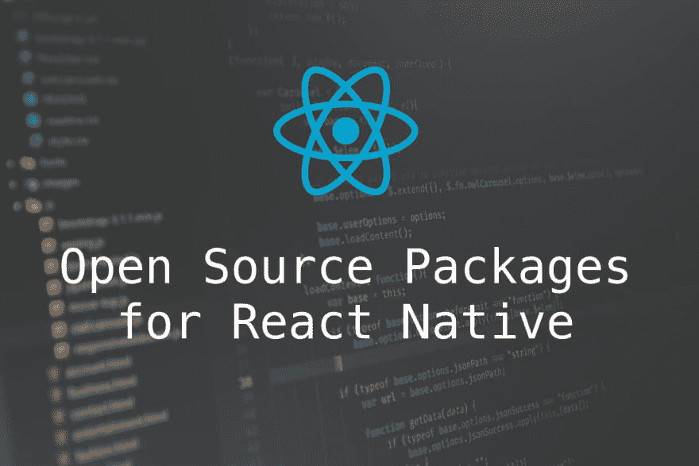

# React Native 的 21 个有用的开源包

> 原文：<https://dev.to/amanhimself/21-useful-open-source-packages-for-react-native-309p>

[](https://res.cloudinary.com/practicaldev/image/fetch/s--LEbTm1n5--/c_limit%2Cf_auto%2Cfl_progressive%2Cq_auto%2Cw_880/https://i.imgur.com/rmpMIwL.jpg)

## [T1】简介](#intro)

我们生活在一个多样化的世界，然而移动设备被两大平台所主导，iOS 和 Android。这是一场两匹马的比赛，但这并没有让移动应用开发变得容易。对于 iOS，你使用 Objective-C 或 Swift 编写代码。对于 Android，你用 Java。除了不同的编程语言，这两个移动平台的工具链也完全不同。

为了创建跨设备工作应用程序，许多现代开发人员使用 HTML、CSS 和 JavaScript 构建混合应用程序——就像处理网页一样——包装在原生容器中。这样，你就(几乎)使用一套源代码为 iOS 和 Android 开发应用程序。

近年来，混合框架已经从 web 视图发展到使用原生 API。这种开发移动应用程序的跨平台方法有其优缺点。优点是耗时少、成本低，缺点包括性能问题。

跨平台开发的一个很好的选择是 React Native。React Native 由脸书开发，并被特斯拉汽车公司、沃尔玛实验室、优步、Instagram Engineering、Discord、Wix 等其他公司使用。

简而言之，React Native 允许您构建外观、感觉和执行更像本机应用程序的移动应用程序。对开发人员来说，好消息是他们可以使用几乎相同的概念来构建 web 应用程序。

下面的列表包含了您可以在 React 本机应用程序中使用的顶级开源库的概述。

### 有用的开源 REACT 原生包

## 洛蒂-反应-原生

Lottie 是一个适用于 Android 和 iOS 的移动库，它可以解析 Adobe After Effects 动画，并使用 bodymovin 导出为 JSON，然后在移动设备上进行原生渲染。该 npm 模块拥有超过 10k 颗星，可帮助您在 React 本机应用程序中使用社区/自定义构建动画。

[https://github . com/react-native-community/Lottie-react-native](https://github.com/react-native-community/lottie-react-native)

## 反应-原生-矢量-图标

如果您正在考虑使用支持导航条/标签条、图像源和完整样式的可定制图标，这是一个不错的选择。这个 npm 模块捆绑了著名的图标库，如:

*   字体真棒
*   离子体
*   邪恶的狮子
*   安特设计
*   材料图标
*   八图标

还有很多。这就像在一个地方拥有所有库中最好的，并且您不必经历连接多个库，然后将它们与 React 本机应用程序链接的过程。还支持 React Native 的动画库`Animated`的动画。

[https://github.com/oblador/react-native-vector-icons](https://github.com/oblador/react-native-vector-icons)

## 反应-原生-天赋-聊天

聊天应用是移动应用开发的重要组成部分。有些情况下，你要么构建完整的聊天应用程序，要么将其作为一项功能添加到现有的应用程序中。在这两种情况下，这个模块都可以帮助您开始使用 UI。这个 npm 模块带有完全可定制的组件、日期、多个 TextInput 选项、Redux 支持等等。

[https://github.com/FaridSafi/react-native-gifted-chat](https://github.com/FaridSafi/react-native-gifted-chat)

## 反应-原生-图像-拾取器

任何具有图像上传或图像处理功能的应用程序的基本库。它支持从图库中选择和从相机中拍照等功能。我喜欢的这个库中的另一个有用的功能是选择你想要的图像质量的选项。此功能解决了高分辨率图像带来的内存问题。

[https://github . com/react-native-community/react-native-image-picker](https://github.com/react-native-community/react-native-image-picker)

## 反应-原生-进展

在应用程序中显示加载或任何其他动作的进度是很重要的。这个库支持 5 个不同的组件，比如线性进度条、圆形进度条、饼状图等等。

```
import * as Progress from 'react-native-progress';

<Progress.Bar progress={0.3} width={200} /> <Progress.Pie progress={0.4} size={50} /> <Progress.Circle size={30} indeterminate={true} /> <Progress.CircleSnail color={['red', 'green', 'blue']} /> 
```

Enter fullscreen mode Exit fullscreen mode

[https://github.com/oblador/react-native-progress](https://github.com/oblador/react-native-progress)

## Nativebase

NativeBase 是一个时尚、巧妙、动态的前端框架，使用 React Native 的现成通用组件来构建跨平台的 Android 和 iOS 移动应用。NativeBase 真正伟大的地方在于，你可以使用共享的 UI 跨平台组件，这将极大地提高你的工作效率。它的文档对每个组件提供了深入的规范，并对它们进行了定制。你需要一个像 Nativebase 这样的组件库来单独工作，或者快速原型化一个 MVP，或者如果你想专注于你的应用程序的功能。

[https://github.com/GeekyAnts/NativeBase](https://github.com/GeekyAnts/NativeBase)

## 反应-导航

导航在 React Naive 社区一直是一个有争议的话题，直到`react-navigation`包开始成熟。随着版本`3`的发布，这个 npm 模块现在是一个完整的解决方案提供商，用于管理 React 本地应用程序中的屏幕。它提供

*   堆栈导航
*   标签导航
*   抽屉导航
*   自定义导航支持
*   对复杂应用程序的冗余支持

如果你想尝试一下，这里有一个很酷的[示例应用程序](https://expo.io/@react-navigation/NavigationPlayground)就是用它构建的。

[https://github.com/react-navigation/react-navigation](https://github.com/react-navigation/react-navigation)

## 反应-原生-导航

React 原生导航在 iOS 和 Android 上为 React 原生应用提供 100%的原生平台导航。由 Wix 的团队开发和维护，是继`react-navigation`之后第二个最常用的支持 React 原生应用中屏幕导航的包。

这个包在社区中经常成为第二选择的原因是因为它的设置过程。每次你想使用这个库的时候，你都必须按照一些步骤手动将它与 iOS build 和 Android gradle 挂钩。

## 反应-母语-语言

一个社区包 react-native-languages 是一个库，它帮助您将 i18n-js 库集成到 react 本机应用程序中，以国际化和本地化应用程序。有了它，你可以利用它的许多实用功能。例如，要获取当前设备的语言，您可以编写以下代码。

```
import RNLanguages from 'react-native-languages';

// Get Current device language
console.log('language', RNLanguages.language); 
```

Enter fullscreen mode Exit fullscreen mode

[https://github . com/react-native-community/react-native-languages](https://github.com/react-native-community/react-native-languages)

## 反应-原生-计费

这个库专门用于 React Native 和 Android。当您需要为 Android 设备的应用添加应用内计费时，请使用此库。该工具有一个简单的接口，并通过包装 anjlab 的`InApp Billing`库作为桥梁。这个库是最新的，支持像`async/await`这样的 ES6 特性。

```
import InAppBilling from "react-native-billing";

async purchase() {
  try {
    await InAppBilling.open();
    const details = await InAppBilling.purchase("android.test.purchased");
    console.log("You purchased: ", details);
  } catch (err) {
    console.log(err);
  } finally {
    await InAppBilling.close();
  }
} 
```

Enter fullscreen mode Exit fullscreen mode

[https://github.com/idehub/react-native-billing](https://github.com/idehub/react-native-billing)

## react-native-iap

这是一个 react-native 链接库项目，用于 Android 和 iOS 平台的应用内购买。这个项目的目标是在两个应用内购买平台之间有类似的体验。它有各种各样的助手功能供您使用。Android 作为一个平台有更多的应用内购买功能。

[https://github.com/dooboolab/react-native-iap](https://github.com/dooboolab/react-native-iap)

## tcomb-form-native

表单可能比图标或组件复杂得多，因为它们有许多不同的部分，并且当涉及到字段验证和表单提交时会涉及到逻辑。有了这个库，您可以极大地简化表单处理。它有各种特定于平台的配置。使用这个库，您将编写更少的代码，获得可用性和可访问性，并且当域模型改变时，不需要更新表单。

[https://github.com/gcanti/tcomb-form-native](https://github.com/gcanti/tcomb-form-native)

## [表格](#formik)

处理表单是成为一名优秀的 web 开发人员最重要的方面之一。如果您使用 React Native 开发移动应用程序，同样适用。这是一个小的库，可以帮助你在 React 中创建表单，并简化表单的构建。它允许您获取表单状态的值，验证和获取错误消息，并有效地提交表单。

[https://github.com/jaredpalmer/formik](https://github.com/jaredpalmer/formik)

## Redux

当谈到管理应用程序中的状态时，Redux 在 React 和 React Native 的生态系统中发挥了巨大的作用。Redux 帮助您编写行为一致、在不同环境(客户机、服务器和本机)中运行且易于测试的应用程序。使用 Redux，您可以查询、选择、插入和更新数据库中的记录。Redux 还有一个非常有用的功能，可以编辑实时代码。Redux 可以与任何 UI 层一起工作，并且有一个庞大的插件生态系统来满足您的需求。

[https://github.com/reduxjs/redux](https://github.com/reduxjs/redux)

## 还原形式

另一个维护良好的库，用于在 React 本地应用程序中构建表单。除了使用 Redux 管理状态之外，这个库还允许您跟踪常见的表单状态，如焦点字段、表单中的字段、用户已经交互的字段、字段值等等。

[https://github.com/erikras/redux-form](https://github.com/erikras/redux-form)

## redux-persist

Redux Persist 获取 Redux 状态对象，并将其保存到持久存储中。然后在应用程序启动时，它检索这个持久状态，并将其保存回 redux。当数据集变得复杂时，管理本地存储在移动设备中的用户数据可能会很困难。对于大型应用程序来说，本机使用 React Native API `AsyncStorage`可能会很困难。

[https://github.com/rt2zz/redux-persist](https://github.com/rt2zz/redux-persist)

## React 原生调试器

React 本机调试器是一个独立的应用程序，可以安装在您的本地计算机上，用于调试 React 本机应用程序。作为一名开发人员，拥有一个高质量的调试环境可以提高工作效率，同时帮助您跟踪错误和创建新功能。使用这个独立应用程序的另一个优点是，它已经默认包含了 Redux DevTools。因此，如果您的应用程序依赖于 Redux 状态管理库，只需很少的配置，您就可以连接 React 本机应用程序。

[https://github.com/jhen0409/react-native-debugger](https://github.com/jhen0409/react-native-debugger)

## 反应原生火基

React Native Firebase 是一个轻量级的 JavaScript 库，可以帮助您将 React Native 应用程序连接到 iOS 和 Android 平台的 native Firebase SDK。这个过程旨在尽可能地反映官方 Firebase SDK。尽管官方 SDK 可以与 React Native 一起工作，但这个包允许您使用 Firebase JS SDK 上不存在的设备 SDk。要在 React Native 中使用官方 SDK，您将选择 web SDK。像 AdMob、分析、云消息(FCM)、远程配置、性能监控、动态链接等功能在官方 Firebase SDK 中是不可用的。

[https://github.com/invertase/react-native-firebase](https://github.com/invertase/react-native-firebase)

## 是

Jest 是一个由脸书创建并在 GitHub 上发布的单元测试框架。它测试 JavaScript 代码。Jest 是一个多功能的测试工具，能够适应任何 JavaScript 库或框架。它的优点包括快照测试支持。

[https://jestjs.io/](https://jestjs.io/)

## 酶

酵素是 Airbnb 的一款测试工具。它支持浅层、全 DOM 和静态渲染。Enzyme 还为开发人员提供了 API 包装器，旨在使断言、操作和遍历 React DOM 变得更加容易。该工具的另一个巨大好处是它与其他测试库和框架兼容，包括 Jest 和 Mocha。

## 排毒

手机自动化测试最困难的部分是测试金字塔的顶端，即 E2E。Detox 是针对用 React Native 编写的应用程序的端到端( *E2E* )测试库。这意味着像真正的用户一样测试应用程序，但是自动地用代码测试。你将编写代码，这个测试库提供工具让*像真正的人类用户一样点击*应用程序。

例如，在 Detox 中，当登录屏幕像实际用户一样在设备/模拟器上运行时，测试如下:

```
describe('Login flow', () => {
    it('should login successfully', async () => {
        await device.reloadReactNative();
        await expect(element(by.id('email'))).toBeVisible();

        await element(by.id('email')).typeText('john@example.com');
        await element(by.id('password')).typeText('123456');
        await element(by.text('Login')).tap();

        await expect(element(by.text('Welcome'))).toBeVisible();
        await expect(element(by.id('email'))).toNotExist();
    });
}); 
```

Enter fullscreen mode Exit fullscreen mode

[https://github.com/wix/Detox](https://github.com/wix/Detox)

## 反应-原生-模仿

这种第三方解决方案相对较新。React-native-mock 帮助开发人员使用 React Native 的最新版本。该库是专门为测试 React 原生应用而设计的。

[https://github.com/RealOrangeOne/react-native-mock](https://github.com/RealOrangeOne/react-native-mock)

## ESLint

最后，我向您展示几乎每个 JavaScript 开发人员都使用的“去林挺”库。它被称为 ESLint。这是一个可插拔的 JavaScript 林挺实用程序，让程序员在执行 JavaScript 代码之前发现问题。ESLint 的一个很大的好处是它给开发者创造他们自己的林挺规则的机会。我个人更喜欢使用 AirBnb 团队提供的规则，并做一些我自己的调整。

[https://eslint.org/](https://eslint.org/)

## 结论

React Native 还有其他用于不同目的的模块库。未来还会有更多，因为移动开发很难访问不同的 API。像用于网络调用的 *axios* 和用于查询 GraphQL APIs 的 Apollo Client 这样的库也可以与 React Native 一起使用，就像它们与 React JS 一起使用一样。我不认为它们值得在这里详细提及。我真的希望上面的列表为您提供现成的解决方案，帮助您构建更好的 React 本机应用程序。

*原贴[此处](https://medium.com/crowdbotics/21-useful-open-source-packages-for-react-native-807f65a818a1)。*

### 关于我

我经常写关于网络技术的文章，并且反应自然。你可以在 [Twitter](https://twitter.com/amanhimself) 上关注我，也可以订阅下面的[我的每周简讯](https://tinyletter.com/amanhimself)，直接在你的收件箱里收到我所有的教程📧。