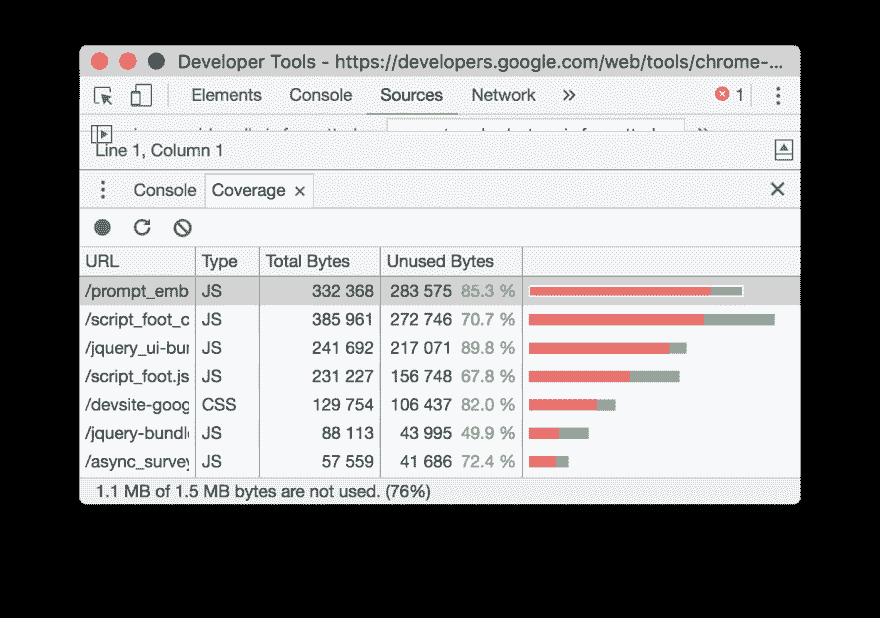
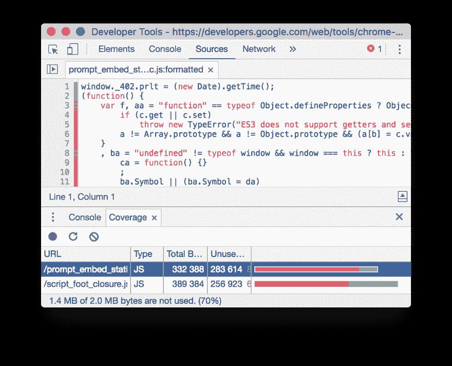

# Chrome 中的 CSS/JS 覆盖率

> 原文：<https://dev.to/hozefaj/cssjs-coverage-in-chrome-2j35>

从 Chrome 版本 59 开始，开发者工具提供了一个新的覆盖标签(在控制台旁边)。这基本上显示了所有的 JS/CSS 都被加载了，实际上有多少被使用了。

您会惊讶地看到通过网络传输的未使用代码的百分比。在大型项目/团队中，随着时间的推移，代码会不断增加，没有人会花时间去检查是否所有跳过的内容都是用户真正需要的。这会导致性能瓶颈，在许多情况下还会失去潜在的业务。

该工具的伟大之处在于，它不仅给出了未使用代码的百分比，而且实际上还显示了它是什么代码。使用这些信息，识别可以删除的代码变得很容易。

每一行代码都用颜色编码:

*   绿色表示该行代码已执行。
*   稳定的红色表示它没有执行。

当然，不是所有红色的东西都可以拿掉。将会有运行在用户动作上的代码。

一个简单的方法是`shift + cmd + p`(在 mac 上)，然后输入`coverage`。

命令面板有很多非常有用的工具。

我们在开发和性能调优中经常使用这个工具。不应被视为事后的想法，而应在开发周期中解决。

一位同事权利将其`Performance is the new Accessibility`置于

> Reefath Rajali@ Rajali“性能是新的可访问性”~ Reefath Rajali
> 在 [@PayPalEng](https://twitter.com/PayPalEng) 开始一个新的谈话系列，讨论性能的重要性，并让世界上的每个人都可以访问 web。20:43PM-2019 年 3 月 12 日

让我们共同努力，让每个人都能上网。