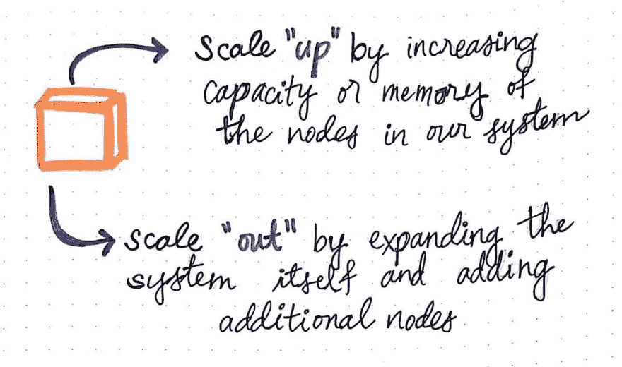
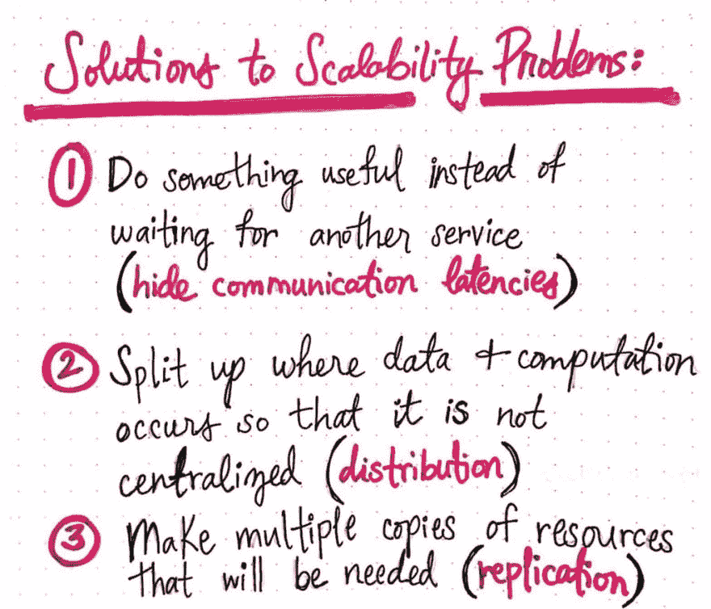
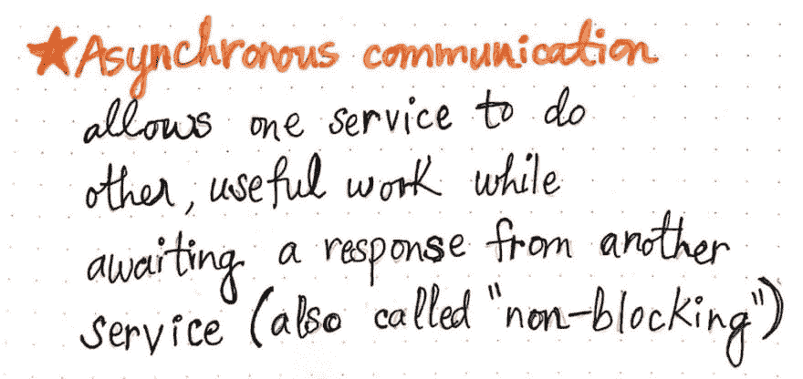
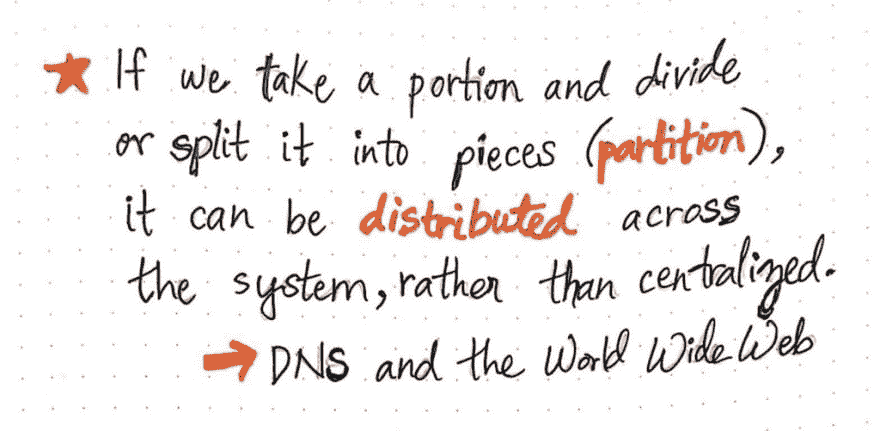
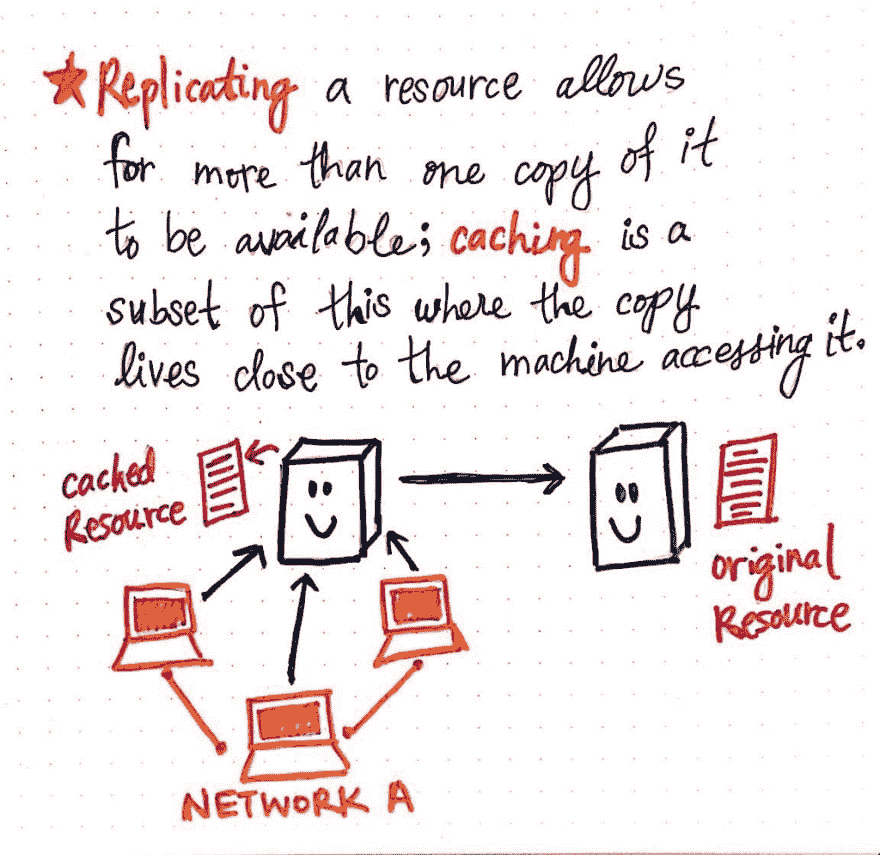
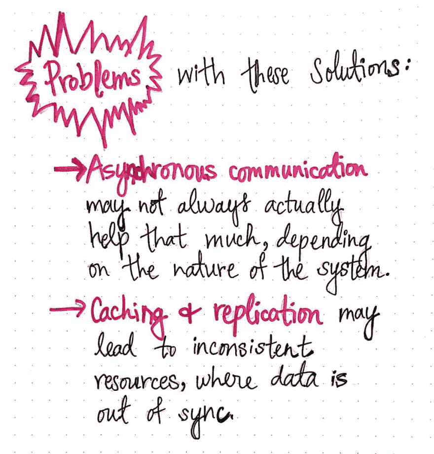

# 可扩展性解决方案:管理系统的快速增长

> 原文：<https://dev.to/vaidehijoshi/scalability-solutions-managing-a-systems-growth-spurts-j9p>

几乎所有的系统在其生命周期中都将经历某种形式的快速增长，每个成功的系统都可能会经历多个时期的快速增长，有时甚至是意想不到的增长。

我们[已经熟悉了](https://dev.to/vaidehijoshi/scalability-growing-a-system-in-different-directions-485j)这种增长的术语:可伸缩性。当系统必须增长以容纳更多的用户或资源时，它们必须扩展规模。当然，问题是，开发一个以某种方式构建的系统并不总是一件简单或容易的事情；各种[问题](https://dev.to/vaidehijoshi/scalability-problems-hidden-challenges-of-growing-a-system-1f68)不可避免地抬头，我们必须与之抗衡！到目前为止，我们已经讨论了什么是扩展，为什么我们应该这样做，以及什么使它变得困难。但是我们实际上还没有找到可伸缩性问题的真正解决方案。

好了，这即将改变:是时候从*问题*转移到*解决方案*了！我们终于有了足够的基线知识，可以开始深入研究一些用于以可持续的方式扩展系统的技术。所以让我们开门见山。

#### 处理各种成长

当人们谈论扩展系统时，他们通常指的是一种特定的*方式*来扩展系统，以帮助它适应不断增长的规模。正如我们从[以前的帖子](https://dev.to/vaidehijoshi/scalability-problems-hidden-challenges-of-growing-a-system-1f68)中所知，使伸缩变得困难的事情之一是处理一个能力有限的系统(例如，有一台服务器，当它被高流量或异常大量的请求淹没时会导致瓶颈)。有时候，如果一个系统很小并且足够包容，解决方案实际上很简单:我们*可以*增加我们系统的容量，从而减少它的局限性。

例如，如果我们正在运行一个小型电子商务商店，并且预计在某一天(可能是黑色星期五)会有大量的请求，我们可能知道我们需要增加系统的内存，或者在服务器集群中“供应”(这只是意味着添加)另一台服务器，以提供额外的处理能力，以便我们可以处理更多的用户/资源。在这种情况下，在给定的一段时间内，改进我们系统的局限性可能就足够了；换句话说，我们可以通过改进现有的设置来增加系统的容量。向我们系统中已存在的资源添加功能的想法被称为*，也称为*。当我们“纵向扩展”时，我们是在改进我们系统中已经存在的节点，使它们能够处理更多流量、更多数据或更多流程。**

 **<figure> 

<figcaption>纵向扩展与横向扩展！</figcaption>

</figure>

然而，垂直扩展解决方案在许多情况下并不足够；有时候，提供一个更大的数据库，增加服务器的大小，或者在一个原本集中的系统上投入更多的钱并不是这项工作的最佳工具。这就是另一种缩放形式发挥作用的地方: ***向外缩放*** ，或者 ***水平缩放*** 。我们可以选择向系统中添加更多的节点来帮助扩展系统的容量，而不是选择通过改进现有的节点来增加系统的容量。

在这篇文章中，我们将重点关注水平缩放，因为这种格式可能会变得非常复杂，并且有更多的细节需要深入研究(在我看来，这使得它在两者中更有趣！).

<figure> 

<figcaption>解决扩展性问题。</figcaption>

</figure>

当谈到横向扩展时，要记住三个主要策略，以避免在现有的各种可伸缩性维度(规模、地理和管理)中增长的陷阱。

1.  首先，我们可以尝试向外扩展，同时确保我们 ***隐藏通信延迟*** ，或者当系统中的一个节点试图与另一个节点通信时经常发生的延迟(不同程度)。
2.  第二，我们可以尝试通过将我们的系统分成不同的部分来进行扩展，这就是所谓的 ***分区和分布*** 。
3.  最后，我们可以通过 ***复制*** 我们的资源并制作它们的多个副本来进行横向扩展，以便帮助支持系统中可能出现故障或距离太远或太忙而无法立即做出响应的部分。

让我们更深入地研究一下这三种技术在水平扩展系统时的实际情况。

#### 扩展系统的策略

**隐藏通信延迟**

当谈到横向扩展系统时，我们知道这将涉及到添加更多的节点(机器、服务器等等)。但是这些节点可能彼此相距很远，特别是如果我们在广域网(WAN)中运行的话——或者至少远到足以导致一台机器与另一台机器“交谈”或通信所需时间的一些延迟。

例如，假设我们添加了第二台机器来处理大量的请求。这台机器可能需要一些额外的时间来做出响应，或者我们的网络本身可能存在一些问题，这些问题超出了我们的控制，因为我们已经添加了第二个节点。一台服务器可能会从这台远程机器上请求一些数据或服务，但是如果这台机器需要时间来回复…好吧，我们的服务器除了等待之外也做不了什么。并且可能要等待相当长的时间(几秒钟甚至更长！).这正是*导致*通信延迟的那种问题，所以当我们向外扩展并添加第二台机器时，我们的工作就是找到隐藏这些延迟的方法。

进入异步通信救援！如果您从事过 web 应用程序的工作，您可能已经熟悉了异步请求；当涉及到分布式系统时，这个概念特别有趣，因为它解决了一个大的可伸缩性问题。 ***异步通信*** 是指一个资源可以向系统中的另一个资源发送请求，但不必等待另一个资源的响应。相反，它可以在其他资源需要多长时间来发送响应时做其他事情，这也被称为 ***【非阻塞】*** 请求。

<figure> 

<figcaption>异步通信:一个定义</figcaption>

</figure>

异步通信有它自己的对应物，叫做——你猜对了——同步通信！ ***同步通信*** 发生在一个资源必须等待另一个资源的回复才能做其他事情的时候，这实际上意味着请求是 ***【阻塞】*** 并且资源必须等待回复。一般来说，术语 ***客户端*** 用于指代进行请求的资源，而 ***服务器*** 用于指代发送响应的资源；通常，服务器实现一些服务，处理一些信息，或者检索一些数据返回给客户端。

当我们在分布式系统中使用异步通信时，我们获得了两个主要好处:

1.  我们从客户机那里收回了宝贵的时间，这些时间本来是用来等待服务器的响应的
2.  每当服务器需要很长时间来回复时，我们都可以隐藏起来——无论这是由于网络问题，还是距离太远或服务器过载的问题。

这两个好处特别有用，因为它们也与创建透明分布式系统的最终目标联系在一起，我们已经知道这是一件值得努力的事情！

> 如果我们很好地处理了请求和接收响应之间的时间，我们就可以实现透明性，并且基本上对我们的最终用户隐藏了系统中的任何延迟。

<figure> 

<figcaption>使用异步通信来隐藏通信延迟</figcaption>

</figure>

特别是，我们可以看到异步通信在批量或并行处理数据的系统中工作，因为客户端可以请求一些信息并并行执行一些其他工作。

我们还可以看到异步通信在系统中的应用，在这些系统中，一个客户端可以一次产生多个线程。在这种情况下，客户端将暂停向服务器请求某些东西的线程，但是因为它有多个线程，所以整个进程不会被阻塞，这意味着进程中的其他线程可以继续工作，而发出请求的线程会耐心地等待响应。我们在上面的图片中看到了这样一个例子:客户端 A 能够在向服务器发送异步请求的同时并行执行一些工作，而客户端 B 的进程中有一个线程在等待响应时发生阻塞，但它的其他线程可以继续工作。

**分区和分配**

解决“向外扩展”问题的另一个策略是，将我们系统中被处理/位于一个集中位置的部分，拆分到整个系统中。这也被称为 ***分区*** 我们系统的一个部分 ***分布*** 它跨多个资源做什么。

<figure> 

<figcaption>分区与分配:一个定义</figcaption>

</figure>

这项技术解决了系统资源完全集中时出现的一些问题；例如，当我们在系统中划分和分布单个服务时，这意味着整个服务不再存在于一个地方，因此整个服务崩溃、延迟或失败的可能性更小，因为它分布在系统中的许多节点上。

一些著名的划分和分割服务的例子实际上是互联网域名系统(DNS)。DNS，或处理向 web 上不同地址发送请求的命名系统(例如。com，。gov，。edu)，基本上是通过让不同的服务器处理映射到不同区域的地址，来分担确定将请求路由到哪里的工作。命名服务被分区，以便一个服务器处理以。而另一个处理那些以。edu，并根据域名计算出将这些请求路由到哪里。

对我们来说，这看起来像是一个单独的服务在做这件事，但是这个复杂的任务实际上已经被*划分到*个服务器上，并且定向请求的工作已经被*分布到*一个更大的系统上，这个系统处理互联网上的每个请求 url！万维网也是如此，它也被分割并分布在超过 1 亿台服务器上。

**复制**

当谈到横向扩展系统时，我们可以使用最后一个策略:我们可以复制我们的资源，以便它们更容易获得。我们以前在[复制透明性](https://dev.to/vaidehijoshi/transparency-illusions-of-a-single-system-part-2-lbb)的上下文中遇到过一次复制，它允许一个资源的多个实例同时存在。

根据定义，资源的复制增加了该资源的实例或副本的数量，以供系统的不同部分使用。这样做的好处有两方面:首先，这意味着整个系统在需要使用资源的时候，都试图只依赖资源的一个副本；第二，如果系统的一部分由于某种原因需要获取该资源，它不需要走很远就能找到原始副本——它只需要找到复制资源的最近的*副本。*

<figure> 

<figcaption>复制(和缓存):快速定义</figcaption>

</figure>

web 开发人员可能特别熟悉的一种复制形式是 ***缓存*** ，这发生在创建资源的各种复制副本以靠近访问它们的客户端时。当一个资源被复制和缓存时，它基本上意味着原始资源被复制，然后被放在一个易于访问并且在物理上靠近请求客户端的地方。通常，单个网络可以共享资源的缓存副本，这意味着网络中的所有计算机都将依赖于附近的缓存资源。

#### 更多的解决方案，更多的问题

在分布式系统中没有什么是容易的，甚至解决问题也不容易。事实上，我们在这里讨论的一些战术和策略实际上有它们自己的缺点。

<figure> 

<figcaption>更多问题的解决方法我们的……问题？</figcaption>

</figure>

例如，并不是所有的系统都能真正利用异步通信。对于处理信用卡支付的电子商务商店来说，当系统在等待处理费用或交易以及实际下订单时，可能根本没有什么有用的事情可做。在这些情况下，尝试减少服务器必须做的工作以减少客户端必须等待的时间是有益的；例如，如果客户机可以在发出请求之前进行一些表单验证(比如检查信用卡的到期日期是否在未来)，那么在等待服务器处理请求数据的剩余部分时，至少可以节省一些时间。

缓存也有它的缺点；当我们拥有一个资源的多个副本时，这些副本很容易失去同步，从而导致 ***一致性*** 问题。一致性在分布式系统中是一个很难解决的问题，因为具有多个部分和多个副本的系统意味着一些缓存资源可能会过时，或者一个资源可能会与系统中的*其他*资源冲突。仅仅“创建一个资源的另一个副本”似乎很容易，但是并不那么容易；另一个副本意味着我们的系统中需要考虑的另一组问题！

如果你想知道什么样的问题会突然出现…好吧，现在不要担心太多。我们有整整一年的时间来讨论这个问题！

#### 资源

学习可伸缩性策略和解决方案是很有趣的，因为即使我们提出的解决方案也不是完美的或可靠的。如果您想继续阅读它们，请查看下面的参考资料！

1.  [分布式系统简介](https://link.springer.com/content/pdf/10.1007%2Fs00607-016-0508-7.pdf)，马腾·范·斯汀&安德鲁·s·塔南鲍姆
2.  [网络分发系统:缓存和复制](https://www.cse.wustl.edu/~jain/cis788-99/ftp/web_caching.pdf)，Raj Jain 教授
3.  [以娱乐和盈利为目的的分布式系统](http://book.mixu.net/distsys/single-page.html)，Mikito Takada
4.  [分布式系统介绍(讲义)](http://cse.csusb.edu/tongyu/courses/cs660/notes/chap1.php)，佟丽玉博士

* * ***