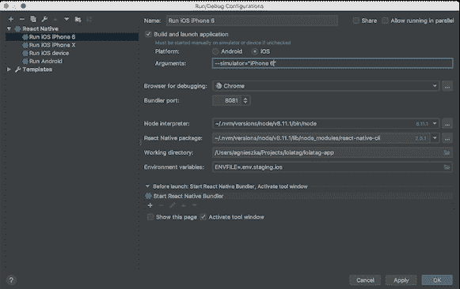
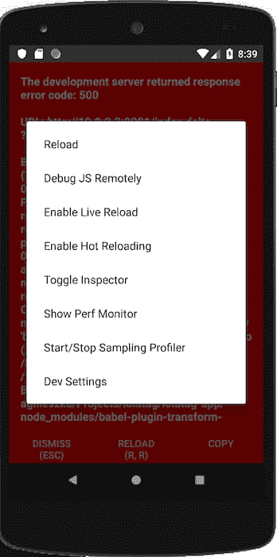
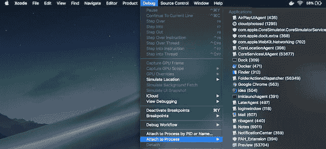

# 调试 React 原生应用的 n 种方法

> 原文：<https://dev.to/brightdevs/n-ways-to-debug-react-native-app-5hao>

React Native 是对本机代码的抽象，它允许我们为多个平台提供一个代码库。听起来很棒，对吧？然而，并不是每个人都对这种方法如此热衷。原因之一可能是运行和调试 JavaScript 代码很麻烦。在这篇博文中，你可能会找到一个简短的教程，介绍如何在 Android 和 iOS 上调试你的应用，在物理设备或模拟器/仿真器上调试 JavaScript 代码和原生代码。

**运行 iOS 应用**

在 IDE 中创建构建配置非常方便。我个人使用 IntelliJ IDEA，但是 WebStorm 也很相似。

转到`Add Configuration`(或者`Edit configuration`，如果您碰巧已经创建了任何配置)。

添加新的`React Native`配置。

叫它`Run iOS`或者任何对你有意义的东西。作为`Target Platform`选择`iOS`。我们可以使用物理设备或模拟器来运行应用程序。

*   要在物理设备上安装应用程序，请将`Arguments`属性设置为`--device="MyDevice"`。您的设备名称可以在`Settings`->-`General`->-`About`->-`Name`中找到并编辑。
*   要在模拟器上安装和运行该应用程序，请将`Arguments`属性设置为`--simulator="iPhone X"`(或任何其他您想要测试的带有 iOS 的设备)。Xcode 附带了模拟器，您需要一台 Mac 来运行它。要管理模拟设备，打开 Xcode，进入`Window`->T3。
*   如果您将`Arguments`属性留空，它将尝试在任何连接的设备上安装应用程序。

您也可以将您的`.env`文件包含在`Environment`属性中，如下所示:`ENVFILE=.env.staging`。

**运行安卓应用**

为 Android 创建运行配置非常相似。添加另一个`React Native`配置，给它命名，选择`Android`作为`Target Platform`。要在设备或模拟器上运行应用程序，您需要安装`adb`。它是 Android Studio 自带的，反正安装了就方便了。要查看和管理 Android 仿真设备，您可以使用 Android Studio。从菜单中选择`Tools -> AVD Manager`。您也可以使用命令行来实现这一点，在这里查看详细信息。要在物理设备上运行应用程序，您需要在物理设备上启用开发者模式。一旦您运行该应用程序，它将被安装在所有连接的设备上(要查看设备列表，您可以运行`adb devices`)。

**热重装**

现在我们可以运行 React Native 应用程序，有一个方便的选项，您可能希望启用:`Hot Reloading`。要启用它，用`CMD + D` (iPhone 模拟器)，或`CMD + M` (Android 模拟器)，或摇动手势(物理设备)打开应用内开发者菜单。

热重新加载将立即在运行的应用程序中反映您在 JavaScript 代码中所做的任何更改。这意味着你不需要重新加载你的应用。还有另外一个选择:`Live reload`。它会在您更改代码时重新加载您的应用程序，这意味着您将丢失当前的应用程序状态。

**检查员**

一旦我们进入开发者菜单，还有另一个有用的选项——检查器。这并不是 web 开发人员可能从 web 浏览器中了解到的功能齐全的检查器，但它有时可能会有所帮助。要启用它，选择`Toggle Inspector`。

**调试 JavaScript 代码**

现在我们几乎准备好调试 JavaScript 代码了。放置一些断点并运行调试。一旦应用在您的设备上启动，进入应用内开发者菜单并选择`Debug JS Remotely`。web 浏览器应该会打开并显示调试器页面。如果没有，[手动打开](http://localhost:8081/debugger-ui/)。现在，您可以在浏览器的开发人员工具窗口中或者通过 IDE 调试 JS 代码。你可以在物理和虚拟设备上，在 Android 和 iOS 上调试你的应用。

**调试本机代码**

在开发 React 原生应用程序时，您通常会关注 JavaScript 代码，但您不能忘记原生代码仍然存在。迟早，你可能需要深入其中。以下是如何调试 React 本机应用程序中的本机代码的方法。

1.  运行 React 本地应用程序(在设备或仿真器/模拟器上)。
2.  在 Android Studio 或 Xcode 中打开你的 React 原生 app 的原生子项目(可能放在`android`或`ios`目录下)。
3.  附加到流程:
    *   在 Android Studio 中打开`Attach debugger to Android process`，勾选`Show all processes`并选择运行应用的设备。T3】
    *   在 Xcode 中打开`Debug` - > `Attach to Process`，选择你的 app 进程(它很可能会被命名为你的 app)。
4.  现在，您可以调试本机代码——应用程序代码本身(可能没那么必要)以及包含的库。当您需要开发自己的 react-native-to-native 桥库时，后者非常有用。

**提示和技巧**

虽然它看起来很有前途，但并不是所有的东西都像魔咒一样管用。事实上，根据我的经验，更多的时候它不起作用。这里有一些建议，当事情不顺利时该怎么做。

热重新加载并不总是正确地重新加载屏幕，有时你只需要手动重新加载应用程序就可以看到更改(特别是当你只更改样式时)。请记住，当您的更改似乎不起作用时:)

在调试 JavaScript 代码时，您也可能会遇到一些问题。仅举几个最常见的例子:

*   有时 IDE 决定停止调试:)通常，仍然可以在浏览器中调试
*   即使在重新加载应用程序后，调试时添加的断点也不会生效
*   调试期间对代码所做的任何更改都不会生效，
*   该应用程序在启动后立即崩溃。

您可以通过采取以下一个或多个步骤来解决这些问题:重新打开模拟器/仿真器，重新打开浏览器，重新启动 Metro Bundler 进程和特定于平台的进程(或终止节点进程)，清理(删除`node_modules`目录并运行`yarn/npm install`，删除`ios/buid`目录)并重建应用程序。

总之，如果您来自本地技术，JavaScript 调试过程可能不像您习惯的那样无缝和稳定，但是您仍然可以并且应该从提到的可能性和技术中受益。

最初发布于 [brightinventions.pl](https://brightinventions.pl/blog/)

软件工程师@光明发明
[电子邮件](//agnieszka.olszewska@brightinventions.pl)