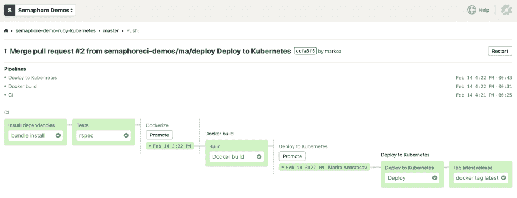
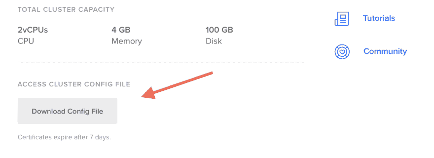
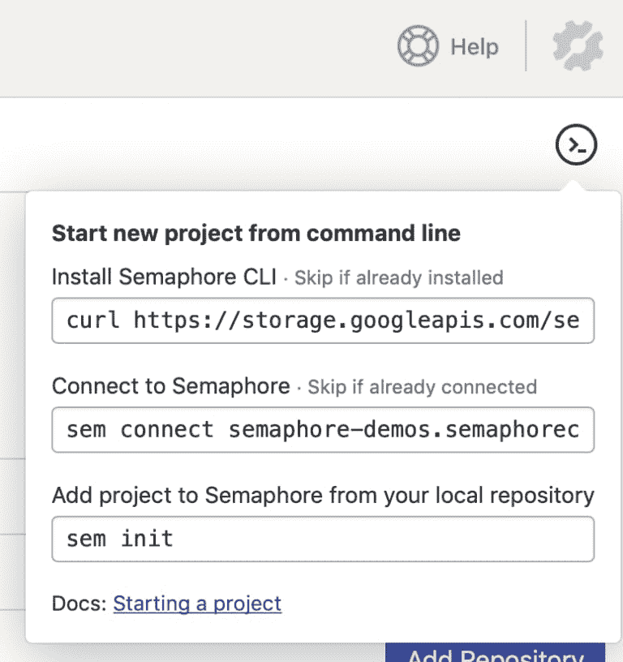
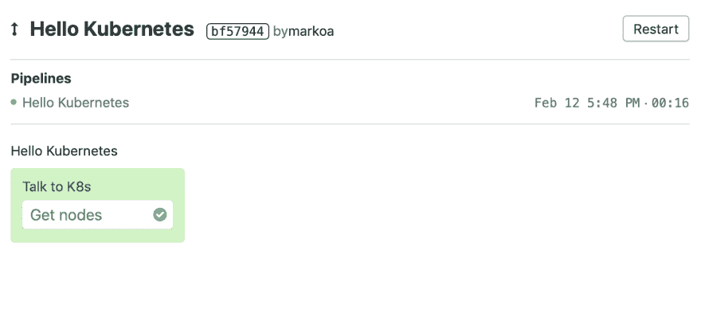
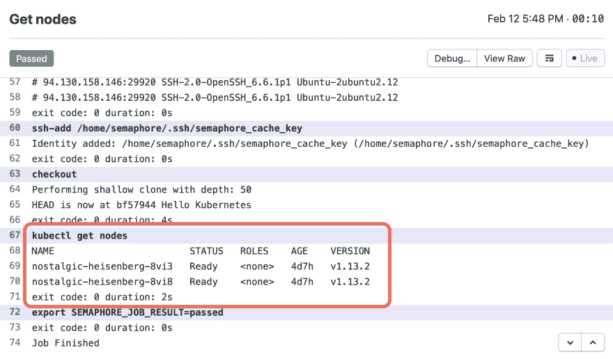
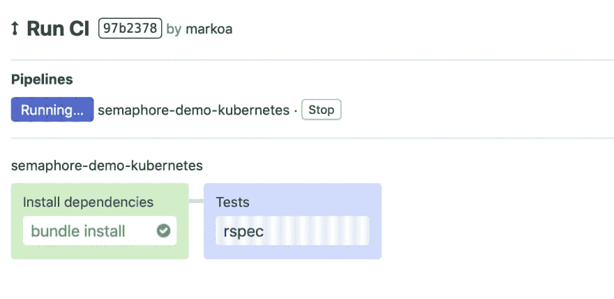
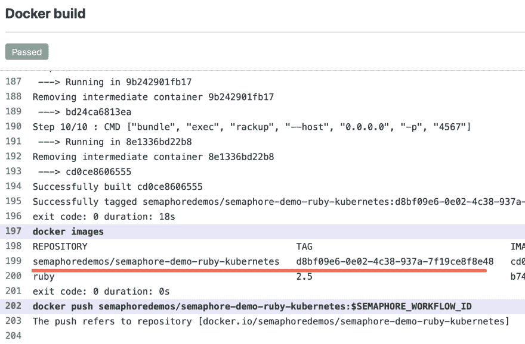
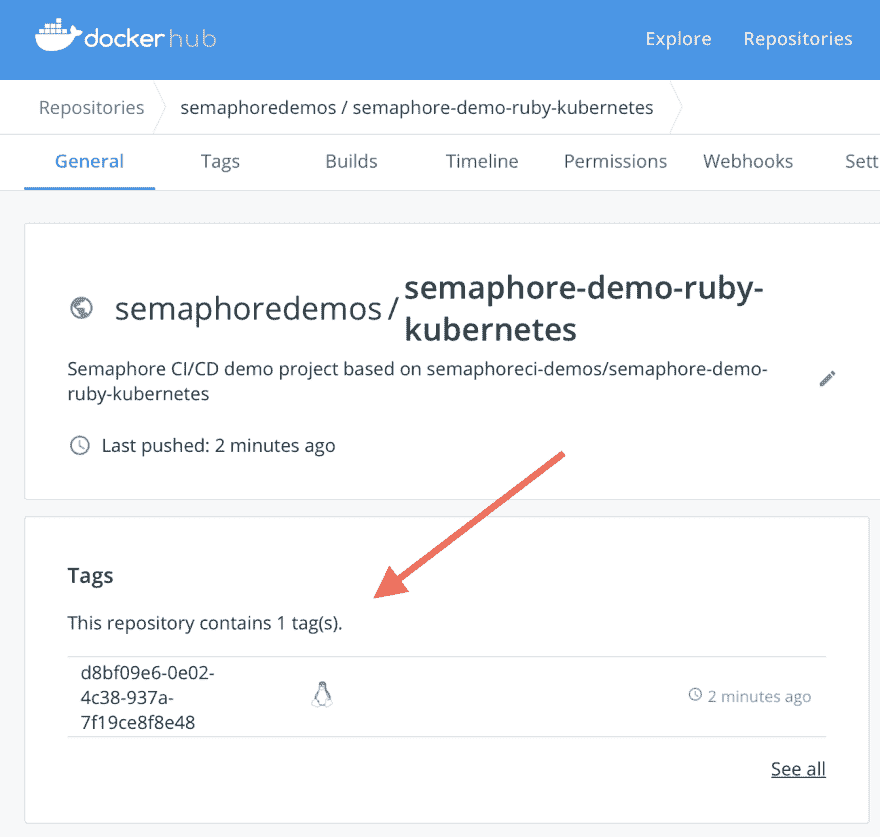

# 数字海洋 Kubernetes 上微服务的 CI/CD

> 原文：<https://dev.to/markoa/cicd-for-microservices-on-digitalocean-kubernetes-1dg1>

Semaphore 让你能够轻松地创建 CI/CD 管道来构建、运行和部署 Docker 容器。DigitalOcean 最近推出了一项名为[的托管 Kubernetes 服务](https://blog.digitalocean.com/digitalocean-releases-k8s-as-a-service/)，该服务简化了云原生应用的运行。总之，它们是高效软件开发的绝佳组合。在本文中，我们将向您展示如何在快速连续交付管道中将这两个服务连接在一起。

## 我们在建造什么

我们将使用一个 Ruby Sinatra 微服务，它公开了一些 HTTP 端点并包含一个测试套件。我们将它与 Docker 打包并部署到 DigitalOcean Kubernetes。CI/CD 管道将完全自动化以下任务:

*   安装项目依赖项，大部分时间从缓存中重用它们；
*   运行单元测试；
*   构建并标记 Docker 图像；
*   将 Docker 映像推送到 Docker Hub 容器注册表；
*   向 DigitalOcean Kubernetes 提供一键部署。

[](https://res.cloudinary.com/practicaldev/image/fetch/s--30NphxW8--/c_limit%2Cf_auto%2Cfl_progressive%2Cq_auto%2Cw_880/https://thepracticaldev.s3.amazonaws.com/i/3ji2iv1bmvs83oschgsz.png)

我们将一步一步来，但如果你想直接进入源代码的最终版本，请查看 GitHub 上的 semaphore-demo-ruby-kubernetes 资源库:

## [semaphore ci-demos](https://github.com/semaphoreci-demos)/[semaphore-demo-ruby-kubernetes](https://github.com/semaphoreci-demos/semaphore-demo-ruby-kubernetes)

### Kubernetes 的信号量演示 CI/CD 管道。

<article class="markdown-body entry-content container-lg" itemprop="text">

# Kubernetes 的信号量 CI/CD 演示

这是一个示例应用程序和 CI/CD 管道，展示了如何使用 Semaphore 2.0 在 Kubernetes 上构建、测试和部署微服务。

成分:

*   Ruby Sinatra 作为 web 框架
*   用于测试的 RSpec
*   包装在码头集装箱中
*   容器被推送到 Docker Hub 注册表
*   部署到 Kubernetes

## 信号量上的 CI/CD

如果您不熟悉 Semaphore，可以随意派生这个存储库并使用它来[创建一个项目](https://docs.semaphoreci.com/article/63-your-first-project)。

CI/CD 管道在`.semaphore`目录中定义，如下所示:

[](https://raw.githubusercontent.com/semaphoreci-demos/semaphore-demo-ruby-kubernetes/master/pipeline.png)

## 本地应用程序设置

要运行微服务:

```
bundle install --path vendor/bundle
bundle exec rackup 
```

要运行测试:

```
bundle exec rspec 
```

要构建和运行 Docker 容器:

```
docker build -t semaphore-demo-ruby-kubernetes .
docker run -p 80:4567 semaphore-demo-ruby-kubernetes
curl localhost
> hello world :)) 
```

## 许可证

版权所有(c) 2019 渲染文本

在麻省理工学院许可下分发。请参见文件许可。

</article>

[View on GitHub](https://github.com/semaphoreci-demos/semaphore-demo-ruby-kubernetes)

我们开始吧！

## 5 分钟后在数字海洋上启动 Kubernetes 集群

在 DigitalOcean 上发布 Kubernetes 集群非常简单。在您的控制面板上，使用顶部的“创建”按钮来创建它。群集将在 4-5 分钟后可用。

[](https://res.cloudinary.com/practicaldev/image/fetch/s--lCBF3qb1--/c_limit%2Cf_auto%2Cfl_progressive%2Cq_auto%2Cw_880/https://thepracticaldev.s3.amazonaws.com/i/037dw1taykle4wjic8gt.png)

“群集”页面包括许多您可以使用的提示和资源。如果您还没有这样做，现在是时候安装 Kubernetes 命令行工具 kubectl。

## 连接到您的 Kubernetes 集群

滚动到群集页面的底部，下载将用于验证和连接到群集的配置文件。

[](https://res.cloudinary.com/practicaldev/image/fetch/s--MOdZ5NE_--/c_limit%2Cf_auto%2Cfl_progressive%2Cq_auto%2Cw_880/https://thepracticaldev.s3.amazonaws.com/i/ou2za8iy1kglq1mgxpzc.png)

在您的本地机器上，创建一个目录来包含 Kubernetes 配置文件:

```
$ mkdir ~/.kube 
```

Enter fullscreen mode Exit fullscreen mode

将下载的文件移动到`~/.kube`并指示 kubectl 使用它。您可以在您的终端会话中运行以下命令，或者将它添加到您的 shell 配置文件中，如`.bashrc`或`.zshrc` :

```
$ export KUBECONFIG=$HOME/.kube/dok8s.yaml 
```

Enter fullscreen mode Exit fullscreen mode

确保更改`dok8s.yaml`以匹配您的文件名。

通过运行`kubectl get nodes`，验证您可以与您的 DigitalOcean Kubernetes 集群通信。当该命令成功时，它返回类似如下的信息:

```
$ kubectl get nodes
NAME                        STATUS    ROLES     AGE       VERSION
nostalgic-heisenberg-8vi3   Ready     <none>    4d        v1.13.2
nostalgic-heisenberg-8vi8   Ready     <none>    4d        v1.13.2 
```

Enter fullscreen mode Exit fullscreen mode

节点数量将与您在集群创建过程中选择的数量相匹配。请注意，如果您在集群仍处于供应状态时运行`get nodes`，节点数量将为零。

数字海洋还没有回应我关于他们和沃尔特·怀特关系的询问。

## 将信号量连接到您的 Kubernetes 集群

此时，您已经有了一个可以从本地机器控制的 Kubernetes 集群。让我们配置一个基本的 CI/CD 项目，其中 Semaphore 也可以成功执行`kubectl get nodes`。

如果你是旗语新手，从[创建一个免费账户](https://semaphoreci.com)开始。免费帐户每月为您提供 20 美元的信用额度，足以提供长达 1300 分钟的服务。如果你连接一张信用卡，你将得到额外的 200 美元的免费信用。

### 在信号量上创建一个项目

进入 Semaphore 后，点击左侧边栏中的“项目>新建”链接。您可以按照屏幕上的说明选择一个存储库并提交默认的 YML 文件。在本教程中，我将向您展示命令行方法。

首先，[安装 sem，信号量命令行工具](https://docs.semaphoreci.com/article/53-sem-reference)。您可以通过打开任何信号量屏幕右上角的 CLI 小部件来找到确切的说明。

[](https://res.cloudinary.com/practicaldev/image/fetch/s--qD8x82G8--/c_limit%2Cf_auto%2Cfl_progressive%2Cq_auto%2Cw_880/https://thepracticaldev.s3.amazonaws.com/i/6eqbawc4yxk0422kjeij.png)

第一个命令下载并安装 CLI:

```
$ curl https://storage.googleapis.com/sem-cli-releases/get.sh | bash 
```

Enter fullscreen mode Exit fullscreen mode

第二个命令将 sem 连接到您的组织帐户:

```
$ sem connect ORGANIZATION.semaphoreci.com ACCESS_TOKEN 
```

Enter fullscreen mode Exit fullscreen mode

接下来，初始化您想要连接到 Semaphore 的 Git 存储库。您也可以在一个空的 Git 存储库中这样做:

```
$ sem init
Project is created. You can find it at https://ORGNAME.semaphoreci.com/projects/PROJECTNAME.

To run your first pipeline execute:

  git add .semaphore/semaphore.yml && git commit -m "First pipeline" && git push 
```

Enter fullscreen mode Exit fullscreen mode

该命令在 GitHub 上创建一个 deploy key 和 webhook，这样 Semaphore 就可以在代码发生变化时访问您的代码，并在您的计算机上创建一个管道定义文件`.semaphore/semaphore.yml`。

### 使用信号量秘密向 Kubernetes 认证

让我们编辑`semaphore.yml`并指导 Semaphore 如何与 Kubernetes 对话。

信号量已经[提供了 kubectl 预装](https://docs.semaphoreci.com/article/32-ubuntu-1804-image)。所以剩下的就是在信号量环境中安全地上传 Kubernetes 配置文件。我们通常通过创建一个[秘密](https://docs.semaphoreci.com/article/62-concepts#secrets)来解决这个问题。秘密可以是环境变量和文件集合。创建后，它可用于组织内的所有项目。

在我们的例子中，我们需要一个基于单个文件的秘密。使用 sem 创建:

```
$ sem create secret do-k8s --file ~/.kube/do-kubernetes.yaml:/home/semaphore/.kube/dok8s.yaml 
```

Enter fullscreen mode Exit fullscreen mode

上面的命令[基于本地文件](https://docs.semaphoreci.com/article/66-environment-variables-and-secrets#a-shortcut-for-creating-file-based-secrets)创建一个秘密，并指示 Semaphore 在`/home/semaphore/.kube/dok8s.yaml`中使其可用。`/home/semaphore/`是运行所有 CI/CD 作业的默认目录。

挂载这个秘密并使其在 CI/CD 作业中可用的完整信号量配置如下:

```
# .semaphore/semaphore.yml
version: v1.0
name: Hello Kubernetes
agent:
  machine:
    type: e1-standard-2
    os_image: ubuntu1804
blocks:
  - name: Talk to K8s
    task:
      secrets:
        - name: do-k8s
      env_vars:
        - name: KUBECONFIG
          value: /home/semaphore/.kube/dok8s.yaml
      jobs:
      - name: Get nodes
        commands:
          - checkout
          - kubectl get nodes 
```

Enter fullscreen mode Exit fullscreen mode

如果这是你第一次看到信号量配置文件，[快速浏览一下概念](https://docs.semaphoreci.com/article/62-concepts)会帮助你理解它。以下是它们在本例中应用的要点:

*   在`agent`部分，我们指定了运行代码和命令的环境。我们结合了一种可用的[机器类型](https://docs.semaphoreci.com/article/20-machine-types)和[操作系统映像](https://docs.semaphoreci.com/article/32-ubuntu-1804-image)。
*   在`secrets`部分，我们挂载刚刚创建的秘密，并使用它提供的文件来定义`env_vars`部分中的`KUBECONFIG`环境变量。
*   我们的管道有一个块和一个作业，我们从 GitHub 下载代码并运行`kubectl get nodes`。

运行`git push`,您应该会看到一个基本的管道在 Semaphore 上运行:

[](https://res.cloudinary.com/practicaldev/image/fetch/s--riYDkzEt--/c_limit%2Cf_auto%2Cfl_progressive%2Cq_auto%2Cw_880/https://thepracticaldev.s3.amazonaws.com/i/ijhj1ti87gxn6vwhvmo3.png)

单击“获取节点”查看作业日志:

[](https://res.cloudinary.com/practicaldev/image/fetch/s--jMk70IGc--/c_limit%2Cf_auto%2Cfl_progressive%2Cq_auto%2Cw_880/https://thepracticaldev.s3.amazonaws.com/i/8dmiqmd3wzasa86zll2b.png)

好了，我们开始了！让我们通过建立一个实际的项目来继续。

## 为 Sinatra 微服务设置持续集成

我们的 Sinatra 应用是一个微服务，具有最小的配置和一个 RSpec 测试套件:

```
.
├── Gemfile
├── Gemfile.lock
├── README.md
├── app.rb
├── config.ru
└── spec
    ├── app_spec.rb
    └── spec_helper.rb 
```

Enter fullscreen mode Exit fullscreen mode

让我们清除前面的`semaphore.yml`并输入以下配置来运行 CI:

```
# .semaphore/semaphore.yml
version: v1.0
name: CI
agent:
  machine:
    type: e1-standard-2
    os_image: ubuntu1804

blocks:
  - name: Install dependencies
    task:
      jobs:
        - name: bundle install
          commands:
            - checkout
            - cache restore gems-$SEMAPHORE_GIT_BRANCH-$(checksum Gemfile.lock),gems-$SEMAPHORE_GIT_BRANCH,gems-master
            - bundle install --deployment --path .bundle
            - cache store gems-$SEMAPHORE_GIT_BRANCH-$(checksum Gemfile.lock) .bundle

  - name: Tests
    task:
      jobs:
        - name: rspec
          commands:
            - checkout
            - cache restore gems-$SEMAPHORE_GIT_BRANCH-$(checksum Gemfile.lock),gems-$SEMAPHORE_GIT_BRANCH,gems-master
            - bundle install --deployment --path .bundle
            - bundle exec rspec 
```

Enter fullscreen mode Exit fullscreen mode

我们将我们的宝石[存储在信号量缓存](https://docs.semaphoreci.com/article/68-caching-dependencies)中，以避免每次提交时从头开始运行`bundle install`。

出于演示的目的，我们将依赖项的安装和运行测试分开在不同的顺序块中。当然，你可以把它们合二为一。

有必要在第二个块中运行`bundle install`，即使`cache restore`在那个点总是会恢复宝石包。这对于 Bundler 来说是一个限制，但好的一面是命令会很快退出。

当您将新的`semaphore.yml`推送到 GitHub 时，您会看到一个真正的 CI 管道在 Semaphore 上成形:

[](https://res.cloudinary.com/practicaldev/image/fetch/s--Os89FfIR--/c_limit%2Cf_auto%2Cfl_progressive%2Cq_auto%2Cw_880/https://thepracticaldev.s3.amazonaws.com/i/zgyf9u26vruqg3lfn10t.png)

## 将 Docker 映像推送到 Docker Hub 容器注册表

部署到 Kubernetes 需要我们将 Docker 映像推送到容器注册中心。在本例中，我们将使用 Docker Hub。对于其他注册中心提供者，该过程非常相似。

这些指令将适用于任何 Docker 图像。关于辛纳特拉的建议，请查看我之前的帖子:

[](/markoa) [## Dockerize a Sinatra 微服务

### 马尔科·阿纳斯塔索夫 2 月 18 日 192 分钟阅读

#ruby #docker #devops](/markoa/dockerize-a-sinatra-microservice-29l8)

推送至公共或私有的容器注册中心需要身份验证。例如，当你在 Mac 上使用 Docker Desktop 时，你会被自动认证，并与 Docker Hub 进行通信。在 CI/CD 环境中，我们需要在执行`docker push`之前提供凭证并进行身份验证。

遵循信号量文档中的 [Docker Hub 指令，我们需要创建一个秘密。](https://docs.semaphoreci.com/article/70-dockerhub)

打开一个新文件`secret.yml` :

```
# secret.yml
apiVersion: v1alpha
kind: Secret
metadata:
  name: my-dockerhub
data:
  env_vars:
    - name: DOCKER_USERNAME
      value: "YOUR  USERNAME"
    - name: DOCKER_PASSWORD
      value: "YOUR  PASSWORD" 
```

Enter fullscreen mode Exit fullscreen mode

使用 sem CLI 创建密码，并在完成后删除源文件:

```
$ sem create -f secret.yml
$ rm secret.yml 
```

Enter fullscreen mode Exit fullscreen mode

您可以使用
来验证它的工作情况

```
$ sem get secrets
NAME               AGE
my-dockerhub   11s

$ sem get secret markoa-dockerhub
apiVersion: v1beta
kind: Secret
metadata:
  name: my-dockerhub
  id: 89596f93-f2ca-4414-88be-e9602174034a
  create_time: "1550149760"
  update_time: "1550149760"
data:
  env_vars:
  - name: DOCKER_USERNAME
    value: xxx
  - name: DOCKER_PASSWORD
    value: xxx
  files: [] 
```

Enter fullscreen mode Exit fullscreen mode

我们现在有了从信号量作业推送到 Docker Hub 所需的东西。

通过 Docker 构建和推送操作，我们进入了项目的交付阶段。[我们将通过促销活动](https://docs.semaphoreci.com/article/67-deploying-with-promotions)扩展 CI 渠道，并利用它来启动下一阶段。

在`semaphore.yml`的底部，定义一个促销:

```
# .semaphore/semaphore.yml
# ...
promotions:
  - name: Dockerize
    pipeline_file: docker-build.yml
    auto_promote_on:
      - result: passed 
```

Enter fullscreen mode Exit fullscreen mode

有了上面指定的`auto_promote_on`,我们的 Dockerize 管道将在每个分支的每个变更上运行。您可以使用[附加条件](https://docs.semaphoreci.com/article/50-pipeline-yaml#promotions)定制该行为。

让我们定义一下 Dockerize 管道:

```
# .semaphore/docker-build.yml
version: v1.0
name: Docker build
agent:
  machine:
    type: e1-standard-4
    os_image: ubuntu1804
blocks:
  - name: Build
    task:
      secrets:
        - name: my-dockerhub
      jobs:
      - name: Docker build
        commands:
          - echo "${DOCKER_PASSWORD}" | docker login -u "${DOCKER_USERNAME}" --password-stdin
          - checkout
          - docker pull semaphoredemos/semaphore-demo-ruby-kubernetes:latest || true
          - docker build --cache-from semaphoredemos/semaphore-demo-ruby-kubernetes:latest -t semaphoredemos/semaphore-demo-ruby-kubernetes:$SEMAPHORE_WORKFLOW_ID .
          - docker images
          - docker push semaphoredemos/semaphore-demo-ruby-kubernetes:$SEMAPHORE_WORKFLOW_ID 
```

Enter fullscreen mode Exit fullscreen mode

在第一个命令中，我们使用在`my-dockerhub` secret 中定义的环境变量向 Docker Hub 认证。

我们使用 [Docker 层缓存](https://docs.semaphoreci.com/article/81-docker-layer-caching)来加速容器构建过程。首先，我们尝试从注册表中提取一个先前构建的映像。如果这是我们第一次运行此操作，此步骤将被跳过，不会失败。

通过将`--cache-from`标志与`docker build`一起使用，我们可以重用已提取图像中的图层，从而更快地构建新的图层。

在`docker push`命令中，我们使用`SEMAPHORE_WORKFLOW_ID`环境变量在每次构建后产生一个独特的工件。它是每个信号量作业中可用的环境变量之一；[完整列表见文档](https://docs.semaphoreci.com/article/12-environment-variables)。

请注意，我们并没有创建最新标签的新版本。只有在成功部署后，我们才会这样做。

一旦用您自己的名称替换了映像名称，您应该会看到类似于以下状态的管道:

[](https://res.cloudinary.com/practicaldev/image/fetch/s--XuoJPdTE--/c_limit%2Cf_auto%2Cfl_progressive%2Cq_auto%2Cw_880/https://thepracticaldev.s3.amazonaws.com/i/6sv1xhsjhiwnq4dl7mar.png)

作业日志显示已经创建并推送了容器映像:

[](https://res.cloudinary.com/practicaldev/image/fetch/s--HnMrJvZQ--/c_limit%2Cf_auto%2Cfl_progressive%2Cq_auto%2Cw_880/https://thepracticaldev.s3.amazonaws.com/i/18ip58aijazb30jxybyf.png)

您的 Docker 注册表包含最新的图像:

[](https://res.cloudinary.com/practicaldev/image/fetch/s--PYVSj3Zz--/c_limit%2Cf_auto%2Cfl_progressive%2Cq_auto%2Cw_880/https://thepracticaldev.s3.amazonaws.com/i/r1hkjnprzn8rythuxw82.png)

## 部署到 Kubernetes

回到 DigitalOcean 的 Kubernetes 集群页面，“入门”部分包括“部署工作负载”的示例。我们可以使用为 nginx 提供的示例，并为我们的应用程序修改它。

在示例配置中，您会注意到对源容器图像的引用:

```
# ...
    spec:
      containers:
        - name: nginx
          image: library/nginx 
```

Enter fullscreen mode Exit fullscreen mode

如果您的 Docker 映像是私有的，那么您需要启用 Kubernetes 集群来通过 Docker 注册中心进行身份验证。方法是，再次创建一个秘密，只是这次是在 Kubernetes 集群的一端。出于演示的目的，我将向您展示如何做到这一点，即使我们在本教程中使用的图像是公开的。

在本地机器上运行以下命令，在 Kubernetes 集群上创建一个`docker-registry`类型的秘密:

```
$ kubectl create secret docker-registry dockerhub-user --docker-server=https://index.docker.io/v1/ --docker-username=YOUR_DOCKER_HUB_USERNAME --docker-password=YOUR_DOCKER_HUB_PASSWORD --docker-email=YOUR_EMAIL` 
```

Enter fullscreen mode Exit fullscreen mode

您可以通过运行:
来验证这个秘密

```
$ kubectl get secret dockerhub-user --output=yaml 
```

Enter fullscreen mode Exit fullscreen mode

和信号量一样，Kubernetes 的秘密是 base64 编码的，输出类似于:

```
apiVersion: v1
data:
  .dockerconfigjson: eyJhdXRocyI6eyJodHR...
kind: Secret
metadata:
  creationTimestamp: 2019-02-08T10:18:52Z
  name: dockerhub-user
  namespace: default
  resourceVersion: "7431"
  selfLink: /api/v1/namespaces/default/secrets/dockerhub-user
  uid: eec7c39e-2b8a-11e9-a804-1a46bc991881
type: kubernetes.io/dockerconfigjson 
```

Enter fullscreen mode Exit fullscreen mode

### 编写部署清单

在您的存储库中创建一个新文件，例如名为`deployment.yml` :

```
# deployment.yml
apiVersion: apps/v1
kind: Deployment
metadata:
  name: semaphore-demo-ruby-kubernetes
spec:
  replicas: 1
  selector:
    matchLabels:
      app: semaphore-demo-ruby-kubernetes
  template:
    metadata:
      labels:
        app: semaphore-demo-ruby-kubernetes
    spec:
      containers:
        - name: semaphore-demo-ruby-kubernetes
          image: semaphoredemos/semaphore-demo-ruby-kubernetes:$SEMAPHORE_WORKFLOW_ID
      imagePullSecrets: # if using a private image
        - name: dockerhub-user 
```

Enter fullscreen mode Exit fullscreen mode

与 DigitalOcean 提供的 nginx 示例相比，我们几乎只替换了应用程序和图像名称。因为 Semaphore 使用`SEMAPHORE_WORKFLOW_ID`环境变量来标记图像，所以我们在这里也使用它。

现在出现的部署配置文件是**而不是**有效的 YML。计划是使用一个名为 [envsubst](https://www.gnu.org/software/gettext/manual/html_node/envsubst-Invocation.html) 的 Linux 实用程序(也可以通过 Homebrew 在 Mac 上获得)来替换信号量 CI/CD 作业中的值`$SEMAPHORE_WORKFLOW_ID`。

然而，如果没有 Kubernetes 负载均衡器，我们的部署清单还不完整。将以下内容添加到同一个文件中:

```
# deployment.yml
# ...
--------

apiVersion: v1
kind: Service
metadata:
  name: semaphore-demo-lb
spec:
  selector:
    app: semaphore-demo-ruby-kubernetes
  type: LoadBalancer
  ports:
    - port: 80
      targetPort: 4567 
```

Enter fullscreen mode Exit fullscreen mode

通过用`latest`替换`$SEMAPHORE_WORKFLOW_ID`并运行:
，您可以在本地机器上验证 Kubernetes 配置是否正常工作

```
$ kubectl apply -f deployment.yml
$ kubectl get services
NAME         TYPE           CLUSTER-IP       EXTERNAL-IP      PORT(S)        AGE
semaphore-demo-ruby-kubernetes     LoadBalancer   10.245.117.152   68.183.249.106   80:30569/TCP   5d
... 
```

Enter fullscreen mode Exit fullscreen mode

### 定义一个信号量部署管道

我们正在进入 CI/CD 配置的最后阶段。此时，我们在`semaphore.yml`中定义了一个 CI 管道，在`docker-build.yml`中定义了一个`Docker build`管道。我们将定义第三个从`Docker build`手动触发的管道，它将部署到 Kubernetes。

首先定义手动促销:

```
# .semaphore/docker-build.yml
# ...
promotions:
  - name: Deploy to Kubernetes
    pipeline_file: deploy-k8s.yml 
```

Enter fullscreen mode Exit fullscreen mode

最后，让我们定义部署管道。它有两个工作:应用一个新的 Kubernetes 配置和创建一个新版本的`latest`容器映像，我们将它视为 Git 中的主分支(您的实践可能有所不同)。

```
# .semaphore/deploy-k8s.yml
version: v1.0
name: Deploy to Kubernetes
agent:
  machine:
    type: e1-standard-2
    os_image: ubuntu1804
blocks:
  - name: Deploy to Kubernetes
    task:
      secrets:
        - name: do-k8s
      env_vars:
        - name: KUBECONFIG
          value: /home/semaphore/.kube/dok8s.yaml
      jobs:
      - name: Deploy
        commands:
          - checkout
          - kubectl get nodes
          - kubectl get pods
          - envsubst < deployment.yml | tee deployment.yml
          - kubectl apply -f deployment.yml

  - name: Tag latest release
    task:
      secrets:
        - name: dockerhub-users
      jobs:
      - name: docker tag latest
        commands:
          - echo "${DOCKER_PASSWORD}" | docker login -u "${DOCKER_USERNAME}" --password-stdin
          - docker pull semaphoreci-demos/semaphore-demo-ruby-kubernetes:$SEMAPHORE_WORKFLOW_ID
          - docker tag semaphoreci-demos/semaphore-demo-ruby-kubernetes:$SEMAPHORE_WORKFLOW_ID semaphoreci-demos/semaphore-demo-ruby-kubernetes:latest
          - docker push semaphoreci-demos/semaphore-demo-ruby-kubernetes:latest 
```

Enter fullscreen mode Exit fullscreen mode

一旦我们将新版本的配置推送到 GitHub，Semaphore 就会运行我们的管道。Docker 构建管道成功完成后，单击“Promote”按钮触发部署:

[](https://res.cloudinary.com/practicaldev/image/fetch/s--Hb5d0Q-z--/c_limit%2Cf_auto%2Cfl_progressive%2Cq_auto%2Cw_880/https://thepracticaldev.s3.amazonaws.com/i/qdomze3sbj0vxm4oj9hy.png)

您现在可以运行`kubectl get services`或打开 DigitalOcean >网络选项卡部分的负载平衡器列表来查找您的微服务的公共 IP 地址:

[](https://res.cloudinary.com/practicaldev/image/fetch/s--cR66wyqf--/c_limit%2Cf_auto%2Cfl_progressive%2Cq_auto%2Cw_880/https://thepracticaldev.s3.amazonaws.com/i/osa990bz6lbu1oxh5p43.png)

并测试出来:

```
$ curl 68.183.251.210
hello world :)) 
```

Enter fullscreen mode Exit fullscreen mode

恭喜你！你现在有了一个全自动的连续输送管道。

## 为自己部署一个演示 app

随意派生出[semaphore-demo-ruby-kubernetes](https://github.com/semaphoreci-demos/semaphore-demo-ruby-kubernetes)存储库，并创建一个 Semaphore 项目将其部署到您的 Kubernetes 实例上。

以下是一些你可以做出的潜在改变的想法:

*   引入暂存环境
*   首先构建一个 Docker 映像，并在其中运行测试(需要 Dockerfile 的开发版本，因为在为生产制作映像时最好避免安装开发和测试依赖项)。
*   用更多的微服务扩展项目。

这篇文章是基于 CI/CD 上的 YouTube 视频系列 Semaphore Uncut 的一集:

[https://www.youtube.com/embed/hi-OPGpecXQ](https://www.youtube.com/embed/hi-OPGpecXQ)

感谢阅读！🙌请给我反馈，我很乐意回答你评论中的任何问题。

要了解更多深入的内容，请点击这里关注我，或者[在 Kubernetes](https://eepurl.com/dLkTuw) 上注册 Semaphore 的免费 CI/CD 电子书。❤️

*原载于[旗语博客](https://semaphoreci.com/blog/cicd-microservices-digitalocean-kubernetes)* 。