# 本地开发和调试 Twilio 函数

> 原文：<https://dev.to/twilio/locally-developing-and-debugging-twilio-functions-5apf>

Twilio 是关于 HTTP 端点和 webhooks 的。从回复收到的短信，到控制语音呼叫的流量，再到用`onMessageSend` webhook 阻止不想要的聊天消息，很有可能你最终会为你正在交互的 Twilio 产品编写一个 HTTP 端点。Twilio 函数允许您在 Twilio 云中直接编写和托管这些端点，同时依靠 Node.js 的强大功能。

如果您想用您选择的 IDE 或编辑器开发这些函数并在本地运行它们，该怎么办呢？如果出了问题，而您想使用调试器更深入地研究它，该怎么办？为此，我构建了 [`twilio-run`](https://npm.im/twilio-run) ，这是一个命令行工具，允许您在本地环境中运行 Twilio 函数。

让我们深入了解它是如何工作的，以及它如何帮助您使用 Twilio 进行开发。

> **注意**
> 该工具仍在开发中，在模拟环境时可能无法 100%反映 Twilio 函数的行为。如果你发现了 bug，请在 https://github.com/dkundel/twilio-run 的[发帖，或者给我发邮件到 dkundel@twilio.com](https://github.com/dkundel/twilio-run)[的](mailto:dkundel@twilio.com)

## 安装

`twilio-run`是用 [Node.js](https://nodejs.org/) 构建的，因此需要安装 Node.js 以及类似 [`npm`](https://www.npmjs.com/) 或 [`yarn`](https://yarnpkg.com/lang/en/) 的包管理器。一旦具备了这些先决条件，就有多种方法可以安装和使用`twilio-run`。

如果你只是想偶尔执行它，最快的方法是使用`npm@5.2`或更新的版本，因为它有一个叫做 [`npx`](https://medium.com/@maybekatz/introducing-npx-an-npm-package-runner-55f7d4bd282b) 的工具。如果你安装了`npx`，你可以运行:

```
npx twilio-run 
```

如果是第一次，npm 会自动下载该工具，并在本地目录中运行它。你也可以传递你在下面找到的任何选项。

如果你想更频繁地使用`twilio-run`，我建议把它作为一个 devDependency 安装在你的项目中。如果你还没有一个 Node.js 项目，创建一个新的文件夹并在运行
之前运行`npm init -y`

```
npm install -D twilio-run
# or alternatively with yarn:
yarn add -D twilio-run 
```

这将把`twilio-run`添加到你的`node_modules`文件夹中，有多种方法可以执行:

```
# specify the path to the executable
node_modules/.bin/twilio-run 

# run it using npx (this won't reinstall it)
npx twilio-run

# run it using yarn
yarn twilio-run

# Add "start": "twilio-run" into your package.json's scripts section. Then:
npm start 
```

现在我们已经安装了`twilio-run`，让我们看看如何使用它。在这篇文章的剩余部分，我将省略运行该工具的相应方法，而只使用`twilio-run`。请根据您运行该工具的方式进行调整。

## 基础知识

与真正的 Twilio 函数类似，我们能够托管 JavaScript 函数和静态资产。对于这些文件，`twilio-run`将在您指定为工具参数的路径中寻找一个`functions/`和一个`assets/`目录。如果您不指定路径，它将使用您当前的工作目录作为基本目录。

让我们设置一个基本功能并创建一个资产来测试。在项目目录中创建一个`functions/`文件夹，并向其中添加一个名为`hello-world.js`的文件。将以下代码放入该文件:

```
exports.handler = function(context, event, callback) {
  let twiml = new Twilio.twiml.MessagingResponse();
  twiml.message('Hello World');
  callback(null, twiml);
}; 
```

接下来创建一个`assets/`目录，并将一个名为`hello.txt`的文本文件放入其中。你想放什么内容都可以。我就放“你好博客！”投入其中。

现在我们已经有了基本的项目设置，我们可以通过运行:
来启动`twilio-run`

```
twilio-run 
```

一旦启动，您应该会看到一个输出，显示您的 Twilio 函数和资产的所有可用 URL。

[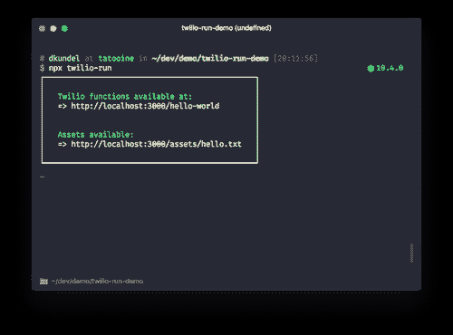](https://res.cloudinary.com/practicaldev/image/fetch/s--OKQJtadN--/c_limit%2Cf_auto%2Cfl_progressive%2Cq_auto%2Cw_880/https://s3.amazonaws.com/com.twilio.prod.twilio-doimg/C4ZLtDHIOK62qz4zR18fUavYhboSGIv8etpiPxd0WBNT9Q.width-500.png)

要验证它是否工作，请打开您的浏览器并导航到[http://localhost:3000/hello-world](http://localhost:3000/hello-world)。您应该会看到一些 TwiML 返回给您:

[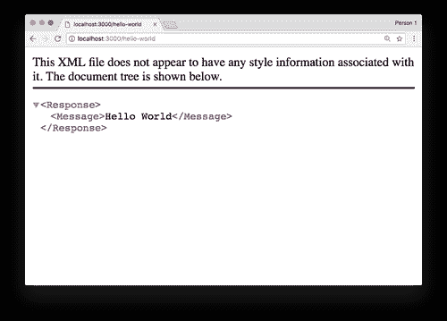](https://res.cloudinary.com/practicaldev/image/fetch/s--PyGF2F0A--/c_limit%2Cf_auto%2Cfl_progressive%2Cq_auto%2Cw_880/https://s3.amazonaws.com/com.twilio.prod.twilio-doimg/EfnTbLy25VlAdip-w-531AIySo0gcik_pgl94zUqnAWnZ-.width-500.png)

如果你进入 http://localhost:3000/assets/Hello . txt，你将会看到“Hello Blog！”或者你放进去的任何信息。这也适用于您可能想要提供的任何其他静态文件。

[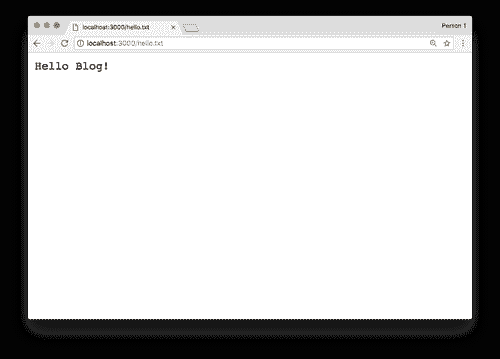](https://res.cloudinary.com/practicaldev/image/fetch/s--EFl0UC2t--/c_limit%2Cf_auto%2Cfl_progressive%2Cq_auto%2Cw_880/https://s3.amazonaws.com/com.twilio.prod.twilio-doimg/oktcvvOjQ_gA9MiYdBLmB07M1Axhi_wVtFteEYQAQAZuFg.width-500.png)

此外，您应该看到所有成功和失败的请求都被记录到控制台中:

[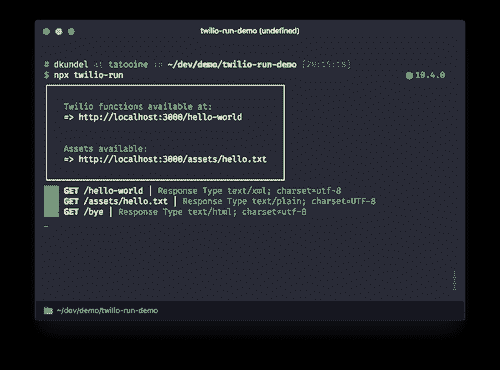](https://res.cloudinary.com/practicaldev/image/fetch/s--Mqbwbdgo--/c_limit%2Cf_auto%2Cfl_progressive%2Cq_auto%2Cw_880/https://s3.amazonaws.com/com.twilio.prod.twilio-doimg/vlu3fW2KtH5y0Z2hcd6LYUyWiMe2fVIuwbX38zqFpEXiWG.width-500.png)

这就是开始在本地运行 Twilio 函数的全部内容。让我们来谈谈`twilio-run`提供的一些附加功能。

## 向外界公开本地功能

如果你想检查你在本地开发的 Twilio 函数与 Twilio 的配合有多好，你必须让它可供 Twilio 联系。我们倾向于为此推荐的工具叫做 [ngrok](https://ngrok.com/) 。它创建一个到本地主机的 HTTP 隧道。`twilio-run`直接内置了这一功能。你所要做的就是通过`--ngrok`标志:

```
twilio-run --ngrok 
```

您将看到输出略有不同，因为该工具现在将返回您外部可用的 URL 以及 ngrok 的请求检查器，这是一个重放过去请求的伟大工具。

[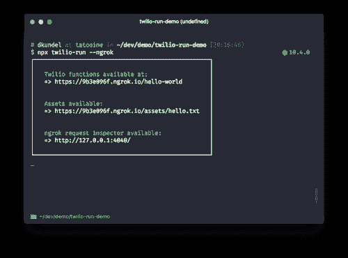](https://res.cloudinary.com/practicaldev/image/fetch/s--3vkgz0Wh--/c_limit%2Cf_auto%2Cfl_progressive%2Cq_auto%2Cw_880/https://s3.amazonaws.com/com.twilio.prod.twilio-doimg/u_VSu-E-oRXQ--h5uUu3C2wVo3W7m9ZK0KCtliw8DB277z.width-500.png)

如果你有一个 ngrok 的付费账户，你也可以传递一个自定义的子域给标志:`--ngrok my-awesome-functions`，它会将它们生成为`my-awesome-functions.ngrok.io`。

## 调试您的函数

虽然`console.log`可能是最流行的调试工具(是的，它和`twilio-run`一起工作)，但有时你必须拿出大家伙，使用真正的调试器。`twilio-run`允许您使用您已经从 Node.js 中熟悉的相同命令行标志来附加您最喜欢的 Node.js 调试器

```
twilio-run --inspect 
```

这将打开默认的调试端口，您可以看到它显示在工具的输出中:

[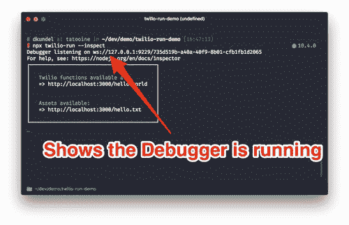](https://res.cloudinary.com/practicaldev/image/fetch/s--jAlo5OZw--/c_limit%2Cf_auto%2Cfl_progressive%2Cq_auto%2Cw_880/https://s3.amazonaws.com/com.twilio.prod.twilio-doimg/jkv-NMSSFJY1XxZEWxdHVdgE79hu4eCWKIqwWRa1XG30s5.width-500.jpg)

如果你像我一样使用 Visual Studio 代码，你现在所要做的就是在你的项目的一个`.vscode`文件夹中创建一个`launch.json`，并放在下面的配置中:

```
{  "version":  "0.2.0",  "configurations":  [  {  "type":  "node",  "request":  "attach",  "name":  "Attach",  "port":  9229  }  ]  } 
```

现在，`twilio-run`带着`--inspect`标志运行，打开调试器窗格，选择“Attach ”,然后运行它。

[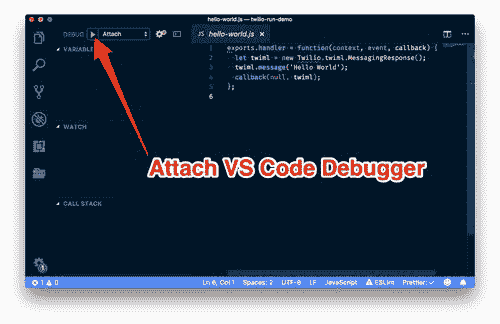](https://res.cloudinary.com/practicaldev/image/fetch/s--6OHfyRvC--/c_limit%2Cf_auto%2Cfl_progressive%2Cq_auto%2Cw_880/https://s3.amazonaws.com/com.twilio.prod.twilio-doimg/HddnhtdDCNNdEyXxTFFWv7d5u1zICM7n82G-EZgjPvDnHk.width-500.jpg)

[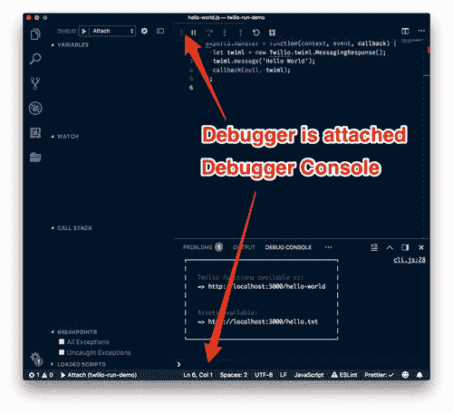](https://res.cloudinary.com/practicaldev/image/fetch/s--DL3a9mU4--/c_limit%2Cf_auto%2Cfl_progressive%2Cq_auto%2Cw_880/https://s3.amazonaws.com/com.twilio.prod.twilio-doimg/_Z6sBzLMSLRIxfG9bWI7LRtpXDjpXuwgzLy51Syza2N7TL.width-500.jpg)

一旦它被附加上，你就可以设置一个断点指针(不要担心它一开始是灰色的)并执行你的请求。调试器应该捕获并设置断点。

[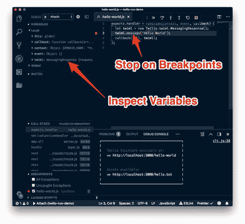](https://res.cloudinary.com/practicaldev/image/fetch/s--kXpXYNBV--/c_limit%2Cf_auto%2Cfl_progressive%2Cq_auto%2Cw_880/https://s3.amazonaws.com/com.twilio.prod.twilio-doimg/87hYw4rhjPBmapVsNjJ7BTPIgBEGSglexGJzLYUCXaO7An.width-500.jpg)

您可以在文档中了解更多关于使用 VS 代码调试 Node.js 应用程序的信息。

如果你不使用 VS 代码，或者更喜欢使用 [Chrome 开发工具](https://medium.com/the-node-js-collection/debugging-node-js-with-google-chrome-4965b5f910f4)，在任何页面打开 Chrome 开发工具，你应该会看到一个 Node.js 图标。单击该图标打开项目的调试器:

[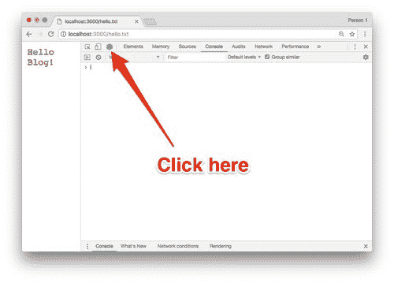](https://res.cloudinary.com/practicaldev/image/fetch/s--FNdtvMFY--/c_limit%2Cf_auto%2Cfl_progressive%2Cq_auto%2Cw_880/https://s3.amazonaws.com/com.twilio.prod.twilio-doimg/dfes4APtlkAuKU1s8o1QPg4tQrJW3roQMZmBW6QXT7fqxN.width-500.jpg)

一旦打开，我们必须加载我们的项目。进入**源文件**标签，点击侧面的**文件系统**(它可能藏在“页面”旁边的“> >”后面)，打开你的项目文件夹。如果您以前没有，您必须在打开项目之前授予您的浏览器对文件系统的访问权限。你现在可以设置你的断点，一旦它们被命中，你就可以进一步调试你的应用程序。

[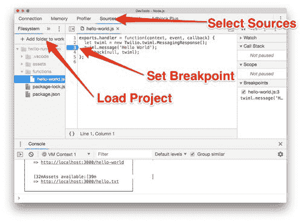 ](https://res.cloudinary.com/practicaldev/image/fetch/s--v5ZEsl2K--/c_limit%2Cf_auto%2Cfl_progressive%2Cq_auto%2Cw_880/https://s3.amazonaws.com/com.twilio.prod.twilio-doimg/Extn3Se3_x1cfJ-x2swl9LjR7agfGnnpVkwlOlJLVtFDdU.width-500.jpg) [ 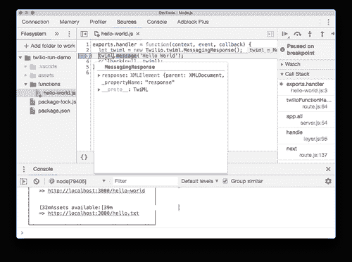](https://res.cloudinary.com/practicaldev/image/fetch/s--RZkDRu6L--/c_limit%2Cf_auto%2Cfl_progressive%2Cq_auto%2Cw_880/https://s3.amazonaws.com/com.twilio.prod.twilio-doimg/e2UtQat1JFcjWMp-OTDMcrKsRwpS2JBGIoNN8CDELH-9sW.width-500.png)

如果这些选项都不合适，您可以使用任何您喜欢的支持附加到 Node.js 调试协议的工具。

## 加载环境变量

Twilio 函数允许您通过`context`对象访问环境变量。为了安全起见，`twilio-run`不允许您访问开发机器的所有本地环境变量。如果你想这样做，你可以添加`--load-local-env`标志，它会加载它们。

```
twilio-run --load-local-env 
```

如果你想配置项目特定的变量，最好的方法是在你的项目中使用一个`.env`文件。如果您的`.env`文件中有像证书这样的敏感数据，请确保将其添加到您的`.gitignore`中。您可以使用`--env`标志载入`.env`文件。如果您想要加载一个特定的文件，您也可以指定它相对于您的基本目录的路径。

让我们试试这个。在项目根目录下创建一个`.env`文件，内容如下:

```
PLANET=Mars 
```

并将您的 Twilio 函数修改为:

```
exports.handler = function(context, event, callback) {
  let twiml = new Twilio.twiml.MessagingResponse();
  twiml.message(`Hello ${context.PLANET || 'World'}`);
  callback(null, twiml);
}; 
```

我们将使用环境中指定的任何值进行问候，如果没有值，则返回到“Hello World”。如果您在没有`--env`变量的情况下重启`twilio-run`，您应该会看到:

```
<?xml version="1.0" encoding="UTF-8"?>
<Response>
    <Message>Hello World</Message>
</Response> 
```

如果你现在用`--env`标志重启`twilio-run`，就像这样:

```
twilio-run --env 
```

您应该看到消息变成了:

```
<?xml version="1.0" encoding="UTF-8"?>
<Response>
    <Message>Hello Mars</Message>
</Response> 
```

请注意，如果您将`--load-local-env`和`--env`组合在一起，那么在您本地环境中设置的所有变量都将被临时替换为在`.env`文件中设置的变量。

## 【直播重装】

默认情况下，如果你想检查一个函数的变化，你必须重启`twilio-run`,因为它们是由 Node.js 缓存的。您可以通过运行带有`--live`标志的`twilio-run`来禁用这种缓存，如下所示:

```
twilio-run --live 
```

因为这不是真正的高性能，所以默认情况下是禁用的。

## 如何将我的功能和资产部署到 Twilio 上运行？

现在，你必须在 Twilio 控制台中复制并粘贴[功能代码](https://www.twilio.com/console/runtime/functions/manage)和/或[拖放资产文件](https://www.twilio.com/console/runtime/assets/public)来实时部署它们。我们正在努力开发用于部署的 API。期待不久，如果你想成为第一个尝试它的人，请与我联系。

## 接下来是什么？

这个项目是出于我自己的需要而产生的，但我很想听听你想看到什么功能。我也完全接受对这个项目的贡献。如果你想检查源代码、文件问题，或者只是说声谢谢，请随时去 https://github.com/dkundel/twilio-run

如果您想在现有的 Express 服务器中加载一个 Twilio 函数进行测试，该项目还公开了一个 API。你可以在项目的 [README.md](https://github.com/dkundel/twilio-run/blob/master/README.md) 中找到它的文档。

既然您已经成功地在本地开发了 Twilio 函数，为什么不看看这些 Twilio 函数支持的博客帖子呢:

*   [用 SendGrid 和 Node.js 将传真转发到电子邮件](https://dev.to/twilio/forward-fax-to-email-with-sendgrid-and-nodejs-2o65)
*   [使用 JavaScript、Twilio 查找和短信识别未知电话号码](https://dev.to/twilio/identify-unknown-phone-numbers-with-javascript-twilio-lookup-and-sms-15ld-temp-slug-9075890)
*   [用 WhatsApp 和 Twilio 打造 npm 搜索机器人](https://www.twilio.com/blog/2018/08/build-npm-search-bot-whatsapp-twilio.html)
*   [👉表情符号翻译📞Twilio API 用于💬WhatsApp 和 Node.js](https://www.twilio.com/blog/2018/08/emoji-translations-twilio-api-whatsapp-node-js.html)

如果您有任何问题或者想向我展示您用 Twilio 函数构建的很酷的东西，只需联系我:

*   邮件:[dkundel@twilio.com](//mailto:dkundel@twilio.com)
*   推特: [@dkundel](https://twitter.com/dkundel?lang=en)
*   GitHub: [dkundel](https://github.com/dkundel)