# IntelliJ 的可视化 Git 操作

> 原文：<https://dev.to/gabriela/a-short-developer-story-withgit-4kfm>

[](https://res.cloudinary.com/practicaldev/image/fetch/s--WaEf8GbN--/c_limit%2Cf_auto%2Cfl_progressive%2Cq_auto%2Cw_880/https://thepracticaldev.s3.amazonaws.com/i/m9ii68rqbznn932itn75.png)

嗨，我在版本控制方面的经验包括 CVS、SVN 和最近的 Git。我用什么总是取决于公司和他们的喜好。下面我概述了我遇到的最多的开发者故事，以及目前为止使用 IntelliJ 和终端使用 Git 的情况。这不是一个关于如何使用 Git 或好/坏路线的教程，而是一个我想及时改进的个人指南。
在那之前，这些是我与 Git 的开发者故事:

**1。创建一个新的本地分支**

我经常需要创建一个新的本地特性分支来实现一个特定的任务，这个任务以后会被推到远程。下面是我完成这些步骤的截图。

来自 IntelliJ:

[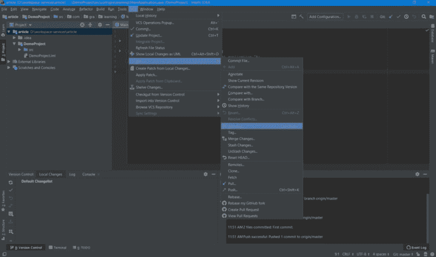](https://res.cloudinary.com/practicaldev/image/fetch/s--HdbPxDGV--/c_limit%2Cf_auto%2Cfl_progressive%2Cq_auto%2Cw_880/https://thepracticaldev.s3.amazonaws.com/i/7zz9wd9biag1k4v6u7rw.png)
[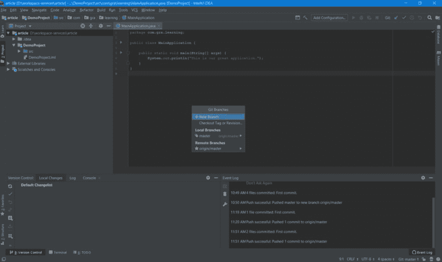](https://res.cloudinary.com/practicaldev/image/fetch/s--v8QkkJMe--/c_limit%2Cf_auto%2Cfl_progressive%2Cq_auto%2Cw_880/https://thepracticaldev.s3.amazonaws.com/i/htl90tsiv106g6e2hp6p.png)
[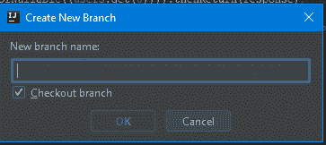](https://res.cloudinary.com/practicaldev/image/fetch/s--OXEs7Jjx--/c_limit%2Cf_auto%2Cfl_progressive%2Cq_auto%2Cw_880/https://thepracticaldev.s3.amazonaws.com/i/d92wat29jb850xx1cl93.png)
[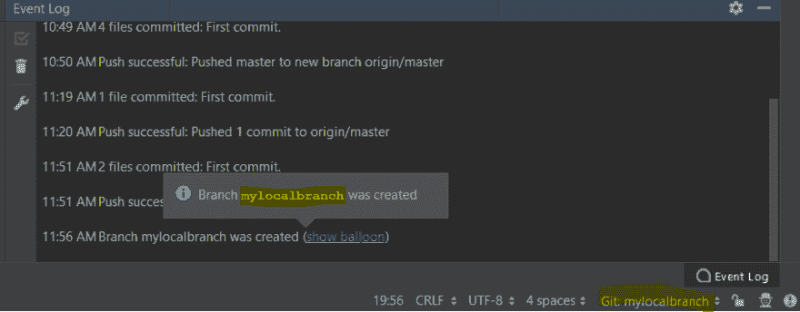](https://res.cloudinary.com/practicaldev/image/fetch/s--tZd97tUd--/c_limit%2Cf_auto%2Cfl_progressive%2Cq_auto%2Cw_880/https://thepracticaldev.s3.amazonaws.com/i/eljggu06gkgtc955h67y.png)

从终端:

```
 Initialized empty Git repository in D:/workspace-services/newproject/.git/
git checkout -b newFeatureBranch
Switched to a new branch 'newFeatureBranch'</code>

<b>2\. Push local branch to remote</b>

There will come a time when you have to push the local branch to remote. First commit all changes, then add the remote (if you haven't already) to which you want to push the code.

From IntelliJ:


From Terminal: 
```

Enter fullscreen mode Exit fullscreen mode

git add *
git commit -m“演示的第一次提交”
git 远程添加原点 https://{...}.git
git push -u 原点主控

**3\. Rebase**

我想把我的新分支放在主分支之上，这样我的同事就可以看到我最新的修改。这可能是一个大项目，有许多团队并行工作，或者是公司内部“行为和实践准则”的一部分。首先，确保您提交了所有的更改。一些团队可能喜欢合并其他团队，如 Rebasing。我个人比较喜欢用 Rebase。我认为线性历史更容易理解。要了解更多技术细节，请查阅这份精美的[亚特兰蒂斯文档](https://medium.com/r/?url=https%3A%2F%2Fwww.atlassian.com%2Fgit%2Ftutorials)。

来自 IntelliJ:

检查你的特征分支，然后从右下角选择哪个分支作为基础，在我的例子中是主分支。我想从 feature 分支获得所有提交，并将它们放在 master 分支之上。

[](https://res.cloudinary.com/practicaldev/image/fetch/s--3_3iWG8J--/c_limit%2Cf_auto%2Cfl_progressive%2Cq_auto%2Cw_880/https://thepracticaldev.s3.amazonaws.com/i/b923gs20d3gu8gedn4ic.png)

推动变更，因为您将处于分支“主”中，并且拥有来自特性分支的提交。

[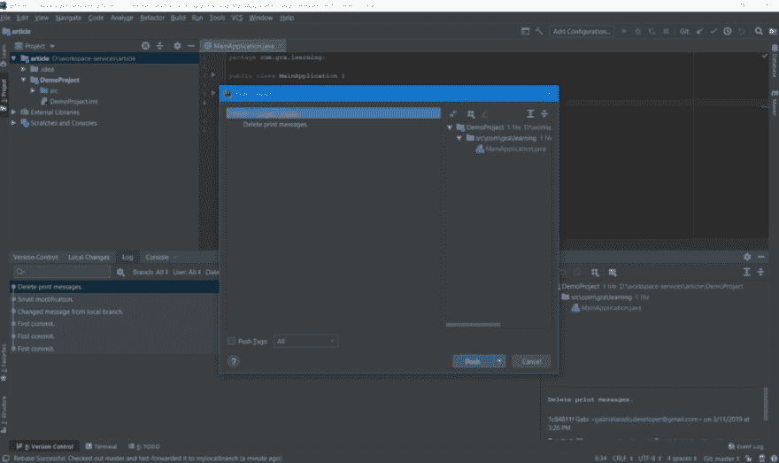](https://res.cloudinary.com/practicaldev/image/fetch/s--QN8tlyM9--/c_limit%2Cf_auto%2Cfl_progressive%2Cq_auto%2Cw_880/https://thepracticaldev.s3.amazonaws.com/i/h1qzhkdkqoxd6265awrl.png)

**4。将远程分支合并到特征分支**

让我们假设我在你的特性分支上工作，现在我在一个“主”分支的一些提交之后，我想要最新的修改。我不能做一个 rebase(政策)，然后合并是我的朋友。

如果您还没有签出功能分支，请签出它。选择要合并的分支，如下所示，然后提交更改。

来自 IntelliJ:

[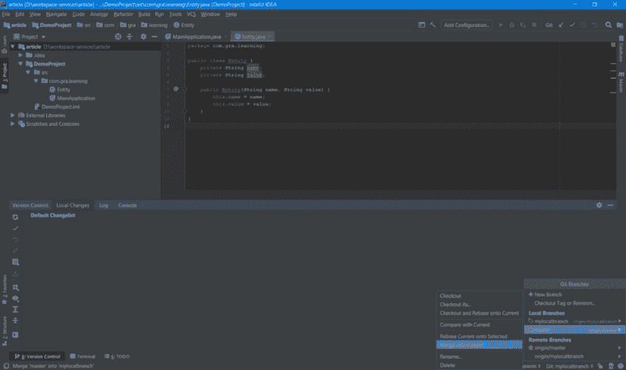](https://res.cloudinary.com/practicaldev/image/fetch/s--9-kqwCYU--/c_limit%2Cf_auto%2Cfl_progressive%2Cq_auto%2Cw_880/https://thepracticaldev.s3.amazonaws.com/i/86ooi9gb3oxx7yi6exqm.png)
[](https://res.cloudinary.com/practicaldev/image/fetch/s--ngaG3RIQ--/c_limit%2Cf_auto%2Cfl_progressive%2Cq_auto%2Cw_880/https://thepracticaldev.s3.amazonaws.com/i/ufizkwdns1jsch09vt5w.png)
[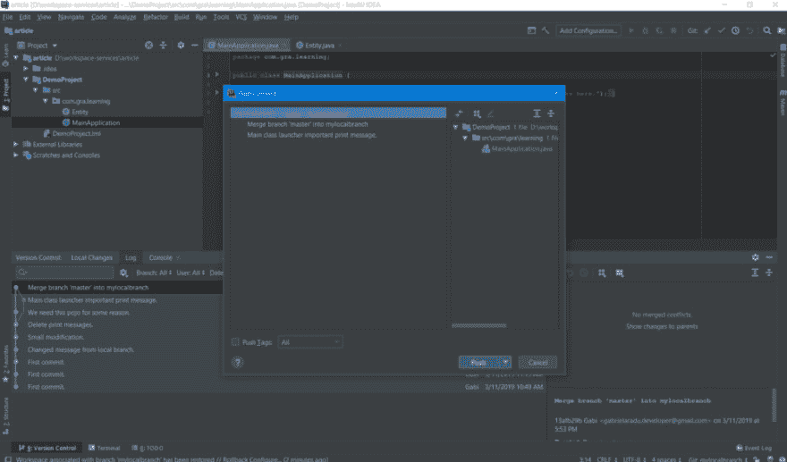](https://res.cloudinary.com/practicaldev/image/fetch/s--5bcgaMY2--/c_limit%2Cf_auto%2Cfl_progressive%2Cq_auto%2Cw_880/https://thepracticaldev.s3.amazonaws.com/i/ys3m0znsalkkux1rfljr.png)

**5。“将当前分支重置到此处”**

从版本控制中选择要将项目重置到的提交。一种情况是，也许最后一次提交引入了一个新的 bug，而您无法找出问题所在，那么您可以将分支重置到您想要的历史点。
另一种情况可能是，您从 remote 获取了所有提交，并且您不想 Git- > Pull(或者您不喜欢这样，或者您有一些不想隐藏或删除的本地修改，或者公司反对这样)，您可以在那里重置当前分支。

[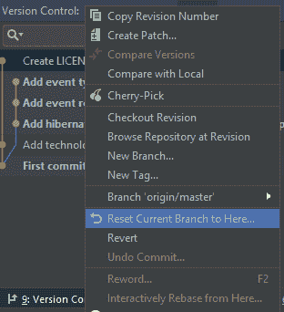](https://res.cloudinary.com/practicaldev/image/fetch/s--hF4so247--/c_limit%2Cf_auto%2Cfl_progressive%2Cq_auto%2Cw_880/https://thepracticaldev.s3.amazonaws.com/i/f6x9yyn7npi02msssc2s.png)

接下来，选择如何重置。我一般用混合。选择硬将不会保留任何本地更改，并将重置为确切的提交。

[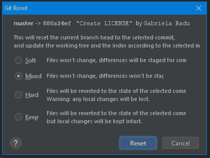](https://res.cloudinary.com/practicaldev/image/fetch/s--ToqxTDOI--/c_limit%2Cf_auto%2Cfl_progressive%2Cq_auto%2Cw_880/https://thepracticaldev.s3.amazonaws.com/i/leg1ufib7bo49urcyjmt.png)

如果您没有选择 Hard，那么您将只能提交修改后的代码，然后推送至 remote。

[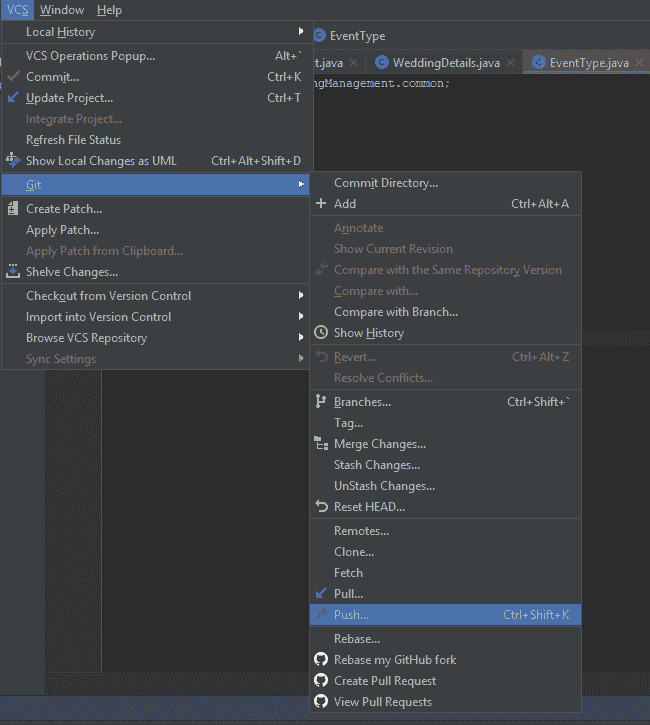](https://res.cloudinary.com/practicaldev/image/fetch/s--Z7tZYaXG--/c_limit%2Cf_auto%2Cfl_progressive%2Cq_auto%2Cw_880/https://thepracticaldev.s3.amazonaws.com/i/msc73p1f3ybvbvnuq7hn.png)

**6。从主分支**更新 GitHub 中的分叉分支

让我们假设您想要参与 Github 中一个很酷的开源项目。您首先派生项目，过一段时间后，您可能希望从主项目更新您的派生。对我来说，这是一个棘手的问题，但我很高兴在 Github 文档中找到了这篇文章，专门针对终端命令。

来自 IntelliJ:

a)在 Git>Remotes…中添加上游 URL，这意味着来自您之前分叉的存储库的 URL。

[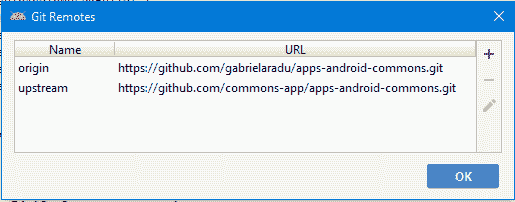](https://res.cloudinary.com/practicaldev/image/fetch/s--59rRie4f--/c_limit%2Cf_auto%2Cfl_progressive%2Cq_auto%2Cw_880/https://thepracticaldev.s3.amazonaws.com/i/1byonyeb4ybpy2pk1in9.png)

b)从上游获取:VCS>Git >获取
c)从上游拉/主:VCS > Git >拉

[https://thepractical dev . S3 . Amazon AWS . com/I/06212 se 7s 0 jvnmvg 0 ch . png "/>T1】](https://thepracticaldev.s3.amazonaws.com/i/06212se7s0jvnmmvg0ch.png%22/%3E)

d)或者改变你的叉子:VCS>Git>VCS 操作弹出菜单

[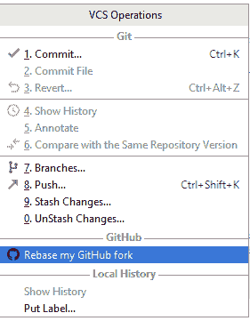](https://res.cloudinary.com/practicaldev/image/fetch/s--TYeIaKzM--/c_limit%2Cf_auto%2Cfl_progressive%2Cq_auto%2Cw_880/https://thepracticaldev.s3.amazonaws.com/i/mnbqzzi5xbummc783yiv.png)

我希望我已经学会的一个重要规则是快速和经常的承诺。太多次我丢失了我的工作，因为我甚至没有在本地提交它。不要像我一样:)

Git 是一个强大的工具，开始时看起来令人生畏，但随着时间的推移，它将成为一个非常有用且易于使用的工具。我仍在学习，并乐于这样做。

谢谢！