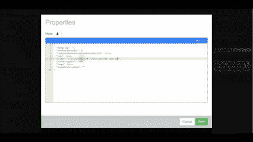

# 使用 Servo 构建上下文感知节点机器人

> 原文：<https://dev.to/lmessinger/building-context-aware-nodejs-bots-using-servo-5bdd>

大家好，看看我们写的机器人框架，叫做 Servo:

嘿，请务必在 Github 上启动它...

##  [伺服 ai ](https://github.com/servo-ai) / [伺服平台](https://github.com/servo-ai/servo-platform)

### 最佳对话式人工智能框架

<article class="markdown-body entry-content container-lg" itemprop="text">

# Servo.ai

**伺服机器人自动化框架**是构建机器人和自动化流程的领先框架。它允许开发者使用可视化架构、开放代码和可重用的 AI
点击观看简短的介绍视频

# 装置

1.  安装 nodejs (v8 及更高版本)和 npm (v5.5 及更高版本)
2.  克隆并安装
    *   sudo npm 安装-g gulp bower 并发
    *   https://github.com/servo-ai/servo-platform.git
    *   光盘伺服平台/服务器
    *   可选:* * Windows:NPM install-global-production Windows-build-tools * * Linux:sudo apt-get install build-essential libssl-dev
    *   npm 安装
    *   激光唱片../编辑
    *   npm 安装
    *   鲍尔安装

如果在 npm 安装期间出现错误，那么:*在 windows 上:NPM install-global-production windows-build-tools * Linux:sudo apt-get install build-essential libssl-dev

# 运行伺服系统

从**服务器**文件夹:
T3】NPM 开始

在 Chrome 浏览器上打开 localhost:8000。

**请注意** : Servo 附带了几个教程项目，将连接到 Wit.ai NLU 引擎。

# 教程

首先，请看维基:[https://github.com/servo-ai/servo-platform/wiki](https://github.com/servo-ai/servo-platform/wiki)

有关参考文件，请参见[https://servo-ai.github.io/servo-platform/](https://servo-ai.github.io/servo-platform/)

…</article>

[View on GitHub](https://github.com/servo-ai/servo-platform)

如需简短教程，请点击此处:

[https://medium . com/datadriveninvestor/building-context-aware-stateful-bots-using-servo-a2dc 3 f 557469](https://medium.com/datadriveninvestor/building-context-aware-stateful-bots-using-servo-a2dc3f557469)