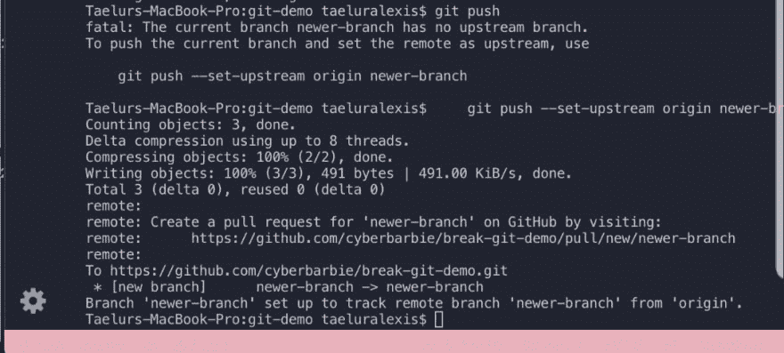
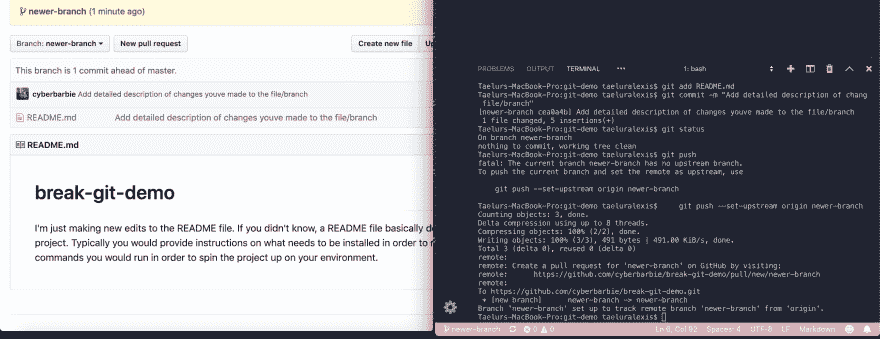

# 分解 Git:如何从 Master 创建分支并进行第一次提交！

> 原文：<https://dev.to/taeluralexis/break-git-down-how-to-create-a-branch-from-master-and-make-your-first-commit-2960>

<figure>

<figcaption>Let's just pretend she's reading the latest post on dev.to...</figcaption>

</figure>

# 介绍 Break Git Down 系列！

Break Git Down 是一个超级初学者友好的系列，帮助新开发人员学习一些您肯定会用到的最重要的 Git 任务。作为一名开发人员，Git 是日常生活中必不可少的一部分，我的目标是帮助过渡到使用 Git(最终是命令行)，这是一个平稳且容易的学习曲线。

## 为什么学它？

当我学习如何编码时，Git 是我害怕的事情之一——主要是因为我对命令行的非理性恐惧。相反，我使用 GitHub Desktop，它允许我懒洋洋地拖放文件。然而，当我受雇于我的第一个技术职位时，我很快意识到熟悉在终端中使用 Git 是多么重要。作为开发人员，使用它是我们日常生活中必不可少的一部分！

为了简洁起见，我们将假设您正在一个**现有的存储库中工作(也就是已经有一个主分支的项目)**

<figure>

<figcaption>Shut up and teach me already!</figcaption>

</figure>

## 为什么我要创建一个独立于主分支的分支？

用最简单的方式来说，主分支包含了一个项目的所有官方代码(也称为存储库)。在一个典型的工作场所，我们永远不会直接将代码推送到 master，以此来减少将 bug 和不必要的代码发布到产品(也就是 live site)的机会。相反，最安全的做法是创建独立于主分支的附加分支。将它们视为项目的不同版本。

## 现在让我们开始出招吧！

看看我们目前在哪一个分部！当我们运行 git branch 时，它将显示与存储库相关联的所有分支。

突出显示的分支表示我们当前在存储库中的位置。

接下来，我们将把我们的位置更改到主分支机构，这样我们就可以在创建新分支机构时重新开始！(如果你已经在高手分支了，完美！)

> git 分支

> git checkout master

让我们创建一个新的分支。在本教程中，我们称之为“新分支”

> Git checkout -b“更新分支”

现在我们已经创建了一个新的分支，这意味着无论我们做什么改变(例如创建一个文件或编辑一个现有的文件)，都只会影响这个分支！这很好，因为我们保持了代码的组织性，降低了搞乱整个项目的风险。

因此，对新文件进行所需的任何更改。在这种情况下，我更新了自述文件。

接下来，我们将把文件添加到提交中。从两个命令中选择一个。第一个命令将把所有文件添加到提交中。通常，只有当您对每个文件都进行了更改或者回购中只有一个文件时，您才会这样做。

> 去把它给我。

##### 选项#2(我们将在本教程中进行的操作)将只添加您指定要提交的文件！您必须指定要提交的文件的相对路径。在这种情况下，它将是自述文件。

> git add README.md

接下来，让我们添加一个关于我们在提交中所做更改的详细描述。-m 只代表消息。

> git commit -m "添加详细描述"

git push 命令允许您将提交从本地 git 存储库中的本地分支发送到远程存储库，它将为我们提供将漂亮的新分支推送到 Git 存储库所需的确切命令！(我最喜欢的命令)。稍后，我们将能够将我们的“新分支”提交合并到我们的主分支。

> git push

> git push-set-上游原点更新-分支

现在，让我们检查一下我们的 GitHub！

我在整个系列中一直建议的一个有用的提醒是练习，练习，再练习！你会通过重复学习。我希望你喜欢 Break Git Down 系列的第一部分。敬请关注更多内容！