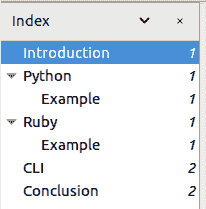
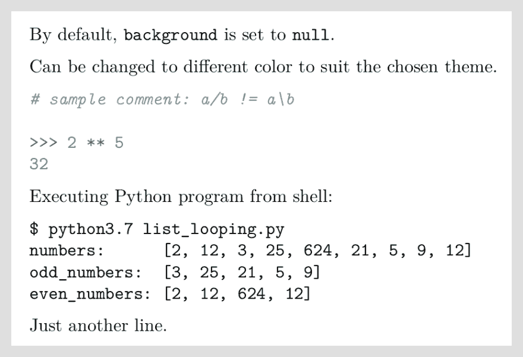
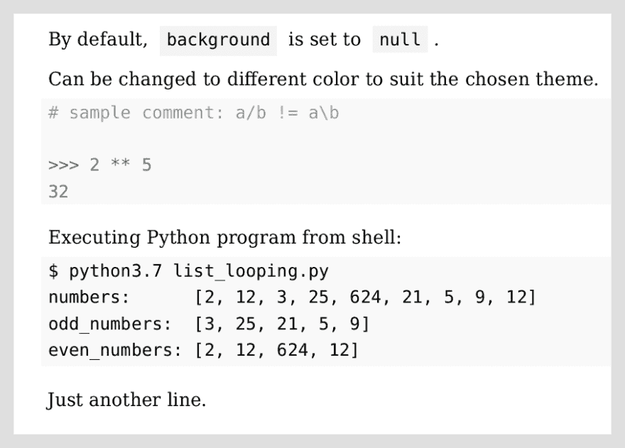
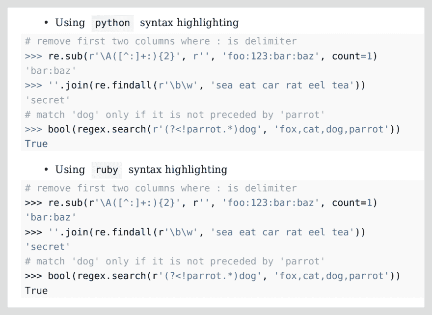
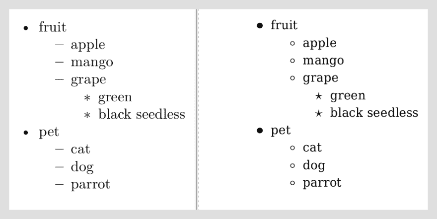
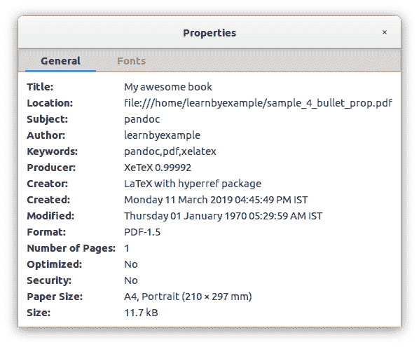
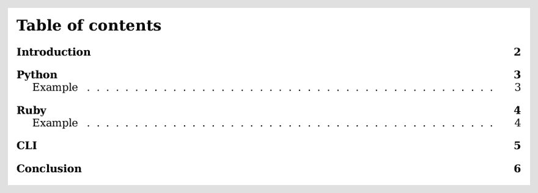
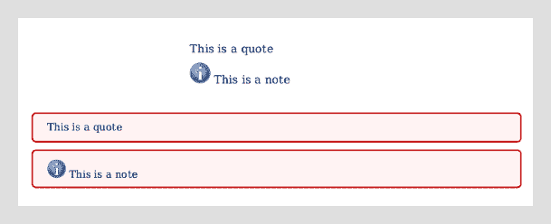

# 定制 pandoc 以从 markdown 生成漂亮的 pdf 和 epub

> 原文：<https://dev.to/learnbyexample/customizing-pandoc-to-generate-beautiful-pdfs-from-markdown-3lbj>

**目录**

*   [安装](#installation)
*   [最小示例](#minimal-example)
*   [章节中断](#chapter-breaks)
*   [通过-V 选项改变设置](#changing-settings-via-v-option)
*   [语法高亮显示](#syntax-highlighting)
*   [项目符号样式](#bullet-styling)
*   [PDF 属性](#pdf-properties)
*   [添加目录](#adding-table-of-contents)
*   [添加封面图像](#adding-cover-image)
*   [时尚的 blockquote](#stylish-blockquote)
*   [定制 epub](#customizing-epub)
*   [资源链接](#resource-links)

要么你已经听说过`pandoc`，要么如果你在网上搜索`markdown`到`pdf`或类似的，你肯定会遇到`pandoc`。本教程将帮助你使用`pandoc`从 [GitHub 风格的 markdown](https://github.github.com/gfm/) 文件中生成`pdf`和`epub`。这篇博文的主要动机是强调我做了哪些定制来为[自助出版我的电子书](https://learnbyexample.github.io/books/)生成`pdf`和`epub`版本。我最终得到的设置并不容易，所以我希望这对那些希望使用`pandoc`生成`pdf`和`epub`格式的人有用。本指南专门针对包含代码片段的技术书籍。

## 安装

我用的是 Ubuntu，据我所知，下面的步骤足以完成本教程中的演示。如果你得到一个错误或警告，在网上搜索这个问题，你可能会发现还需要安装什么。

我首先从 [pandoc: releases](https://github.com/jgm/pandoc/releases) 下载`deb`文件并安装。其次是`pdf`代所需的包。

```
$ # latest pandoc version as of 21 July 2020 is 2.10
$ sudo gdebi ~/Downloads/pandoc-2.10-1-amd64.deb

$ # note that download size is 750+ MB
$ sudo apt install texlive-xetex
$ sudo apt install librsvg2-bin
$ sudo apt install texlive-math-extra 
```

Enter fullscreen mode Exit fullscreen mode

有关其他操作系统的更多详细信息和指南，请参考 [pandoc:安装](https://pandoc.org/installing.html)

## 极小的例子

一旦`pandoc`在您的系统上工作，尝试生成一个没有任何定制的样本`pdf`。

参见[learn byexample . github . io repo](https://github.com/learnbyexample/learnbyexample.github.io/tree/master/files/pandoc_pdf)了解本教程中提到的所有输入和输出文件。

```
$ pandoc sample_1.md -f gfm -o sample_1.pdf 
```

Enter fullscreen mode Exit fullscreen mode

这里`sample_1.md`是输入 markdown 文件，`-f`用于指定输入格式是 GitHub 风格 markdown。`-o`选项根据扩展名指定输出文件类型。默认输出可能已经足够好了。但是我希望定制超链接、内嵌代码风格、在章节之间添加分页符等等。这篇博文将逐一讨论这些定制。

`pandoc`有自己的`markdown`风格，有许多有用的扩展——详见 [pandoc: pandocs-markdown](https://pandoc.org/MANUAL.html#pandocs-markdown) 。如果您希望在多个地方使用相同的源代码(或稍作修改),建议使用 GitHub 风格的 markdown。

建议按顺序使用`markdown`标题，不要跳过——例如，章节标题使用`H1`,章节小节使用`H2`等也可以。`H1`用于章节标题，而`H3`用于小节标题。使用前者可以在电子书阅读器上进行自动索引导航。

在 [Evince](https://wiki.gnome.org/Apps/Evince) 阅读器上，上述样本的索引导航如下所示:

[](https://res.cloudinary.com/practicaldev/image/fetch/s--ADqeswcJ--/c_limit%2Cf_auto%2Cfl_progressive%2Cq_auto%2Cw_880/https://learnbyexample.github.img/pandoc_pdf/chapter_index.png)

## 章节间断

从前面的演示中可以看出，默认情况下没有分页符。在网上搜索一个[解决方案，得到了这段`tex`代码:](https://superuser.com/questions/601469/getting-chapters-to-start-on-a-new-page-in-a-pandoc-generated-pdf) 

```
\usepackage{sectsty}
\sectionfont{\clearpage} 
```

Enter fullscreen mode Exit fullscreen mode

这可以使用`-H`选项添加。从`pandoc`手动、

> -H FILE，- include-in-header=FILE
> 
> 在文件头的末尾逐字包含文件的内容。例如，这个
> 可以用于在
> HTML 文档中包含特殊的 CSS 或 JavaScript。该选项可重复使用，以在文件头中包含多个
> 文件。它们将按指定的顺序排列。
> 寓意——独立。

`pandoc`调用现在看起来像:

```
$ pandoc sample_1.md -f gfm -H chapter_break.tex -o sample_1_chapter_break.pdf 
```

Enter fullscreen mode Exit fullscreen mode

您可以对标题进行进一步的定制，例如使用`\sectionfont{\underline\clearpage}`给章节名称加下划线，或者使用`\sectionfont{\LARGE\clearpage}`让章节名称变得更大。以下是更多关于各种定制的链接:

*   [tex.stackexchange:节字体](https://tex.stackexchange.com/questions/1455/how-to-set-the-font-for-a-section-title-and-chapter-etc)
*   [tex.stackexchange:截面颜色](https://tex.stackexchange.com/questions/230730/section-coming-up-as-undefined-when-using-sectsty)
*   [tex.stackexchange:更改节字体](https://tex.stackexchange.com/questions/10138/change-section-fonts)

## 通过-V 选项更改设置

> -V 键[=VAL]，-变量=键[:VAL]
> 
> 在独立模式下呈现
> 文档时，将模板变量 KEY 设置为 VAL 值。这通常只在使用
> - template 选项指定自定义模板时有用，因为 pandoc
> 会自动设置默认模板中使用的变量。如果
> 没有指定 VAL，该键将被赋予值 true。

`-V`选项允许改变变量值来定制设置，如页面大小、字体、链接颜色等。随着更多设置的改变，最好使用一个简单的脚本来调用`pandoc`,而不是在终端上键入整个命令。

```
#!/bin/bash

pandoc "$1" \
    -f gfm \
    --include-in-header chapter_break.tex \
    -V linkcolor:blue \
    -V geometry:a4paper \
    -V geometry:margin=2cm \
    -V mainfont="DejaVu Serif" \
    -V monofont="DejaVu Sans Mono" \
    --pdf-engine=xelatex \
    -o "$2" 
```

Enter fullscreen mode Exit fullscreen mode

*   `mainfont`为普通文本
*   `monofont`是代码片段
*   `geometry`对于页面尺寸和页边距
*   `linkcolor`设置超链接颜色
*   要增加默认的**字体大小**，使用`-V fontsize=12pt`
    *   如果您需要更大的尺寸选项，请参见 [stackoverflow:更改字体大小](https://stackoverflow.com/questions/23811002/from-markdown-to-pdf-how-to-change-the-font-size-with-pandoc)

使用`xelatex`作为`pdf-engine`允许使用系统中安装的任何字体。我选择`DejaVu`的一个原因是因为它支持**希腊语**和其他 Unicode 字符，这些字符会导致其他字体出错。更多细节请参见 [tex.stackexchange:使用 XeLaTeX 代替 pdfLaTeX](https://tex.stackexchange.com/questions/21736/using-xelatex-instead-of-pdflatex) 。

`pandoc`调用现在是通过一个脚本进行的:

```
$ chmod +x md2pdf.sh
$ ./md2pdf.sh sample_1.md sample_1_settings.pdf 
```

Enter fullscreen mode Exit fullscreen mode

在继续之前，请将生成的 pdf 与之前的输出进行比较。

在我的系统上，`DejaVu Serif`没有安装*斜体*变体，所以我不得不使用`sudo apt install ttf-dejavu-extra`来获得它。

## 语法高亮显示

为代码片段定制语法高亮显示的一个选项是保存一个`pandoc`主题并编辑它。参见 [stackoverflow:有哪些可用的语法高亮？](https://stackoverflow.com/questions/30880200/pandoc-what-are-the-available-syntax-highlighters/47876166#47876166)关于可用主题和更多细节(作为 stackoverflow 的一个好习惯，浏览所有答案和评论——边栏上的链接/相关部分也很有用)。

```
$ pandoc --print-highlight-style=pygments > pygments.theme 
```

Enter fullscreen mode Exit fullscreen mode

编辑上面的文件来定制主题。使用像 [colorhexa](https://www.colorhexa.com/) 这样的网站来帮助选择颜色、十六进制值等。对于本演示，更改了以下设置:

```
# by default, background is same as normal text
# change it to a shade of gray to easily distinguish code and text
"background-color": "#f8f8f8",

# change italic to false, messes up comments with slashes
# change comment text-color to yet another shade of gray
"Comment": {
    "text-color": "#9c9c9c",
    "background-color": null,
    "bold": false,
    "italic": false,
    "underline": false
}, 
```

Enter fullscreen mode Exit fullscreen mode

**内联代码**

类似于改变代码片段的背景颜色，我在网上找到了一个[解决方案](https://stackoverflow.com/questions/40975004/pandoc-latex-change-backtick-highlight)来改变内联代码片段的背景颜色。

```
\usepackage{fancyvrb,newverbs,xcolor}

\definecolor{Light}{HTML}{F4F4F4}

\let\oldtexttt\texttt
\renewcommand{\texttt}[1]{
  \colorbox{Light}{\oldtexttt{#1}}
} 
```

Enter fullscreen mode Exit fullscreen mode

将`--highlight-style pygments.theme`和`--include-in-header inline_code.tex`添加到脚本中，并再次生成`pdf`。

使用`pandoc sample_2.md -f gfm -o sample_2.pdf`,输出将是:

[](https://res.cloudinary.com/practicaldev/image/fetch/s--hu4QzLoZ--/c_limit%2Cf_auto%2Cfl_progressive%2Cq_auto%2Cw_880/https://learnbyexample.github.img/pandoc_pdf/default_syn.png)

用`./md2pdf_syn.sh sample_2.md sample_2_syn.pdf`输出是:

[](https://res.cloudinary.com/practicaldev/image/fetch/s---FkDrRx4--/c_limit%2Cf_auto%2Cfl_progressive%2Cq_auto%2Cw_880/https://learnbyexample.github.img/pandoc_pdf/customized_syn.png)

为了我的 [Python re(gex)？](https://github.com/learnbyexample/py_regular_expressions)本书，偶然我发现使用`ruby`而不是`python`来突出显示 REPL 代码片段的语法更好。来自`./md2pdf_syn.sh sample_3.md sample_3.pdf`结果的快照如下所示。对于`python`指令，字符串输出被视为注释，布尔值的颜色不容易与字符串值区分开来。`ruby`指令按预期处理字符串值，布尔值更容易识别。

[](https://res.cloudinary.com/practicaldev/image/fetch/s--RGR_Lr6x--/c_limit%2Cf_auto%2Cfl_progressive%2Cq_auto%2Cw_880/https://learnbyexample.github.img/pandoc_pdf/python_vs_ruby_syn.png)

## 项目符号样式

这个 [stackoverflow Q & A](https://stackoverflow.com/questions/22156999/how-to-change-the-style-of-bullets-in-pandoc-markdown) 有助于子弹造型。

```
\usepackage{enumitem}
\usepackage{amsfonts}

% level one
\setlist[itemize,1]{label=$\bullet$}
% level two
\setlist[itemize,2]{label=$\circ$}
% level three
\setlist[itemize,3]{label=$\star$} 
```

Enter fullscreen mode Exit fullscreen mode

比较`pandoc sample_4.md -f gfm -o sample_4.pdf`和`./md2pdf_syn_bullet.sh sample_4.md sample_4_bullet.pdf`得出:

[](https://res.cloudinary.com/practicaldev/image/fetch/s--LhR3GT34--/c_limit%2Cf_auto%2Cfl_progressive%2Cq_auto%2Cw_880/https://learnbyexample.github.img/pandoc_pdf/bullet_styling.png)

## PDF 属性

这个 [tex.stackexchange Q & A](https://tex.stackexchange.com/questions/23235/eliminate-edit-pdf-properties-added-by-pdflatex) 有助于改变元数据。参见[PSP PDF kit:你的 PDF 中隐藏了什么？](https://pspdfkit.com/blog/2018/whats-hiding-in-your-pdf/)与[关于 HN](https://news.ycombinator.com/item?id=18381515) 的讨论。

```
\usepackage{hyperref}

\hypersetup{
  pdftitle={My awesome book},
  pdfauthor={learnbyexample},
  pdfsubject={pandoc},
  pdfkeywords={pandoc,pdf,xelatex}
} 
```

Enter fullscreen mode Exit fullscreen mode

`./md2pdf_syn_bullet_prop.sh sample_4.md sample_4_bullet_prop.pdf`给出:

[](https://res.cloudinary.com/practicaldev/image/fetch/s--lWEDlj56--/c_limit%2Cf_auto%2Cfl_progressive%2Cq_auto%2Cw_880/https://learnbyexample.github.img/pandoc_pdf/pdf_properties.png)

## 添加目录

有一个方便的选项`--toc`可以在生成的`pdf`顶部自动包含目录。您可以使用`--toc-depth`选项控制级数，默认为 3 级。您也可以使用`-V toc-title`选项将默认字符串`Contents`更改为其他值。

`./md2pdf_syn_bullet_prop_toc.sh sample_1.md sample_1_toc.pdf`给出:

[](https://res.cloudinary.com/practicaldev/image/fetch/s--w4bgdl5U--/c_limit%2Cf_auto%2Cfl_progressive%2Cq_auto%2Cw_880/https://learnbyexample.github.img/pandoc_pdf/table_of_contents.png)

## 添加封面图片

要在目录之前添加内容，例如封面图像，您可以使用一个`tex`文件并逐字包含它。创建一个`tex`文件(此处命名为`cover.tex`，内容如下:

```
\includegraphics{cover.png}
\thispagestyle{empty} 
```

Enter fullscreen mode Exit fullscreen mode

然后，通过添加`--include-before-body cover.tex`和 tada 来修改前面的脚本`md2pdf_syn_bullet_prop_toc.sh`——在目录之前得到封面图像。`\thispagestyle{empty}`有助于避免封面上的页码，参见[tex . stack exchange:clear page](https://tex.stackexchange.com/questions/360739/what-is-the-use-of-clearpage-thispagestyleempty-cleardoublepage)。

`bash`脚本调用现在是`./md2pdf_syn_bullet_prop_toc_cover.sh sample_5.md sample_5.pdf`。

在输入减价文件中你至少需要一张图片，否则设置不会应用到封面图片，你可能会得到奇怪的输出。`sample_5.md`上面的命令中使用了包括一幅图像。如果图像路径可以包含`tex`元字符，请注意使用转义。

## 时尚 blockquote

默认情况下，块引号(markdown 中以`>`开头的行)在`pdf`输出中是缩进的。为了让它们突出， [tex.stackexchange:改变背景颜色和边框 blockquote](https://tex.stackexchange.com/questions/154528/how-to-change-the-background-color-and-border-of-a-pandoc-generated-blockquote) 帮了大忙。

用如下所示的内容创建`quote.tex`。你可以改变颜色以适合你自己喜欢的风格。

```
\usepackage{tcolorbox}
\newtcolorbox{myquote}{colback=red!5!white, colframe=red!75!black}
\renewenvironment{quote}{\begin{myquote}}{\end{myquote}} 
```

Enter fullscreen mode Exit fullscreen mode

`bash`脚本调用现在是`./md2pdf_syn_bullet_prop_toc_cover_quote.sh sample_5.md sample_5_quote.pdf`。默认和样式化块引用之间的差异如下所示。

[](https://res.cloudinary.com/practicaldev/image/fetch/s--PlzKJBTl--/c_limit%2Cf_auto%2Cfl_progressive%2Cq_auto%2Cw_880/https://learnbyexample.github.img/pandoc_pdf/styled_blockquote.png)

## 定制 epub

很长一段时间，我认为`epub`对于编程书籍来说没有意义。结果，我没有使用正确的电子书阅读器。FBReader 适合小说，但不适合有代码片段的电子书。当我使用 [atril](https://github.com/mate-desktop/atril) 和 [calibre 电子书阅读器](https://calibre-ebook.com/)时，效果不错。

在尝试生成`epub`版本之前，我不知道如何使用`css`。不知何故，我设法采用了`pandoc`提供的默认 [epub.css](https://github.com/jgm/pandoc/blob/master/data/epub.css) ，并对其进行了尽可能接近`pdf`版本的定制。修改后的`epub.css`可从[learn byexample . github . io repo](https://github.com/learnbyexample/learnbyexample.github.io/tree/master/files/pandoc_pdf)获得。生成`epub`的`bash`脚本如下所示，调用为`./md2epub.sh sample_5.md sample_5.epub`。注意`pygments.theme`与之前讨论的`pdf`定制相同。

```
#!/bin/bash

pandoc  "$1" \
        -f gfm \
        --toc \
        --standalone \
        --top-level-division=chapter \
        --highlight-style pygments.theme \
        --css epub.css \
        --metadata=title:"My awesome book" \
        --metadata=author:"learnbyexample" \
        --metadata=lang:"en-US" \
        --metadata=cover-image:"cover.png" \
        -o "$2" 
```

Enter fullscreen mode Exit fullscreen mode

## 资源链接

*   [pandoc:手动](https://pandoc.org/MANUAL.html)
*   [pandoc: demos](https://pandoc.org/demos.html)
*   [pandoc:提示和技巧](https://github.com/jgm/pandoc/wiki/Pandoc-Tricks)

**生成电子书的更多选项和工作流程**:

*   pandoc-latex-template —一个干净的 pandoc latex 模板，用于将您的 markdown 文件转换为 PDF 或 LaTeX
*   [用 pandoc、make 和 vim 写书](https://keleshev.com/my-book-writing-setup/)
*   Jupyter Book —一个开源项目，用于从计算材料中构建漂亮的、出版质量的书籍和文档
*   [Asciidoctor](https://asciidoctor.org/docs/what-is-asciidoc/)
    *   [使用 Asciidoc 的 pdf 生成工作流程](https://shape-of-code.coding-guidelines.com/2019/08/11/my-books-pdf-generation-workflow/)
*   [斯芬克斯](https://www.sphinx-doc.org/en/stable/index.html)
    *   [自助出版一本使用 reStructuredText、Sphinx、Calibre 和 vim 的书](https://digitalsuperpowers.com/blog/2019-02-16-publishing-ebook.html)
*   [预订](https://bookdown.org/home/)
*   [emacs 组织模式](https://orgmode.org/)
*   [马克迪普](https://casual-effects.com/markdeep/)

**杂项**

*   Vim 在写书的时候节省了我几个小时的工作时间&课程
*   [用 Unix 写一本书](https://joecmarshall.com/posts/book-writing-environment/)
*   askubuntu:我如何安装字体？
*   tex.stackexchange:对于 Serif、Sans 和 Mono，你有什么最佳的字体组合推荐？
*   [乳胶字体目录](http://www.tug.dk/FontCatalogue/)
*   [支持降价创作的工具](https://github.com/karthik/markdown_science/wiki/Tools-to-support-your-markdown-authoring)
*   [picular:颜色搜索引擎](https://picular.co/)和 [colorhexa](https://www.colorhexa.com/)
*   [ebooks.stackexchange](https://ebooks.stackexchange.com/questions?sort=votes)