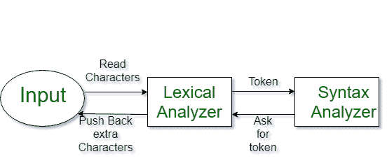

# 一起使用 JFlex 和 Jacc

> 原文：<https://dev.to/vicentemaldonado/use-jflex-and-jacc-together-3nnd>

[](https://res.cloudinary.com/practicaldev/image/fetch/s--aYeayOxk--/c_limit%2Cf_auto%2Cfl_progressive%2Cq_auto%2Cw_880/https://cdn-images-1.medium.com/max/500/1%2AXCb6SyEhRx5JoxfLvd0QUw.jpeg)

就像 [JFlex](https://www.jflex.de/) 生成词法分析器一样， [Jacc](http://web.cecs.pdx.edu/~mpj/jacc/) 生成解析器，但这有什么区别呢？词法分析器可以识别单词，语法分析器可以识别整个句子，或者更正式地说，使用词法分析器处理[常规语法](https://en.wikipedia.org/wiki/Regular_grammar)，使用语法分析器处理[上下文无关语法](https://en.wikipedia.org/wiki/Context-free_grammar)。

这就是两者经常一起使用的原因——首先使用词法分析器识别单词，然后将这些单词传递给解析器，解析器能够确定这些单词是否构成有效的句子。

现在，Java 就是 Java，有一种解析器生成器可供选择: [Antlr](https://www.antlr.org/) 无处不在，但也有 [CoCo/R](http://www.ssw.uni-linz.ac.at/Coco/) 、[、](https://javacc.org/)、 [SableCC](http://sablecc.org/) 、 [Cup](http://www2.cs.tum.edu/projects/cup/) 、 [Byacc/J](http://byaccj.sourceforge.net/) 以及其他许多解析器生成器。甚至古老的 Bison 也能够生成 Java 解析器。有些解析器，比如 Antlr、CoCo/R 和 JavaCC，甚至不需要单独的词法分析器来输入单词——它们可以自己生成一个！

那么为什么是 Jacc 呢？为什么不呢？

好的，那么 JFlex 和 Jacc 是如何协同工作的:

[](https://res.cloudinary.com/practicaldev/image/fetch/s--EBWw95iw--/c_limit%2Cf_auto%2Cfl_progressive%2Cq_auto%2Cw_880/https://cdn-images-1.medium.com/max/552/1%2AFxPEreHwpiRs_PbzaXBBFQ.png)

JFlex 将输入作为字符流读取，并在 Jacc 请求时为 Jacc 生成一个令牌。[令牌是一个具有含义](https://en.wikipedia.org/wiki/Lexical_analysis#Token)的字符串。例如，+，true 和 3.14 都是记号——其中一些记号除了它们的类型之外并不真正需要值:true 是一个布尔文字，但是其中一些是:3.14 是一个值为 3.14 的整数文字。

与 JFlex 一样，Jacc 文件有三个不同的部分:

```
directives section
%%
rules section
%%
additional code section 
```

Jacc 在一个单独的文件中创建一个它期望的所有令牌的列表。您可以这样指定文件和令牌列表:

```
%interface ParserTokens
%token X NL 
```

我们来看看生成的文件:

```
// Output created by jacc on Mon Mar 11 09:54:05 CET 2019

interface ParserTokens {
    int ENDINPUT = 0;
    int NL = 1;
    int X = 2;
    int error = 3;
} 
```

它是一个兼做枚举的接口。除了我们要求的两种令牌类型 NL 和 X 之外，还创建了另外两种类型:一种用于输入结束，另一种用于错误。回到 JFlex 文件中，您“实现”了这个“接口”:

```
%class Lexer
%implements ParserTokens 
```

这样我们的 lexer 就可以看到 ENDINPUT、NL、X 和 error 常量。Jacc 还期望一些事情:

*   一个返回表示令牌类型的整数值的函数(在我们的示例中为 0、1 或 3)。将该函数命名为 yylex 是一种传统，我们就这么做吧:

```
%function yylex
%int 
```

*   另外三个函数:getToken 获取当前令牌码，nextToken 读取下一个令牌码，getSemantic 获取当前令牌值:

```
%{

private int token;
    private String semantic;

    public int getToken()
    {
        return token;
    }

    public String getSemantic()
    {
        return semantic;
    }

    public int nextToken()
    {
        try
        {
            token = yylex();
        }
        catch (java.io.IOException e)
        {
            System.out.println(
                "IO exception occured:\n" + e);
        }
        return token;
    }

%} 
```

您可能会注意到，我们决定让令牌语义值成为一个字符串，所以我们还需要在解析器中指出:

```
%semantic String 
```

对于我们的例子，我们只需要让 lexer 识别以下单词:单词，单词，单词，单词，…，单词，单词和新行。我们将忽略空白。

```
x = [wW][oO][rR][dD]
nl = \n | \r | \r\n
space = [\t]

%% 
```

当 lexer 找到一个单词时，它将返回 X 标记(即。2 来自 ParserTokens 接口)值为 word，Word，… —这就是 semantic = YY text()；确实如此。当它遇到一个新行时，它将返回 ENDINPUT(即。0):

```
{x} { semantic = yytext(); return X; }
{space} { /\* Ignore space \*/ }
{nl} { return ENDINPUT; }
[^] { System.out.println("Error?"); } 
```

就是这样。现在解析器“语法”如日中天:

```
sentence : X { System.out.println("X found: " + $1); }
    | sentence X { System.out.println("X found: " + $2); }
    ; 
```

语法是[左递归](https://en.wikipedia.org/wiki/Left_recursion)，允许我们在一个句子中有一个或多个 X 单词。$1 和$2 将保存由 lexer 传递的 X 语义值，我们将简单地打印出来。

在 main 方法中，我们创建 Lexer 和 Parser 实例并开始解析。这里需要注意的一点是，我们必须用
来“初始化”lexer

```
parser.lexer.nextToken(); 
```

解析器才能使用它。作为参考，这里是 lexer 的完整源代码

```
import java.io.\*;

%%

%class Lexer
%implements ParserTokens

%function yylex
%int

%{

private int token;
    private String semantic;

    public int getToken()
    {
        return token;
    }

    public String getSemantic()
    {
        return semantic;
    }

    public int nextToken()
    {
        try
        {
            token = yylex();
        }
        catch (java.io.IOException e)
        {
            System.out.println(
                "IO exception occured:\n" + e);
        }
        return token;
    }

%}

x = [wW][oO][rR][dD]
nl = \n | \r | \r\n
space = [\t]

%%

{x} { semantic = yytext(); return X; }
{space} { /\* Ignore space \*/ }
{nl} { return ENDINPUT; }
[^] { System.out.println("Error?"); } 
```

而解析器的:

```
%{

import java.io.\*;

%}

%class Parser
%interface ParserTokens

%semantic String

%token X NL

%%

sentence : X { System.out.println("X found: " + $1); }
    | sentence X { System.out.println("X found: " + $2); }
    ;

%%

private Lexer lexer;

    public Parser(Reader reader)
    {
        lexer = new Lexer(reader);
    }

    public void yyerror(String error)
    {
        System.err.println("Error: " + error);
    }

    public static void main(String args[]) throws IOException
    {
        System.out.println("Interactive evaluation:");

        Parser parser = new Parser(
            new InputStreamReader(System.in));

        parser.lexer.nextToken();
        parser.parse();
    } 
```

你需要编译 Lexer.flex

```
jflex lexer.flex 
```

和 Parser.jacc

```
jacc parser.jacc 
```

以及生成的三个 Java 文件(Lexer.java、Parser.java 和 ParserTokens.java):

```
javac \*.java 
```

为了最终能够运行解析器:

```
java Parser 
```

下面是一个终端会话示例:

```
Interactive evaluation:
word Word wOrD WORD
X found: word
X found: Word
X found: wOrD
X found: WORD 
```

你可以在 Github 上找到[的完整源代码。](https://github.com/Wurdlack/Medium/tree/master/jflex_jacc)

实际上这很无聊，但是我们现在可以自由地使用上下文无关的语法了！