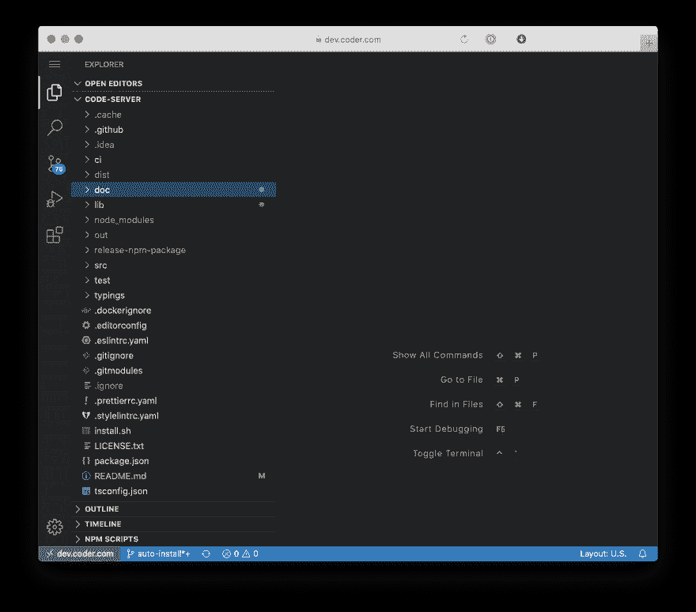
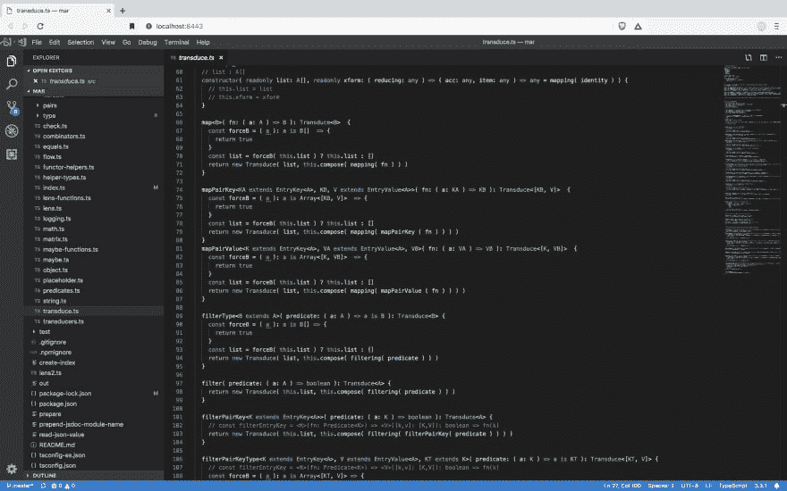

# 如何在服务器上运行 VS 代码！

> 原文：<https://dev.to/babak/how-to-run-vs-code-on-the-server-3c7h>

VS Code 是我最喜欢的 web 开发编辑器。集成的终端、强大的插件生态系统、调试器和出色的 TypeScript 支持使它变得完美。这是我不断回到本地发展的一个原因。因为虽然我可以在终端上运行`vim`并远程工作，但我在`vim`中的效率并不高。

当然还有其他选择。云开发非常棒。在浏览器上进行完全远程的项目是一种解放。我的项目总是准备好工作，不受我的机器的束缚。但是云编辑器各有各的弊端。最终，我想进入终端，启动和停止服务，并完成我在本地机器上能做的所有事情。如果有一种方法可以直接在远程服务器上运行 VS 代码，那将是两全其美。

现在有了！感谢 coder.com

##  [ cdr ](https://github.com/cdr) / [代码服务器](https://github.com/cdr/code-server)

### 浏览器中的 VS 代码

<article class="markdown-body entry-content container-lg" itemprop="text">

# 代码服务器

在任何地方的任何机器上运行 [VS 代码](https://github.com/Microsoft/vscode)，并在浏览器中访问它。

[](https://raw.githubusercontent.com/cdr/code-server/master/./doc/assets/screenshot.png)

## 突出

*   **代码无处不在**
    *   使用一致的开发环境在 Chromebook、平板电脑和笔记本电脑上编写代码。
    *   在 Linux 机器上开发，并通过网络浏览器从任何设备上获取。
*   **服务器驱动的**
    *   利用大型云服务器来加速测试、编译、下载等等。
    *   由于所有密集型任务都在您的服务器上运行，因此在旅途中也能延长电池寿命。
    *   利用你身边的一台备用计算机，把它变成一个完整的开发环境。

## 入门指南

有关完整的设置和演练，请参见[。/doc/guide.md](https://raw.githubusercontent.com/cdr/code-server/master/./doc/guide.md) 。

### 快速安装

我们有一个[脚本](https://raw.githubusercontent.com/cdr/code-server/master/./install.sh)来为 Linux、macOS 和 FreeBSD 安装代码服务器。

如果可能的话，它会尝试使用系统包管理器。

第一次运行以打印出安装过程:

```
curl -fsSL https://code-server.dev/install.sh | sh -s -- --dry-run
```

现在实际安装:

```
curl
```

…</article>

[View on GitHub](https://github.com/cdr/code-server)

# 入门

要开始，您需要登录到远程开发服务器。这可以是数字海洋中的一滴水滴，AWS Lightsail 实例，或者任何其他你想要使用的云或互联网连接的服务器。需要访问权限。

然后，用户可以登录到远程服务器，或者在 docker 中运行 code-server，或者只使用他们的二进制版本。出于我的目的，我使用了二进制发行版

[https://github.com/codercom/code-server/releases](https://github.com/codercom/code-server/releases)

这里有一个例子可以说明这种情况会如何发展

```
mkdir ~/code-server
wget -qO- LINK_TO_DESIRED_BINARY \
  | tar xvz --strip-components=1 -C ~/code-server 
```

二进制文件有几个选项。在撰写本文时，在我的系统上给定相对路径时，应用程序似乎遇到了一些问题。所以我在 bash 中为它写了一个超级简单的包装器，决定将其命名为`code`,并将其放在我的`PATH`变量`~/bin`中。

`vim ~/bin/code`

```
#!/usr/bin/env bash
abs=$(realpath .)
req=$1
if [[ ! $1 =~ ^\/ ]];
then req="$abs/$1"
fi;

if [[ ! -d $req ]];
then echo "ERROR: path does not exist"
  echo "$req"
  exit;
fi;

~/code-server/code-server $req --no-auth 
```

`chmod +x ~/bin/code`

这个脚本从带有`no-auth`选项的`code-server`开始。`no-auth`选项禁用内置加密功能和密码验证页面。我这样做是因为我更愿意通过代理服务器或 SSH 隧道加密流量。我还可以使用代理连接的 web 服务器对页面进行密码保护。

现在，为了启动服务器，我简单地打开一个项目，就像我直接打开 VS 代码一样。

`code /path/to/project`

这将开始通过端口`8443`提供 VS 代码。有两种方法连接到它；通过 SSH 隧道或使用 web 服务器反向代理。

# SSH 隧道/端口转发

您可以使用 SSH 将远程端口从服务器转发到本地客户端。下面是将端口`8443`从服务器格式化到本地机器的样子。

```
ssh -N -L 0.0.0.0:8443:localhost:8443 login@your-server \
  2> /dev/null 
```

这个命令不会给出远程 shell，它只会进行端口转发。现在您可以打开浏览器并访问`http://localhost:8443`。看哪！您现在正在使用 VS 代码，运行在您的服务器上，从您的浏览器！

[](https://res.cloudinary.com/practicaldev/image/fetch/s--4Y5wnJW9--/c_limit%2Cf_auto%2Cfl_progressive%2Cq_auto%2Cw_880/https://thepracticaldev.s3.amazonaws.com/i/yu7tdjf7djj12kcuveo4.jpg)

令人难以置信的是，你还可以访问终端！这是非常强大的东西-所以要小心！

最后一部分是代理任何其他在非特权端口上运行的服务，比如端口`3000`或`8080`。一种方法是打开另一个终端并建立另一个连接。

```
ssh -N -L0.0.0.0:3000:localhost:3000 login@your-server \
  2> /dev/null 
```

或者同时代理两个端口

```
ssh -N \
  -L 0.0.0.0:8443:localhost:8443 \
  -L 0.0.0.0:3000:localhost:3000 \
  login@your-server \
  2> /dev/null 
```

# Web 服务器反向代理

注意:如果您想自己处理加密和密码保护，可以选择这个选项。

```
 BE SURE TO ENCRYPT AND PASSWORD PROTECT PUBLIC URLS. 
```

通过 web 服务器正确设置反向代理是一个更复杂的过程。我将只提供你需要做的工作的概述。

*   确保您有 SSL 证书。你可以用`certbot`通过让我们加密得到一个。
*   配置 web 服务器，在端口 8443 和所需的 URL 之间创建反向代理。一定要代理 websocket 流量。
*   密码保护对 URL 的访问

在我的例子中，我还想代理为开发目的而运行的服务，比如 port `3000`或`8080`。

### 阿帕奇

您需要确保加载了正确的模块

```
sudo a2enmod rewrite 
```

那么配置可能是这样开始的

```
<VirtualHost ip_address:443>
  # Enable Modules
  RewriteEngine On
  SSLEngine On

  # Configure basics
  ServerName your.address
  ServerAdmin whoever@your.address

  # Proxy Traffic
  RewriteCond %{HTTP:Upgrade} =websocket
  RewriteRule /(.*)           ws://localhost:8443/$1 [P,L]
  RewriteCond %{HTTP:Upgrade} !=websocket
  RewriteRule /(.*)           http://localhost:8443/$1 [P,L]

  # Require Password
  AuthUserFile /path/to/.htpasswd
  AuthGroupFile /dev/null
  AuthName "Title"
  AuthType Basic
  require valid-user

  # Use SSL
  Include /etc/letsencrypt/options-ssl-apache.conf
  SSLCertificateFile /etc/letsencrypt/live/yourwebsite.com/fullchain.pem
  SSLCertificateKeyFile /etc/letsencrypt/live/yourwebsite.com/privkey.pem

  SSLProtocol all
  SSLCipherSuite HIGH:MEDIUM
  # And so on... 
```

### NGINX

我还没有用 NGINX 尝试过这样做。NGINX 特别适合这一点。以下是我应该从哪里开始的一些参考资料:

使用 websockets
[加密流量和反向代理 https://gist.github.com/steve-ng/ed6de1fa702ef70bd6ce](https://gist.github.com/steve-ng/ed6de1fa702ef70bd6ce)

密码保护
[https://www . digital ocean . com/community/tutorials/how-to-set-up-password-authentic ation-with-nginx-on-Ubuntu-14-04](https://www.digitalocean.com/community/tutorials/how-to-set-up-password-authentication-with-nginx-on-ubuntu-14-04)

# 其他选项

### 让`code-server`处理自己的加密

另一个选择是不包含`--no-auth`选项，让`code-server`做它的事情。这里有一个资源可以获得更多关于数字海洋的信息

[https://github . com/coder com/code-server/blob/master/doc/admin/install/digital ocean . MD](https://github.com/codercom/code-server/blob/master/doc/admin/install/digitalocean.md)

### 使用 coder.com

我还应该提到，coder.com 有一个云服务。

[https://www.coder.com](https://www.coder.com)

# 概述

在云上运行 VS 代码将开发人员从他们的工作站中解放出来。人们可以安装他们的插件，根据自己的喜好配置编辑器，并直接从。环境一直都在，蓄势待发。