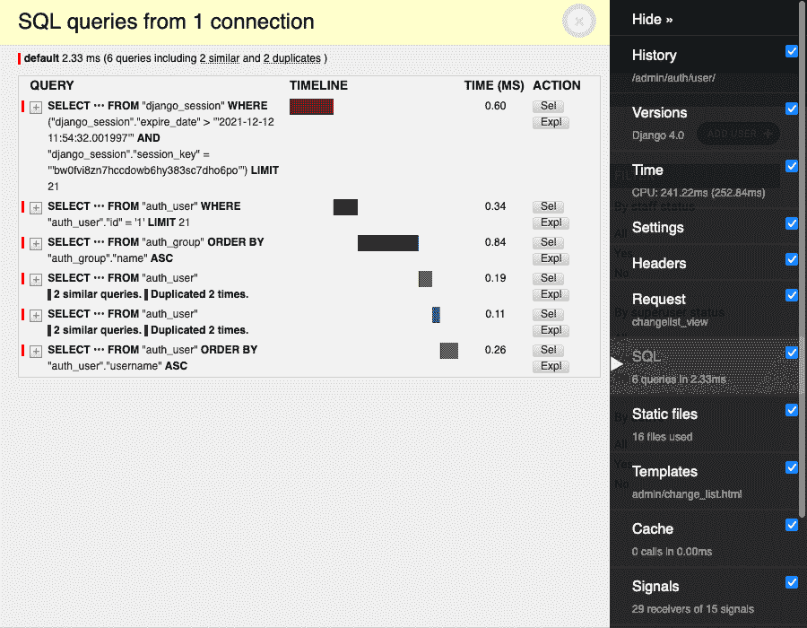

# 提高 Django 应用性能的技巧

> 原文：<https://dev.to/levivm/tips-for-improving-your-django-app-performance-bgi>

在与 Django 合作多年后，我想了解一些以前的工具/技术，以便提高性能和发现瓶颈。

所以，一个重要的话题就是性能，让我们分享一下如何让 Django 更快/提高性能的技巧。

我的列表

1.  使用 nginx + uWsgi/gunicorn 部署您的应用程序。
2.  使用 AWS S3(或任何其他类型的回购)提供静态文件。如果你的门户是全球性的或巨大的，你可以在前面放一个 CDN。CloudFront 可能是一个选择。[这里](https://www.sumologic.com/blog/devops/content-distribution-amazon-cloudfront/)有关于它的教程。
3.  花点时间创建数据库索引。理解最复杂的查询，并尝试为它们创建索引。
4.  安装 [Django 调试工具栏](https://github.com/jazzband/django-debug-toolbar)以便检查您的数据库查询。它是一个请求分析器。你可以检查 CPU 时间，请求时间，它有很多选项。

1.  使用**选择 _ 相关()**和**预选 _ 相关()**。这些 Django 的内置功能已经改变了我的生活。它们可以帮助你加快查询速度。为什么？查看这个[教程](https://hackernoon.com/all-you-need-to-know-about-prefetching-in-django-f9068ebe1e60)。相信我，这会让你大吃一惊的。
2.  使用缓存。Django 默认允许您设置一个缓存管理器。可以使用 memcached 或者 redis。如果你有很多重复的查询，一遍又一遍地返回相同的内容。执行整个请求没有意义。您可以在 Django 中缓存响应。这是一个很好的起点[如何在 Django 中使用 Redis 进行缓存](https://realpython.com/caching-in-django-with-redis/)
3.  如果您正在使用 Django 模板，您也可以对它们使用缓存。这里有一个很好的解释
4.  使用任何任务管理器(celery)执行非阻塞/异步任务，例如，如果您需要发送电子邮件，您应该将该任务委托给 Celery。
5.  如果你要处理每分钟的流量和请求，使用这个性能助推器 [**清漆**](https://varnish-cache.org/) 。它增加了一个缓存层，但级别更高。它可以设置在 Nginx 之上，能够缓存整个请求，而不会影响应用服务器。如果您想知道使用 Redis 或 Varnish 进行缓存的区别。注意 redis 在应用程序级执行缓存，您的应用服务器处理整个请求，使用您的缓存并创建一个包含您的数据的新 HTTP 响应。Varnish 获取请求，检查给定的规则，并返回之前缓存的请求，避免由于请求处理而产生的 nginx/应用服务器开销。