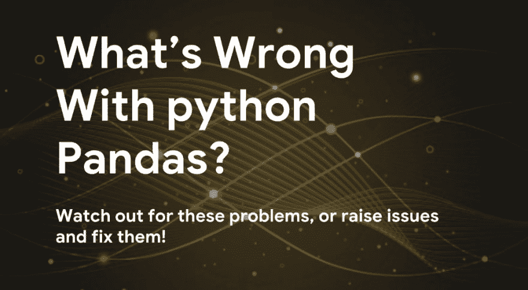
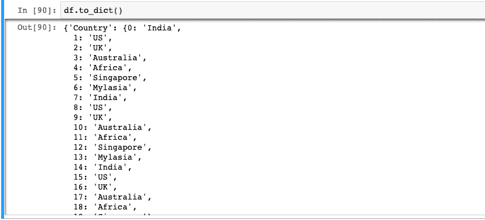
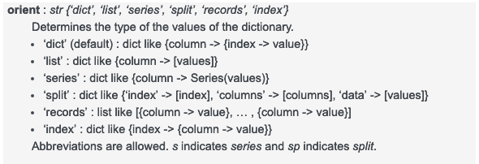
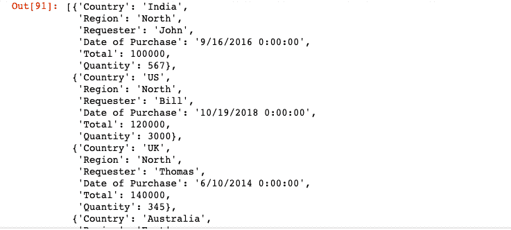
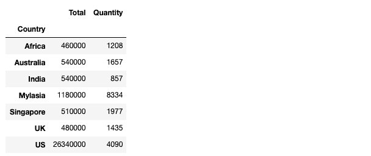
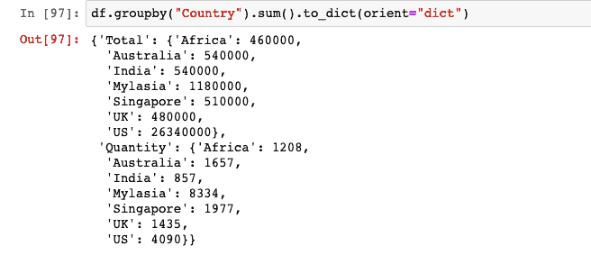
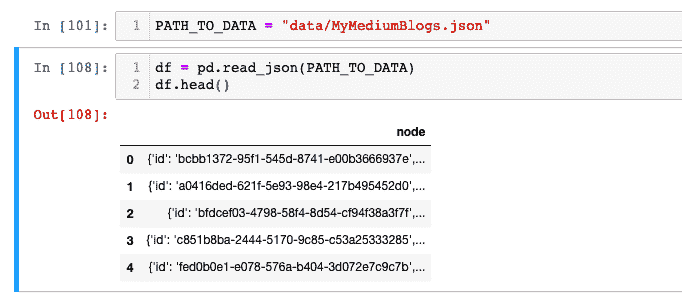
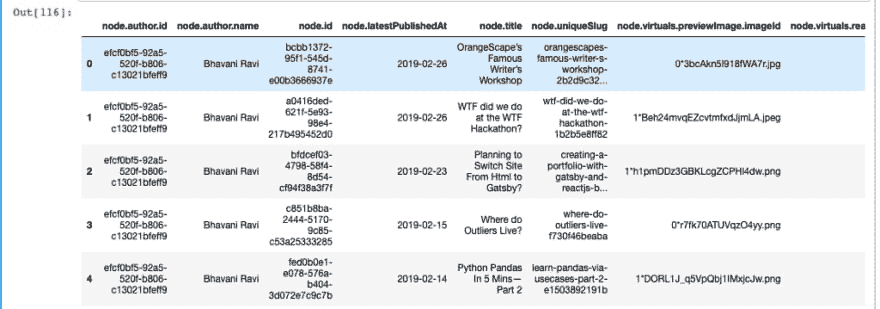
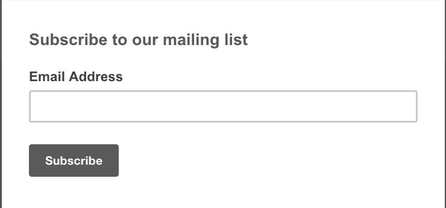

# 蟒蛇熊猫怎么了？

> 原文：<https://dev.to/bhavaniravi/whats-wrong-with-python-pandas-39gi>

请注意这些问题，或者提出问题并解决它们！

> 复杂的数据和用例会导致复杂的问题。

在我之前的博客中，我建议你从熊猫开始，并展示了为什么在进入机器学习之前掌握它是重要的。但是有几件事你需要注意。当我用熊猫来处理实时数据和创建一个报告平台时，这些问题是节目的绊脚石。密切关注这些问题，如果你在寻找熊猫来建立分析管道或平台，这可能会成为一个交易破坏者。

[](https://res.cloudinary.com/practicaldev/image/fetch/s--cRV0wvEg--/c_limit%2Cf_auto%2Cfl_progressive%2Cq_auto%2Cw_880/https://cdn-images-1.medium.com/max/1024/1%2A-08Oc6-APDXG60kwTifYvw.png)

### 一切从哪里开始

正如我提到的，我试图将 Pandas 整合到数据管道中，以创建报告。一些常见的使用案例包括

1.  从数据框架中选择特定列
2.  分组
3.  构建数据透视表

所有这些用例都有一个共同的属性。一旦构建了数据帧，就需要通过 API 将数据发送到前端。你要寻找的最可能的事情是将数据帧转换成字典，这就是 ***问题 1***

### 1。将数据帧转换为字典

对于这一部分，我们使用了与之前博客中相同的销售数据。

Dataframe 最大的优点之一是它是将数据转换成所需格式(CSV、JSON 等)的现成方法。,).to _ dictis 就是这样一个方法，将它们转换成 python 字典。

```
df = pd.read\_csv(PATH\_TO\_DATA)
df.head() 
```

<figure>[T3】

<figcaption>x</figcaption>](https://res.cloudinary.com/practicaldev/image/fetch/s--yg-JCI7T--/c_limit%2Cf_auto%2Cfl_progressive%2Cq_auto%2Cw_880/https://cdn-images-1.medium.com/max/623/1%2AA8dgTs7shZeiRNPf7GPMmQ.png) </figure>

现在，按照我们的用例，让我们使用 theto _ dict 方法创建一个字典。但是当你看到结果的时候，兴奋感就消失了。

```
df.to\_dict() 
```

[](https://res.cloudinary.com/practicaldev/image/fetch/s--ukU9V-jb--/c_limit%2Cf_auto%2Cfl_progressive%2Cq_auto%2Cw_880/https://cdn-images-1.medium.com/max/828/1%2AYHLkCSEOUbH-Cw_ABjskpw.png)

to_dict 方法有 5 种不同的方向，默认情况下是 dict 方向。对于每一列，它遍历每个索引并创建一个具有相应值的字典

[](https://res.cloudinary.com/practicaldev/image/fetch/s--r5gk0ZFO--/c_limit%2Cf_auto%2Cfl_progressive%2Cq_auto%2Cw_880/https://cdn-images-1.medium.com/max/590/1%2AHVJ5nut-Q5VbBvTuTB6pbA.png)

对于我们的要求，东方唱片公司似乎是一个很好的选择。

```
df.to\_dict(orient="records") 
```

[](https://res.cloudinary.com/practicaldev/image/fetch/s--HRuyXEZZ--/c_limit%2Cf_auto%2Cfl_progressive%2Cq_auto%2Cw_880/https://cdn-images-1.medium.com/max/737/1%2ALDrIIjWqfopdwVX4TfX82A.png)

### 2。将数据帧分组到字典中

我们看到了将数据帧转换成 API 响应是多么容易。类似地，您可以通过 API 端点将任何数据帧转换成响应，甚至是分组的数据帧。

我们来做一些简单的分组。

```
grouped\_df = df.groupby("Country").sum() 
```

[](https://res.cloudinary.com/practicaldev/image/fetch/s--_kzXrEju--/c_limit%2Cf_auto%2Cfl_progressive%2Cq_auto%2Cw_880/https://cdn-images-1.medium.com/max/608/1%2AmNQs-fpGKt0jp_qquO-KEg.png)

根据我们从使用默认的 to_dict 方法中得到的直觉，如果我们使用 orient=records，我们会以 OOPS 结束！！！那好像不对啊！

[](https://res.cloudinary.com/practicaldev/image/fetch/s--z7UeFI3X--/c_limit%2Cf_auto%2Cfl_progressive%2Cq_auto%2Cw_880/https://cdn-images-1.medium.com/max/608/1%2AMoP9VjyVBQIwWx1g1zAiiw.png)T3】

```
'records' : list like [{column -> value}, … , {column -> value}] 
```

正如文档所说，orient=record 只考虑列。留下包含 groupby 的国家详细信息的行。这使得最终的字典毫无意义。

在这一点上，我们必须弄清楚我们最终的字典应该是什么样子。你可能认为这是显而易见的，但对熊猫来说，事实并非如此。

```
**Structure 1 - Country wise**
{"Africa": {"Total": 5678, "Quanitity": 6789}}
{"Index":{"Column": "value"}} 
```

在查找熊猫文档时，orient="index "将符合要求

[](https://res.cloudinary.com/practicaldev/image/fetch/s--7SQJhnIP--/c_limit%2Cf_auto%2Cfl_progressive%2Cq_auto%2Cw_880/https://cdn-images-1.medium.com/max/774/1%2A6GwBmWKNxzvUufG2bah6aA.png)T3】

```
**Structure 2 - All the totals and Quatities**
{'Total': {'Africa': 460000, ...}, "Quantity":{"Africa":..}}
{"Column":{"Index": "value"}} 
```

[](https://res.cloudinary.com/practicaldev/image/fetch/s--IVSleBB3--/c_limit%2Cf_auto%2Cfl_progressive%2Cq_auto%2Cw_880/https://cdn-images-1.medium.com/max/656/1%2AFoW1Y_MmjqEPjDxZ7RnoeA.png)

#### 越列问题越多

当您在分组中添加更多的列时，Pandas 索引会堆积起来，dict 键会变成元组而不是 str，这使得它实际上无法使用。这次，字典、记录、索引这些东西都救不了我们了。

[](https://res.cloudinary.com/practicaldev/image/fetch/s--0f5o3x-6--/c_limit%2Cf_auto%2Cfl_progressive%2Cq_auto%2Cw_880/https://cdn-images-1.medium.com/max/961/1%2APWRfbK7ByayAlUOuJoXDNA.png)

### 3。JSON 转换成数据帧

到目前为止，我们已经看到了从 CSV 文件加载的数据，这意味着对于每个键，将有一个确切的值。由于这个部分需要更复杂的嵌套数据，[我通过 API(嵌套字典和列表)](https://jsoneditoronline.org/?id=e1a38442d3e740fa80b57c49efcc6ca8)使用了我的中等博客结果。当我们从外部 API 加载数据时，在现实场景中遇到这些障碍是很常见的。

当我们处理嵌套很深的数据时，熊猫成了一个巨大的麻烦。每个博客数据位于一个名为 node 的键下，作者和统计信息分别位于嵌套键 virtuals 和 author 下。

[](https://res.cloudinary.com/practicaldev/image/fetch/s--YpxPTfX9--/c_limit%2Cf_auto%2Cfl_progressive%2Cq_auto%2Cw_880/https://cdn-images-1.medium.com/max/532/1%2AG2Rpww7gxt9H3HjoimfZPg.png)

让我们看看将这个 JSON 加载到 Dataframe 中会发生什么。很明显，我们不能以任何方式利用这个数据帧，因为没有列或索引可供使用。

[](https://res.cloudinary.com/practicaldev/image/fetch/s--JX5Cj60s--/c_limit%2Cf_auto%2Cfl_progressive%2Cq_auto%2Cw_880/https://cdn-images-1.medium.com/max/682/1%2AOqSmjVAcMGGPxjzmLM0nHQ.png)

#### 蟒解

这个问题的 pythonic 解决方案是遍历 JSON 上的每个项目，并使用展平的项目创建一个数据帧。

```
data = None
with open(PATH\_TO\_DATA) as json\_data:
data = json.load(json\_data)
data = [d["node"] for d in data]
df = pd.DataFrame(data)
df.head() 
```

[](https://res.cloudinary.com/practicaldev/image/fetch/s--8K4Kd7AX--/c_limit%2Cf_auto%2Cfl_progressive%2Cq_auto%2Cw_880/https://cdn-images-1.medium.com/max/1024/1%2AxI6wVQiAkfILydrZZ2SV5A.png)

结果似乎比我们以前的那个好得多。但是我们仍然在丢失嵌套字典的重要信息。键 author 和 virtuals 仍然是嵌套的。例如，我们无法解决以下用例

1.  按用户对博客进行分组。
2.  找出平均拍手次数。
3.  找到用户写的博客的平均阅读时间。

除非扁平化到用户和虚拟人的层面，否则我们无法实现这些。依赖 pythonic 的方式变得复杂，因为这意味着你在所有层次上循环所有的键

#### 使用 json_normalize

Pandas 提供了一个名为 json_normalize 的方法，可以在所有级别上标准化(展平)字典。

```
import json
data = None
**# Read data into a dictionary**
with open(PATH\_TO\_DATA) as json\_data:
    data = json.load(json\_data)

**# Normalize using json\_normalize**
df = json\_normalize(data)
df.head() 
```

[](https://res.cloudinary.com/practicaldev/image/fetch/s--H0hoHlYw--/c_limit%2Cf_auto%2Cfl_progressive%2Cq_auto%2Cw_880/https://cdn-images-1.medium.com/max/1024/1%2AS6NDGpo5Hu7RkLQwT0x2hA.png)

虽然这听起来像是一个可行的解决方案，但它也有自己的一系列问题。

1.  **列名—** 列名是嵌套字典中键的路径。要访问数据帧中的元素，您需要知道完整的路径。当嵌套到 N 层时，这就变成了一个巨大的痛苦，你必须在同一层上进行分组。

```
df["node.virtuals.previewImage.imageId"] 
```

1.  **缺少定制**

*   如果你想在嵌套的某一层停止规范化，该怎么办？
*   如果你想在正常化时忽略某些键怎么办？(忽略规范化的 PreviewImage 键)
*   如果您只想规范化特定的键，该怎么办
*   如果您想在特定级别开始规范化数据，该怎么办？(例如，仅用虚拟创建数据框架)

Pandas 是一个优秀的软件包，具有各种级别的优化，使人们能够构建惊人的数据管道。但这是一些不符合目的的极端情况，就像我在尝试将其整合到实时报告系统中时遇到的情况一样。

这并不意味着你要恨熊猫一辈子。这些是你可以为熊猫做贡献的一些领域。有 600 个公开的 bug，和 230 个好的第一期，一个很棒的支持社区，而且非常容易开始。

你喜欢你读到的东西吗？ ***按住*** *的“鼓掌”键，给我一个* ***大喊*** *上*【推特】*([https://twitter.com/@bhavaniravi](https://twitter.com/@bhavaniravi))*。_

[](http://eepurl.com/gaEkp5)

* * *