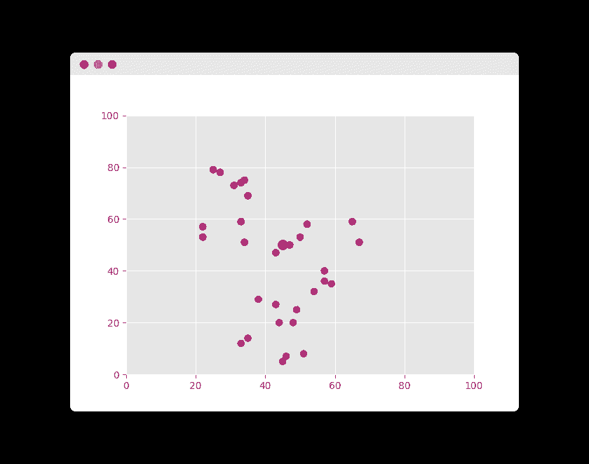

# k-最近邻算法

> 原文：<https://dev.to/devtox/k-nearest-neighbors-algorithm-44aj>

“告诉我谁是你的朋友，我会告诉你你是谁”。这就是 k-最近邻算法的思想基础。

您可以在向量空间中表示数据。这可能是长度(x)和重量(y)，大小(x)和价格(y)或任何你想要的。

给定一个二维空间，它寻找 k 个最近的邻居。空间中的任何点都可以是组/类的一部分。意味着最接近的点可能告诉该类一个新点。

在上图中，有一个红蓝组。新的黑点最有可能属于红色组，因为它被红色邻居所包围。

阅读更多: [k 近邻](https://pythonbasics.org/k-nearest-neighbors/)