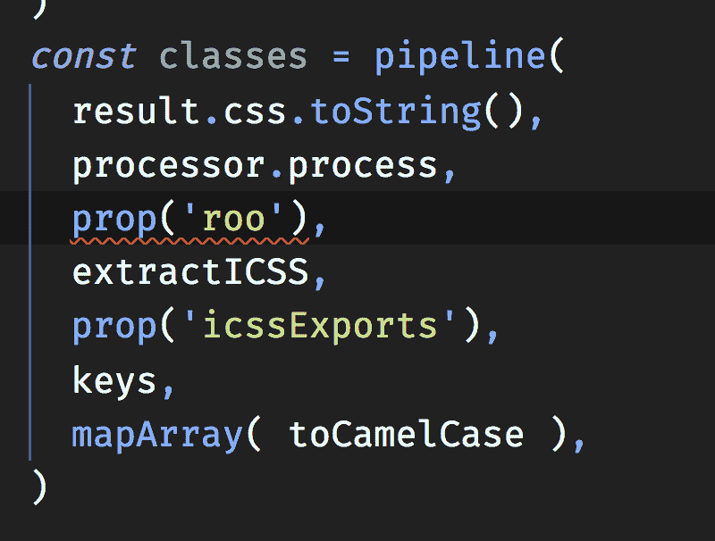

# 你不会后悔使用类型系统的 4 个理由

> 原文：<https://dev.to/babak/4-reasons-why-you-wont-regret-using-a-type-system-308k>

# 要打字还是不要打字

关于类型系统的好处和局限性的争论还在继续，双方都有合理的观点。在本文中，我将探讨我个人从使用类型系统中体验到的一些好处。

1.  重构——我一直致力于降低复杂性。人们普遍认为，简洁地表达一个想法需要付出努力。因此，当你在偿还技术债务时，类型系统可以提供巨大的帮助。当一些功能或过程的工作分布在许多不同的文件、库和/或组件中时，类型系统是一个福音。

2.  写作单元测试是很好的练习。一个类型系统可以更进一步，测试不同的单元是如何组合在一起的。在下面的例子中，所有的功能都工作正常；问题在于我们对它们的使用。我们正在访问一个不存在的属性——谢天谢地，这个类型良好的`pipeline`函数马上就发现了这一点。

    <figure> 

    <figcaption>来自 soultrain 库的管道[https://github . com/babakness/soul train/blob/v 0 . 0 . 43/src/function/pipeline . ts](https://github.com/babakness/soultrain/blob/v0.0.43/src/function/pipeline.ts)</figcaption>

    </figure>

3.  运行时错误——编译时错误比运行时错误好——特别是当它们很难被发现的时候！

    > 巴巴克@巴巴克内斯[@ getify](https://twitter.com/getify)运行时错误比编译时错误代价大得多。04:09AM-07 Mar 201905

4.  协作——在同事、队友、库作者或过去或未来的自己之间，我发现类型系统帮助我理解数据是如何转换的，事件是如何处理的，以及组件需要什么参数。

然而，类型系统并不总是正确的解决方案。我发现自己忽略它们的一个常见场景是在我教书的时候。其他时候包括当我在做原型或者尝试一些新的库的时候。简单地勾勒出一些东西，然后看看会发生什么是有意义的。

也就是说，在我看来，对于复杂程度可能增加的项目，使用它们比不使用它们有更多的好处。辩论将会继续，而且还有其他有效的反对意见。

套用克尔凯郭尔的话，使用类型系统或者不使用类型系统；你可能还会后悔。希望我已经给出了四个你应该使用它们的好理由，不要后悔！😉