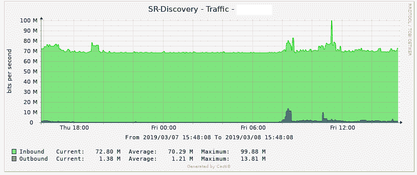
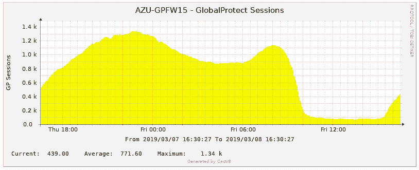

# 将自定义 SNMP MIBs 与 Cacti 一起使用

> 原文：<https://dev.to/jmcmahon/using-custom-snmp-mibs-with-cacti-ia2>

作为一名 IT 基础设施监控预算有限的地方政府雇员，我(和其他员工)依靠低成本、免费和开源工具尽可能提供网络监控和基础设施报告解决方案。

我们最近能够利用带有 Cacti 的第三方 MIB 库来收集我们的防火墙上的一些有趣的统计数据，对于所获得的价值来说，这是非常容易的。

入门:我正在为 Cacti 写这个指南，但是你可以*很可能*为你的网络监控工具使用相同的技术，即使它是一个付费的解决方案。此外，大声疾呼[帕洛阿尔托网络](https://www.paloaltonetworks.com/)免费提供他们的 MIB 库，但做一点搜索你选择的供应商，看看他们提供什么。最后，如果您想开始使用 Cacti，那么这方面的操作指南很容易找到。因此，让我们开始吧！

在我们的场景中，我们希望跟踪到我们的 VPN 网关的并发 VPN 连接的数量，并将该数据提供给管理层，用于使用、扩展和节约成本的目的。开箱即用，这个很难做到；网关的内置网络管理工具没有显示这个统计数据。然而，一个小小的互联网调查揭示了供应商*是否有 SNMP MIB 包来监控这个数据点。*

[https://docs . Palo alto networks . com/global protect/7-1/global protect-admin/set-the-global protect-infra structure/global protect-mi B- support #](https://docs.paloaltonetworks.com/globalprotect/7-1/globalprotect-admin/set-up-the-globalprotect-infrastructure/globalprotect-mib-support#)

备份一分钟——SNMP 是[简单网络管理协议](https://en.wikipedia.org/wiki/Simple_Network_Management_Protocol)。SNMP 收集器可以通过运行“轮询”和(希望)对(至少)一个社区字符串(基本上是密码)进行身份验证，从设备(目标)收集统计数据。

MIB 或管理信息库是 SNMP 可轮询对象的分层数据库，称为 oid 或对象标识符。OID 是您试图收集的数据。通常，OID 提供接口上使用的带宽等数据。当您定期(通常为 5 分钟)在目标上运行轮询器时，您可以将结果绘制在图表上。

MIB 有一些标准化，大多数 SNMP 收集器都预装了常见的可疑程序，以便于收集接口统计数据、温度、处理器/内存利用率等信息。如果供应商不同意使用标准的 MIB，SNMP 的作用将会大大降低；大多数收集器开箱即用。在我们的案例中，我们正在寻找由我们的供应商提供的增强功能来监控他们的专有解决方案。

所以回到仙人掌。Cacti 通过为几个底层进程集成一个 web 接口来工作，这使得一个普通的 Linux VM 成为一个强大的 SNMP 收集器，但是“轮询者”是`snmpd`。在 CentOS 中，您可以在`/usr/share/snmp/mibs`中安装定制的 MIB——对于我们的供应商(帕洛阿尔托)，我们使用`wget`下载压缩的 MIB 文件并解压到`mibs`文件夹中。请注意，它们还包括相关的校验和，但其他供应商可能没有，它们也不是必需的。

现在我们有了 MIB，我们需要告诉`snmpd`在进行民意调查时寻找它们。为此，我们到`/usr/share/snmp`创建一个名为`snmp.conf`的文件，并添加 MIB 文件，一次一行。在我们的例子中，GlobalProtect VPN sessions 整数在`PAN-COMMON-MIB`中，所以我们添加到`snmp.conf`中的只是一行——守护程序不需要重启。

`mibs +PAN-COMMON-MIB`

注意:还有一种方法可以同时添加所有的 MIB 文件，但是`snmpd`的文档并没有明确推荐这样做。

既然我们的 MIB 文件已经加载完毕，我们就可以查看供应商的文档，找出哪个 OID 对应于我们要收集的数据。为了跟踪这些 VPN 会话，OID 是 1.3.6.1.4.1.25461.2.1.2.5.1.3，MIB 定义了一个 0 的后缀(参考您的供应商文档，这样会有意义)，因此为了收集我们的数据，我们使用 1 . 3 . 6 . 1 . 4 . 1 . 25461 . 2 . 1 . 2 . 5 . 1 . 3 . 0。

为了在生产之前测试这一点，我们可以使用这种格式的`snmpget`命令，假设您使用的是 SNMP 版本 2(如果您运行的不是*至少是*版本 2，那么您就有问题):

`snmpget -v2c -c $your_community_string $target.ip $OID`

该命令立即轮询目标，并返回您的数据点。

`PAN-COMMON-MIB::panGPGWUtilizationActiveTunnels.0 = INTEGER: 1197`

从这里，我们可以在 Cacti 中创建我们的自定义轮询器。我们已经使用“通用 OID”模板创建了一个新的图表，并将我们刚刚测试的 OID 放入“自定义数据”字段，同时给出适当的标签。

我们后来将“通用 OID”模板克隆到一个总是使用这个 OID 的新模板中，这样我们就可以减少创建新图的手工操作。查看您选择的 SNMP 收集器的文档，了解相关的操作方法。

我们现在有一个图表，显示了我们的云网关的 VPN 会话总数，可即时访问并随时跟踪:

**总结**

*   SNMP 是一种用于在目标设备上收集数据的协议。它使用分层分类到管理信息库(MIB)中的对象标识符(oid)来获取准确的数据。

*   存在许多优秀的付费 SNMP 收集器，但是使用像 Cacti 这样的开源工具可以在任何预算下进行精确的收集和报告。

*   如果您想要一些投票/图表，请咨询您的供应商。他们通常有免费的自定义 MIB 文件供您使用。如果它是一个数值，可能可以使用 SNMP 收集。

*   在 Linux 中，MIB 通常存储在`/usr/share/snmp/mibs`中

*   在生产中使用之前，您可以使用`snmpget`命令来测试定制 MIB/oid 的功能。(另外，检查一下`snmpwalk`命令)

保持冷静，继续监视！