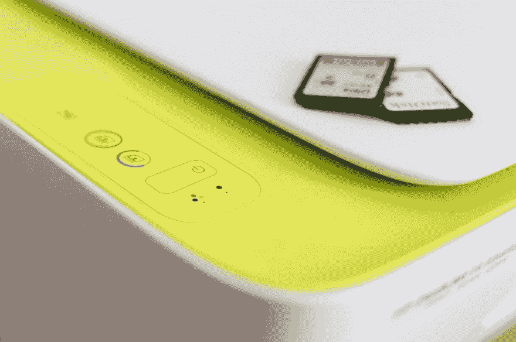
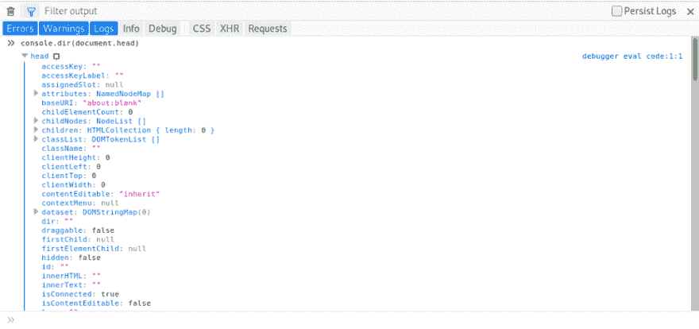

# 用 JavaScript 控制台保持简单

> 原文：<https://dev.to/bnevilleoneill/keeping-it-simple-with-the-javascript-console-d81>

[](https://res.cloudinary.com/practicaldev/image/fetch/s--_8VItxCA--/c_limit%2Cf_auto%2Cfl_progressive%2Cq_auto%2Cw_880/https://cdn-images-1.medium.com/max/1024/1%2AGkiF3ojpNXmRy2RjJByYAg.jpeg)

我承认，我并不总是使用调试器来找出程序中的问题。如果我的鼠标点击开始打印文档，那么是时候使用最强大的调试工具了:控制台。

原因很简单。当一个程序是交互式的时，包含一个中断步骤调试器变得很乏味，并且会中断流程。在这种情况下，更容易的方法是跳到代码中的几个关键位置，跟踪程序的状态，找出程序在哪里走错了路。

### 显示物体

[console.log](https://developer.mozilla.org/en-US/docs/Web/API/Console/log) 方法，以及它的朋友 [console.warn](https://developer.mozilla.org/en-US/docs/Web/API/Console/warn) 和 [console.error](https://developer.mozilla.org/en-US/docs/Web/API/Console/error) ，让你在控制台中转储对象。这些函数之间唯一的区别是它们的“类型”分类，看起来略有不同，在查看控制台输出时可以过滤掉。

例如，

```
console.log(document.head, document.body); 
```

根据浏览器的不同，将输出如下内容(这来自 Firefox，但一般功能在不同的浏览器中是相同的):

[](https://res.cloudinary.com/practicaldev/image/fetch/s--MZdeLmVZ--/c_limit%2Cf_auto%2Cfl_progressive%2Cq_auto%2Cw_880/https://cdn-images-1.medium.com/max/1024/0%2AVwqz3jdgSCpJ06wc.png)

在大多数浏览器实现中，这将显示指定 JavaScript 对象属性的交互式列表，以及对象的可扩展树视图。

还有 console.dir，它允许您对单个对象进行同样的操作，但在表示上略有不同。

例如，

```
console.dir(document.head) 
```

将输出以下内容:

[](https://res.cloudinary.com/practicaldev/image/fetch/s--dasNdlIs--/c_limit%2Cf_auto%2Cfl_progressive%2Cq_auto%2Cw_880/https://cdn-images-1.medium.com/max/1024/0%2ArQSUcy1uujjHOpwc.png)

两者之间唯一值得注意的区别是，在打印对象时，console.log 对 HTML 元素进行特殊处理，而 console.dir 将所有内容显示为普通对象。

**注意**:还有 console.exception，但这只是 console.error 的别名。

[](https://logrocket.com/signup/)

### 编写格式化字符串

console.log 和 friends 采用的另一种形式是类似 printf 的格式化字符串，后跟任意数量的替换。这种格式不像 printf 那样丰富，但是它支持一些常见的变体，比如带%s 的字符串，带%d 或%i 的整数，以及对象%o 和%O。

例如，

```
for (let i = 0; i < 10; i++) {
  console.log(
    "%s I've been called %d times, this is the document body %o",
    "Hello", i, document.body
  );
} 
```

将导致显示以下内容，这些对象是交互式的，就像它们在 console.log 的另一个变体中使用一样:

[](https://res.cloudinary.com/practicaldev/image/fetch/s--fy-RJcCH--/c_limit%2Cf_auto%2Cfl_progressive%2Cq_auto%2Cw_880/https://cdn-images-1.medium.com/max/1024/0%2AI2-x57V3VQV_E35K.png)

您还可以使用另一种替代方法——实际上，它更像是一种转义序列——让您可以使用 CSS 来设置文本在控制台中的显示方式。这就是%c 替换。

例如，

```
console.log(
  "%c The quick %c brown %c fox jumps over the %c lazy dog",
  "font-size: 34px;",
  "font-size: 24px; color: brown;",
  "color: orange;",
  "color: black; font-weight: bold;"
) 
```

将呈现如下:

[](https://res.cloudinary.com/practicaldev/image/fetch/s--BNQrObOD--/c_limit%2Cf_auto%2Cfl_progressive%2Cq_auto%2Cw_880/https://cdn-images-1.medium.com/max/1024/0%2AH6XrYiWi1tP3lwp3.png)

### 显示对象表

如果您想要查看大量数据，比如地图或对象数组，那么 console.table 可以很好地将这些数据呈现为表格数据。

例如，

```
var animals = [
  { kind: 'Horse', name: 'Henry', age: 43 },
  { kind: 'Dog', name: 'Spot', age: 13 },
  { kind: 'Cat', name: ' Mittens', age: 18 },
]; 
```

```
console.table(animals); 
```

将呈现如下表所示:

[](https://res.cloudinary.com/practicaldev/image/fetch/s--F3QqvpVQ--/c_limit%2Cf_auto%2Cfl_progressive%2Cq_auto%2Cw_880/https://cdn-images-1.medium.com/max/1024/0%2AyS9foVEOvpcGbo77.png)

假设您只想显示几个关键列。调用 console.table 时，通过将包含所需列名的数组作为第二个参数传递，可以避免将它们映射到新对象的步骤

例如，

```
console.table(animals, ['kind', 'name']); 
```

将呈现如下表格:

[](https://res.cloudinary.com/practicaldev/image/fetch/s--Znp4z_fv--/c_limit%2Cf_auto%2Cfl_progressive%2Cq_auto%2Cw_880/https://cdn-images-1.medium.com/max/1024/0%2ASIfzg4gsBHKlzB7g.png)

### 跟踪函数调用

console.trace 方法允许您在控制台中转储堆栈跟踪，换句话说，就是运行时调用该函数的路径，这对于跟踪负责传递错误数据的函数非常有用。

例如，

```
function foo() {
  bar(); 
```

```
function bar() {
    console.trace();
  }
} 
```

```
foo(); 
```

将输出如下所示的堆栈跟踪:

[](https://res.cloudinary.com/practicaldev/image/fetch/s--8G-t9gaz--/c_limit%2Cf_auto%2Cfl_progressive%2Cq_auto%2Cw_880/https://cdn-images-1.medium.com/max/1024/0%2AShP-frUtsmMW3fvd.png)

### 计数函数调用

有时你想记录一段代码被调用的频率；console.count 就是这么做的。只需提供它应该跟踪的字符串，每次调用它时，它都会进行计数。这在处理用户输入和事件时特别有用。

例如，

```
window.addEventListener('click', function(event) {
  console.count(event.type);
  console.log(event);
}); 
```

将会产生类似以下的输出:

[](https://res.cloudinary.com/practicaldev/image/fetch/s--AK1nM3AM--/c_limit%2Cf_auto%2Cfl_progressive%2Cq_auto%2Cw_880/https://cdn-images-1.medium.com/max/1024/0%2Aj1PUjNQpM8_h4euF.png)

要重置计数器，只需要用标签调用 console.countReset，它就会重置回零。

### 分组信息

最后是 console.group，它将信息可视化地分组到一个可折叠的列表中，每一级增加一个缩进。

例如，

```
console.group('First group');
console.log('First message');
console.group('A group inside the first group');
console.log('A message inside the group inside the first group'); console.log('Another message inside the group inside the first group');
console.groupEnd();
console.log('Second message'); console.groupEnd(); 
```

将产生以下输出:

[](https://res.cloudinary.com/practicaldev/image/fetch/s--9io7Gdb2--/c_limit%2Cf_auto%2Cfl_progressive%2Cq_auto%2Cw_880/https://cdn-images-1.medium.com/max/1024/0%2AmMAtJ_w4FVtakAOQ.png)

### 检查状态

除了跨浏览器甚至在 Node.js 中支持的 console 对象之外，在浏览器的开发人员控制台中还有一些可用的函数和变量。但是，请注意，这些是特定于供应商的，并且这里支持的子集因浏览器而异。

例如,$_ 变量保存在控制台上下文中计算的最新表达式:

[](https://res.cloudinary.com/practicaldev/image/fetch/s--oNybc392--/c_limit%2Cf_auto%2Cfl_progressive%2Cq_auto%2Cw_880/https://cdn-images-1.medium.com/max/737/0%2AbwZ2-WI4_H--tE_X.png)

$0 到$4 保存用 inspect element 检查的最新元素:

[](https://res.cloudinary.com/practicaldev/image/fetch/s--_TBjdcLb--/c_limit%2Cf_auto%2Cfl_progressive%2Cq_auto%2Cw_880/https://cdn-images-1.medium.com/max/734/0%2Aui7JVVaSeU25m8WR.png)

同样，这些是特定于浏览器的，不同于控制台对象。谷歌 Chrome 有更多的实用功能，这里记录了这些功能[。不过，还是不要指望它们能在其他浏览器中工作。](https://developers.google.com/web/tools/chrome-devtools/)

### 结论

打印到控制台是一种很好的可视化方式。如果简单的事情有助于解决一个复杂的问题，为什么要用一个复杂的解决方案让自己更难呢？

将流程和状态可视化真的可以成为救命稻草，所以不要害怕使用它。一个东西简单不代表它只适合初学者。我登录控制台已经十年了，我计划再做一次。

给所有读到这里的老同事们:很抱歉用光了你们所有的打印机墨水。

* * *

### Plug: [LogRocket](https://logrocket.com/signup/) ，一款适用于网络应用的 DVR

[](https://logrocket.com/signup/)

<figcaption>[https://logrocket.com/signup/](https://logrocket.com/signup/)</figcaption>

LogRocket 是一个前端日志工具，可以让你回放问题，就像它们发生在你自己的浏览器中一样。LogRocket 不需要猜测错误发生的原因，也不需要向用户询问截图和日志转储，而是让您重放会话以快速了解哪里出错了。它可以与任何应用程序完美配合，不管是什么框架，并且有插件可以记录来自 Redux、Vuex 和@ngrx/store 的额外上下文。

除了记录 Redux 操作和状态，LogRocket 还记录控制台日志、JavaScript 错误、堆栈跟踪、带有头+正文的网络请求/响应、浏览器元数据和自定义日志。它还使用 DOM 来记录页面上的 HTML 和 CSS，甚至为最复杂的单页面应用程序重新创建像素级完美视频。

免费试用。

* * *

帖子[用 JavaScript 控制台](https://blog.logrocket.com/keeping-it-simple-with-the-javascript-console-cc6b1d8e26aakeeping-it-simple-with-the-javascript-console/)保持简单最先出现在[日志博客](https://blog.logrocket.com)上。