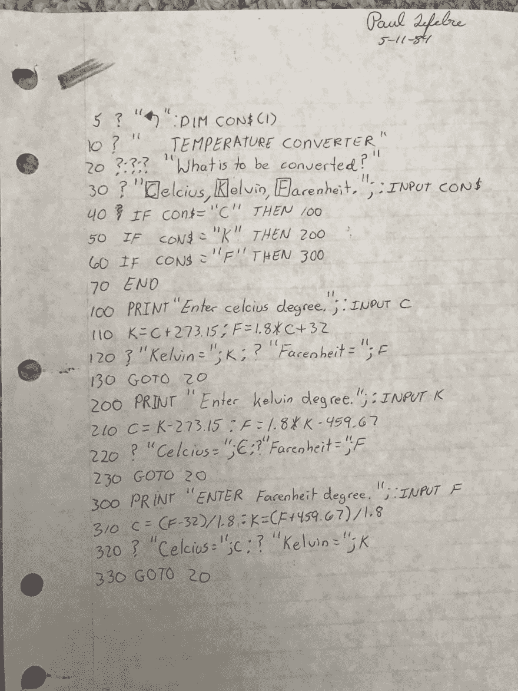

# 我如何学习编程

> 原文：<https://dev.to/lefebvre/how-i-learned-to-program-8eh>

以下是我如何学习编程的，灵感来自 Marco Arment 的这条推文:

[https://twitter.com/marcoarment/status/1101932427260411906](https://twitter.com/marcoarment/status/1101932427260411906)

我第一次意识到编程是一件事是在 1984 年初，在一台使用 T2 雅达利 BASIC 的雅达利 400 上。

我开始输入雅达利电脑杂志基本程序列表中的程序，然后试着修改代码来感受事情是如何运作的。

然后，我开始从书本中学习。我最喜欢的一本书是 C. Wacko 博士的《设计和编程你自己的 Atari 电脑街机游戏的奇迹指南》。

在此期间，我也在纸上写 BASIC 程序，主要是因为我并不总是被允许使用计算机(因为它当时被连接到我们唯一的电视上)。另外，我没有办法实际保存我写的程序(后来有了磁带机)，所以我必须把它们写下来以便记忆。

我有一个这个时期的资料的活页夹，里面全是我写的程序(手写的和打印出来的)，甚至还有我提交给杂志的第一个程序的退稿信！

当我开始触及 BASIC 的极限时，我转向了其他语言，如 Pascal 和 C，以及其他计算机，如 Atari ST T1，它有一个类似于 Mac 的图形用户界面。

在 Atari ST 上，我学习了事件驱动编程和窗口管理。我甚至在用 Pascal 编写的 Atari ST 程序(JumpSTART app launcher)上赚了一些钱，这是我作为程序员的第一份收入。我实际上为 2018 年 Just Code Challenge 制作了 JumpStart 的 Xojo 实现，并且还在 GitHub 上提供了[原始 Pascal 源代码。](https://github.com/paullefebvre/JumpSTART-AtariST)

在 80 年代，编程，尤其是 BASIC 编程的乐趣是无与伦比的。当我在 2001 年发现 Xojo(当时是 Realbasic)时，我非常激动，现在，我认为 Xojo 是你能得到的最接近把乐趣带回编程的东西。Xojo 是一个现代的、成熟的 IDE，具有结构化的、面向对象的和完全现代的语言。但是它的语法会给你一点 BASIC 的味道，让你回忆起美好的回忆。

Xojo 让你在一个有趣、快速的环境中快速创建应用程序，可以在你喜欢的任何计算机上运行:Windows、Mac 或 Linux。Xojo 可以让你制作任何类型的应用:桌面应用(Mac/Windows/Linux/Raspberry Pi)、网络应用或移动应用(iOS，Android 正在开发中)。如果你想完全重温老派的用户界面，Xojo 甚至可以让你制作基于文本的控制台应用程序。

那些早期的日子常常会被人亲切地回忆起来，但并不是那时的一切都很美好。例如，我不愿意回到一个 64K 内存被认为是很多的世界，我必须担心每一个字节。

但是如果你怀念早期编程简单有趣的日子，你需要试试 Xojo。Xojo 可以免费使用，所以[下载它](http://www.xojo.com/download)并亲自试用。还有一本[免费书籍](https://www.xojo.com/learn)帮助你入门。当您决定构建自己的应用程序并分发给其他人时，您只需购买许可证。我保证 Xojo 许可证的起价比 1984 年我的 Atari 400 的磁带机价格还要低！