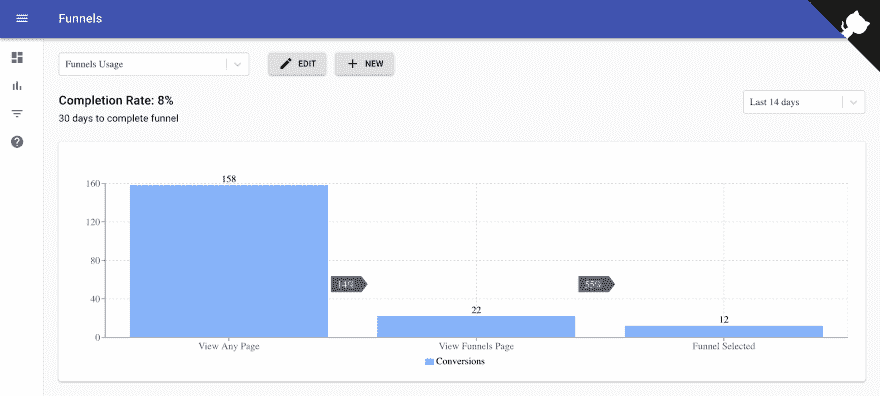

# 构建开源 Mixpanel 替代方案。第 2 部分:转换漏斗

> 原文：<https://dev.to/cubejs/building-open-source-mixpanel-alternative-part-2-conversion-funnels-4hm0>

这是关于使用 [Cube.js](https://github.com/cube-js/cube.js) 构建分析 web 应用程序的系列教程的第二部分。你可以在这里找到[第一部](https://statsbot.co/blog/building-an-open-source-mixpanel-alternative-1/)。它希望读者熟悉 Javascript、Node.js、React，并具备 SQL 的基本知识。[最终的源代码在这里](https://github.com/cube-js/cube.js/tree/master/examples/event-analytics)和[现场演示在这里](https://d1ygcqhosay4lt.cloudfront.net/)。示例应用程序是无服务器的，运行在 AWS Lambda 上。它显示自己的使用数据。

在这一部分，我们将在应用程序中添加漏斗分析。漏斗分析和留存分析对于分析客户旅程中的行为至关重要。漏斗是用户在应用程序中经历的一系列事件，例如完成入职流程。如果用户以指定的顺序执行事件，则她被认为通过漏斗中的一个步骤转换。计算每个事件有多少独立用户可以显示每个步骤之间的转化率。它帮助你将问题定位到某个阶段。

因为我们的应用程序跟踪它自己的使用情况，所以我们将构建漏斗来显示用户如何很好地浏览漏斗的使用情况。很 meta 吧？

这是它的样子。你[在这里](https://d1ygcqhosay4lt.cloudfront.net/funnels)查看现场演示。

[](https://res.cloudinary.com/practicaldev/image/fetch/s--Bs_g3g01--/c_limit%2Cf_auto%2Cfl_progressive%2Cq_auto%2Cw_880/https://media.graphcms.com/yN9dB53UTkOFUwIsjwLT)

## 为漏斗构建 SQL

简单回顾一下第一部分——我们使用 Snowplow tracker 收集数据，将其存储在 S3，并使用 Athena 和 Cube.js 进行查询。Athena 构建于 Presto 之上，支持标准 SQL。因此，要构建一个漏斗，我们需要编写一个 SQL 代码。从性能角度来看，真实世界的漏斗 SQL 可能相当复杂和缓慢。因为我们使用 Cube.js 来组织数据模式和生成 SQL，所以我们可以解决这两个问题。

Cube.js 允许构建包，包是可重用数据模式的集合。其中一些是特定于数据集的，比如[条带包](https://github.com/cube-js/stripe-schema)。其他的为常见的数据转换提供了有用的宏。我们将使用其中的一个——漏斗包。

*如果你是 Cube.js 数据模式的新手，我强烈建议你先查看一下[这个](https://cube.dev/docs/getting-started-cubejs-schema)或者[那个](https://statsbot.co/blog/building-an-open-source-mixpanel-alternative-1/)教程，然后再回来学习漏斗包。*

组织漏斗的最好方法是为每个漏斗创建一个单独的立方体。我们将使用漏斗包中的`eventFunnel`。我们需要做的就是将一个具有所需属性的对象传递给`eventFunnel`函数。
[查看漏斗包文档了解其配置的详细信息。](https://cube.dev/docs/funnels)

下面是这个配置的样子。
*在生产应用程序中，您最有可能动态生成 Cubes.js 模式。[你可以在这里阅读更多关于如何做的信息。](https://cube.dev/docs/schema-generation)*

```
import Funnels from "Funnels";

import { eventsSQl, PAGE_VIEW_EVENT, CUSTOM_EVENT } from "./Events.js";

cube("FunnelsUsageFunnel", {
  extends: Funnels.eventFunnel({
    userId: {
      sql: `user_id`
    },
    time: {
      sql: `time`
    },
    steps: [
      {
        name: `viewAnyPage`,
        eventsView: {
          sql: `select * from (${eventsSQl}) WHERE event = '${PAGE_VIEW_EVENT}`
        }
      },
      {
        name: `viewFunnelsPage`,
        eventsView: {
          sql: `select * from (${eventsSQl}) WHERE event = '${PAGE_VIEW_EVENT} AND page_title = 'Funnels'`
        },
        timeToConvert: "30 day"
      },
      {
        name: `funnelSelected`,
        eventsView: {
          sql: `select * from (${eventsSQl}) WHERE event = '${CUSTOM_EVENT} AND se_category = 'Funnels' AND se_action = 'Funnel Selected'`
        },
        timeToConvert: "30 day"
      }
    ]
  })
}); 
```

上面的 3 步漏斗，描述了用户从查看任何页面，比如主页，到进入漏斗，最后从下拉菜单中选择一个漏斗的流程。我们将第二步和第三步的`timeToConvert`设置为 30 天。这意味着我们给用户一个 30 天的窗口，让她完成目标行动，使其进入漏斗。

在我们的示例应用程序中，我们动态生成这些配置。你可以在这里查看 Github 上的代码。

## 物化带有预聚合的漏斗 SQL

正如我之前提到的，Cube.js 中有一种内置的方法来提高查询的性能。
Cube.js 可以将查询结果物化在一个表中。它使它们保持最新，并查询它们而不是原始数据。预聚合可能相当复杂，包括多阶段和依赖性管理。但是对于我们的情况，最简单的`originalSql`预聚合就足够了。它具体化了多维数据集的基本 SQL。

[在此了解有关预聚合的更多信息。](https://cube.dev/docs/pre-aggregations)

```
import Funnels from 'Funnels';
import { eventsSQl, PAGE_VIEW_EVENT, CUSTOM_EVENT } from './Events.js';

cube('FunnelsUsageFunnel', {
  extends: Funnels.eventFunnel({ ... }),
  preAggregations: {
    main: {
      type: `originalSql`
    }
  }
}); 
```

## 可视化

有很多种方法可以将漏斗形象化。Cube.js 是可视化不可知的，所以选择一个适合你的并且适合你的应用程序设计的。在我们的示例应用程序中，我们使用 Recharts 库中的条形图。

漏斗包生成一个具有`conversions`和`conversionsPercent`尺寸以及`steps`和`time`尺寸的立方体。为了构建一个条形图漏斗，我们需要查询按`step`维度分组的`conversions`度量。过滤器中应使用`time`维度，以允许用户选择漏斗的特定日期范围。

下面是代码(我们使用 React 和 Cube.js React 客户端):

```
import React from "react";
import cubejs from "@cubejs-client/core";
import { QueryRenderer } from "@cubejs-client/react";
import CircularProgress from "@material-ui/core/CircularProgress";
import { BarChart, Bar, XAxis, YAxis, CartesianGrid, Tooltip } from "recharts";

const cubejsApi = cubejs(
  "YOUR-API-KEI",
  { apiUrl: "http://localhost:4000/cubejs-api/v1" }
);

const Funnel = ({ dateRange, funnelId }) => (
  <QueryRenderer
    cubejsApi={cubejsApi}
    query={{
      measures: [`${funnelId}.conversions`],
      dimensions: [`${funnelId}.step`],
      filters: [
        {
          dimension: `${funnelId}.time`,
          operator: `inDateRange`,
          values: dateRange
        }
      ]
    }}
    render={({ resultSet, error }) => {
      if (resultSet) {
        return (
          <BarChart
            width={600}
            height={300}
            margin={{ top: 20 }}
            data={resultSet.chartPivot()}
          >
            <CartesianGrid strokeDasharray="3 3" />
            <XAxis dataKey="x" minTickGap={20} />
            <YAxis />
            <Tooltip />
            <Bar dataKey={`${funnelId}.conversions`} fill="#7A77FF"/>
          </BarChart>
        );
      }

      return "Loading...";
    }}
  />
);

export default Funnel; 
```

如果您在 CodeSandbox 中运行这段代码，您应该会看到类似这样的内容。

[https://codesandbox.io/embed/nw87w1nnjm](https://codesandbox.io/embed/nw87w1nnjm)

上面的例子从我们的事件分析应用程序连接到 Cube.js 后端。

在下一部分中，我们将介绍如何构建一个仪表板和动态查询构建器，就像 Mixpanel 或 Amplitude 中的一样。第 4 部分将讨论保留分析。在最后一部分，我们将讨论如何以无服务器模式将整个应用程序部署到 AWS Lambda。

你可以在这里查看该应用程序的完整源代码。

这里有现场演示。