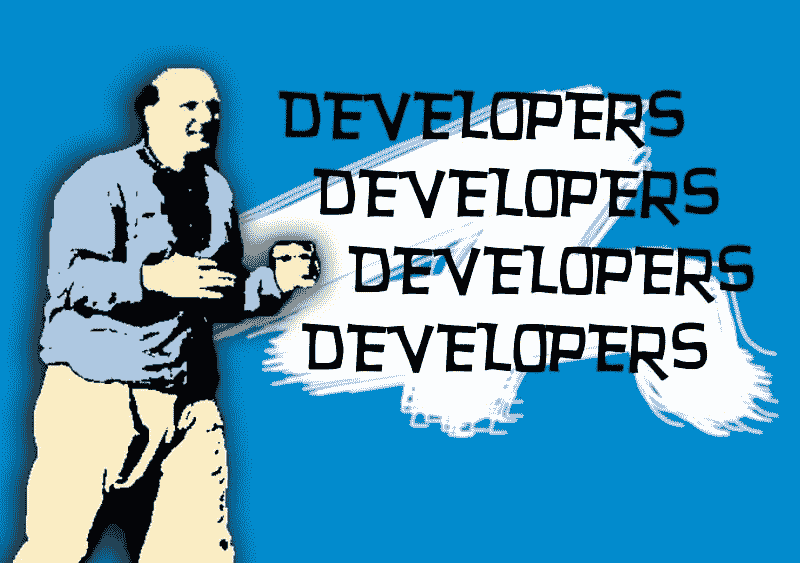

# 同情一个开发者

> 原文：<https://dev.to/belhassen07/empathizing-with-a-developer-51l2>

对我来说，我们同情开发者的最好方式就是让开发者工作。是的，在我决定专注于用户体验设计之前，我已经做了一段时间的开发人员，现在为了我的研究项目，我还必须开发一个网站(也许是最后一个？).

我几乎已经完成了 UX 的设计过程，最终交付的是我试图创建的 cliackable UI 原型。在此之前，我已经做了一个高保真可点击的原型，我在考虑我要使用的工具。例如，我们需要一个所见即所得(WYSIWYG)编辑器。当然，开发人员可以创建一个，但我们没有时间去做，而且在我正在做的这种项目中，这样做实际上是浪费时间。因此，在制作低保真原型之前，我必须决定我将使用哪个编辑器，以便我可以在原型中重新制作它来测试它。不过，更好的测试方法是通过编辑器的现场演示来进行。然后，您可以测试许多选择，并选择哪个编辑器适合您的项目，并且具有更好的可用性。

## 我不管！你是开发商！

很容易掉进这个地狱，你只是做了设计，然后把它扔给开发商。你必须同情开发商，但这意味着什么呢？

你必须知道开发商是否:

有时间实现您所展示的特性(对开发人员来说可能要复杂得多)
有合适的技能来实现它们(不要把一些复杂的 SVG 动画扔给一个对 SVG 动画知之甚少的开发人员)
如果有可能做出一些东西来满足用户需求、业务目标，并且还能让您的开发人员在实现您的原型时不那么沮丧。为什么我们不让他们的生活更轻松些呢？

我知道这不是一种理想主义的工作方式，当你用开发人员的时间和技能来调整自己时，但这是一种更现实的方式，在这种方式下，每个人都可以感觉到他们被考虑到了，然后每个人都会尽自己最大的努力，超越自己的极限。