# 在 30 分钟或更短时间内在 VS 代码市场推出“产品”

> 原文：<https://dev.to/thegeoffstevens/launch-a-product-in-the-vs-code-marketplace-in-30-minutes-or-less-16oa>

我的团队今天正式发布了 VS 代码的扩展。哇，你可以通过运送产品学到很多东西。

为 VS 代码构建一个扩展并在他们的市场上发布的过程令人惊讶的愉快，更重要的是一次无价的学习经历。所以我想分享一种方法，让任何技能水平的人都可以构建和发布他们自己的扩展——一种可以立即供数百万 VS 代码用户使用的迷你“产品”。

如果您以前从未构建过扩展，设计自己的主题是熟悉构建 VS 代码扩展所需的工具和过程的好方法。

这个快速教程将带你从打开 VS 代码到在市场上发布你的第一个主题。如果你已经熟悉了某些步骤，就直接跳到前面。

## 颜色主题入门

VS 代码有大量的[开箱即用的主题](https://code.visualstudio.com/docs/getstarted/themes)，你可以使用命令`Preferences: Color Theme`打开一个可用主题的菜单，如 Light+，Dark+，Monokai，Red 等等。如果你正在寻找更多的定制，那么 [VS 代码市场](https://marketplace.visualstudio.com/search?target=VSCode&category=Themes&sortBy=Downloads)有数以千计的主题可供下载。

我建议尝试几个不同的主题。主题是你所有开发的背景——软件开发魔力的背景。主题可以激励你(或者相反会让你沮丧或厌烦)。因此，虽然微妙，主题真的很重要。

我们构建 VS 代码主题所遵循的基本工作流程可以总结为三个关键步骤:

1.  使用扩展生成器为您的扩展创建框架
2.  通过添加颜色自定义来设计您的扩展
3.  通过创建 Microsoft 帐户和发布者配置文件将您的扩展发布到市场

计时器现在开始计时！

## 设置您的环境

要对 VS 代码进行扩展，您需要安装以下工具:

*   [Node.js](https://nodejs.org/en/)
*   约曼
*   [Visual Studio 代码扩展生成器](https://github.com/Microsoft/vscode-generator-code)

Node.js 是一个流行的开源 JavaScript 运行时，它在浏览器之外执行 JavaScript。VS 代码支持现成的 JavaScript 和 TypeScript 以及 Node.js 调试。您需要安装 Node.js，以便能够在 VS 代码中以调试模式运行您的应用程序。如果您还没有 Node，请查看不同的安装程序。在不同的平台上安装 Node 有很多不同的方法，但是安装 Node 最直接的方法是使用 Node 网站上的[官方安装程序](https://nodejs.org/en/download/)。

您可以通过打开终端并输入`node -v`来检查是否安装了 Node。还要确保处理节点工具包安装的节点包管理器`npm`与`npm -v`一起安装。

[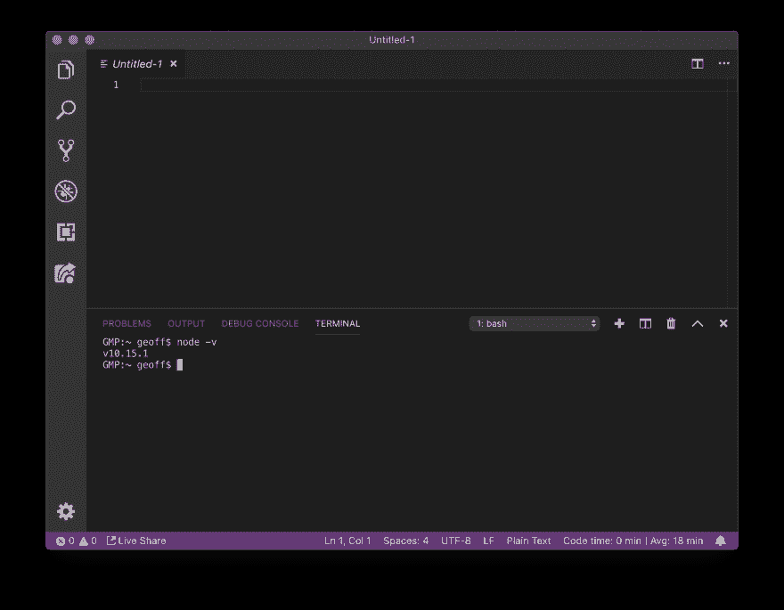](https://res.cloudinary.com/practicaldev/image/fetch/s--xGCOppo7--/c_limit%2Cf_auto%2Cfl_progressive%2Cq_auto%2Cw_880/https://thepracticaldev.s3.amazonaws.com/i/d1gp8xtx91askfv5ndjf.png)

一旦安装了 Node，就可以安装 Yeoman 和 Visual Studio 代码扩展生成器。这些工具将自动用必要的文件构建扩展的基本框架。

约曼被称为“网络的脚手架工具”它提供了对大型发电机生态系统的便捷访问，以快速启动项目。Visual Studio 代码扩展生成器将引导您完成布局扩展的文件结构的过程。

要安装 Yeoman 和 VS 代码扩展生成器，可以使用`npm`，Node 的包管理器。打开终端，输入:

```
npm install -g yo generator-code 
```

Enter fullscreen mode Exit fullscreen mode

一旦安装了扩展生成器，您就可以开始构建您的颜色主题扩展了。

## 为您的扩建搭建脚手架

在您的终端中，导航到您想要在其中创建扩展的目录。扩展生成器将在这个目录中创建一个新文件夹，其中包含构建一个工作扩展所需的所有文件。要运行 Yeoman 和 VS 代码扩展生成器，请输入:

```
yo code 
```

Enter fullscreen mode Exit fullscreen mode

扩展生成器现在会询问您一系列创建新扩展所需的问题。

[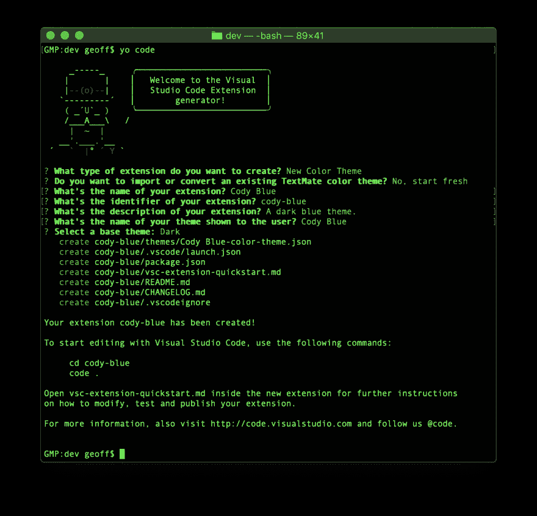](https://res.cloudinary.com/practicaldev/image/fetch/s--_clExP9---/c_limit%2Cf_auto%2Cfl_progressive%2Cq_auto%2Cw_880/https://thepracticaldev.s3.amazonaws.com/i/l5voty80xxk03c3kfv6i.png)

生成器可以帮助创建几种类型的扩展。我们将建立一个颜色主题，所以选择该选项。

> 您想创建哪种类型的扩展？新颜色主题

下一个问题是关于 [TextMate](https://macromates.com/manual/en/themes) 主题的。文本匹配规则改变[语法着色](https://code.visualstudio.com/api/extension-guides/color-theme)。配置 TextMate 规则是一项更高级的技能，需要了解 TextMate 语法。在你熟悉 TextMate 之前，重新开始。

> 您要导入或转换现有的 TextMate 颜色主题吗？不，重新开始。

现在是时候给你的扩展命名了。命名将是获得用户兴趣和采用的关键。我的颜色主题使用了我们的[代码时间扩展](https://marketplace.visualstudio.com/items?itemName=softwaredotcom.swdc-vscode)中的蓝色，并以我们的吉祥物[科迪](https://dev.to/brettmstevens7/its-alive-simple-css-animations-in-codepen-aa1)命名。

> 你的分机叫什么名字？科迪蓝

您的分机的标识符默认为您的分机的名称，但是所有小写字母和连字符都用空格替换。

> 你的分机号码是什么？科迪蓝

接下来，您可以为您的主题写一个简短的描述，并选择一个显示给用户的名称。

> 你的分机描述是什么？深蓝色的主题
> 
> 向用户显示的主题的名称是什么？科迪蓝

最后，选择一个基本主题。您将在基本主题的默认基础上构建您的主题。

> 选择一个基本主题:黑暗

回答完最后一个问题后，生成器将在一个使用您的扩展名标识符命名的文件夹中创建以下文件:

```
├── .vscode
│   └── launch.json
├── themes
│   └── Cody Blue-color-theme.json
├── .vscodeignore
├── CHANGELOG.md
├── package.json
├── README.md
└── vsc-extension-quickstart.md 
```

Enter fullscreen mode Exit fullscreen mode

这些文件的作用是什么？

`.vscode`文件夹包含`launch.json`，这是一个配置如何为您的项目启动调试器的文件。`.vscodeignore`文件决定了安装扩展时忽略哪些文件。我们现在可以忽略这些文件和文件夹，因为它们的默认设置很好。

文件`vsc-extension-quickstart.md`有一些关于如何开始设计和构建你的主题扩展的说明。值得快速浏览一下。

`README.md`是一个供您添加您希望用户在市场或 GitHub repo 上阅读的任何描述或文本的地方。类似地，`CHANGELOG.md`是您在更新扩展时能够手工记录特性变化的地方。

然而，最重要的文件是`package.json`和`color-theme.json`。`package.json`包含您的扩展的所有设置。`color-theme.json`包含您所有的颜色定制，是您设计主题的地方。

## 选择您的主题颜色定制

要开始编辑您的扩展，请在 VS 代码中打开您的扩展项目。

要预览和调试您的扩展，点击`Function + F5`在扩展开发主机窗口中运行扩展。扩展开发主机允许您在一个单独的窗口中运行您的扩展，这使得调试和查看您的扩展变得容易。要退出调试模式，只需关闭新窗口。

尝试在扩展开发宿主窗口中运行未编辑的扩展。

使用扩展生成器，我选择了基本主题“黑暗”,如下所示:

[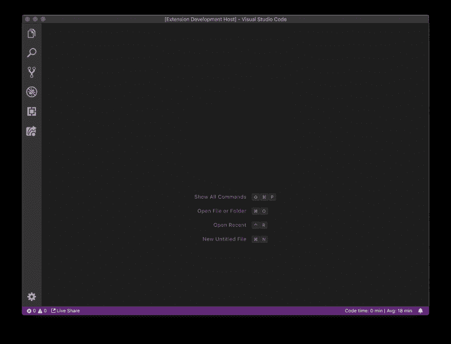](https://res.cloudinary.com/practicaldev/image/fetch/s--ScVitRBw--/c_limit%2Cf_auto%2Cfl_progressive%2Cq_auto%2Cw_880/https://thepracticaldev.s3.amazonaws.com/i/6wpoyosakilm7ro7by63.png)

要进行颜色调整，请转到位于扩展中的`themes`文件夹中的主题文件。主题文件是一个 JSON 文件，其结构为:`your-extension-name-color-theme.json`。

在 JSON 文件的顶部，您会看到一个名为`colors.`的部分，这是您进行大部分编辑的地方。颜色部分提供了一些默认颜色。

[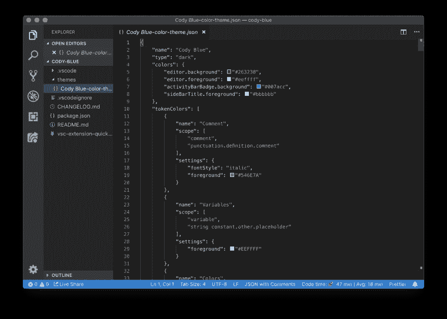](https://res.cloudinary.com/practicaldev/image/fetch/s--r17ed03T--/c_limit%2Cf_auto%2Cfl_progressive%2Cq_auto%2Cw_880/https://thepracticaldev.s3.amazonaws.com/i/whgqrmpfqa4ojcah9rao.png)

让我们暂时删除它们，这样你可以使用你自己的颜色。

可以进行两种类型的定制:工作台和语法。工作台定制更改编辑器及其视图的颜色，而语法定制影响编辑器中源代码的外观。

现在，让我们专注于定制工作台，它涵盖了 VS 代码最突出的特性。

将下面几行添加到主题文件的`colors`部分。这些设置改变了编辑器的主要部分，如标题栏、菜单栏、活动栏、侧边栏和状态栏。

```
// title bar (macOS)
"titleBar.activeBackground": "#384357", 
"titleBar.activeForeground": "#afafaf",
"titleBar.inactiveBackground": "#29303f",
"titleBar.inactiveForeground": "#afafaf",

// menu bar (PC/Linux users)
"menu.background": "#384357", 
"menu.foreground": "#afafaf",

// activity bar
"activityBar.background": "#384357", 
"activityBar.foreground": "#00B4EE",
"activityBar.inactiveForeground": "#afafaf",

// side bar
"sideBar.background": "#384357", 
"sideBar.foreground": "#afafaf",
"sideBarTitle.foreground": "#00B4EE",
"sideBarSectionHeader.background": "#384357",
"sideBarSectionHeader.foreground": "#afafaf",

// status bar
"statusBar.background": "#384357",
"statusBar.foreground": "#afafaf",
"statusBar.noFolderBackground": "#384357",
"statusBar.noFolderForeground": "#afafaf",
"statusBar.debuggingBackground": "#384357", 
"statusBar.debuggingForeground": "#afafaf",
"statusBarItem.hoverBackground": "#29303f",

// editor 
"editor.background": "#191e27",
"editorLineNumber.foreground": "#afafaf",
"editorLineNumber.activeForeground": "#00B4EE",

// editor groups and tabs
"editorGroupHeader.tabsBackground": "#14181f" 
```

Enter fullscreen mode Exit fullscreen mode

颜色主题 JSON 文件只是一个键/值对的列表。关键是您正在定制的特征，值是您想要分配给该特征的十六进制颜色代码。生成的主题文件应该如下所示:

[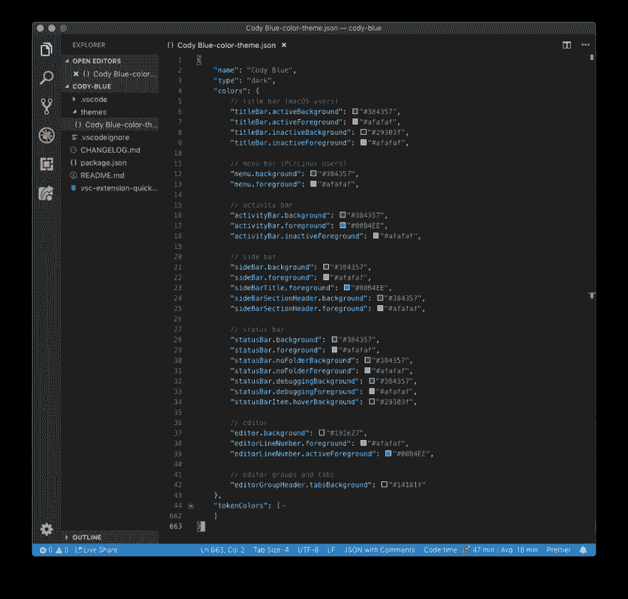](https://res.cloudinary.com/practicaldev/image/fetch/s--AW4MIr-4--/c_limit%2Cf_auto%2Cfl_progressive%2Cq_auto%2Cw_880/https://thepracticaldev.s3.amazonaws.com/i/sw1c1w454c370vhlkfcm.png)

您会注意到，在您输入颜色的十六进制代码后，如果您再次将鼠标悬停在十六进制代码上，VS Code 会显示一个颜色选择器。弹出窗口还会告诉您正在更改的功能将对编辑器的外观产生什么影响。

[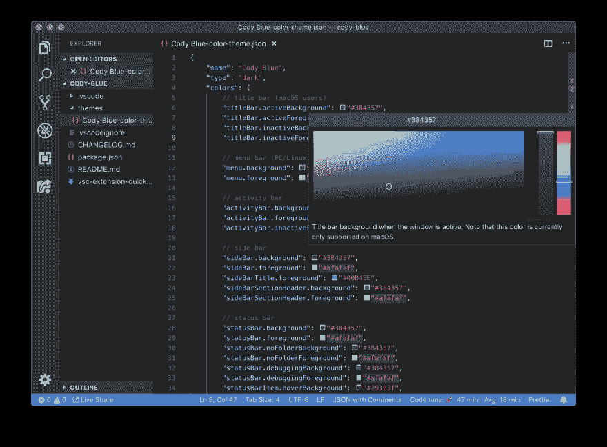](https://res.cloudinary.com/practicaldev/image/fetch/s--d2AxWpw_--/c_limit%2Cf_auto%2Cfl_progressive%2Cq_auto%2Cw_880/https://thepracticaldev.s3.amazonaws.com/i/bwqyzxp8xoyh008uoufk.png)

尝试选择您自己的值来更新您的配色方案。

要查看新颜色的效果，再次点击`Function + F5`在扩展开发主机窗口中运行扩展。

上面的更改应该如下所示:

[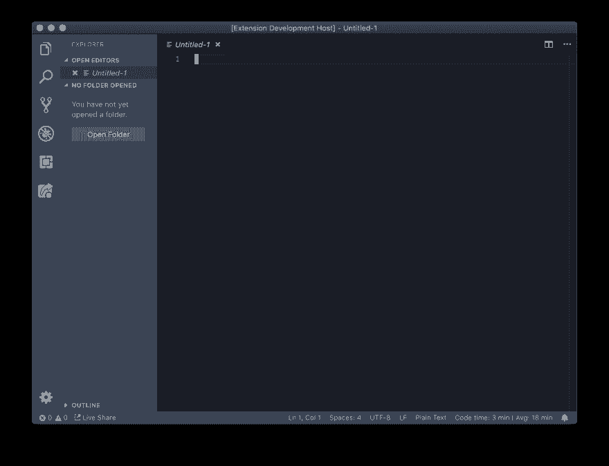](https://res.cloudinary.com/practicaldev/image/fetch/s--tfMHQXey--/c_limit%2Cf_auto%2Cfl_progressive%2Cq_auto%2Cw_880/https://thepracticaldev.s3.amazonaws.com/i/t92aqqitnvb5luwmov33.png)

想看看还定制了什么主题？查看一下[紫色](https://marketplace.visualstudio.com/items?itemName=ahmadawais.shades-of-purple)的色调，戳一下它的 [GitHub repo](https://github.com/ahmadawais/shades-of-purple-vscode) 寻找更多的灵感。

想改变更多吗？VS 代码文档列出了所有你可以定制的特性。你可以编辑从集成终端到通知到下拉菜单的所有内容。您可以随意添加您喜欢的任何其他更改。

## 将你的主题扩展发布到 VS 代码市场

一旦你对你的主题定制感到满意，你就可以[发布你的扩展](https://code.visualstudio.com/api/working-with-extensions/publishing-extension)到 VS 代码市场。市场是展示你的主题的一个很好的方式，这样其他 VS 代码用户可以找到并安装你的主题。

首先，更新你的`README`告诉用户你的主题。您的`README`将在 VS 代码扩展市场中可见。

[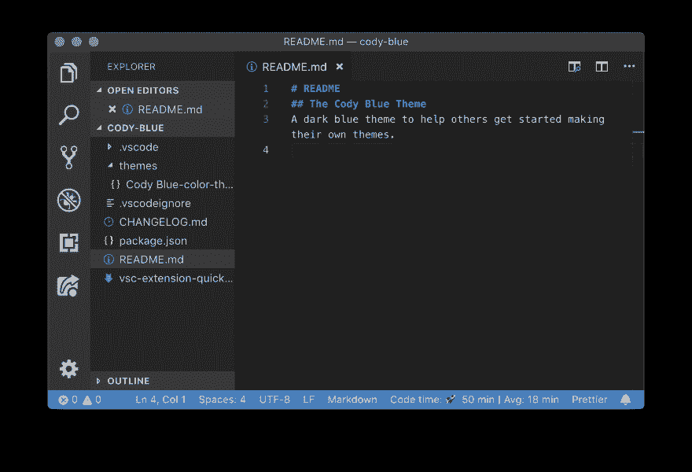](https://res.cloudinary.com/practicaldev/image/fetch/s--Jh7Mbp0D--/c_limit%2Cf_auto%2Cfl_progressive%2Cq_auto%2Cw_880/https://thepracticaldev.s3.amazonaws.com/i/4hsmypary5q5tx48cpng.png)

要发布您的扩展，您需要安装 [Visual Studio 代码扩展](https://github.com/Microsoft/vscode-vsce)，这是一个用于打包、发布和管理扩展的命令行工具。再次打开你的终端，运行:

```
npm install -g vsce 
```

Enter fullscreen mode Exit fullscreen mode

访问 VS 代码市场的最快方法是在 VS 代码市场的[管理页面](https://marketplace.visualstudio.com/manage)上创建一个[微软账户](https://account.microsoft.com/account?lang=en-us)和一个发布者档案。在这里，您可以创建一个发布者档案，将您的扩展添加到市场。

一旦您创建了一个发布者，请确保返回到您的扩展并编辑`package.json`文件，使用您新创建的发布者名称添加`"publisher”: “publisher-name”`作为一个新的键/值对。

[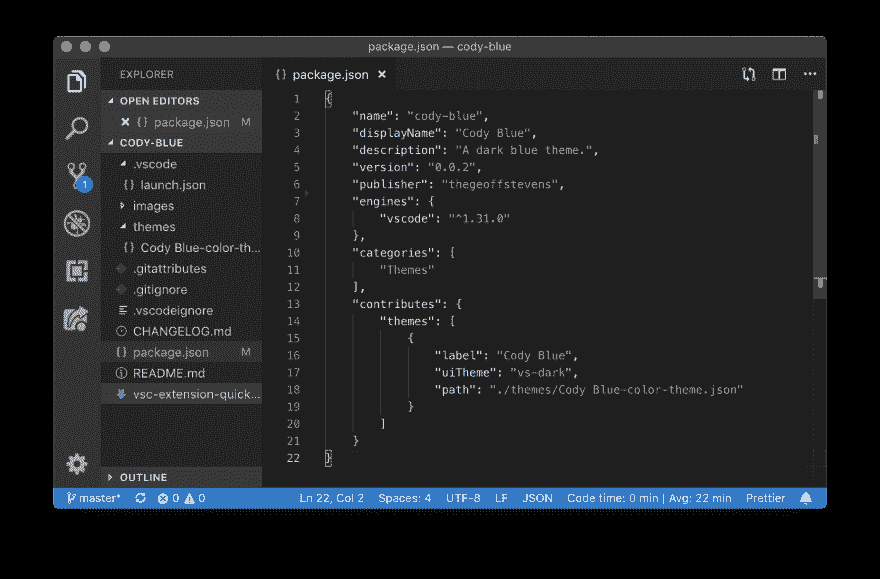](https://res.cloudinary.com/practicaldev/image/fetch/s--ku1E5mtw--/c_limit%2Cf_auto%2Cfl_progressive%2Cq_auto%2Cw_880/https://thepracticaldev.s3.amazonaws.com/i/q7bj5zhkmnkrm11cat25.png)

创建帐户后，您将被自动重定向到名为“管理发行商和扩展”的页面。

[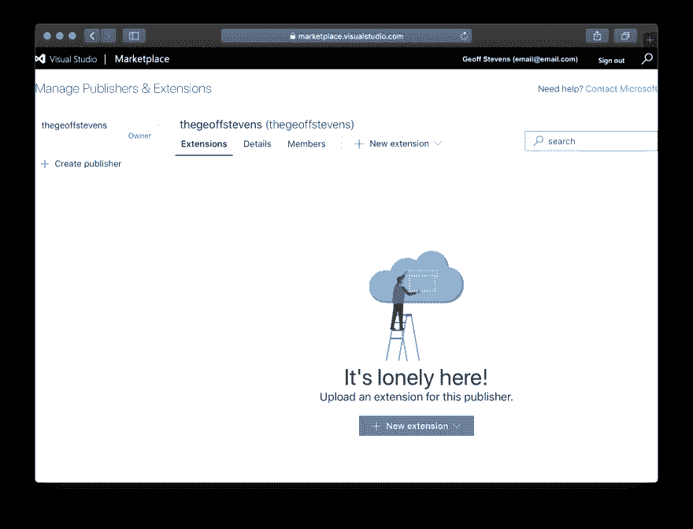](https://res.cloudinary.com/practicaldev/image/fetch/s--DmneFQGI--/c_limit%2Cf_auto%2Cfl_progressive%2Cq_auto%2Cw_880/https://thepracticaldev.s3.amazonaws.com/i/rjrdzl8jvelgnkh9q4sk.png)

您可以选择上传您的扩展，它将在 VS 代码市场中可用。只需运行`vsce package`并上传生成的`VSIX`文件。`VSIX`文件包含了安装和运行扩展所需的所有信息。

然而，如果你想从命令行发布(我推荐这种方式，因为它更容易将更新推送到你的扩展)，你将需要创建一个 Azure DevOps 组织。

为此，请单击导航栏右上角的您的姓名或电子邮件。这将带您进入创建新组织的页面。单击“创建新组织”。

[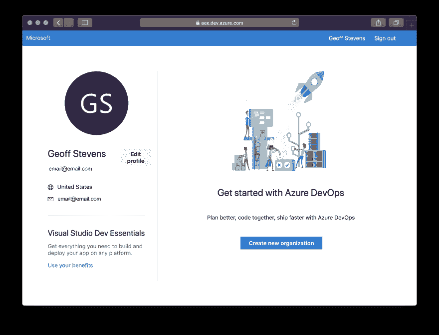](https://res.cloudinary.com/practicaldev/image/fetch/s--gLdOeSPb--/c_limit%2Cf_auto%2Cfl_progressive%2Cq_auto%2Cw_880/https://thepracticaldev.s3.amazonaws.com/i/kpglc6doy0nqa93lc14r.png)

下一个窗口将让您为您的 Azure DevOps 组织创建一个名称。

创建好组织后，点击导航栏右上角的头像。向下滚动并点击安全。

[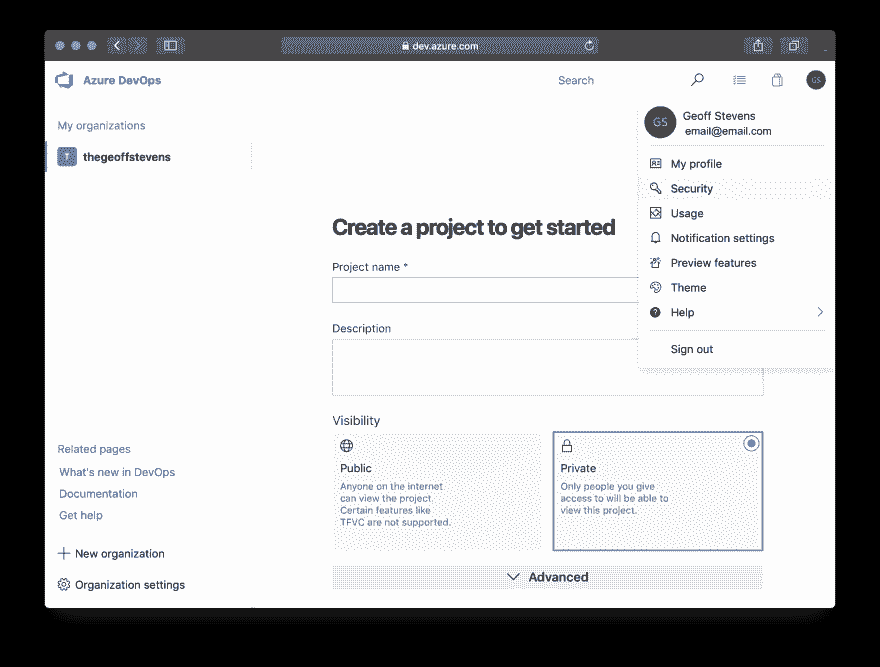](https://res.cloudinary.com/practicaldev/image/fetch/s--BZuVZnKS--/c_limit%2Cf_auto%2Cfl_progressive%2Cq_auto%2Cw_880/https://thepracticaldev.s3.amazonaws.com/i/4bsmkzpunxeg0wr58uu2.png)

单击“个人访问令牌”并创建新令牌。选择以下设置:

[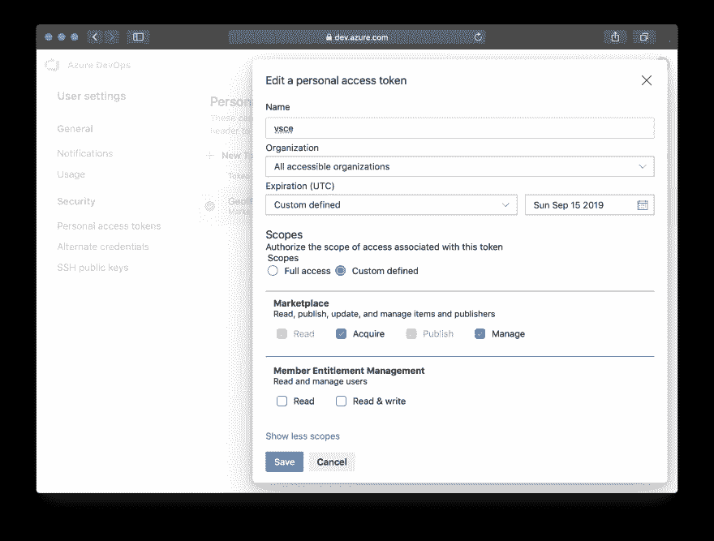](https://res.cloudinary.com/practicaldev/image/fetch/s--m7IkUrUj--/c_limit%2Cf_auto%2Cfl_progressive%2Cq_auto%2Cw_880/https://thepracticaldev.s3.amazonaws.com/i/dvxcfa1f329dn8p5vlrk.png)

您现在将看到一个访问令牌。复制它，因为你将无法再次看到它。

您现在可以将您之前创建的发布者名称与`vsce`相关联。在您的终端中，输入:

```
vsce login (publisher name) 
```

Enter fullscreen mode Exit fullscreen mode

接下来，`vsce`将要求您提供您通过 Azure DevOps 组织创建的个人访问令牌。出现提示时，输入令牌。

再次在终端中，导航到包含您的扩展文件的文件夹。要最终发布您的扩展，请输入:

```
vsce publish 
```

Enter fullscreen mode Exit fullscreen mode

您将收到一条警告，提示您没有存储库。按照提示暂时忽略这一点。

**大功告成！**发布后不久，`vsce`会给你一个链接，让你在扩展市场上看到你的扩展。

您也可以返回到 [publisher manager](https://marketplace.visualstudio.com/manage) 页面查看您的扩展状态。

## 做一些最后的润色

在你的扩展中添加一个图标和一个 GitHub repo 是一个很好的实践，这样其他人就可以看到源代码。你需要一个 GitHub repo 来添加图标。

首先，从您的扩展文件夹创建一个存储库，并将其推送到 GitHub(或另一个存储库托管服务)。

找到您的存储库的 URL，并将下面的代码片段添加到`package.json` :

```
 "repository": {
        "type": "git", 
        "url": "https://github.com/geoffstevens8/cody-blue" 
```

Enter fullscreen mode Exit fullscreen mode

要添加图标，在扩展文件夹中创建一个名为`images`的文件夹。将您想用作图标的图像添加到该文件夹中。该图标应该是一个 PNG 和至少 128x128。我从我的主题中选择了纯色。

接下来，将下面的键/值对添加到`package.json` :

```
"icon": "images/icon.png" 
```

Enter fullscreen mode Exit fullscreen mode

再次发布之前，请确保增加`package.json`中的版本号。一旦你完成了，你可以通过运行`vsce publish`再次发布。

想看看我的主题吗？在[市场](https://marketplace.visualstudio.com/items?itemName=thegeoffstevens.cody-blue)中找到我的主题，在 [GitHub](https://github.com/geoffstevens8/cody-blue) 上找到源代码。

## 让世界知道

最后，如果你想让世界知道你的第一个迷你“产品”或它们的推广发布，你可以在推特上获得帮助，或者在产品搜索上发布。

以下是如何建立一个简单的链接，让你的朋友和网络可以轻松分享。

开始于:`https://twitter.com/intent/tweet?text=`

在`=`之后添加你的文本，但是确保用`%20`替换所有的空格——正如你在下面的例子中看到的。

[https://twitter.com/intent/tweet?text =嘿，%20VS%20Code%20users，% 20 get % 20 project % 20 time % 20 reports % 20 other % 20 metrics % 20 for % 20 free，% 20 right % 20 in % 20 your % 20 editor % 20 with % 20 the % 20 code % 20 time % 20 extension—启动%20today](https://twitter.com/intent/tweet?text=Hey,%20VS%20Code%20users,%20get%20project%20and%20time%20reports%20and%20other%20metrics%20for%20free,%20right%20in%20your%20editor%20with%20the%20Code%20Time%20extension%E2%80%94launching%20today)

现在有趣的事情开始了——继续查看你的扩展网页，看看你下载了多少！

如果你喜欢这个教程，看看我的团队刚刚发布的扩展:[代码时间](https://www.producthunt.com/posts/code-time)。