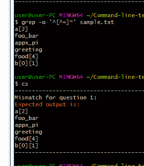

# 一次短暂而令人满意的捕虫活动

> 原文：<https://dev.to/learnbyexample/a-short-and-satisfying-bug-hunt-en2>

## 惊喜

因此，上周日一个惊喜等待着我。作为我的习惯，早餐后我打开了我的 GitHub 账户，看看我是否遇到了流量突增的情况。和往常一样，一切都很正常。除了蓝色的通知，这是罕见的。我希望这不是一个愚蠢的拉请求，谢天谢地，这是一个新的问题是开放的。

# [ex13 _ regex _ character _ class _ part 2 第 1 题不匹配 #24](https://github.com/learnbyexample/Command-line-text-processing/issues/24) 

[](https://github.com/pourradass) **[pourradass](https://github.com/pourradass)** posted on [<time datetime="2019-03-02T18:52:31Z">Mar 02, 2019</time>](https://github.com/learnbyexample/Command-line-text-processing/issues/24)

提交 ex13 _ regex _ character _ class _ part 2 的问题 1 的解决方案后，结果如下:

> 问题 1 不匹配:预期输出为:a[2] foo_bar appx_pi 问候食品[4] b[0][1]

但这和我得到的输出完全一样。我甚至尝试过。ref_solutions，没有任何运气。

[](https://user-images.githubusercontent.com/7921628/53686208-29224080-3d1c-11e9-8fc2-05a8798ae3fb.png)

使用 GNU bash，版本 4 . 4 . 23(1)-release(x86 _ 64-PC-msys)

[View on GitHub](https://github.com/learnbyexample/Command-line-text-processing/issues/24)

我粗略地看了一下这个问题，错误地猜测它可能是一些行尾问题(用户在 Windows 操作系统上)。作为一个在以前的工作中见过很多错误的人，我不排除任何可能性。我首先克隆了 repo，以便尝试在不受我的本地工作副本干扰的情况下重新创建工作环境。由于用户在打开问题时提供了详细信息，所以我能够快速复制它。果然，我看到了同样的问题。我只是奇怪为什么以前没有引起我的注意。要么是过去的用户选择不这样做，要么是事情不够有趣，无法在练习中进行到这一步。

## 创建最小失败案例

大约两年前，我写了 [solution checker 脚本](https://github.com/learnbyexample/Command-line-text-processing/blob/master/exercises/GNU_grep/solve)，这个脚本看起来很陌生。从克隆回购开始，我就不得不与改善事物的冲动作斗争。当我发现这个问题时，所有这些幻想都被抛到了脑后。取而代之的是写给*某天*写自动化测试脚本，以检查我的脚本对于所有的练习确实工作正常。

简单来说，`solve`脚本的作用就是检查用户之前执行的命令
是否解决了当前的练习题。为此，脚本
从历史中获取前一个命令，并将该命令的输出
与练习目录中的参考解决方案进行比较。听起来很简单，对吗？
是啊，我也这么想。我确实记得在我第一次发表它之前测试了几个案例，到目前为止还没有人提交一个问题。那么，为什么现在失败了呢？

如前所述，我认为这可能是一些奇怪的行尾问题。但是这实际上被排除了，因为它在 Linux 上对我来说也是失败的。尽管如此，我还是用`cat -A`检查了有趣的角色。不，没有问题。

```
$ grep -o '^[^=]*' sample.txt
a[2]
foo_bar
appx_pi
greeting
food[4]
b[0][1]
$ source ../solve -s
---------------------------------------------
Mismatch for question 1:
Expected output is:
a[2]
foo_bar
appx_pi
greeting
food[4]
b[0][1]
--------------------------------------------- 
```

Enter fullscreen mode Exit fullscreen mode

预期输出与提交的解决方案的输出相同。那么，为什么剧本会失败呢？我记得将脚本通过了 [shellcheck](https://www.shellcheck.net/) ，但还是检查了一遍。没有进展。因此，在调试整个脚本之前，我首先尝试从终端调试最可能的问题。幸运的是，结果很好。

```
$ cat sample.txt 
a[2]='sample string'
foo_bar=4232
appx_pi=3.14
greeting="Hi  there     have a nice   day"
food[4]="dosa"
b[0][1]=42

$ # say what??
$ [[ $(eval "command grep -o '^[^=]*' sample.txt") == \
>    $(eval "command grep -o '^[^=]*' sample.txt") ]] || echo 'Not fine'
Not fine

$ # after some attempts, I tried a command that won't have
$ # any [] characters in the output
$ # Eureka!
$ [[ $(eval "command grep 'bar' sample.txt") == \
>    $(eval "command grep 'bar' sample.txt") ]] || echo 'Not fine'
$ [[ foo == foo ]] && echo 'fine'
fine
$ [[ 'a[5]' == a[5] ]] || echo 'Not fine'
Not fine
$ [[ 'a[5]' == 'a[5]' ]] && echo 'fine'
fine 
```

Enter fullscreen mode Exit fullscreen mode

终端出现最小的失败案例是一种解脱。我试过了，但是 T2 也没有点亮灯泡。最后，不知何故，我认为可能是输出中的字符
导致了这个问题，当`[]`字符不存在时，
比较如预期的那样工作。

我确实认为引用可能是一个问题，但一开始我没有考虑，因为比较的双方都有相同的命令。然后我最近复习
[命令行基础](https://www.packtpub.com/application-development/command-line-fundamentals)的经验书就派上了用场。我记得如果比较操作符的 RHS 上没有使用引号，那么它将被视为`glob`匹配，而不是字符串匹配。唷。

## TL；速度三角形定位法(dead reckoning)

除非你有充分的理由不使用字符串，否则在 bash 中总是要引用字符串。

在命令替换命令两边加上双引号后，脚本
按预期工作。我感谢用户打开了这个问题。然后通知
CLI 基础书的作者。