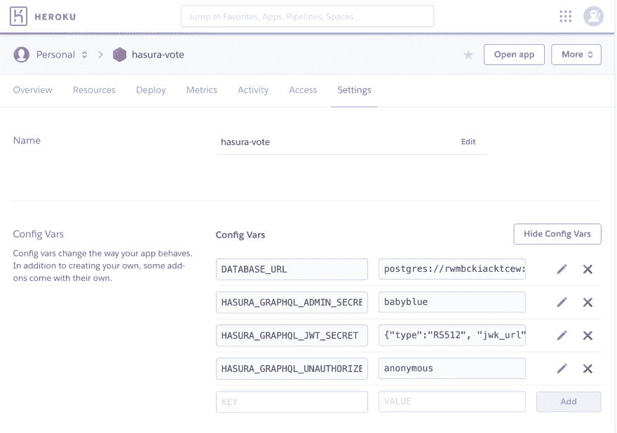
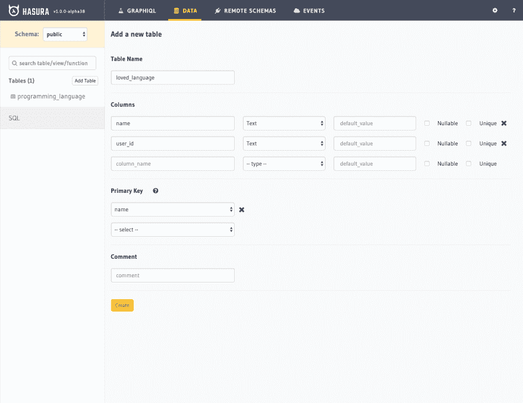

# 使用 Firebase 向实时 Hasura 应用程序添加身份验证和授权的教程

> 原文：<https://dev.to/hasurahq/a-tutorial-for-using-firebase-to-add-authentication-and-authorization-to-a-realtime-hasura-app-2ofb>

<figure> 

<figcaption>照片由 [rawpixel](https://unsplash.com/photos/qBinFqb_i0c?utm_source=unsplash&utm_medium=referral&utm_content=creditCopyText) 上 [Unsplash](https://unsplash.com/search/photos/keycard?utm_source=unsplash&utm_medium=referral&utm_content=creditCopyText)</figcaption>

</figure>

*本教程由[于君·詹](https://twitter.com/thezjy1)撰写，并作为 [Hasura 技术作者计划](https://blog.hasura.io/the-hasura-technical-writer-program/)的一部分发布，该计划旨在支持为开源 Hasura GraphQL 引擎编写指南和教程的作者。*

## 简介

Hasura 帮助您快速构建生产级[3 因子](https://3factor.app/)应用。除了从 PostgreSQL 数据库生成 CRUD GraphQL APIs 之外，它还提供了使用 webhooks 或 JWT 对用户进行**认证的方法，并帮助您为 GraphQL 模式定义粒度访问控制规则(**授权**)。然而，将一个 auth 系统与 Hasura 后端和一些前端集成仍然需要一些努力，并且可能很棘手。本教程旨在演示如何通过制作一个像这个[示例应用](https://realtime-poll.demo.hasura.app/)一样的实时投票应用来做到这一点，但是内置了 auth。我们将使用 Hasura 作为后端，Firebase Authentication 作为身份验证，React 作为前端。**

它主要有 3 个步骤:

1.  设置 Hasura 并使用 Hasura 控制台创建数据模型。
2.  设置身份验证。
3.  构建 React web 应用程序。

## 先决条件

*   反应
*   GraphQL
*   一些 SQL

## 试玩演示

试玩在 [hasura-vote.now.sh](https://hasura-vote.now.sh/) 直播，可以试试！这是一个简单的应用程序，你可以为你最喜欢的编程语言投票。投票是实时更新的。登录后，您还可以将语言标记为“**喜爱的**”。

## 使用 Firebase 认证与构建自己的认证

构建一个健壮的身份验证系统是一项不小的工作。它非常重要，可以决定你的应用程序的成败。因为本教程的主要重点是将认证系统与 Hasura 和 React 集成，所以我们将使用现成的 Firebase 认证。它是安全的，提供许多有用的功能，如第三方和无密码登录，并有一个慷慨的免费层。

## 第一步:哈苏拉

让哈苏拉运行起来非常容易。只需遵循 [Deploy Hasura to Heroku 指南](https://docs.hasura.io/1.0/graphql/manual/getting-started/heroku-simple.html)，最终，您将拥有一个全新的实例，运行在一个看起来像“**https://[your-Heroku-project-name]. Heroku app . com**的域中。

我们需要在 Heroku 控制台中设置一些环境变量。

设置一些秘密，在你忘记之前写下来，这样我们的 API 就不会被互联网上的人访问。

因为我们将使用 Firebase 中的 JWT，所以将`HASURA_GRAPHQL_JWT_SECRET`设置为`{"type":"RS512", "jwk_url": "https://www.googleapis.com/service_accounts/v1/jwk/securetoken@system.gserviceaccount.com"}`。

最后，将`HASURA_GRAPHQL_UNAUTHORIZED_ROLE`设置为`anonymous`,因为我们确实允许未经认证的用户写入和读取一些数据。

现在是数据建模的时候了。首先，我们需要一个“**编程 _ 语言**”表，其中包含“**姓名**”和“**投票 _ 计数**”字段。

此外，我们需要一个“ **loved_language** ”表来记录某个用户是否喜欢某种语言。由于一个用户只能喜欢一种语言一次，我们需要将主键设置为**名**和**用户名**的组合。在“添加表”UI 中没有办法做到这一点，但是 Hasura 方便地提供了一种执行原始 SQL 的方法: