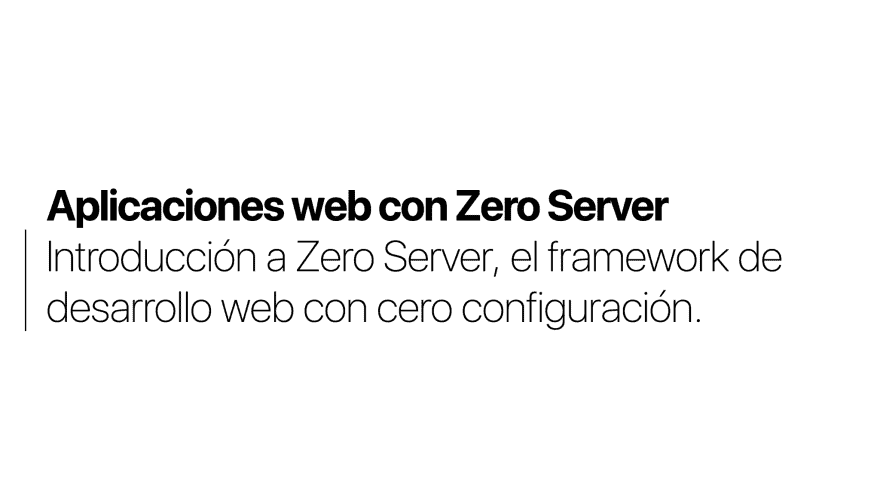

# 零服务器 web 应用程序

> [https://dev . to/sergiodxa/applications-web-with-zero-server-3 ooh](https://dev.to/sergiodxa/aplicaciones-web-con-zero-server-3ooh)

[](https://res.cloudinary.com/practicaldev/image/fetch/s--9_xy2Cfy--/c_limit%2Cf_auto%2Cfl_progressive%2Cq_auto%2Cw_880/https://thepracticaldev.s3.amazonaws.com/i/g9b4bfxfbqzpgjkfx340.png)

*最初发表于[https://sdx . im/articles/applications-we B- con-zero server/](https://sdx.im/articles/aplicaciones-web-con-zero-server/)T3]*

[**零**服务器](https://zeroserver.io/)是一个非常有趣的基于 JavaScript 的新型 web 开发框架，完全没有设置，支持多种技术，Zero 负责设置路径，构建和调试应用程序，让您编写 Node.js(带有 Express)、React、HTML、Markdown、MDX 或

## 设施

与任何 JavaScript 库或框架一样，可以使用 NPM
进行安装

```
npm install zero 
```

O con yarn

```
yarn add zero 
```

## 你好零号世界

hi zero world 是创建一个返回时间的 API 和一个请求该时间并将其显示给 API 的前端。

首先是 API，在项目中创建了一个包含文件“`time.js`”的文件夹“`time.js`”，文件夹“`/api`”t5“”是必需的，且“`time.js`”可能位于项目的根目录下，按组织而言，最好将其放在“`/api`”中。

在`time.js`内，将输出从 Express.js
接收到`Request`和`Response`的函数

```
const format = require("date-fns/format");

function main(req, res) {
  const time = format(Date.now(), "hh:mm A");
  res.send({ time: time });
}

module.exports = main; 
```

一旦保存后，`zero`运行在项目中，Zero 将负责安装任何代码依赖项并启动服务器。

如果现在访问[http://localhost:3000/API/time](http://localhost:3000/api/time)zero 将使用类似于此
的 JSON 进行响应

```
{  "time":  "11:14 PM"  } 
```

∞这是 API 的第一个端点！

不关闭服务器。我们现在可以创建一个使用此 API 的 React 应用程序，方法是在根目录中创建一个文件“`index.jsx`”，Zero 将文件“`.jsx`”标识为 React 组件。

以下代码放置在“`index.jsx`”内。

```
import React, { Component } from "react";

class Home extends Component {
  static async getInitialProps() {
    const response = await fetch("/api/time");
    const data = await response.json();
    return { time: data.time };
  }

  render() {
    return <h1>Current time is: {this.props.time}</h1>;
  }
}

export default Home; 
```

使用类的常规 React 组件，使用名为“[next . js](https://nextjs.org)”的附加静态方法(灵感来源于“[next . js]T2]”)，此异步方法允许组件在呈现之前获取服务器和客户端上的初始信息，并接收这些信息和 props。](https://nextjs.org)

如果您存取[https://localhost:3000](https://localhost:3000)zero 将会封装 React 应用程式并进行彩现，当您输入时将会看到包含以下讯息的页面。

> 当前时间是:晚上 11 点 20 分

这就列出了应用程序，非常简单，但没有设置任何内容。

## 静态文件

这些是图像、视频、文档等文件，可以位于项目中任何位置的应用程序代码旁边。零按原样提供服务，不做任何修改。

## 节点

如上所述，Zero 将文件视为 Node.js 的代码，并将其用作 URL，其文件名作为端点。每个文件必须导出一个用于处理请求的函数。

### 打字稿

Zero 还支持 TypeScript，如果文件以“`.ts`”结尾，则 Zero 会将它们从 TypeScript 转换为 JavaScript，并将其用作普通 JavaScript 文件。

### 查询

Zero 读取查询参数并将属性“`query`”注入对象“`Request`”。

### Verbos http

Zero 支持所有 HTTP 动词。提示`POST`具有作为 JSON 处理并注入对象`Request`作为`body`的信息，即`json`或`urlencoded`。

### 定制路线

Zero 使用路径的档名，无法设定自己的路径。如果你想把类似`/user?id=sergio` a `/user/sergio`的东西转换成`/user/sergio`零发送未找到路径的请求到最近的路径，也就是说，如果`/user/sergio.js`不存在但`/user.js`存在，那么零将发送到`/user.js`存在的请求

### 获取 API

Fetch 是一个浏览器 API，用于使用承诺发出 HTTP 请求。Zero 还将此添加到 Node.js 中，甚至允许对相对 URL(如“`/user/sergio`)进行请求。

如果您要从受身份验证保护的 URL 使用“`credentials: "include"`”(第二个参数)，则只需在“`fetch`”选项中切换到“`credentials: "include"`”(第二个参数)，该参数将负责将用户会话传递到请求的端点。

### 会议

Zero 自动处理用户会话。默认情况下，Zero 将会话保存到文件夹“`tmp`”中，这在本地工作正常，但在生产中不是很好，因此 Zero 支持 Redis 和 mongodb

#### 使用缰绳

Zero 从环境变数`SESSION_REDIS_URL`读取凭证，也支援档案`.env`而不设定任何内容。作为替代，可以将`SESSION_REDIS_HOST`、`SESSION_REDIS_PASSWORD`和`SESSION_REDIS_PORT`添加到环境变量中，并将它们与零相结合以连接到 Redis。

#### Usando MongoDB

为了使用 monodb 类似，Zero 使用环境变量`SESSION_MONGODB_URL`，只加 0 就会开始使用 monodb 来保存用户会话。

#### 会话的寿命

`SESSION_TTL`环境变量用于设置会话的生命周期，其值以秒为单位。默认值为一年。

## 做出反应

如上所述，Zero 支持 React，如果您创建了一个文件“`.jsx`”，则 Zero 会将其视为一个使用 React 的页面，并通过渲染该页面(即组件 osea)来封装和响应请求。

Zero 还支持导入 CSS、SCS 和 SASS 文件，并将用户会话注入“`this.props`”。

### `getInitialProps`

Zero，与 Next.js 一样，支持异步静态方法`getInitialProps`。此方法将对象`Request`接收为`req`，用户会话接收为`user`，当前 URL 接收为`url`，全部接收为一个对象。此方法的响应在渲染时被注入元件为“`prop`”。

### 获取 API

Zero 支持在服务器上使用 fetch in`getInitialProps`，此外还支持使用`credentials: "include"`和 Node.js 传递用户凭据，这在服务器和浏览器中都同样适用。

### 添加内容至`<head>`

要将内容添加到页面的``中，零支持[反应头盔](https://github.com/nfl/react-helmet)，只需将其导入为

```
import { Helmet } from "react-helmet"; 
```

并将其用于某个组件的“`render`”中，以便将内容添加到“`<head>`”中。

### 打字稿

它还支持使用“`.tsx`”的 React 中的 TypeScript，类似于 Node.js 中的支持

## HTML

Zero 读取 HTML，并负责合并 CSS、SCS、SASS、JavaScript 甚至图像并对其进行处理，以便优化它们并将 URL 更改为新文件，所有这一切都是通过‘t0’parcel 完成的。

Para detectar HTML 美国`.htm` o `.html`。

## 降价销售

Zero 读取 Markdown 文件并在使用时将其转换为 HTML。它还支持 [MDX](https://sergiodxa.com/articles/introduccion-a-mdx/) ，这样就可以导入另一个 Markdown 或 MDX 文件，导入 React 组件并直接在 Markdown 中使用。

甚至进口试剂头盔向`<head>`添加内容。

## 结语

Zero Server 虽然是新的，但却是一个很有前途的框架，因为它允许您创建结合了多种技术的 web 应用程序，而无需为生产进行任何配置和优化。是否支持更多技术，如 vue . js 的“`.vue`”或快速启动或支持渐进式 Web 应用程序。