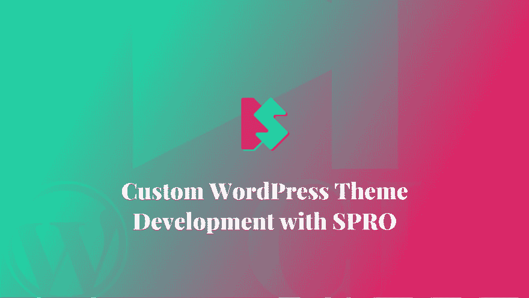
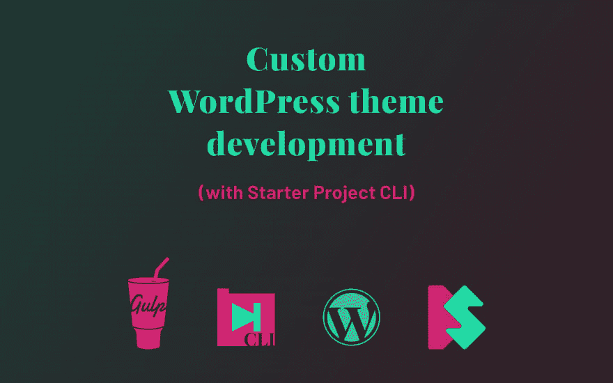
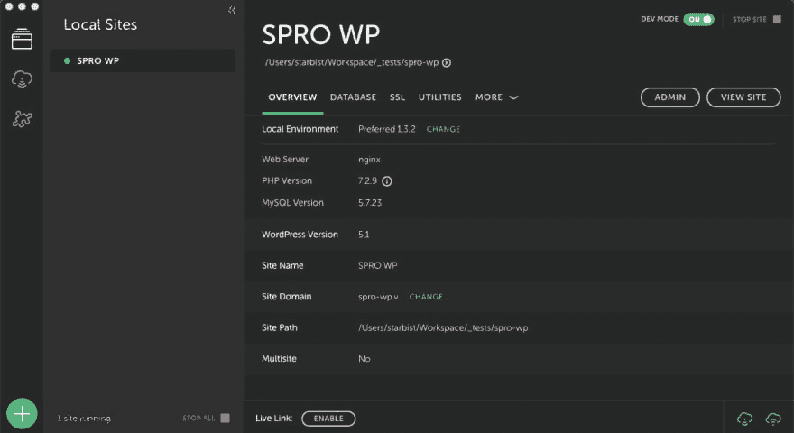

# 用 SPRO 定制 WordPress 主题开发

> 原文：<https://dev.to/starbist/custom-wordpress-theme-development-with-spro-bgd>

[](https://www.silvestar.codes/articles/custom-wordpress-theme-development-with-spro/)

*这篇文章最初发表于 [silvestar.codes](https://www.silvestar.codes/articles/custom-wordpress-theme-development-with-spro/) 。*

SPRO 是预定义吞咽任务的样板。任务是为你的项目建立开发环境，而不是一次又一次地编写冗长的任务。在这篇文章中，我将向你展示如何为自定义 WordPress 主题开发配置 SPRO。

如果你想更多地了解 SPRO，请阅读上周的介绍文章。

## 视频课

如果你更喜欢看视频而不是阅读文章，你可以继续[我为此录制的技能分享课程](https://skl.sh/2EcUlRt)。

[](https://skl.sh/2EcUlRt)

## 项目结构

在这种情况下，我将使用一个默认的 WordPress 安装作为我的起点。我使用飞轮的本地版本作为我的 WordPress 开发工具。

[](https://res.cloudinary.com/practicaldev/image/fetch/s--vAklDBML--/c_limit%2Cf_auto%2Cfl_progressive%2Cq_auto%2Cw_880/https://thepracticaldev.s3.amazonaws.com/i/xbwp6imwhm45ygpnotoo.jpg)

目的是为 Sass、JavaScript、BrowserSync 和 Critical CSS 的 219 个默认主题添加 Gulp 任务。

我已经重新组织了主题中的代码。首先，我创建了一个名为`css`的新文件夹，并将所有的 Sass 文件和`sass`文件夹移到其中。接下来，我新建了一个名为`src`的文件夹，并将新建的`sass`文件夹和现有的`js`文件夹移动到`src`文件夹中。

项目结构如下:

```
|-- src
    |   |-- css
    |   |   |-- style.scss
    |   |   |-- ...
    |   |   |-- sass
    |   |       |-- _normalize.scss
    |   |       |-- ...
    |   |-- js
    |       |-- customize-controls.js
    |       |-- ... 
```

Enter fullscreen mode Exit fullscreen mode

## SPRO 安装

要安装 SPRO，运行`npm install starter-project-cli -s`命令，然后通过执行`node_modules/.bin/spro start`命令运行 SPRO。SPRO[也可用于全球安装](https://dev.to/starbist/introducing-spro-2p4#installation)。现在你应该被提示回答关于项目架构和吞咽任务的问题。

以下是我的(简短)回答:

```
 GENERAL | Do you want to override the project? Yes
    GENERAL | What is the root folder of the project? ./
    GENERAL | Where is the folder with the source code of the project? src
    GENERAL | Where do you want to store compiled code of the project? build
    GENERAL | Are you sure that you want to override the project? Yes
BROWSERSYNC | Do you want to run BrowserSync to preview changes in the browser? Yes
       HTML | Do you want to run HTML tasks? No
        CSS | Do you want to run CSS tasks? Yes
        CSS | Are you using Sass? Yes
        CSS | Where is the folder with CSS source code? css
        CSS | Where do you want to store compiled CSS code? css
        CSS | Do you want to minify CSS code? Yes
        CSS | Do you want to autoprefix CSS code? Yes
        CSS | Do you want to add sourcemaps for CSS code? No
        CSS | Do you want to lint CSS code? No
         JS | Do you want to run JavaScript (es6) tasks? Yes
         JS | Where is the folder with JavaScript source code? js
         JS | Where do you want to store compiled JavaScript code? js
         JS | Do you want to minify JavaScript code? Yes
         JS | Do you want to add sourcemaps for JavaScript code? No
         JS | Do you want to lint JavaScript code? No
     IMAGES | Do you want to run image optimization tasks? No
      FONTS | Do you use local fonts? Do you want to run font tasks? No
    FAVICON | Do you want to run favicon tasks? No
   CRITICAL | Do you want to extract Critical CSS? Yes
   COMPRESS | Do you want to compress (gzip) all assets? No
        KSS | Do you want to add KSS style guide? No
    SASSDOC | Do you want to add documentation for the SASS code (SassDoc)? No
      JSDOC | Do you want to add documentation for the JS code (JSDoc)? No
     SEMVER | Do you want to add semver versioning tasks? No
       YARN | Do you use Yarn as your default dependency manager? Yes 
```

Enter fullscreen mode Exit fullscreen mode

安装完成后，SPRO 会将任务和配置文件复制到`gulpfile.js`文件夹中。

为了能够运行吞咽任务，我们应该安装所有需要的依赖项。您可以在终端中找到安装命令，就在问题后面。将该命令粘贴到您的终端中，然后按 Enter 键。

## SPRO 配置

现在我们已经有了所有必需的 Gulp 任务和依赖项，我们可以配置 SPRO 了。

先说 BrowserSync。我想使用 BrowserSync 来预览浏览器中的更改。本地通过飞轮工具已经为我配置了本地站点域。我的情况是`spro-wp.v`。我将使用本地域作为 BrowserSync 的代理。

```
{
  "proxy": "http://spro-wp.v"
} 
```

Enter fullscreen mode Exit fullscreen mode

接下来，我们应该更新提取关键 CSS 的 URL，以匹配我们在`.critical.json`文件中的开发域。

```
[{
  "src": "style.css",
  "settings": {
    "out": "style.critical.css",
    "url": "http://spro-wp.v/",
    "width": 1920,
    "height": 1200,
    "keepLargerMediaQueries": true,
    "strict": false,
    "blockJSRequests": false,
    "phantomJsOptions": {
      "ssl-protocol": "any",
      "ignore-ssl-errors": true
    }
  }
}] 
```

Enter fullscreen mode Exit fullscreen mode

这里还有其他选项，但最重要的是`src`和`out`选项。`src`选项告诉我们使用哪个文件作为提取关键 CSS 的源文件，而`out`选项告诉 Penthouse 应该在哪个文件中存储提取的关键 CSS 代码。要了解更多关于顶层公寓的信息，[请访问顶层公寓官方网站](https://github.com/pocketjoso/penthouse)。

另外，我们应该在名为`style.critical.scss`的`sass`文件夹中创建一个新的 Sass 文件。

## 运行任务

要查看可用 Gulp 任务列表，运行`gulp --tasks`命令。我们有四项任务:

*   `clean`用于清理编译后的代码，以及
*   三个用于开发:`dev`、`build`和`default`。

如果你运行`default` Gulp 任务，站点应该会在浏览器中打开。

## PHP 更新

由于我们编译的代码存储在`build`文件夹中，我们应该更新 CSS 和 JavaScript 文件的路径。在`functions.php`文件中，更新`twentynineteen_scripts`函数:

```
<?php
/**
 * Enqueue scripts and styles.
 */
function twentynineteen_scripts() {
  // Will load CSS file at the end of the page
  // wp_enqueue_style( 'twentynineteen-style', get_stylesheet_uri(), array(), wp_get_theme()->get( 'Version' ) );

  wp_style_add_data( 'twentynineteen-style', 'rtl', 'replace' );

  // Will update the path to the JavaScript files
  if ( has_nav_menu( 'menu-1' ) ) {
    wp_enqueue_script( 'twentynineteen-priority-menu', get_theme_file_uri( '/build/js/priority-menu.js' ), array(), '1.1', true );
    wp_enqueue_script( 'twentynineteen-touch-navigation', get_theme_file_uri( '/build/js/touch-keyboard-navigation.js' ), array(), '1.1', true );
  }

  // Will update the path to the print CSS file
  wp_enqueue_style( 'twentynineteen-print-style', get_template_directory_uri() . '/build/css/print.css', array(), wp_get_theme()->get( 'Version' ), 'print' );

  if ( is_singular() && comments_open() && get_option( 'thread_comments' ) ) {
    wp_enqueue_script( 'comment-reply' );
  }
}
?> 
```

Enter fullscreen mode Exit fullscreen mode

我们正在删除主样式文件，并更新 JavaScript 和打印 CSS 文件的路径。

在`footer.php`文件中，在结束 body 标签之前添加一个到主样式文件的链接:

```
<link rel="stylesheet" href="<?php echo get_theme_file_uri('/build/css/style.css'); ?>"> 
```

Enter fullscreen mode Exit fullscreen mode

理想情况下，我们应该推迟不重要的 CSS 文件的加载，正如 Google 建议的那样。

## 临界 CSS

接下来，让我们将关键的 CSS 嵌入到 HTML 文档的头部，在`header.php`文件中。

```
<?php
$critical = get_template_directory() . '/build/css/style.critical.css';
if ( file_exists( $critical ) ) {
  echo '<style>';
  require_once $critical;
  echo '</style>';
}
?> 
```

Enter fullscreen mode Exit fullscreen mode

如果您正确遵循了说明，您应该能够在您的终端中运行`gulp`命令。Gulp 应该编译代码，然后在浏览器中打开站点，然后提取关键的 CSS，然后刷新浏览器。

## 结论

正如你所看到的，我从来没有碰过任何 Gulp 任务，只是配置文件。这正是 SPRO 的全部。

如果您有任何反馈，我们将不胜感激。SPRO 还处于早期阶段，不久将会增加更多功能。

请广而告之。更多课程即将推出！📣