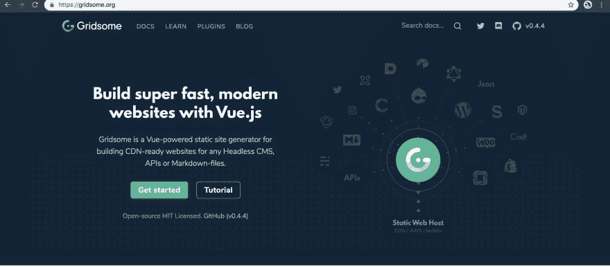
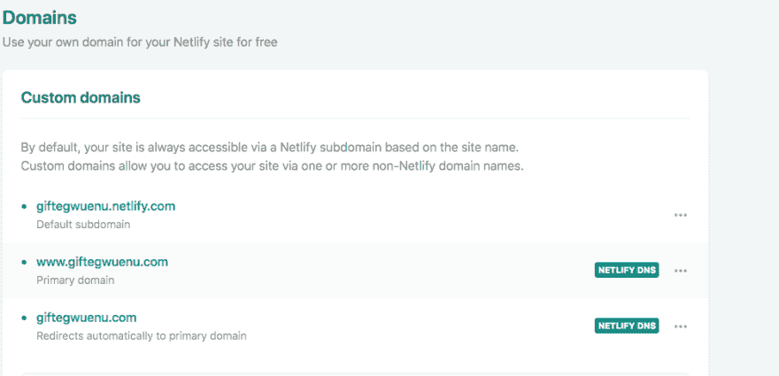

# 从 Hugo 迁移到 Gridsome

> 原文：<https://dev.to/lauragift21/-migrating-to-gridsome-from-hugo-2o6e>

上周我在浏览我的推特时间表时，无意中发现了这条推文。在查看了 gridsome-starter-blog 之后，我决定做出改变。

> Gridsome@ gridsome第一位正式 gridsome 首发:
> 
> ⚡️beautiful 和简单设计。
> ⚡️Markdown 为物。
> ⚡️Tags 支持。
> ⚡️Dark /灯光切换。
> ⚡️100，100，100，谷歌灯塔 100 分。
> ⚡️Uses 相同前场[@ thepracticaldev](https://twitter.com/ThePracticalDev)00:46am-01 2019 年 3 月[](https://twitter.com/intent/tweet?in_reply_to=1101282439320797187)[](https://twitter.com/intent/retweet?tweet_id=1101282439320797187)[](https://twitter.com/intent/like?tweet_id=1101282439320797187)

## 我为什么要做这个切换？

我对之前博客的设计很满意，我也喜欢用 Hugo。这篇文章不是要抨击 Hugo😄。我想要灵活性，因为我在以前的博客中得不到这一点，所以我决定做出改变。我目前正在使用官方的 Gridsome Blog Starter ，我只是调整了一些东西，添加了一些我需要的功能，这些功能是 Starter 中没有的。

在这篇文章中，我将重点介绍我是如何做出这一改变的，同时也将详细介绍我为支持我的个人博客而添加的功能。我们开始吧，好吗？

## 介绍 Gridsome

[](https://res.cloudinary.com/practicaldev/image/fetch/s--69E2AuMj--/c_limit%2Cf_auto%2Cfl_progressive%2Cq_auto%2Cw_880/https://d2mxuefqeaa7sj.cloudfront.net/s_3D517D01AFC7E74C96BBEC559A051E8481EFE4E7CA50AF0EC2D3A5EA7519BF92_1548180739910_Screen%2BShot%2B2019-01-22%2Bat%2B7.11.51%2BPM.png)

Gridsome 是一个 Vue 驱动的静态站点生成器，用于构建超快的网站和应用程序。这是盖茨比的另一种选择。我最喜欢 Gridsome，因为它支持 GraphQL 作为数据层的单一来源，允许您连接到任何无头 CMS 或外部 API，如 Google sheets、Airtable、本地 markdown 文件等。

当我使用 Hugo 时，毫无压力，我能够在几乎不了解 go 编程语言的情况下找到代码库，因为 Hugo 是使用 Go 构建的。但是我发现，当我需要添加我正在使用的模板中没有的额外功能时，这有点棘手。所以对我来说真的没有那么灵活。我一直有一个语法突出的问题，当我最近试图解决这个问题时，它是一个灾难。所以在我搬家之前，我权衡了搬家的利弊。当我的读者访问我的博客时，他们还能认出我吗？不管怎样，我还是走了。

## 内容迁移

将我的内容从 Hugo 转移到 Gridsome 并不困难，因为它们只是降价文件，在 Hugo 中，我的内容在`content/post`中，幸运的是 Gridsome 有相同的目录。我要做的唯一一件事就是格式化 frontmatter 以适应 Gridsome 的格式。我真正喜欢的一件事是我目前使用的 starter 采用了 [Dev.to](https://dev.to) frontmatter 格式，我是 Dev 的长期用户，所以这对我来说也很容易采用。

## 定制启动器

这真的很有趣，因为 Gridsome 团队真的让这成为一个很好的开端。一些支持的功能已经包括标签，暗/亮切换，漂亮和简约的用户界面和降价支持。这些是我在安装和使用这个启动器时采取的步骤。

我使用这些命令创建了一个新的 Gridsome 项目:

```
<!-- install gridsome globally -->
npm install --global @gridsome/cli

<!-- Then clone the starter repo -->
gridsome create gridsome-blog https://github.com/gridsome/gridsome-starter-blog.git

<!-- navigate to the directory -->
cd gridosme-blog

<!-- run the app on your local server -->
gridsome develop 
```

Enter fullscreen mode Exit fullscreen mode

你有它！🎉我们刚刚创建了一个网格博客。

## 集成附加功能

我不得不对这个博客做一些额外的修改，因为我需要的几个集成不可用。默认情况下，您会得到 gridsome/source-filesystem 和 gridsome/remark-prismjs。但是我需要增加额外的功能，比如

*   谷歌分析支持
*   评论的问题
*   时事通讯
*   关于我页面
*   Twitter 上的分享功能
*   RSS 支持
*   Twitter 嵌入支持

我已经能添加一些了。我很幸运地得到谷歌分析插件已经可用，所以我只需要安装它。对于 Disqus，我安装了一个名为`vue-disqus`的包，并将我用于时事通讯的表单迁移到这个新博客上，只需要调整一些样式，使其适合这个新布局。这个博客仍然是一个正在进行中的工作，因为我添加了其他功能，我有悬而未决。总的来说，到目前为止，搬到 Gridsome 很棒！

## 正在部署

我使用 Netlify 托管以前的博客，并将其配置为使用自定义域。我最近买了 [giftegwuenu.dev](https://giftegwuenu.dev) ，只是让它重定向到 giftegwuenu.com。从之前的博客切换到这个博客真的很快，因为使用 Netlify，你已经有了一个分配给你创建的任何项目的域。所以我从我以前的博客中删除了自定义域，并将其添加到这个新博客中。它工作得非常完美。Netlify 是 Bae💚

[](https://res.cloudinary.com/practicaldev/image/fetch/s--u0zM2jbF--/c_limit%2Cf_auto%2Cfl_progressive%2Cq_auto%2Cw_880/https://res.cloudinary.com/lauragift/image/upload/v1551708884/Screen_Shot_2019-03-04_at_2.50.52_PM_h7seox.png)

## 结论

做出这一举动并不像我想象的那么令人生畏。我很高兴我能够做到这一点，现在我可以使用 Vue 这个框架了，与我使用 Hugo 时相比，我更熟悉这个框架，并且必须了解 go 以进行额外的实现更改。我现在将专注于创建内容，不要担心我会很快切换。

如果你有关于 JAMStack、Gridsome 或者为什么我换了的问题，你可以在 twitter 上联系我