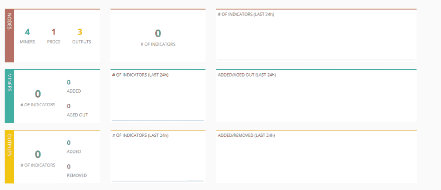

# Minemeld 安装，续

> 原文：<https://dev.to/ngschmidt/minemeld-installation-continued-2e4a>

我欺骗/改变了一点——决定更接近地模拟一下我将在工作中使用的东西。我启动了一个 CentOS 虚拟机，并按照下面的指令操作:[https://github.com/PaloAltoNetworks/minemeld-ansible](https://github.com/PaloAltoNetworks/minemeld-ansible)

```
$ sudo yum install -y wget git gcc python-devel libffi-devel openssl-devel zlib-dev sqlite-devel bzip2-devel$ wget https://bootstrap.pypa.io/get-pip.py$ sudo -H python get-pip.py$ sudo -H pip install ansible$ git clone https://github.com/PaloAltoNetworks/minemeld-ansible.git$ cd minemeld-ansible$ ansible-playbook -K -i 127.0.0.1, local.yml$ usermod -a -G minemeld # add your user to minemeld group, useful for development 
```

Enter fullscreen mode Exit fullscreen mode

一切都很好——我不得不重试一次剧本来让它运行，但是安装剧本甚至启用/启动了必要的服务。与 OVA 相比，我强烈推荐这种方法——在我的实验室中，我总共花了大约 30 分钟来启动和运行 Minemeld，包括 CentOS ISO 下载。

任何正在这样做的人可能会发现，知道上面的 usermod 不授予您登录 minemeld 的权限是有用的——它有自己的凭证集。默认凭据是 _admin| **minemeld。** _

我的下一个目标是使用 EDL 与我的实验室防火墙集成。这是它在没有任何自定义挖掘器的情况下运行的预览——最终我想挖掘 NSX-T 的管理器来在系统之间共享对象组。

[](https://2.bp.blogspot.com/-wf-Uyx3Z5eQ/XHwJEINyStI/AAAAAAAAAhE/VTVlM_Ex0JwijlObEqoFxchwL7y2ppZcQCLcBGAs/s1600/minemeld-running.PNG)