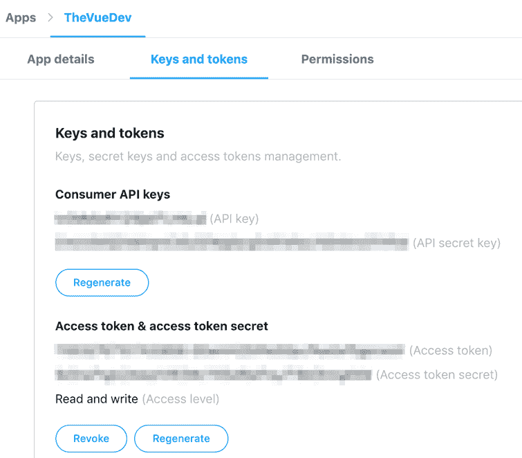

# 一个在推特上发布关于 Vue 的新文章的机器人

> 原文：<https://dev.to/danielelkington/a-bot-that-tweets-new-dev-articles-about-vue-4p5a>

所以我爱 [VueJS](https://vuejs.org/) 。我喜欢 dev.to 关于 Vue 的文章。我不想错过任何一个。我可以不断刷新 dev.to 上的 [#vue 标签](https://dev.to/t/vue)，但是我认为在我的 Twitter feed 上看到所有新的 vue 文章会更方便。所以我写了我的推特机器人- [@TheVueDev](https://twitter.com/TheVueDev) 。

# 基本架构和流程

我决定的基本流程如下

*   用 Typescript 编写的 Azure 函数每分钟都在运行，
*   该函数抓取[dev.to/t/vue/latest](https://dev.to/t/vue/latest)来检查新文章，
*   如果发现新文章，它们会自动在推特上发布！

Azure 功能是微软 Azure 的“无服务器”产品，它允许你运行一小段代码来响应一些触发。有一个慷慨的免费层([每月 100 万次免费执行！这意味着这个项目非常便宜，尽管不是完全免费的，因为该功能需要一个 Azure 存储帐户来存储一些与该功能相关的东西。尽管如此，这个项目的总成本还不到每月 1 美元。](https://azure.microsoft.com/en-us/pricing/details/functions/)

# 设置 Twitter

建立 Twitter 账户相对简单(你只需要准备好回答 Twitter 为了防止滥用而提出的许多问题，这是可以理解的)。在[twitter.com](http://twitter.com)为这个机器人建立了一个 Twitter 账户后，我去了[developer.twitter.com](https://developer.twitter.com)，按照提示申请了一个开发者账户。最后，我创建了一个新的“应用程序”，填写了一些更多的细节，请求了一些访问令牌，然后出现了一个类似这样的页面:
[](https://res.cloudinary.com/practicaldev/image/fetch/s--c6zVj0rm--/c_limit%2Cf_auto%2Cfl_progressive%2Cq_auto%2Cw_880/https://thepracticaldev.s3.amazonaws.com/i/0chzhufxmibwequ1c9ej.png) 
没错，有四个令牌/密钥，我们需要全部！

# 该功能

我按照 Azure 文档中的[快速入门指南](https://docs.microsoft.com/en-us/azure/azure-functions/functions-create-first-function-vs-code)用 Visual Studio 代码创建了一个 Azure 函数，选择“JavaScript”作为语言。然后运行`tsc --init`添加 TypeScript，准备开始编码！

## 每分钟运行代码

对于你创建的每个函数，你需要指定什么会触发它(在这里找到所有选项)。在我的例子中，我想每分钟触发一次函数，这可以通过函数的`function.json`文件中的以下代码来实现:

```
{  "disabled":  false,  "bindings":  [  {  "schedule":  "0 * * * * *",  "type":  "timerTrigger",  "direction":  "in",  "name":  "everyMinuteTimer"  }  ]  } 
```

## 刮除开发到

我要感谢 Sarthak Sharma，他的 Vue CLI 非常棒——如果你还没有看过的话，请查看一下。他用来抓取 dev.to 的代码给了我很多这个项目的指导。

[](/sarthology) [## 🎁💝DevTo CLI💝🎁:给我最爱的人的情人节礼物

### sart hak Sharma 2 月 14 日 192 分钟阅读

#showdev #meta #opensource #productivity](/teamxenox/devto-cli-a-valentines-day-gift-to-my-favorite-people-56bd)

和 Sarthak 一样，我用了 [x 光库](https://github.com/matthewmueller/x-ray)帮助刮痧。每一分钟我都想加载 https://dev.to/t/vue/latest 的并抓取最新 VueJS 文章的细节。在 Chrome devtools 的帮助下，获取文章标题、作者详细信息和文章链接等信息非常简单——查询页面使用的语法与 CSS 非常相似。

```
const xray = Xray()
const articleScrapeData = await xray(
  'https://dev.to/t/vue/latest',
  '#substories .single-article',
  [
    {
      title: '.index-article-link .content h3',
      author: 'h4 a',
      link: '.index-article-link@href',
      tags: ['.tags .tag'], // need the tags so we can strip them out of the title
      authorLink: '.small-pic-link-wrapper@href'
    }
  ]
) 
```

这将返回页面上文章的数组。我需要清理一些数据([如果你感兴趣，这是代码](https://github.com/danielelkington/twitter-vue-dev/blob/master/AutoTweetDevArticles/article.ts))。当然，如果他们提供了作者的 Twitter 账号，那么在 Twitter 上发布是有意义的，所以我从作者页面上抓取了这个账号。

```
 const socialLinks: string[] = await xray(article.authorLink, [
      '.profile-details .social a@href'
  ])
  const twitterLink = socialLinks.find(x => x.includes('twitter.com/'))
  if (twitterLink != null) {
    // twitterLink is in the form https://twitter.com/{blah}
    const twitterURL = new URL(twitterLink)
    const twitterHandle = '@' + twitterURL.pathname.substring(1)
  } 
```

对于每篇文章，我都可以创建推文。我决定 tweets 将包含文章标题，然后是作者的 twitter 句柄或名称，最后是文章的链接(dev.to 用漂亮的卡片很好地格式化了它)。

```
const tweetContent =
`${article.title} { ${article.twitterHandle || article.authorName} } ${article.link}` // Yay for Template Literals! 
```

现在我们所要做的就是在推特上发布文章！

## 进退两难

问题是，这个功能不能每分钟都发所有我们找到的“最近的文章”，否则我们最终会发一堆重复的文章。更复杂的问题是，dev.to 似乎没有提供一种简单的方法来查看一篇文章发布的时间，而不是最近的一天。我想到了三种可能的解决方案:

1.  每 24 小时只运行一次该功能，并在推特上发布昨天的文章。问题是，如果功能由于某种原因失败，我们将错过一天，如果它的工作追随者需要等待长达 24 小时的新文章！
2.  实现某种存储来跟踪已经发布的文章。但是对于这样的项目来说，这似乎有点大材小用了。 <sub><sup>(你可能会认为 Typescript 对于这样的项目来说也是多余的，但我想用它来学习☺️)</sup></sub>
3.  使用 Twitter API 获取该帐户发布的最新文章，与 dev.to 上找到的最新文章进行比较，并发布任何尚未发布的文章。

备选案文 3 似乎最直截了当。抓取[dev.to/t/vue/latest](https://dev.to/t/vue/latest)只返回最近的 8 篇文章，而 Twitter API 返回账户最近的 200 条推文，因此该函数应该总是能够准确地确定一篇文章是否已经被推文。

## 使用 Twitter API

Omar Sinan 关于构建 Twitter 机器人的文章非常有帮助——来看看吧！

## 文章不再可用

和 Omar 一样，我用 [Twit](https://github.com/ttezel/twit) 库来帮助发推特。将它连接到 [@TheVueDev](https://twitter.com/TheVueDev) 就像从 Twitter 应用页面粘贴四个键和令牌一样简单(当然是作为环境变量！).

```
this.t = new Twit({
  consumer_key: process.env.twitter_consumer_key,
  consumer_secret: process.env.twitter_consumer_secret,
  access_token: process.env.twitter_access_token,
  access_token_secret: process.env.twitter_access_token_secret
}) 
```

如果我们的文章还没有被发布，我们就把它们发布出去！

```
// Get recent tweets
const res = await this.t.get('statuses/user_timeline', {
  screen_name: 'TheVueDev'
})
const recentTweets = <any[]>res.data
// Determine if article has been tweeted yet
// Need to look at entities.urls.expanded_url because Twitter 
// automatically shortens the URL in the tweet itself.
if (recentTweets.find(x =>
  x.entities.urls.find((u: any) => u.expanded_url === articleLink)
  ) == null) {
  // Article hasn't yet been tweeted - tweet it!
  await this.t.post('statuses/update', { status: tweetContent })
} 
```

(此处可找到此代码的更高效版本[。)](https://github.com/danielelkington/twitter-vue-dev/blob/master/AutoTweetDevArticles/tweet.ts)

# 部署

使用 [Azure Functions extension](https://marketplace.visualstudio.com/items?itemName=ms-azuretools.vscode-azurefunctions) ，只需点击几下按钮，就可以在 Visual Studio 代码内将该功能部署到 Azure。整洁！

这样，我就有了一个功能正常的 Twitter 机器人，现在可以很容易地了解所有出现在 dev.to 上的新 VueJS 文章了！

[](https://res.cloudinary.com/practicaldev/image/fetch/s--CkGCVXGn--/c_limit%2Cf_auto%2Cfl_progressive%2Cq_auto%2Cw_880/https://thepracticaldev.s3.amazonaws.com/i/y0qnn82nsfn8z2rvd65t.png)

[这是 Twitter 账户](https://twitter.com/TheVueDev),[这是完整代码](https://github.com/danielelkington/twitter-vue-dev)，一步一步的指导你部署你自己的机器人来发布你选择的任何 dev.to 标签！

## [【danielelkington】](https://github.com/danielelkington)/[【Twitter-view-dev】](https://github.com/danielelkington/twitter-vue-dev)

### 一个存在于 Azure 函数中的机器人，它可以发布所有 dev.to VueJS 文章

<article class="markdown-body entry-content container-lg" itemprop="text">

# twitter 检视器-dev

[](https://raw.githubusercontent.com/danielelkington/twitter-vue-dev/mastimg/logo.png)

一个存在于 Azure 函数中的机器人，可以发布所有 [dev.to](https://dev.to) VueJS 文章。找到它 [@TheVueDev](https://twitter.com/TheVueDev) 。

[dev.to 文章解释这是如何创建的。](https://dev.to/danielelkington/a-bot-that-tweets-new-dev-articles-about-vue-4p5a)

同样的代码可以用来创建一个 Twitter bot，它可以从任何有效的 [dev.to](https://dev.to) 标签发布新文章。

## 部署

按照这些说明来创建你自己的 Twitter 机器人，为你选择的标签发送 [dev.to](https://dev.to) 文章。这可能会让你每月花费几美分的 Azure 存储费。

### 设置 Twitter 帐户

1.  去[twitter.com](https://twitter.com)为你的机器人创建一个 Twitter 账户。

2.  登录你的机器人的 Twitter 账户，进入[developer.twitter.com](https://developer.twitter.com)，点击“应用”，然后按照提示申请一个开发者账户。

    *   当要求“选择要关联的用户配置文件”时，请确保选择了您的 bot 帐户。
    *   填写关于您的开发者帐户用途的信息，接受条款并…

</article>

[View on GitHub](https://github.com/danielelkington/twitter-vue-dev)