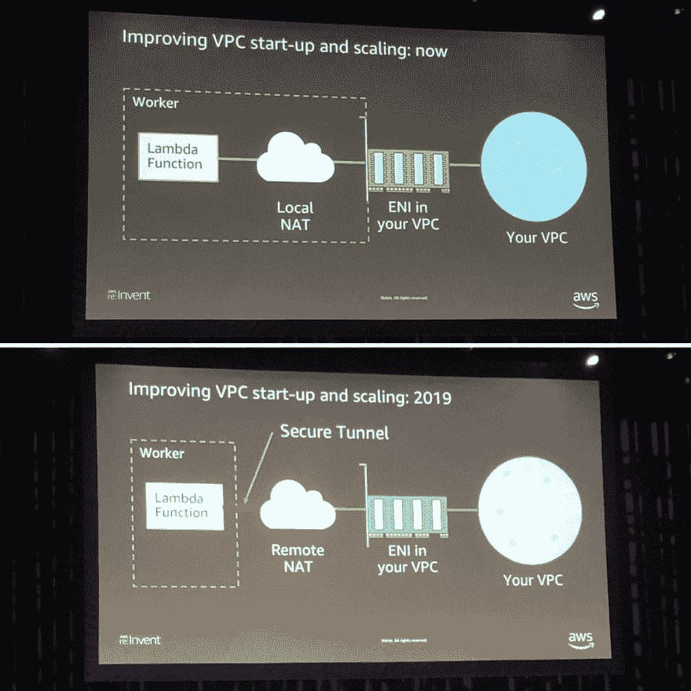

# 使用利特尔法则估算 VPC 自动气象站的知识产权容量

> 原文：<https://dev.to/vladusenko48/using-littles-law-to-estimate-ip-capacity-in-vpc-for-aws-lambda-jpn>

*原贴[此处](https://medium.com/@vu4848/using-littles-law-to-estimate-ip-capacity-in-vpc-for-aws-lambda-46711eb55fe3)T3】*

在 2019 年找到一个没有听说过无服务器计算的人将是一项艰巨的任务。AWS Lambda、GCF 和 Azure 函数——我们都知道这些东西意味着什么。节省成本的基础架构、无限的可扩展性、无运营、无系统管理员——这多酷啊！我们阅读了许多大公司的案例研究，这些公司声称，他们通过转向 AWS Lambda 或任何其他云市场 FaaS 解决方案，成功地将云计算成本降低了 X 倍。但是，正如我们所知，在软件工程的世界里没有什么灵丹妙药，只有适合特定问题的折衷方案。

例如，让我们考虑 AWS。虽然我们真正从 Lambdas 的任何服务器管理中抽离出来，但我们感觉很棒。但是，一旦我们意识到由于某种特殊原因，我们可能需要将我们的功能放在 VPC 中(例如，lambdas 需要与 RDS、ElastiCache 或任何没有公共 IP/DNS 名称的东西进行对话)，第一次冷启动时，我们意识到我们完蛋了。是的，在 VPC 启动 Lambda 是个问题。细节我就不多说了，你可以在 AWS 官方 [docs](https://docs.aws.amazon.com/lambda/latest/dg/best-practices.html) 上读到很多关于 VPC 冷启动问题的内容。长话短说，函数必须与 ENI 相关联才能与 VPC 的实例进行对话，ENI 分配可能需要 10 秒钟，这意味着 VPC 中任何函数的冷启动很可能需要 10 秒钟以上！多酷啊。不完全是。

总之，VPC 冷启动不是我们应该考虑的唯一问题。这个问题影响了我们应用的性能和延迟，但背后还有更多东西。如果我们把 Lambdas 放在 VPC 中，我们必须记住它的子网的 IP 容量。详细信息可以在[这里](https://docs.aws.amazon.com/lambda/latest/dg/vpc.html)找到，但是简单来说，如果有非常多的并发请求进来，VPC 就有可能用完空闲的 IP 地址。出于这个特殊原因，AWS 为我们提供了这个著名而简单的公式来计算 ENI 容量:

*ENI 容量=预计的并发执行峰值*(以 GB / 3GB 为单位的内存容量)*

给定我们为 Lambda 函数分配的 CIDR 块(例如 10.0.0.0/24)和 RAM，我们可以估计子网能够处理多少并发请求，这在我们设计子网和分配 IP 地址时非常有用。

然而，我试图向前迈进一步，尝试将利特尔定律用于分布式系统。这个定律给我们提供了这样的公式:

如果我们将 lambda 符号视为每秒的请求数量，将 W 视为每个请求完成的平均时间，L 将代表在任何时刻系统中并发请求的平均数量。让我们举一个商店的例子。假设人们以每小时 10 英镑的速度到达商店，并在那里停留半个小时。所以在任何时刻，商店里的平均人数都等于 10 x 0.5 = 5。很简单。

利特尔法则广泛应用于分布式系统吞吐量的估计。但是，它给出了一个平均值，实际上并不适合精确估计，因为它没有考虑现实世界的副作用。由于资源分配、网络问题或其他原因，系统的延迟(W)往往会随时间而变化。mark Brooker(AWS Lambda 团队的首席工程师)有一篇关于它的很好的博客文章，他描述了我们可以利用更接近真实世界的利特尔定律的方法。

然而，即使法律没有给我们一个精确的估计，我们仍然能够在某些情况下利用它。例如，我们实际上可以很容易地计算出一个 VPC 中的 IP 地址数量，这样它就能够以每秒的速率处理一个请求。

假设有一个构建在 VPC 中 Lambda 之上的系统要求每秒能够处理 1000 个请求。我们需要确保我们的子网中有足够的 IP 地址来满足需求。所以让我们做一些简单的数学计算！

首先，我们需要弄清楚 lambda 中的代码需要运行多少时间，消耗多少 RAM，这样才能为我们的函数设置合适的内存量。使用 CloudWatch 日志很容易做到这一点，其中 AWS 为我们提供以毫秒为单位的持续时间和以兆字节为单位的已用内存。例如，我们发现平均持续时间和内存消耗分别为 500 毫秒和 128 兆字节。记住 VPC 冷启动，我们可以很容易地增加 10 秒的持续时间，结果将是 W 在利特尔定律。现在我们可以计算 L:

L = 1000(请求/秒)* (10 + 0.5)(秒)
L = 10500(请求)

这个数字告诉我们，在 VPC 冷启动期间，我们将至少有 10500 个并发 lambda 函数在运行。现在我们需要计算必要的 IP 地址数量。在 AWS 为我们提供的计算 ENI 容量的公式中，我们可以将 L 替换为预计的并发执行峰值，将 128 MB (0.125 GB)替换为 Lambda RAM:

ENI = 10500 * (0.125 / 3)
ENI = 4375

如我们所见，4375 个 IP 地址足以确保我们一切顺利。满足这一要求的最接近的 CIDR 块将是 10.0.0.0/19，即 8192(实际上是 8187，因为 AWS 声称为内部需求保留了 5 个地址)。10.0.0.0/20 会给我们 4096 (4091)，比我们需要的少一点。

尽管如此，它还是不太精确。大多数情况下，Lambdas 位于 VPC 中，因为它们需要连接到 RDS。这意味着他们将打开数据库连接，这肯定会大大降低数据库性能，这将反映在利特尔定律中的 W 上。你可能会发现提到的马克·布泽尔的博客文章非常有用，他超越了原始的利特尔定律。

## 重要提示

当然，我不得不说，在 Re:Invent 2018 期间，AWS 宣布了一个针对 VPC 冷启动的解决方案，其中包括一些花哨的远程 NAT。很可能在不久的将来，我们将不再需要计算 IP 地址，不再有这 10 秒钟的延迟，这太棒了。

> 杰瑞米·达利@ re:Invent[@杰瑞米 _ 达利](https://dev.to/jeremy_daly)看起来 [@awscloud](https://twitter.com/awscloud) 有些想法搞定 [#Lambda](https://twitter.com/hashtag/Lambda) 冷启动一个 [#VPC](https://twitter.com/hashtag/VPC) 。🙌2019 年即将到来！[#无服务器](https://twitter.com/hashtag/serverless)[#彻底改造](https://twitter.com/hashtag/reInvent)2018 年 11 月 29 日 22:36 点60146

但我只是觉得写起来很有趣。感谢您的关注！