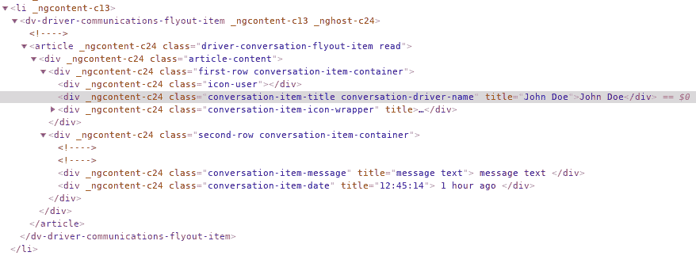

# 无框架 Web 开发

> 原文：<https://dev.to/misomir/frameworkless-web-development-3n2h>

> **TL；DR:** 不使用框架进行 web 开发从来没有这么简单过。如果你不想读太长的介绍，直接跳到[无框架](#frameworkless)部分，看看如何不使用框架来创建可重用的组件，或者更好地说，如何创建新的 HTML 元素。

新的。闪闪发光。现代。新鲜。最近的。臀部。很快。英寸

作为一个人，你会被新事物所吸引，这在你生活的每一部分都可以看到。你可能在口袋里有一个盒子，你现在用它来做任何事情，浏览网页，拍照，记笔记，跟踪这个和那个(有人用它来跟踪你，但那是另一回事)，保持联系，同时变得与人疏远，有时，只是有时你像最初打算的那样使用它来接电话。但是等等，有一个新的口袋盒子(名字取自[诚实的手机广告](https://www.youtube.com/watch?v=75gwlQlMLbk))，刚刚发布，它的名字中有一个更高的数字，它的价值相当于某人一个月的工资(或者在某些国家相当于某人 4-5 个月的工资)。你不能插上耳机，但是，嘿，你在屏幕上得到一个缺口。哇，一个[缺口](https://www.kickstarter.com/projects/charleswongzx/notch-the-only-notch-for-your-devices)！他们卖给你一些你不需要也没有要求的东西和功能，不知何故，他们通过发明一些听起来朗朗上口的新的愚蠢的名字来让你对他们的产品感兴趣。无限显示之类的名称。接受 Infinity Display 这样的名字，并把它作为新手机的优势和卖点之一，你应该有多傻？你可以清楚地看到显示屏的尽头，在那里，在手机的边缘，它不会以任何方式走向无限，除了价格。

你愿意付出大量金钱来换取失去你的隐私和时间，只是为了不感到害怕错过新的流行的东西。你付出的是即使属于你也无法定制的东西。嗯，你可以把带耳朵的硅胶外壳放在上面，这是一种定制，但你不能删除它附带的臃肿软件。如果你买了一套公寓，却不能扔掉不用的沙发、几把椅子、灯具和衣柜，你会有什么反应？是的，新手机可能有几个好处。但是，你难道不怀念过去的日子吗？那时你不必查看突然出现的每一个通知，不必拍下你吃的每一顿饭的照片，也不必即时获得每一条新闻。

你，作为一个人，变得越来越懒，这很糟糕。以汽车为例。曾几何时，你不得不放下手中的东西，手动打开行李箱。不仅如此，曾经有一段时间，你必须拿一把钥匙，把它放在点火锁上，然后启动汽车。或者更糟糕的是，你不得不实际驾驶你的车，并意识到你周围的环境和交通流量。但与此同时，有些事情发生了变化，而且仍在变化。你有遥控钥匙，而不是把钥匙插进门锁。但是你懒于按遥控钥匙上的按钮，所以现在有了无钥匙进入。真的需要在后备箱下晃脚才能打开吗？空气悬架、电子驻车制动、坡道起步辅助、起停系统、车道辅助、交通标志摄像头、盲点传感器、自适应巡航控制、倒车摄像头、360 度视角、摄像头和传感器、驾驶辅助、碰撞缓解系统、自动泊车汽车、自动驾驶汽车等。你要这些东西是因为你懒，还是汽车制造商强加给你的，让你懒？

你真的需要每隔几年给某人几万欧元甚至更多的钱来买一辆新车，用来从 A 地到 B 地吗？我知道你不能比较，比如说梅赛德斯-奔驰和达契亚，即使他们都使用雷诺的引擎。但问题是，花这么多钱买一堆你一开始就不需要的传感器值得吗？什么时候开始开关挡风玻璃雨刷变得如此痛苦，所以你需要雨水传感器？是的，汽车中有一些新的东西，或多或少是有帮助的，但最终它更难、更复杂、维护更昂贵，并且有越来越多的东西可能出错。难道你不怀念过去驾驶汽车并控制它，而不是电脑的日子吗？或者也许你等不及自动驾驶汽车，所以你可以在开车的时候盯着你的口袋盒子，嗯，不开车，不如说坐在车里？

## 框架

自从你患上了[闪亮物体综合症](https://www.quora.com/Whats-shiny-object-syndrome)，有了 [FOMO](http://time.com/4358140/overcome-fomo/) ，你变得越来越懒，一些公司和人很容易让你相信你需要一些你实际上并不需要的东西。假设你是一个懒惰的开发人员，你需要一些东西来减轻工作，他们创建了许多框架和库，告诉你不应该一天不使用它们。开发人员和其他人一样懒惰。我看到比尔·盖茨说过这样的话:“我选择一个懒惰的人去做一件艰难的工作。因为一个懒惰的人会找到一个简单的方法去做。”而懒惰是一件好事。但是也许懒惰有不同的类型。也许同一个人既懒惰又勤奋。说到学习，开发人员当然不会偷懒。他们需要学习所有这些架构、技术和语言。

你不应该重新发明轮子，你应该使用成熟的框架和库来实现特定的目的，你应该专注于业务逻辑，而不是实现别人已经实现的东西。那句话是真的，同时又不是真的。您可能不应该编写某些特定加密算法的实现。但是您应该能够编写简单函数来填充字符串。难道你不记得[一个开发者如何用 11 行 JavaScript](https://www.theregister.co.uk/2016/03/23/npm_left_pad_chaos/) 攻破 Node、Babel 和数千个项目？我相信你一定遇到过这样的情况，你得到了一个新项目。在那个项目中，使用了一些很酷的 HTTP 库。在使用这个库之前，你必须投入时间和精力通读 API，查看一些代码示例等等。你完成那个项目，开始另一个项目。其他项目有一些当时流行的其他 HTTP 库。你是做什么的？你必须再次投入时间和精力去学习做你已经知道如何做的事情，只是用不同的方式。框架也是如此。

学习新的、过度设计的方法来做同样简单的事情，显示数据(在大多数情况下，这是关于传递内容)并使用 web 浏览器从用户那里获取数据。在我看来，这是不断重复自己和重新发明轮子。学习 X 框架，它的组件，它的路由器，它的双向绑定，它的模板系统，它的 HTTP 调用方式。然后去另一个项目，学习如何使用 Y 框架，然后 Z 框架。不要被 Z framework 这个名字所迷惑，它肯定不是最后一个。然后您发现自己在考虑如何做最简单任务，如何处理点击事件。是`element.addEventListener('click', ...)`或者可能是`onclick`或者`ng-click`或者`(click)`或者`v-on:click`或者`@click`或者`onClick`？等号后面是否需要引号，是否需要花括号，参数值是什么，函数，函数引用，字符串？

有时候，懒惰和闪亮物体综合症会驱使你去做越来越多的工作。你懒于创建一些组件或路由器，因此你会投入时间和精力去学习和使用整个框架。但是，有一个新的框架，做同样的事情不同，但当然更好。它是这家公司制造的，跟踪人们在互联网上做什么，并将这些信息卖给广告公司，所以它一定很棒。澄清一下，我并不是说，某个框架不好只是因为某个公司创建了它。我想说的是，它是在一家盈利的公司中创建的，可能是为了他们拥有的特定用例，他们可以用它做他们想做的任何事情。他们可以停止工作，他们可以在版本之间进行突破性的改变，等等。你在某种程度上被困住了。

你最近读过关于前端技术的时事通讯吗？你会得到这样的头条新闻: *4 个你可以用 Framework.js CLI 做的了不起的事情*， *the-best-datatable:一个用于 Framework 的功能丰富的数据表组件 2* ， *some-content-loader:基于 SVG 的“加载占位符”组件*，*这个了不起的 XFramework 组件是你等待了一辈子的东西*。毕竟，你可能会问自己:“我在这里做错了吗？”

我需要在我的应用程序功能丰富的数据表，但我使用反应，而不是角度。我可以在 React 中使用角分量吗？也许有一个 React 组件，但它是否具有像 Angular 组件那样的所有功能。我一开始选择 React 是不是错了，我应该用 Angular 重写我的应用吗？但是 Angular 改变了它的代码库并引入了与旧版本不兼容的新版本。如果他们再做一次呢？如果 React 做了那样的事情怎么办？我还需要内容加载器。我可以在用 React 编写的应用程序中集成 Vue 组件吗？我看到关于 Vue 的帖子越来越多，我是不是应该把重点从 React 换成 Vue，完全忽略 Angular？但是骨干，淘汰赛，余烬，奥雷利亚，...？我应该换一个吗？显然，对特定框架工程师的需求很大。

如今，在你生活的所有领域都有一种叫做选择悖论的东西。软件开发也是如此。面对这么多可供选择的库、框架、工具包，你永远不会对某个选择真正满意。你总是会想，如果其他库更快，这是旧的，是更好的，因为 GitHub 上有更多的明星，是浏览器的框架更轻，等等。

> 你不需要框架。你需要一幅画，而不是一个框架。
> ——<cite>克劳斯·金斯基</cite>

当你第一次决定使用框架时，你会受到框架的边界(形状和大小)、属性和行为的限制。这种限制有时是好的，例如，当你的孩子想要一个新玩具时，你应该建立一个像价格限制这样的界限。但是当你创作一首歌的时候，你可能不应该限制和弦的数量。

当你使用框架的时候，你被限制在按照它的创造者希望你思考的方式去思考和行动。这对您来说可能没问题，但是在选择这样的框架之前，您应该三思。你喜欢框架的每个部分吗，它使用什么库，你应该花多少资源来学习它，你准备好面对它可能在几年内死亡或过时的事实吗，如果公司做出一些突破性的改变，你准备好每几个月更新到同一框架的新版本吗，你是根据你的需求选择框架还是根据你选择的框架来满足你的需求，你选择它只是因为现在每个人都在谈论它吗，如果需要，你准备好重写你的应用程序吗？

起初，框架增加了一些好处，但也增加了许多复杂性，正如当今业界最优秀的演讲者之一所说的那样[不要逃避复杂性，运行](https://www.youtube.com/watch?v=nZcLHkORdHE&t=1788)。一开始你可能认为框架让你更快，但这并不总是成功的必要条件。有时候，为了胜利，你需要专注和坚持，不要中途分心，就像[龟兔大战](https://www.youtube.com/watch?v=K4SsuprcggI)中显示的那样

为了证明我并不完全反对框架，我将向您推荐一个。 [Vanilla JS](http://vanilla-js.com/) ，它是干净且易于安装的框架，也是**目前最轻量级的框架**。

## 无框架

英语中后缀 *-less* 表示“没有”。所以，如果有人无所畏惧，这意味着他是勇敢的，没有恐惧。如果某个东西是无服务器的，这意味着没有服务器，除了，在现实中，有一个服务器，这个词是用来描述一个架构概念。无框架意味着没有框架，在这种情况下你应该[#使用平台](https://twitter.com/hashtag/UseThePlatform)进行 web 开发。

平易近人，多才多艺，高性能，声明性，基于组件，学习一次写在任何地方，速度和性能，令人难以置信的工具，受到数百万人的喜爱，代码生成，代码分割，更少的代码，模板，CLI，动画。这些是赞美一些框架和库的标语。你能猜出哪个框架使用哪个标语吗？听起来很相似，很有说服力，对吧？

> 公司对他们的框架特性的描述给出了很高的准确度，这些特性被认为是专门为 it 定制的，但实际上是模糊的和通用的，足以应用于广泛的其他框架。
> — <cite>文章第一句关于[巴纳姆效应](https://en.wikipedia.org/wiki/Barnum_effect)</cite> 的部分释义

所有那些已经存在并将消亡的前端框架、库和工具包都有一个共同点。你猜怎么着？JavaScript，不断发展的前端开发标准。框架和库不能为你做普通的旧 JavaScript 做不到的事情，浏览器不支持的事情或者没有 polyfill 的事情。大多数提到的流行语，如果不是全部，也适用于纯 JavaScript。

JavaScript 已经发展到拥有 Web 组件。创建新的可重用 HTML 标签的通用方法。如果做得好，你可以在任何地方使用这种新的 HTML 标签，而不需要依赖于特定的框架。如果你在一个框架中创建了组件`<a-menu></a-menu>`,你能在哪里重用它呢？只有在你的应用程序中，因为你不能改变菜单中的项目。但是如果你用一些接口(接受一些属性)来创建它，比如菜单项，那么你可以在相同框架下编写的其他应用程序中使用它。在另一个框架中使用一个框架中组件很难，甚至不可能。但是如果你用 web 标准创建它，比如像`<a-menu><a-menu-item></a-menu-item></a-menu>`，和`<select><option></option></select>`的工作方式一样，那么你就可以在任何你喜欢的地方用你的特定菜单项使用这样的组件。

我说你可以在任何地方使用新元素。嗯，那不完全是真的，但会是真的。您只能在支持 Web 组件标准的浏览器中使用它( [Shadow DOM](https://dom.spec.whatwg.org/) 、[自定义元素](https://html.spec.whatwg.org/multipage/custom-elements.html)、 [HTML 模板元素](https://html.spec.whatwg.org/multipage/scripting.html#the-template-element)和 [ES 模块](https://html.spec.whatwg.org/multipage/webappapis.html#integration-with-the-javascript-module-system))，对于其他浏览器，您可以使用 polyfills 来模拟标准实现。当浏览器实现支持时，他们会的，你可以简单地删除 polyfill，你知道没有什么比删除不必要的东西更好的了。最终，它将会出现在每一个浏览器中，没有哪个框架能够做到这一点。

我不会详细介绍 web 组件标准，你可以很容易地在 Web 上找到，我只给出简单的使用示例。我将通过编程方式创建元素，而不是使用 HTML 模板元素。所以我最终只使用自定义元素规范来定义新的 HTML 标签，方法是扩展现有的`HTMLElement`并创建影子 DOM 来封装新 Web 组件中的样式和标记。

您还记得上一次看到不以`npm install framework-with-bunch-of-dependencies-which-size-is-like-200MB`开头的前端代码是什么时候吗？这不一样，你需要的一切都已经在浏览器里了。你不需要 CLI，你不需要软件包管理器，或稍快软件包管理器，你安装使用以前安装的软件包管理器。你不需要众多复杂的配置文件，你不需要任何模块捆绑器，构建工具，预处理器，编译器等等。唯一的外部依赖是 Web 组件 polyfill loader 及其简单的`script`元素。它使用特征检测动态加载最小 polyfill 包，目的是使该示例能够在尚不支持标准实现的浏览器中工作。

```
<script src="https://unpkg.com/@webcomponents/webcomponentsjs@2.0.0/webcomponents-loader.js"></script> 
```

Enter fullscreen mode Exit fullscreen mode

如果你想使用组件，你可以像使用其他 HTML 元素一样使用它。像写标签一样写下它的名字，并定义想要的属性值。自定义 Web 组件的名称中必须包含破折号，以便浏览器可以将其与现有元素区分开来。因为自定义元素不能自结束，所以需要编写结束标记。

```
<cn-jokes headerText="Three random Chuck Norris jokes" count="3"></cn-jokes>
<cn-jokes></cn-jokes> 
```

Enter fullscreen mode Exit fullscreen mode

创建 Web 组件时，首先要做的是在`windows.customElements`中定义它。通过这种方式，您可以让浏览器了解新元素。元素是通过扩展包含特定 DOM API 的`HTMLElement`创建的。

```
window.customElements.define('cn-jokes', class extends HTMLElement {}) 
```

Enter fullscreen mode Exit fullscreen mode

类应该定义构造函数，并且在构造函数中对`super()`的调用必须在第一行进行。这不是每个组件都需要的，但是指示组件创建影子 DOM 可能是个好主意。通过使用 Shadow DOM，您可以从独立和自包含的 DOM 和 CSS 中获益。Shadow DOM 中的元素和样式不能被意外访问。例如，如果您的影子 DOM 中有`h1`元素，有人编写了自定义 CSS 来更改页面上`h1`元素的样式，您可以放心，这些更改不会影响组件中的样式。

```
constructor() {
    super()
    this.attachShadow({ mode: 'open' }) 
    this.jokesUrl = 'https://api.icndb.com/jokes/'

    this.shadowRoot.appendChild(this.createStyleTag())

    this.refreshBtn = document.createElement('button')
    this.refreshBtn.textContent = '\u21bb'

    this.h1 = document.createElement('h1')
    this.h1.textContent = this.getAttribute('headerText') || 'Random Chuck Norris joke'

    this.header = document.createElement('header')

    this.header.appendChild(this.h1)
    this.header.appendChild(this.refreshBtn)

    this.shadowRoot.appendChild(this.header)
} 
```

Enter fullscreen mode Exit fullscreen mode

你可以把构造函数想象成一个生命周期钩子，当元素被创建时，它被调用，这是创建组件结构的好地方。其他挂钩有`connectedCallback`和`disconnectedCallback`。每次在 DOM 中插入元素和从 DOM 中移除元素时，都会分别调用它们。它们是获取资源、附加事件监听器和进行清理的好地方。

```
connectedCallback() {
    this.refreshBtn.addEventListener('click', () => this.fetchAndDisplayResult())
    this.fetchAndDisplayResult()
}

disconnectedCallback() {
  this.refreshBtn.removeEventListener('click')
} 
```

Enter fullscreen mode Exit fullscreen mode

属性用于在自定义元素中发送数据。可以使用的另一个有用的回调(示例中没有显示)是`attributeChangedCallback`。每当静态`observedAttributes`中定义的 elements 属性被更新、删除或添加时，它都会被调用。如果你想从自定义元素发送数据，你可以使用[自定义事件](https://dom.spec.whatwg.org/#interface-customevent)

```
this.dispatchEvent(new CustomEvent('cn-jokes-load', {
    bubbles: true,
    composed: true,
    detail: {
        jokes: jokes
    }
})) 
```

Enter fullscreen mode Exit fullscreen mode

使用 CSS，可以像处理任何其他 HTML 元素一样处理 Web 组件的样式。元素的外部样式将覆盖阴影 DOM 中定义的样式。在 Shadow DOM 中，从外部对内部元素进行样式化可以使用 Web 组件中定义的 CSS 变量来完成。

```
body {
  font-family: Arial, Helvetica, sans-serif
}

cn-jokes {
  --quote-font-size: 19px;
}

cn-jokes:nth-of-type(2) {
  width: 50%;
  --header-bg-color: #FF1744;
  --quote-font-size: 12px;
} 
```

Enter fullscreen mode Exit fullscreen mode

元素内部的阴影 DOM 样式是由作用于它的 CSS 完成的。

```
createStyleTag() {
        const styleTag = document.createElement('style')
        styleTag.textContent = `
          :host {     
            display: block;
            box-shadow: 0 2px 2px 0 rgba(0,0,0,.14), 0 3px 1px -2px rgba(0,0,0,.2), 0 1px 5px 0 rgba(0,0,0,.12);
          }

          /* this is for browsers which does not support :host https://stackoverflow.com/questions/25468701/why-does-the-host-selector-only-work-in-chrome-with-platform-js#33475684 */
          cn-jokes { 
            display: block;
            -moz-box-shadow: 0 2px 2px 0 rgba(0,0,0,.14), 0 3px 1px -2px rgba(0,0,0,.2), 0 1px 5px 0 rgba(0,0,0,.12);
            -webkit-box-shadow: 0 2px 2px 0 rgba(0,0,0,.14), 0 3px 1px -2px rgba(0,0,0,.2), 0 1px 5px 0 rgba(0,0,0,.12);
            box-shadow: 0 2px 2px 0 rgba(0,0,0,.14), 0 3px 1px -2px rgba(0,0,0,.2), 0 1px 5px 0 rgba(0,0,0,.12);
          }

          header {
            align-items: center;
            background-color: var(--header-bg-color, #00B8D4);
            display: flex;
            flex-direction: row;
            justify-content: space-between;
            padding: 0 16px;
          }

          h1 {
            color: white;
            font-size: 18px;
          }

          button {
            background: none;
            border: none;
            border-radius: 50%;
            color: white;
            font-size: 24px;
            height: 32px;
            width: 32px;
          }

          button:hover {
            background-color: rgba(158,158,158,.5)
          }

          button:disabled {
            cursor: wait;
            -webkit-animation: rotation 1s infinite linear;
          }

          @-webkit-keyframes rotation {
              from {
                  -webkit-transform: rotate(0deg);
              }
              to {
                  -webkit-transform: rotate(359deg);
              }
          }

          blockquote {
            font-size: var(--quote-font-size, 14px);
            padding-bottom: 10px;
          }

          :focus {outline:none;}
          ::-moz-focus-inner {border:0;}
        `
        return styleTag
      } 
```

Enter fullscreen mode Exit fullscreen mode

[https://jsfiddle.net/9gkbqaL2/3//embedded/result,js,html,css//dark](https://jsfiddle.net/9gkbqaL2/3//embedded/result,js,html,css//dark)

当你创建自己的组件时，你不再需要 CSS 框架和库，你不需要 Bootstrap 组件及其 CSS 和 JavaScript。当使用 [CSS 灵活框布局](https://developer.mozilla.org/en-US/docs/Web/CSS/CSS_Flexible_Box_Layout)或 [CSS 网格布局](https://developer.mozilla.org/en-US/docs/Web/CSS/CSS_Grid_Layout)时，布局不需要 CSS 框架。此外，由于 CSS 样式的作用域在 Shadow DOM 中，所以您的选择器变得简单多了。你可以在样式中看到，我没有任何复杂的、嵌套的带有 id、类等的选择器。

当你创建自己的组件时，你应该停下来想想是否真的需要这个新组件。你真的需要一个新的按钮组件来包装已经可以按照你的意愿设计的`button`吗？

[](https://res.cloudinary.com/practicaldev/image/fetch/s--jxxFEk_a--/c_limit%2Cf_auto%2Cfl_progressive%2Cq_auto%2Cw_880/https://thepracticaldev.s3.amazonaws.com/i/ihjg9ophd380impxoj5q.png)

你可能会说它增加了更多的语义，但真的是这样吗？还是`button`带`class`属性。你应该利用现有的元素。当你可以使用[对话框元素](https://developer.mozilla.org/en-US/docs/Web/HTML/Element/dialog)时，你为什么要创建自定义对话框？这是非常好的 HTML。

```
<dialog>
  <header>Dialog header</header>
  <div>Dialog content</div>
  <footer>Dialog footer</footer>
</dialog> 
```

Enter fullscreen mode Exit fullscreen mode

当创建你自己的组件时，保持它的干净和简单。我知道 HTML 是计算机可读的，浏览器会非常有效地处理它，但是看到没有不必要的标记的干净的 HTML 不是很好吗？以这段代码片段为例

[](https://res.cloudinary.com/practicaldev/image/fetch/s--grU9x9uM--/c_limit%2Cf_auto%2Cfl_progressive%2Cq_auto%2Cw_880/https://thepracticaldev.s3.amazonaws.com/i/d73vezvnzs1ov5mdyw8u.png)

你真的需要`li`作为一个容器，然后`dv-driver-communications-flyout-item`作为一个容器，然后`article`作为一个容器，然后`div.article-content`作为另一个容器吗？

我知道，创建像数据表这样复杂的组件会变得很难，但是这种东西在任何其他框架中也是复杂的，因此你使用其他人创建的组件。你可以使用在 https://www.webcomponents.org/已经存在的网络组件。有时候你只需要添加一些依赖关系。

## 你的选择

当一些公司发布带有 10 个摄像头的智能手机时，有人会想:“这是我一生都在等待的智能手机的功能，我必须购买它，而且我真的需要新型号的 32GB 内存”。当一些公司生产的汽车在室内环境照明方面多了一种颜色选择，或者在调节按摩座椅方面多了一种模式时，有人会想:“我这辆开了三年的车没用了。我想开着那种新的玫瑰色的车，同时在座位上感受一百只按摩的手。这种类型的人只想在每件事上都成为第一，这一点也不坏。公司的存在是因为人们想要最新最好的东西。

当一些公司发布新的框架时，会有人愿意学习和使用它。同样，我不是说你不应该学习和使用框架。在某些情况下，框架是很好的选择。如果你是一个小的初创企业，需要一些快速的原型制作，你知道应用程序将持续几个月，而不是你应该使用的框架。但是如果你是一个公司或者一个人，创造的东西是持久的，不会有很大的变化，那么你可能应该控制你的工作，尽量减少可能导致问题的依赖，即使这意味着你将创建某种内部框架。

在阅读了 Web 组件之后，你可能会说 Web 组件是一种崭新的技术。答案可能是肯定，但这是标准技术。它不会像其他库和框架那样经常改变，也不会有突破性的改变。你可能会说只学一种东西并坚持标准会很无聊。也许吧，但是无聊会让你晚上睡不着。无聊能让你有更多的时间和家人朋友在一起，做一些事情而不是学习每一个新的框架。当使用“旧的”标准技术时，这是稳定的和经过验证的，具有已知的限制和可能性，您不必担心某些东西会很容易损坏。你可能会说这会有很多代码，这是真的，但你是专业的问题解决者，你会找到一种方法来完成这一切，并在做的时候找到乐趣。