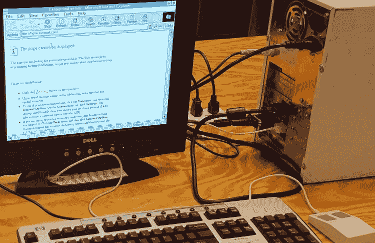
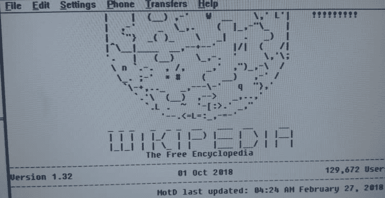
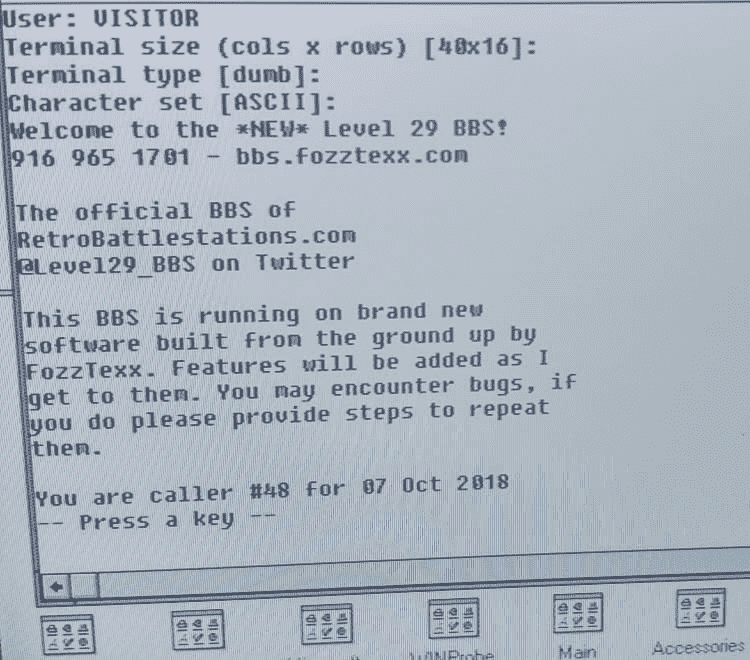
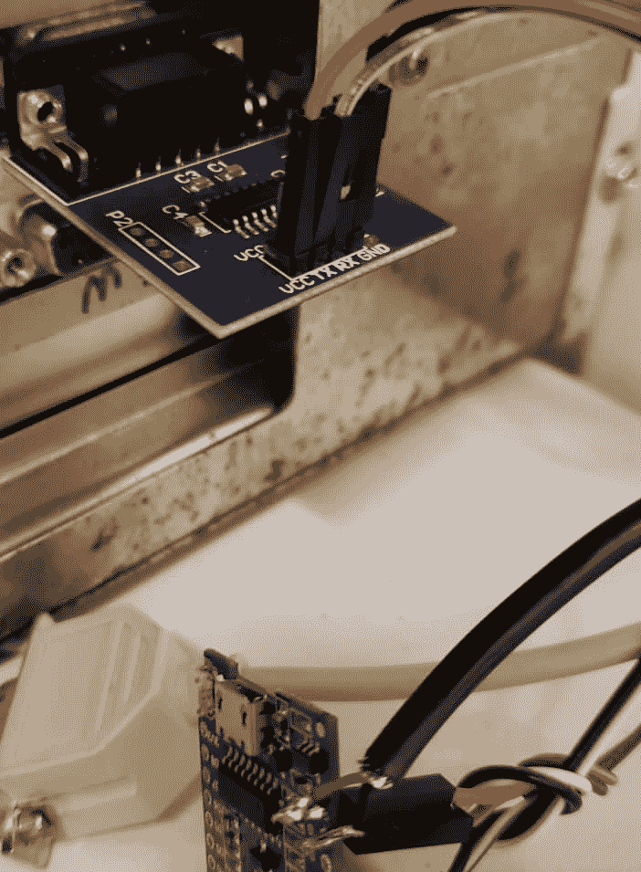
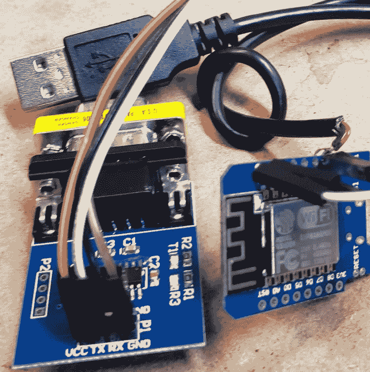
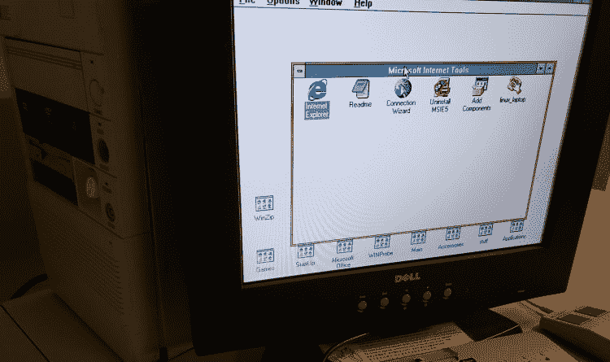
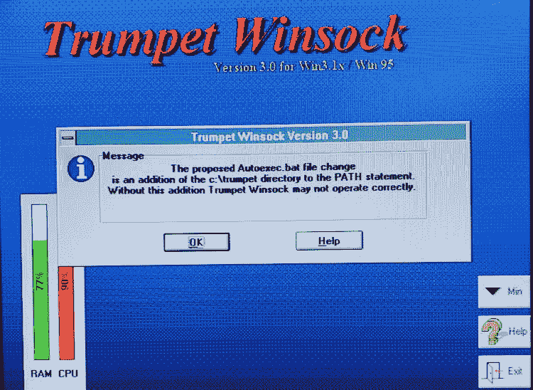
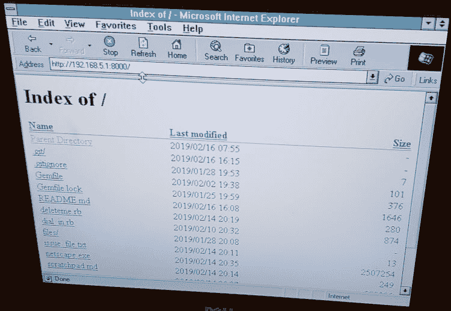
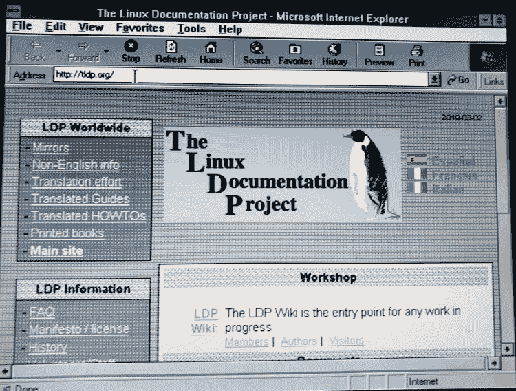

# 老式计算机修复，第二部分

> 原文：<https://dev.to/rickcarlino/vintage-computer-restoration-part-ii-2i4g>

[](https://res.cloudinary.com/practicaldev/image/fetch/s--QoDswaFC--/c_limit%2Cf_auto%2Cfl_progressive%2Cq_auto%2Cw_880/https://rickcarlino.cimg/2019/386_ii/20190216_161953.jpg)

在我的上一篇文章中，我在一台古老的 386 台式机(运行 Windows 3.1)和一台运行 Xubuntu 18 的现代笔记本电脑之间设置了串行文件传输。第一部分在处[可用。](///2019/01/01/vintage-computer-restoration-part-i-html.html)

一旦我的 386 开始从一台主机笔记本电脑上接收文件，我就准备好继续我的上网目标了。

在安装了正确的软件包(谢谢，互联网存档)后，我在机器上运行了一些基于网络的实验。我最终实现了连接到面向公众的服务器(HTTP 和 Telnet)的目标，同时也在这个过程中学到了很多东西。这是我第一次深入复古计算的世界，我玩得很开心！

下面我将记录我是如何将 386 连接到网络的。

# 实验一:Telnet/TCP

[](https://res.cloudinary.com/practicaldev/image/fetch/s--JyVzgg_S--/c_limit%2Cf_auto%2Cfl_progressive%2Cq_auto%2Cw_880/https://rickcarlino.cimg/2019/386_ii/20181007_154127.jpg)

当我开始这个项目时，我认为在旧机器上设置 TCP 网络是一个挑战。为了快速地进行试验，我决定追求一个不太雄心勃勃的目标，即通过串行线路连接一个 TCP 套接字。这将把我的机器变成一个终端模拟器，并完全避免 Windows 3.x 网络的问题。

[](https://res.cloudinary.com/practicaldev/image/fetch/s--3UQy3FUV--/c_limit%2Cf_auto%2Cfl_progressive%2Cq_auto%2Cw_880/https://rickcarlino.cimg/2019/386/serial.jpg)

我的设置很简单:在串行转 USB 电缆的一端，我有一台现代的 Linux 笔记本电脑。我的 386 机器将位于电缆的另一端，并使用现代笔记本电脑作为代理(主要是为了避免 Windows 3.x 中的本机 TCP 设置)。

为了方便两台机器之间的数据传输，我使用了流行的 [TCPSer](https://github.com/FozzTexx/tcpser) 应用程序，它充当 TCP 套接字(Telnet)和串行端口之间的桥梁。

[](https://res.cloudinary.com/practicaldev/image/fetch/s--i44u135_--/c_limit%2Cf_auto%2Cfl_progressive%2Cq_auto%2Cw_880/https://rickcarlino.cimg/2019/386_ii/20181007_153053_HDR.jpg)

这个过程比我预想的还要简单。在一个下午的过程中，我能够访问几个 [BBS 系统](https://en.wikipedia.org/wiki/Bulletin_board_system)，甚至是维基百科的 [Telnet 版本](https://meta.wikimedia.org/wiki/Telnet_gateway)。一个蓬勃发展的复古爱好者社区保持着 BBS 的传统，即使在 2019 年也是如此。

我不会对设置过程说太多，因为有很多好的教程已经涵盖了这个主题。

# 实验二:串口转 WiFi 适配器

我尝试的另一个实验是将我的 386 的串行端口连接到一个 [ESP-8266](https://www.sparkfun.com/products/13678) 微控制器。这与使用 TCPSer 的结果基本相同，但是使用了紧凑的微控制器而不是完整的 Linux 桌面。

[](https://res.cloudinary.com/practicaldev/image/fetch/s--hc-8SqlN--/c_limit%2Cf_auto%2Cfl_progressive%2Cq_auto%2Cw_880/https://rickcarlino.cimg/2019/386_ii/20190120_184006.jpg)

出厂默认 ESP 固件有许多 [Hayes 兼容](https://en.wikipedia.org/wiki/Hayes_command_set) AT 命令，允许用户打开任意 TCP 套接字，然后通过 TTL 引脚读取它们。通过将 [MAX-3232 板](https://www.amazon.com/NulSom-Inc-Ultra-Compact-Converter/dp/B00OPU2QJ4/ref=sr_1_1?keywords=max3232&qid=1551407183&s=gateway&sr=8-1)焊接到 ESP，我能够将 TTL 信号转换为 RS-232，并将 ESP 直接插入 386 的串行端口，从而消除了对实验一中提到的主机笔记本电脑的需求

该模块很快连接到我的家庭 WiFi，我可以使用默认的 ESP 命令打开连接。我以为这个过程会更复杂，但它真的就像把 MAX-3232 焊接到一个静电除尘器上一样简单。

[](https://res.cloudinary.com/practicaldev/image/fetch/s--uJ2Z1Nxx--/c_limit%2Cf_auto%2Cfl_progressive%2Cq_auto%2Cw_880/https://rickcarlino.cimg/2019/386_ii/20190302_175320.jpg)

有趣的事实:我相当肯定调制解调器在 CPU、存储和内存方面比它所连接的台式机更好。

# 实验三:全 TCP 栈

在通过两个不同的渠道连接到 BBSes 和 Telnet 服务之后，我已经准备好迎接更具挑战性的任务了。我的目标是在 Windows 3.1 上运行一个成熟的 TCP 栈，这样我就可以做更多的事情，而不仅仅是 BBSing。为此，我做了各种尝试，让我的 386 以为串行电缆另一端的现代笔记本电脑是一个调制解调器。

我在 Sega Dreamcast 社区发现了一篇有趣的文章，甚至想到要写一个 T2 定制脚本来模拟调制解调器和拨号 ISP。这和预期的一样困难。由于 4 兆字节的内存限制，那个时代的许多浏览器根本无法在机器上加载，理由是内存不足。在加载 Netscape 和 Opera 的尝试失败后，我最终安装了 Internet Explorer 5。考虑到这三种浏览器的历史，这让我大吃一惊。

[](https://res.cloudinary.com/practicaldev/image/fetch/s--BZkPTlfJ--/c_limit%2Cf_auto%2Cfl_progressive%2Cq_auto%2Cw_880/https://rickcarlino.cimg/2019/386_ii/20190302_171425.jpg)

在[查阅互联网](https://retrocomputing.stackexchange.com/questions/9018/tcp-over-rs-232-with-windows-3-1-and-internet-explorer-5-dialer)后，我在目标上安装了小号 Winsock，并在主机上开始配置过程(一台运行 Xubuntu 18 的现代笔记本电脑)。小号 Winsock 是在 Windows 3.1/Windows 95 机器上使用的流行软件包。

## 配置主机:SLIP 和 Serial

正如在[第一部分](///2019/01/01/vintage-computer-restoration-part-i-html.html)中提到的，两台机器之间的物理层是一个 USB 转串行适配器。没什么新鲜的。

对于数据链路层，我选择了 [SLIP](https://en.wikipedia.org/wiki/Serial_Line_Internet_Protocol) ，因为我没有耐心去处理更高级的 [PPP](https://en.wikipedia.org/wiki/Point-to-Point_Protocol) 协议。虽然没有 PPP 那么优雅，但事实证明它更容易管理，并且得到了小号的良好支持。

[](https://res.cloudinary.com/practicaldev/image/fetch/s--TtqMiYfm--/c_limit%2Cf_auto%2Cfl_progressive%2Cq_auto%2Cw_880/https://rickcarlino.cimg/2019/386_ii/20190214_204425.jpg)

为了在两台机器之间创建链接，我在链接的 Linux 端使用了 [slattach](https://linux.die.net/man/8/slattach) 。`slattach`是一个将标准串行线置于“网络模式”的工具(在我的例子中是 SLIP):

```
slattach -s 19200 -p slip -d /dev/ttyUSB0 
```

Enter fullscreen mode Exit fullscreen mode

这些旗帜如下:

| 旗 | 意义 |
| --- | --- |
| `-s 19200` | 速度/波特率(我的机器处理数据的速度不能超过 19200 波特) |
| `-p slip` | 将线路协议设置为`slip`，而不是`cslip`或`ppp`。 |
| `-d` | 启用调试输出。 |

在我的串行线路配置了 SLIP 之后，我就可以开始进行 IP 配置了。

## 配置主机:IP 表

一旦调用了`slattach`，您就可以通过运行`ifconfig sl0` :
来验证连通性

```
 sl0: flags=4240<POINTOPOINT,NOARP,MULTICAST> mtu 296
        slip txqueuelen 10 (Serial Line IP)
        RX packets 0 bytes 0 (0.0 B)
        RX errors 0 dropped 0 overruns 0 frame 0
        TX packets 0 bytes 0 (0.0 B)
        TX errors 0 dropped 0 overruns 0 carrier 0 collisions 0 
```

Enter fullscreen mode Exit fullscreen mode

`slattach`已经创建了适当的网络接口，但是我们仍然需要配置网络接口并将其启动:

```
sudo ifconfig sl0 192.168.5.1 netmask 255.255.255.0 up 
```

Enter fullscreen mode Exit fullscreen mode

在我的例子中，`192.168.5.1`没有被使用。您的本地网络可能有所不同。

为了验证一切正常，我再次运行了`ifconfig sl0`:

```
sl0: flags=4305<UP,POINTOPOINT,RUNNING,NOARP,MULTICAST> mtu 296
        inet 192.168.5.1 netmask 255.255.255.0 destination 192.168.5.1
        slip txqueuelen 10 (Serial Line IP)
        RX packets 0 bytes 0 (0.0 B)
        RX errors 0 dropped 0 overruns 0 frame 0
        TX packets 0 bytes 0 (0.0 B)
        TX errors 0 dropped 0 overruns 0 carrier 0 collisions 0 
```

Enter fullscreen mode Exit fullscreen mode

我的 Linux 笔记本电脑现在可以通过串行线路传输 IP 数据包了。

## 配置小号

现在主机笔记本已经配置了 SLIP 和网络接口，我需要设置小号。

小号是 90 年代中期流行的 Windows 共享软件 TCP 栈。请注意，如果您计划使用该软件超过三十天，您必须[从作者](http://www.trumpet.com.au/)处购买许可证。

我使用了以下配置值:

| 环境 | 价值 |
| --- | --- |
| IP 地址；网络地址 | 我使用了`192.168.5.2`，但是您的 IP 地址可用性可能不同 |
| 网络掩码 | `255.255.255.0` |
| 名称服务器 | 不确定的话可以用`8.8.8.8`。我注意到与我的 ISP 名称服务器相比，延迟增加了。 |

同样重要的是**确保您没有使用 PPP** 。

正确配置后，您应该能够在网络的任何一端运行`ping`并获得响应。只是为了好玩，我运行了一个小型 HTTP 服务器，看看 IE5 是否会加载它(它加载了):

[](https://res.cloudinary.com/practicaldev/image/fetch/s--hUobdc8K--/c_limit%2Cf_auto%2Cfl_progressive%2Cq_auto%2Cw_880/https://rickcarlino.cimg/2019/386_ii/20190216_163441.jpg)

此时，我能够在两台机器之间发送 TCP 数据包，但是我无法访问互联网。为了与外界联系，我需要设置[网络地址转换](https://en.wikipedia.org/wiki/Network_address_translation)，这就是 386 个数据包将如何以我的笔记本电脑作为中介传播到外界。

## (再次)配置主机

继续之前，请确保在主机上启用内核级 IP 转发:

```
sudo bash -c "echo 1 > /proc/sys/net/ipv4/ip_forward" 
```

Enter fullscreen mode Exit fullscreen mode

您需要在每次启动时运行上面的命令。

之后，您需要运行`iptables`来路由出站流量。在我的例子中，出站网络接口是`wlp1s0`，但你的可能不同(特别是如果你使用以太网而不是 WiFi)。

您可以通过运行`ifconfig`来确定您的出站网络接口。

```
# Change the value of `wlp1s0` to the correct interface!!
sudo iptables --table nat --append POSTROUTING --out-interface wlp1s0 -j MASQUERADE
sudo iptables --append FORWARD --in-interface sl0 -j ACCEPT 
```

Enter fullscreen mode Exit fullscreen mode

我现在可以上网冲浪了！

[](https://res.cloudinary.com/practicaldev/image/fetch/s---Ll5XDOD--/c_limit%2Cf_auto%2Cfl_progressive%2Cq_auto%2Cw_880/https://rickcarlino.cimg/2019/386_ii/20190302_183131.jpg)

## 我学到了什么

**有趣的事实:**虽然 SLIP 协议没有正式的 IETF 标准，但它*有[正式的非标准](https://tools.ietf.org/html/rfc1055)由几行 C 代码组成。*

虽然我没有时间实现在目标设备上运行 web 服务器的扩展目标，但我确实很高兴重温了童年时代的技术。我能够对许多日常看不到的主题(如`SLIP`、`iptables`、`xmodem`以及 OSI 模型的第 1 层和第 2 层)进行记忆更新。我还在现代网络上看到了一个夸张的膨胀视角。谷歌等热门网站几乎无法使用。在现代设备上快速加载的未压缩图像可能需要 10 分钟才能加载到受限设备上。

另一方面，仍然有一些网站(比如[这些](///2018/07/11/fabulous-text-only-websites-2018-edition-html.html))表现得出奇的好。TLDP.org[加载速度很快，渲染方式与现代主机几乎相同。](http://tldp.org/)