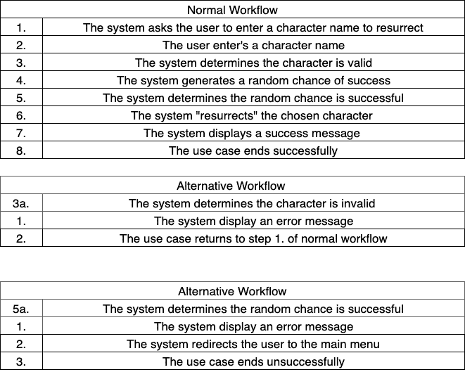

# 为什么您应该浪费时间创建用例

> 原文：<https://dev.to/jessicabetts/why-you-should-waste-your-time-creating-use-cases-1b8p>

[](https://i.giphy.com/media/aNqEFrYVnsS52/giphy.gif)

想象一下，你刚刚想出了一个最有创意的新应用程序，可以把你的猫喵喵的叫声翻译成英语！很自然，你想跑到电脑前开始编码。停下来。走，不要跑。如果你在游泳池附近跑步，救生员会指导你减速，寻找潜在的危险，并在跳入之前检查深度。你应该以同样的方式处理编码。走，不要跑。初级开发人员通常是如何开始新项目的。对于我们许多人来说，作为开发人员的 ***乐趣*** 实际上是编写代码。然而，随着经验的积累，你也应该通过在设计阶段投入更多的精力来改进你的工作流程。具体来说，我挑战你，在你开始快速打字之前，为你的应用程序创建**用例**..

# 但是什么是用例呢...

[](https://i.giphy.com/media/CPskAi4C6WLHa/giphy.gif)

简单地说，在编程中，用例显示了软件特定功能的事件流。这是一个循序渐进的图表，描绘了尝试执行一项行动的不同结果。

# 那么我们怎么做呢？

[](https://i.giphy.com/media/kQOxxwjjuTB7O/giphy.gif)

### 用例组件

```
Name:
Actors: Who or what is acting upon the system(program), often a User
Description: This use case describes how ….
Pre-conditions: What must be in place before this use case can happen
Normal Workflow: Steps of events that lead to success
Alternate Workflows: Alternate step of events (may result in failure or redirect)
Additional rules: Added conditionals
Post-conditions: What a success looks like 
```

每一步都必须是可测试的！如果没有，就不要在用例中包含这个步骤。

### 举例:

在 Flatiron School 的第一个模块结束时，所有学生都被分配了一个合作伙伴，并被要求创建一个与 API 交互的命令行界面应用程序。随着项目截止日期的临近，我和我的合作伙伴纳特·里德开始测试我们的[权力的游戏](https://github.com/jessicabettsftw/Game-of-Thrones-CLI)(选择你自己的冒险)CLI。我们给游戏增加了一些功能，比如选择一个角色，参加维斯特洛的活动，通过向光之王祈祷来复活死去的角色。这是一个复活角色的用例的例子…

* * *

名称:复活一个角色

参与者:用户

描述:
这个用例描述了一个用户如何成功复活一个角色

先决条件:
用户必须选择一个有效的角色来扮演
用户必须在主菜单区输入“复活”

[](https://res.cloudinary.com/practicaldev/image/fetch/s--pYJET47q--/c_limit%2Cf_auto%2Cfl_progressive%2Cq_auto%2Cw_880/https://thepracticaldev.s3.amazonaws.com/i/zm9vekdtmicubz34mcg4.png)

附加规则:

第三步。玩家希望复活的角色必须
1 .存在
2 .不是他们自己的角色
3 .已经“死亡”

第五步。随机机会值必须达到某个阈值
例如:6(满分为 10)

后期条件:用户成功复活了一个角色

# 但是这有什么大不了的？

[](https://i.giphy.com/media/2Yla2l9s5livOfmgrp/giphy.gif)

在学校里，我们不会像在工作场所那样经常完成一个项目或任务。许多公司已经建立了工作流程和项目管理策略。我们需要习惯于用设计思维来思考代码。通常一个软件是给客户的产品，而不是个人使用的。通过创建用例，您正在收集功能需求。这使您能够与客户合作，实现他们想要的产品。

**让编码更容易**
用例为应用程序的每个部分应该如何工作设定了路线图。提前计划将有助于指导您开始编写代码。在《权力的游戏》项目中，我们会遇到一个新功能，头脑风暴我们希望如何实现该功能，并经常在这个过程中提出越来越多的新功能。最终，我们缺乏计划导致思维混乱，生产力下降。

**预见边缘案例/缺失需求**
为这个博客创建复活用例，展示了这个工具如何帮助您识别边缘案例的清晰例子！在提交时，我们没有测试所有可能的输入选项。我们的项目不是测试你是否在自己身上尝试复活动作。因为我们决定为所有可能的情况定制消息，所以我们需要处理这个最初被遗忘的新的替代工作流。

**让测试更容易**
测试代码有许多不同的方法。其中一种方法是通过测试用例。如果在编写测试用例之前已经创建了用例，那么可以更快地编写测试功能，因为您已经知道每个操作的结果应该是什么。这将加速测试阶段。

### 你可能选择不写用例的原因:

[](https://i.giphy.com/media/J0pNyPyK1vgGY/giphy.gif)

如果你的项目很小，你可能不想花时间在设计上。

**不是你的工作**
当你在一个团队中工作时，成员可能有特定的角色。开发人员并不总是出现在整个设计过程中，如果有的话。在这种情况下，专注于设计可能不是你的工作。你的职责可能是实现提供给你的架构。(不管怎样...花点时间想象一下，如果设计团队已经向您提供了用例，那么实现这个结构将会变得多么容易)

# 相加(mation)

游泳池边潮湿时很滑。当您遗漏需求或未能提前计划时，代码也会变得不可靠。随着您的应用程序变得越来越大和越来越复杂，考虑使用用例作为工具来帮助设计您的项目。从长远来看，它会使这个过程变得更容易！

[](https://i.giphy.com/media/l3Ucjd2CxLydBTjjy/giphy.gif)