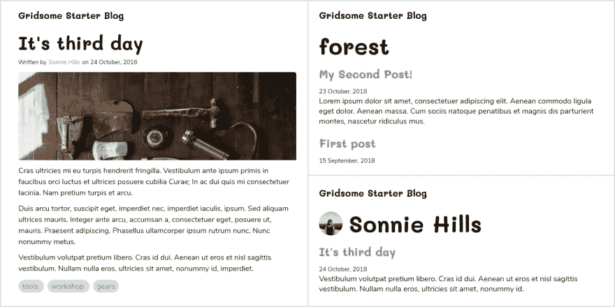

# Gridsome 得到了分类学。那是什么意思？

> 原文：<https://dev.to/mittalyashu/gridsome-got-taxonomy-what-does-that-mean-2mpg>

> GraphQL 模式中的所有引用都是单向关系。这个版本为所有内容类型引入了一个名为`belongsTo`的新字段。该字段将列出引用当前节点的所有节点，这对于创建分类页面等非常有用。该字段也可以接受与集合相同的参数。*来源: [Gridsome v0.5](https://gridsome.org/blog/2019/02/19/gridsome-v05)*

还在想那是什么意思吗？🤔

简而言之，不用手动创建所有的作者和标签页面。

*   `src/pages/author/tommy`
*   `src/pages/tag/vuejs`
*   `src/pages/tag/getting-started`
*   `src/pages/author/mittalyashu`
*   `src/pages/author/hvedvik`
*   `src/pages/tag/gridsome`

使用这个叫做**分类法**的新特性，你可以通过定义一些东西来自动创建这些页面。

听起来很有趣？让我们开始吧。

🚧**剧透提示:**你现在可以通过[克隆这个分支](https://github.com/gridsome/gridsome-starter-markdown-blog/tree/feat/authors-and-categories)来试试。

或者，你可以跟着我一步一步地学习。

为了让它与你更相关，我们将以这个[源代码](https://github.com/gridsome/gridsome-starter-markdown-blog)为基础开始。在这个例子中，我们将**创建两个内容类型**，一个`Author`和一个`Tag`类型。我们在`gridsome.config.js`文件中这样做，通过创建一个作者集合。

```
{
      // Add Authors collection
      use: '@gridsome/source-filesystem',
      options: {
        path: 'authors/*.md',
        typeName: 'Author',
        route: '/author/:id'
      }
    } 
```

接下来，为了将`Author`和`Tags`与我们的`Posts`链接起来，我们需要使用`refs` 创建一个**引用。** 

```
refs: {
  // Add a reference to Author GraphQL collection
  author: 'Author',

  // Auto create a collection for all categories
  categories: {
    typeName: 'Category',
    route: '/category/:slug',
    create: true
  }
} 
```

为了得到一个要点，这就是你的`gridsome.config.js`文件应该看起来的样子。正如你所看到的 **`Author`系列，看起来与`Post`系列**完全一样，唯一的区别在于`path`、`typeName`和`route`。

我们不必在`refs`之外创建一个单独的集合，因为标签是文章的一部分。*当然，你可以自定义，在这里你可以在 ref 之外定义标签集合来创建一个单独的标签集合。*T3】

```
module.exports = {
  siteName: `Gridsome Starter Blog`,
  titleTemplate: `%s - Gridsome`,

  plugins: [
    {
      // Add Post collection
      use: '@gridsome/source-filesystem',
      options: {
        path: 'blog/*.md',
        typeName: 'Post',
        route: '/:slug',
        refs: {
          // Add a reference to Author GraphQL collection
          author: 'Author', 

          // Auto create a collection for all categories
          tags: { 
            typeName: 'Tag',
            route: '/tag/:slug',
            create: true
          }
        }
      }
    },
    {
      // Add Authors collection
      use: '@gridsome/source-filesystem',
      options: {
        path: 'authors/*.md',
        typeName: 'Author',
        route: '/author/:id'
      }
    },
  ]
} 
```

接下来，在库的根目录下，**创建一个名为`authors`** 的目录，创建不同作者名的`markdown`文件，并添加一些它们的图片*(可选)*。

在存储库的根目录下创建作者目录并不是强制性的，这只是我们在`gridsome.config.js`中定义的方式。

```
.
├─ authors
│  ├─ john-deo.md
│  ├─ marina.md
│  ├─ sonnie-hiles.md
│  └─ images
│     ├─ image-1.jpg
│     ├─ image-2.jpg
│     └─ image-3.jpg
├─ blog
.
.
.
├─ README.md
├─ gridsome.config.js
└─ package.json 
```

author 的每个 markdown 文件的格式可以是这样的，您可以在`front-matter`中添加额外的属性和值。

```
---
id: john-doe
title: John Doe
image:img/image-3.jpg
---

Lorem ipsum dolor sit amet, consectetur adipisicing elit. Saepe sunt quos rerum culpa! Non voluptates nesciunt, nemo, omnis dolor temporibus repellat ab magnam laboriosam maiores ullam, distinctio mollitia quia vel! 
```

最后，是时候给我们的博客文章添加一些关于作者的信息和标签了。

打开任何文件，用以下字段更新前面的内容

```
tags: ["forest", "tree", "sunset", "rocks"]
author: marina 
```

交叉手指🤞🏻，Gridsome 应该**成功编译代码**并在`localhost:8080`输出结果，这里是预览😎。

[](https://res.cloudinary.com/practicaldev/image/fetch/s--yCeyRYXY--/c_limit%2Cf_auto%2Cfl_progressive%2Cq_auto%2Cw_880/https://thepracticaldev.s3.amazonaws.com/i/8w9tsvxbv2rl3hypn9hq.png)

。
。
。

[](https://i.giphy.com/media/8m1T2fkE3OzNBpcXeM/giphy.gif)

跟我念*“我，pinky 和舒雅·米塔尔承诺，尝试 Gridsome 的这个新分类功能”*。😉

等等等等。这不是故事的结尾，还有更多，Gridsome 已经在 0.5 版本中发布了许多其他令人敬畏的功能供您尝试，请查看这篇完整的文章 [Gridsome v0.5](https://gridsome.org/blog/2019/02/19/gridsome-v05) 以了解更多信息。

### 引用

*   [网格体](https://gridsome.org/)
*   [Gridsome starter markdown 博客](https://github.com/gridsome/gridsome-starter-markdown-blog)

✋🏻我正在创建一个 **Gridsome casper 免费主题**，如果你能通过让[成为我的搭档](https://www.patreon.com/mittalyashu)来帮忙，我将不胜感激。

谢谢