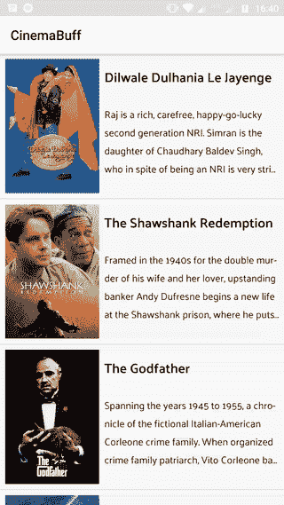

# 使用 Koin 的 Android 依赖注入

> 原文：<https://dev.to/levimoreira/android-dependency-injection-with-koin-i34>

依赖注入，或称 DI，是一种历史悠久的设计模式/技术。在你的职业生涯中，你可能听过几次，它总是出现在开发 Android 应用程序的“良好实践”列表中，但这是为什么呢？让我们先了解一下什么是 DI，以及它在 Android 中是如何实现的，然后我们可以看看 Koin 是如何实现这个想法的。

### 什么是 DI？

依赖注入包括简单地提供对象所需的依赖，而不在对象本身内创建它们。顾名思义，我们将以某种方式将这种依赖注入到对象中。我知道，这听起来有点混乱，让我们看一个例子:

假设您的应用程序中有一个存储库类，您可以使用它来访问您的 api 服务。你可以这样创建你的类:

```
class MovieRepositoryImpl() :
    MovieRepository {
    val tmdbService = TmdbApi()

    override fun getMovies(page: Int): Single<TopMovieListResponse> {
        return tmdbService.getTopMovies(page = page)
    }
} 
```

Enter fullscreen mode Exit fullscreen mode

然而，这在服务类和存储库之间强加了一个强耦合，您正在存储库中创建服务。你将如何对存储库进行单元测试？您不能只测试存储库，因为服务就在那里，您不能控制它的行为。依赖注入有利于并帮助我们建立一种思维模式来编写可测试的代码。我们可以在创建存储库时修改代码并提供服务依赖，通过构造函数:

```
class MovieRepositoryImpl(val tmdbService : TmdbApi) :
    MovieRepository {

    override fun getMovies(page: Int): Single<TopMovieListResponse> {
        return tmdbService.getTopMovies(page = page)
    }
} 
```

Enter fullscreen mode Exit fullscreen mode

现在，当我们尝试测试存储库时，我们可以提供服务的模拟实例，并且我们可以正确地对存储库进行单元测试。这仍然不是 DI *本身*，而是一种编码方法，使我们以后能够这样做。我们可以编写代码，使 DI 更容易(并使测试更容易)，以各种方式提供依赖关系:

*   构造函数注入:这是组织你的代码的更好的方法，我们应该在创建一个对象的时候提供依赖关系。然而，如果有大量的依赖项，这可能会变得有点混乱。

*   **字段注入:**这种类型的注入需要某种类型的工具，该工具将使用期望的依赖项填充字段。这使得测试有点困难，但如果我们利用阿迪框架(更快)，我们可以选择如何填充这个字段，我们可以提供模拟注入其中。

*   **方法注入:**我们可以利用 setter 方法来提供正确的依赖。然而，通过使用 setter 方法，我们可以得到一个处于无效状态的对象。

### 什么是阿迪框架

阿迪框架只不过是一个帮助你组织如何在你的代码中完成 DI 的工具。根据框架的不同，您需要遵循一些步骤来创建一个新的类。通过使用阿迪框架，我们可以以一种更有组织的方式利用构造函数和字段注入，这使我们能够开发一个更具解耦性和可测试性的代码。Android 中使用的一个非常著名的 DI 框架是 Dagger，更确切地说是 Dagger2 的最新版本。关于达格 2 我有一句话要说:

[](https://res.cloudinary.com/practicaldev/image/fetch/s--_UbCkatb--/c_limit%2Cf_auto%2Cfl_progressive%2Cq_auto%2Cw_880/https://static1.squarespace.com/static/531721eae4b01a2dce5576a6/t/53abf4bde4b0a06bed81a379/1403778240963/)

Dagger2 的学习曲线非常陡峭，你可以在网上找到许多系列解释如何在你的项目中设置 Dagger2。第一种配置总是最难的，之后 Dagger 很容易扩展，添加新的依赖项就像给方法添加参数一样容易。为了学习如何应用 Koin，你需要了解 Dagger 是如何工作的，特别是*模块*和*依赖图*的概念。

*   模块:模块是一个中心位置，您可以在这里告诉框架如何创建新的依赖实例。您可以在该模块中添加各种配置，以帮助框架决定如何创建新实例。例如，这是 Dagger2 中模块的样子:

```
@Module
abstract class MainProfileModule {

    @Binds
    abstract fun provideView(
       view: MainProfileFragment
    ): MainProfileContract.View

    @Binds
    abstract fun providePresenter(
       presenter: MainProfilePresenter
    ): MainProfileContract.Presenter

    @Binds
    abstract fun provideDataHandler(
       dhandler: MainProfileDataHandler
    ): MainProfileContract.DataHandler
} 
```

Enter fullscreen mode Exit fullscreen mode

*   依赖图:这是一个“想象的”(在内存图中)，框架用它来跟踪依赖关系注入的位置。

### Koin

这就是创作者所说的 Koin:

> 面向 Kotlin 开发人员的实用轻量级依赖注入框架。用纯 Kotlin 编写，只使用函数解析:没有代理，没有代码生成，没有反射！

以下是 Koin 和 Dagger 之间的一些区别:

*   Dagger2 是用 Java 写的，Koin 是纯 kotlin，所以和 Kotlin 一起使用看起来更自然。
*   Koin 是一个伪装成依赖注入的服务定位器(如果有意义的话)
*   Koin 不生成代码==更短的构建时间
*   与使用 Dagger2 这样的注释相比，Koin 需要更多的手动配置。

这一切都意味着 Dagger2 的一个很好的替代方案。这并不意味着我们应该从现在开始在每个项目中用 Koin 代替 Dagger。Dagger 非常强大，一旦你通过了初始设置，它很容易使用。Koin 只是以一种很好的有组织的方式管理依赖关系的另一种选择，如果你要使用它，它将取决于你的需要。

要将 Koin 添加到您的项目中，只需将依赖项添加到您的应用程序级 build.gradle 文件:

```
 implementation "org.koin:koin-android:${koin}"
    implementation "org.koin:koin-android-viewmodel:${koin}" 
```

Enter fullscreen mode Exit fullscreen mode

### 用法和配置

我将用来演示 Koin 用法的项目可以在[这里](https://github.com/Levi-Moreira/CinemaBuff)找到。这是一个简单的应用程序，显示来自 TMDB API 的顶级电影。下面是它的大概样子:

[](https://res.cloudinary.com/practicaldev/image/fetch/s--8UplBHYX--/c_limit%2Cf_auto%2Cfl_progressive%2Cq_66%2Cw_880/https://thepracticaldev.s3.amazonaws.com/i/a70f82hllewcbbqzidyj.gif)

在我在代码中设置了大部分的类之后(记住 DI 思维)，我开始编写我的模块。我从网络模块开始，在那里我保存了所有与网络相关的注射。