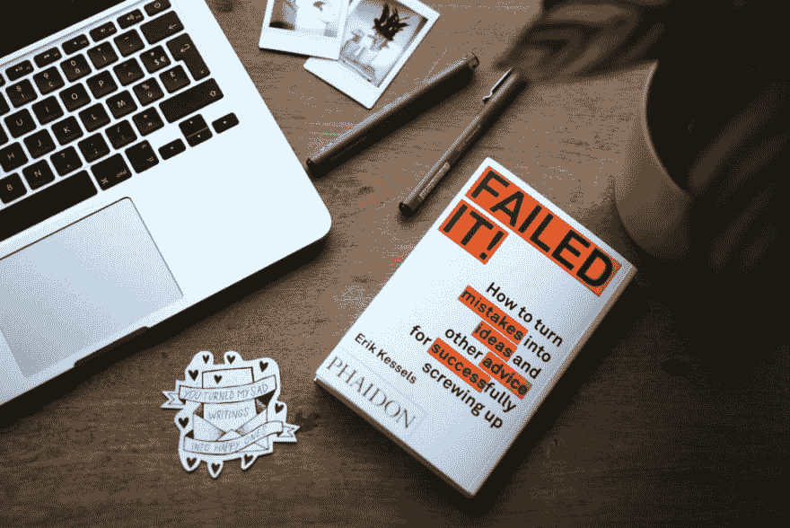

# 衡量价值的三种非常规方式

> 原文：<https://dev.to/kellycodeschaos/three-unconventional-ways-to-measure-value-2658>

#### 当设计产品的时候，并不总是关于金钱。

<figure> 

<figcaption>照片由[斯蒂夫·约翰森](https://unsplash.com/@steve_j?utm_source=medium&utm_medium=referral)上[下](https://unsplash.com?utm_source=medium&utm_medium=referral)</figcaption>

</figure>

理财很难。批准预算很难。确保每一个财务决策都是正确的，这可能是一个人保住工作还是雇佣新员工的区别。

这就是为什么证明某些计划的成本有时会很困难，因为内在价值并不总是等同于容易衡量的结果。然而，如果只关注一家公司将获得的直接收入，这些错过的机会可能会因忽视其隐藏的价值而导致灾难。

### 1 |失败为一个值

快速失败现在已经成为一种相当流行的心态，确保我们不会在错误的功能或概念上投入太多时间。公司通常采用 A/B 测试、快速原型和其他方法来快速评估对用户的初步价值。

> 错得快总比错得慢好。詹姆斯·赫尔姆斯

<figure> 

<figcaption>照片由[este 扬森斯](https://unsplash.com/@esteejanssens?utm_source=medium&utm_medium=referral)上 [Unsplash](https://unsplash.com?utm_source=medium&utm_medium=referral)</figcaption>

</figure>

然而，仅仅关注确保正确的项目正在进行是不够的。跟踪并了解你的用户如何 ***实际上*** 使用你的产品同样重要，如果不是更重要的话。

将一些初步测试的结果作为成功的衡量标准是一个危险的假设。

那么，如果收入是由客户或其他利益相关者产生的，一个团队如何证明投资于用户的成本是合理的呢？用失败来框定问题(和解决方案)。

*   如果一个团队专注于错误的优先级和概念，他们将冒着在用户不想要的功能/产品上浪费时间和金钱的风险。投入时间和资源，通过使用[视觉](https://www.invisionapp.com/)和[用户测试](https://www.usertesting.com/)等工具来获得反馈。
*   向真实用户学习，并确定您的产品功能如何未能达到其预期用途——如果用户看到某个功能的改进，这可能会转化为更高的 NPS(净推广得分)以及可采用性。
*   说到 NPS，行动胜于语言和调查数字。投资与用户建立真正的联系，以获得更有意义和更现实的反馈，无论是通过社交媒体还是某种社区平台。监控社交媒体有困难？试试免费的监控工具，比如 [HootSuite](https://hootsuite.com/) 。
*   一家公司不能满足用户需求的时间越长，它就越失去信誉，用户就越不愿意提供反馈，他们就越有可能尝试不同的产品。

利用您的用户优势，根据他们的需求而不是纯粹的直接收入来确定项目的优先级并调整工作。快乐的用户往往也有更好的预测行为，这有助于计算预测。

### 2 |灵感作为价值

快乐的员工造就快乐的顾客。当你的团队一直在做单调乏味、无足轻重的任务时，他们会变得没有动力去跳出框框思考。在泡沫中设计也会导致平庸的回音室，并导致创新的缺乏。

<figure> 

<figcaption>照片由[穆罕默德·海卡尔·舒克利](https://unsplash.com/@pantiumforce?utm_source=medium&utm_medium=referral)上[下](https://unsplash.com?utm_source=medium&utm_medium=referral)</figcaption>

</figure>

话虽如此，当然每份工作都有其重复性的任务和工作，坦率地说，只是需要完成。

但是，我们如何最大限度地减少这些平凡的方面，以最大限度地提高实际生产力，并确保您的员工受到鼓舞，并产生他们一生中最好的工作？

努力确保你的员工在工作中有成就感和目标感。有意义的工作可能是“我喜欢我的工作”和“我热爱我的工作”之间的区别但是有意义的工作是什么样子的呢？

*   它不是重复性的，因此不能自动化
*   它是独特的或专业的**并且**有领导的支持
*   在直接工作团队之外有影响力并得到认可

<figure> 

<figcaption>照片由 [rawpixel](https://unsplash.com/@rawpixel?utm_source=medium&utm_medium=referral) 上 [Unsplash](https://unsplash.com?utm_source=medium&utm_medium=referral)</figcaption>

</figure>

当批准与创新和士气等无形利益相关的预算时，利益相关者和投资者可能会感到焦虑。有时费用看起来与团队正在做的工作完全无关。在这种情况下，更重要的是着眼于大局，而不是每一美元的具体去向。

花钱确保员工感受到激励对企业有什么好处？

*   受其他行业和外部影响启发的团队具有竞争优势。不要只考虑用户如何体验你的产品，重要的是要看到他们使用其他什么产品来描绘一幅完整的画面。考虑带你的团队去当地企业实地考察，向他们介绍他们试图解决的问题。
*   减少多余的任务。在开发之前，你的团队是否痴迷于像素完美的构图？如果你的团队正在利用一个设计系统，那额外的努力可能是多余的。通过将层命名为与开发中使用的组件/类相同的名称，可以在移交阶段节省大量时间。Avocode 和 [Zeplin](https://zeplin.io/) 是巨大的省时工具，允许开发者检查设计规格。
*   设计思维不仅仅是设计师的专利。一个了解客户旅程的企业会带领团队产生创新的解决方案。不熟悉设计思维？通过在线课程为提供培训，例如在 IDEO 上的[其中之一。](https://www.ideou.com/pages/design-thinking#ldt)
*   有灵感的团队对他们所做的工作充满热情和自豪。投资于他们的士气表明了对他们努力的认可，并提供了与你的团队联系的机会。工程士气不仅仅是扔赞助的快乐时光或在休息室安装台球桌。真正的投资是倾听，不仅为了理解和支持职业目标，也为了理解和支持个人目标。作为一名领导者，在你的日历上留出时间与你的团队联系，并让你自己的目标[完全透明](https://www.linkedin.com/feed/update/urn:li:activity:6443482093308698624/)。

> 我怎么帮你？这个简单的问题创造了机会，使合作成熟，并成为理解的催化剂。查考斯基

### 3 |个性化为值

随着设计系统的兴起和诸如 [Bootstrap](https://getbootstrap.com/) 之类的框架的流行，依赖一种一刀切的方法是很常见的。从投资的角度来看，使用一个可扩展的成熟解决方案是非常明智的。

当然，我们都想定制这些通用模板，当我们听到“定制”时，很容易跳到常见的覆盖，如字体、颜色和图标。

<figure> 

<figcaption>照片由[黄祖儿](https://unsplash.com/@onice?utm_source=medium&utm_medium=referral)上[下](https://unsplash.com?utm_source=medium&utm_medium=referral)</figcaption>

</figure>

当涉及到技术升级和可伸缩性时，其中一些类型的变化还会导致技术债务和问题，所以尽量不要过于热心。你真的需要那个自定义图标集吗？T3】

为了给用户提供真正个性化的定制体验，没有必要覆盖模板或框架中的每一个元素。事实上，这样做可能会损害代码库的完整性和可伸缩性。

别忘了内容为王是有原因的。这也是为你的产品增加个性化的好机会。向个性化内容投入资源是定制体验的最简单方式，而无需投入大量的开发工作。

*   提供更多信息和可用性。不要说“添加了一个新用户”，而是考虑“您将 [**【简·T2】**](https://www.intercom.com/)添加到了您的收藏夹。 [*给她发消息！*](https://en.wikipedia.org/wiki/Jane_Smith) “您正在具体说明谁被添加到了**和**个人资料的链接以及与此人相关的快速行动要求。
*   让它变得有关联。不要用文字来描述一个特征，而是用创造性的故事和证明来建立可信度。讲述你产品的故事！
*   不要让你的用户去猜测。不要简单地感谢某人的业务，而是提前提供尽可能多的信息(订单详情、时间表等)。不要等着在电子邮件中告诉他们！最重要的是，确保他们对自己的行为/决定有信心。
*   每当你想显示新信息时，很容易默认到另一个屏幕。然而，这可能会导致不熟悉信息体系结构的用户无法使用。相反，尝试其他方法来引入内容，如抽屉、模态和弹出窗口。
*   利用你对用户的了解来个性化他们的体验。一些小事情，比如对他们经常在仪表板上交互的项目进行优先排序，使得一般的体验更符合他们自己的活动。

当考虑你的内容的语气时，你的产品的个性应该闪耀出来——这很容易陷入听起来太专业的陷阱。不要错过让你的产品更容易使用的潜在乐趣。通过投资打造定制的内容和体验，你的产品有了额外的润色。

### TLDR

在选择公司投资项目时，价值有时很难定义。当谈到经营企业的优先事项和方法时，不要忽视:

*   您的**用户的需求**
*   您的**团队的需求**
*   您的**产品**的需求

<figure> 

<figcaption>照片由[刘汉宁奈巴霍](https://unsplash.com/@hannynaibaho?utm_source=medium&utm_medium=referral)上 [Unsplash](https://unsplash.com?utm_source=medium&utm_medium=referral)</figcaption>

</figure>