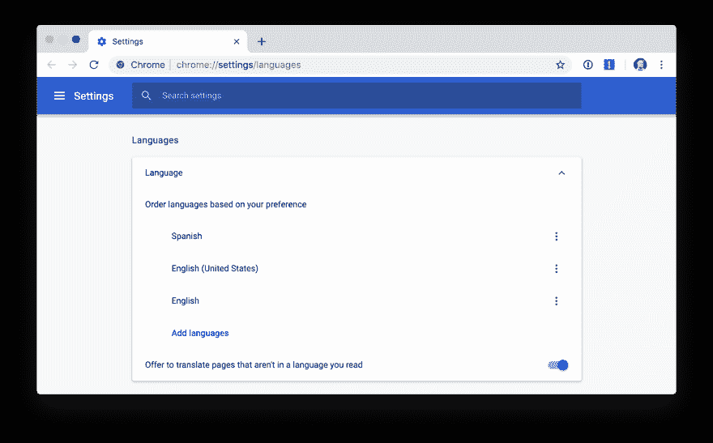
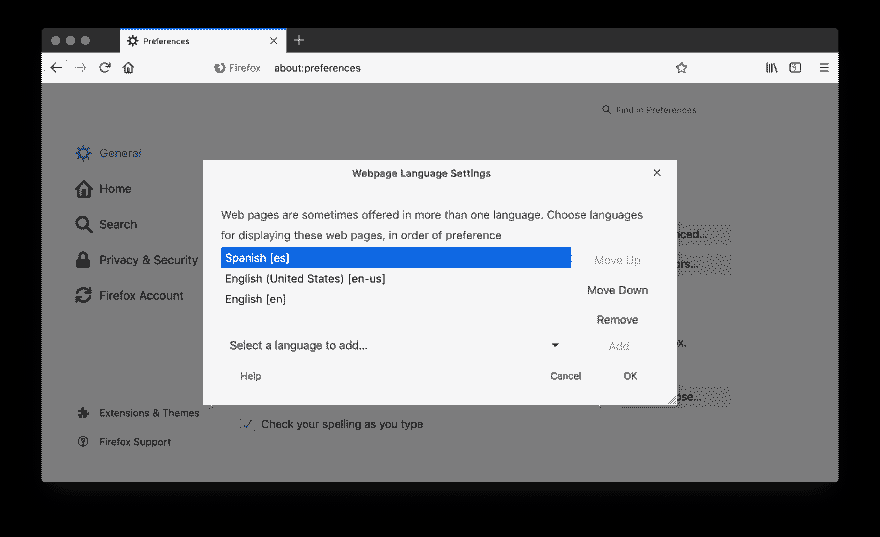
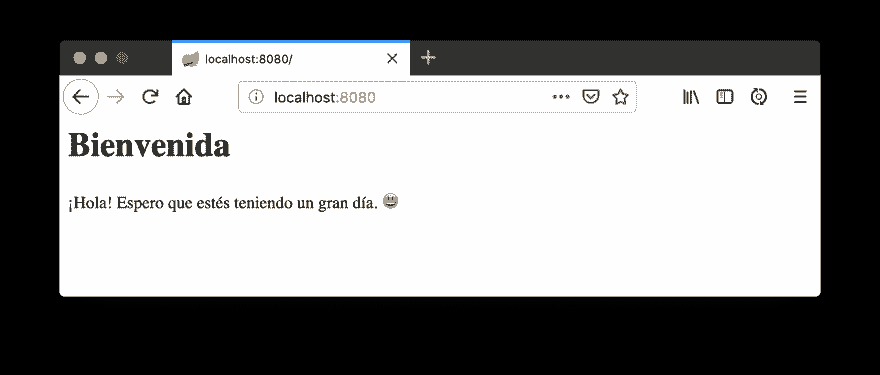
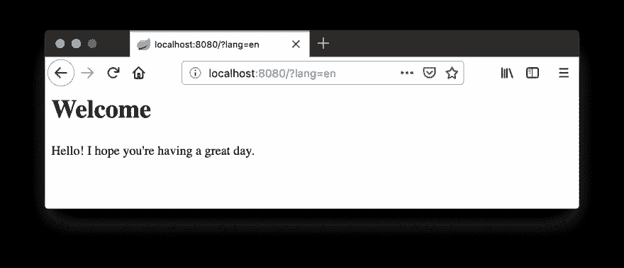
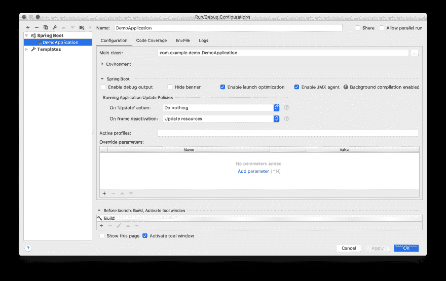
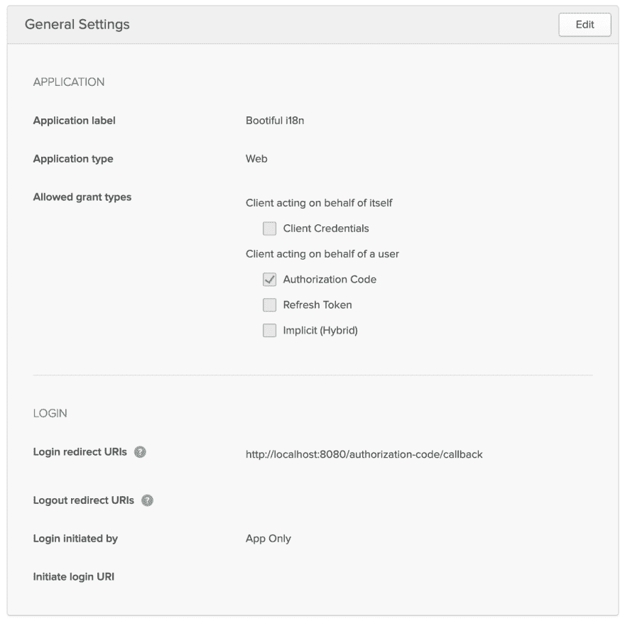
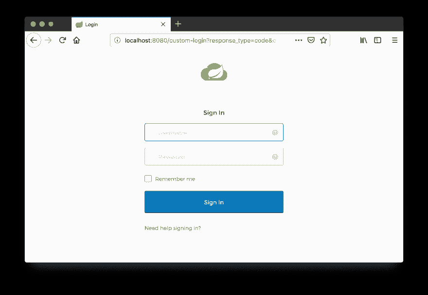
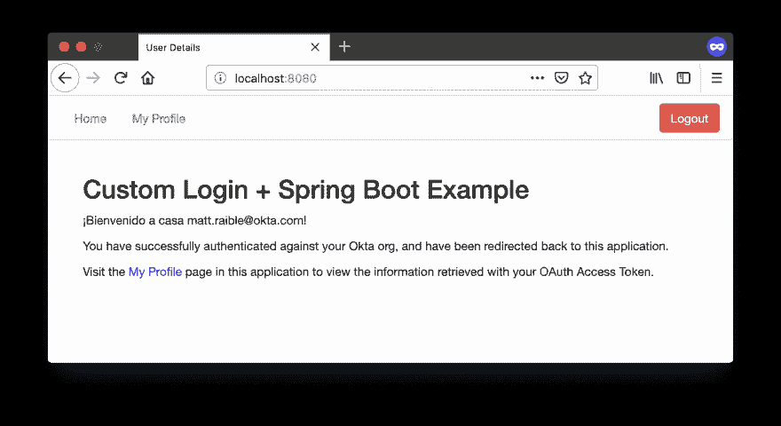
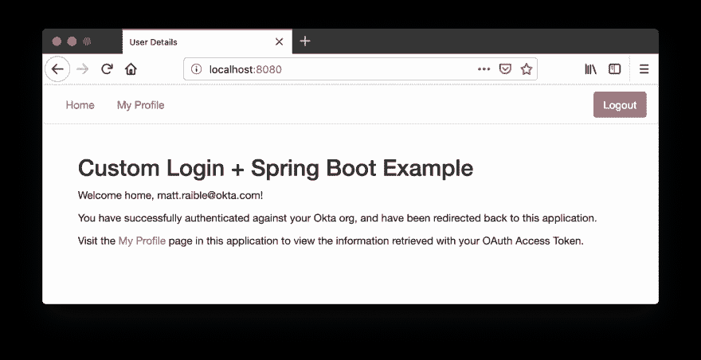

# Java 11、Spring Boot 和 JavaScript 中的 i18n

> 原文：<https://dev.to/oktadev/i18n-in-java-11-spring-boot-and-javascript-37mo>

i18n 和 l10n 是什么？国际化(i18n)是使您的应用程序能够用多种语言呈现文本的过程。本地化(l10n)意味着您的应用程序的编码方式符合特定地区的语言、文化或其他要求。这些需求包括日期、时间和货币的格式，以及符号、图标和颜色等。i18n 启用 l10n。

为什么 i18n 和 l10n 很重要？因为你想让尽可能多的用户访问你的应用！如果你的母语是英语，你会被宠坏的，因为英语是目前的商业语言，许多应用程序都提供英语翻译。由于内置的机制，国际化 Java 应用程序相对简单。Spring Boot 也是一样——它是默认存在的！

本教程将向您展示如何国际化一个简单的 Java 应用程序、一个带有百里香叶的 Spring Boot 应用程序和一个 JavaScript 小部件。

## Java i18n 与资源包

一个*资源包*是一个`.properties`文件，包含特定语言的键和值。使用资源包可以让您的代码独立于语言环境。要了解这是如何工作的，请在您的硬盘上为本教程的练习创建一个新目录。比如`java-i18n-example`。从命令行导航到这个目录并创建一个`Hello.java`文件。

```
public class Hello {

    public static void main(String[] args) {
        System.out.println("Hello, World!");
    }
} 
```

运行`java Hello.java`你应该会看到“你好，世界！”打印到您的控制台。

如果你看到任何与下面类似的错误，那是因为你使用的是 Java 版本< 11\. [JEP 330](https://openjdk.java.net/jeps/330) 是 Java 11 的增强版，它允许你运行 Java 源代码的单个文件，而无需编译它。

```
$ java Hello.java
Error: Could not find or load main class Hello.java 
```

你可以从 [AdoptOpenJDK](https://adoptopenjdk.net/) 11 安装 Java 11 或者使用 [SDKMAN！](https://sdkman.io/)

```
curl -s "https://get.sdkman.io" | bash 
```

一旦你安装了 SDKMAN，你可以用`sdk list java` :
列出可用的 java 版本

```
$ sdk list java
================================================================================
Available Java Versions
================================================================================
     13.ea.07-open 8.0.202-zulu
     12.ea.31-open 8.0.202-amzn
   + 11.ea.26-open 8.0.202.j9-adpt
     11.0.2-sapmchn 8.0.202.hs-adpt
     11.0.2-zulu 8.0.202-zulufx
   * 11.0.2-open 8.0.201-oracle
     11.0.2.j9-adpt > + 8.0.181-zulu
     11.0.2.hs-adpt 7.0.181-zulu
     11.0.2-zulufx 1.0.0-rc-12-grl
   + 11.0.1-open 1.0.0-rc-11-grl
   + 11.0.0-open 1.0.0-rc-10-grl
     10.0.2-zulu 1.0.0-rc-9-grl
     10.0.2-open 1.0.0-rc-8-grl
     9.0.7-zulu
     9.0.4-open

================================================================================
+ - local version
* - installed
> - currently in use
================================================================================ 
```

使用下面的命令设置您的环境以使用最新版本的 open JDK:

```
sdk default java 11.0.2-open 
```

现在你应该能够像 Java 程序一样运行你的`Hello.java`。

```
$ java Hello.java
Hello, World! 
```

看，妈妈！不需要编译！！😃

在同一个目录下创建一个`messages_en_US.properties`文件，并为术语`hello`和`world`添加关键字和翻译。

```
hello=Hello
world=World 
```

创建`messages_es.properties`并用西班牙语翻译填充它。

```
hello=Hola
world=Mundo 
```

修改`Hello.java`以使用`Locale`和`ResourceBundle`从这些文件中检索翻译。

```
import java.util.Locale;
import java.util.ResourceBundle;

public class Hello {

    public static void main(String[] args) {
        String language = "en";
        String country = "US";

        if (args.length == 2) {
            language = args[0];
            country = args[1];
        }

        var locale = new Locale(language, country);
        var messages = ResourceBundle.getBundle("messages", locale);

        System.out.print(messages.getString("hello") + " ");
        System.out.println(messages.getString("world"));
    }
} 
```

再次运行您的 Java 程序，您应该会看到“Hello World”。

```
$ java Hello.java
Hello World 
```

改进参数的解析，只允许指定语言。

```
if (args.length == 1) {
    language = args[0];
} else if (args.length == 2) {
    language = args[0];
    country = args[1];
} 
```

运行带有`es`参数的相同命令，您将看到西班牙语翻译:

```
$ java Hello.java esHola Mundo 
```

诶哈！Java 内置了 i18n，这很酷吧？

## 国际化与 Spring Boot 和百里香

得益于 Spring 框架及其 [`MessageSource`](https://docs.spring.io/spring-framework/docs/current/javadoc-api/org/springframework/context/MessageSource.html) 实现，Spring Boot 内置了 i18n。有一个建立在`ResourceBundle`之上的`ResourceBundleMessageSource`，以及一个不言自明的 [`ReloadableResourceBundleMessageSource`](https://docs.spring.io/spring-framework/docs/current/javadoc-api/org/springframework/context/support/ReloadableResourceBundleMessageSource.html) 。

将`MessageSource`注入一颗春豆，尽情调用`getMessage(key, args, locale)`！在服务器上使用`MessageSource`会对你有帮助，但是在你的用户界面上呢？让我们创建一个快速应用程序，向您展示如何使用百里香叶添加国际化。

进入 [start.spring.io](https://start.spring.io) ，选择 **Web** 和**百里香**作为依赖。点击**生成项目**，下载生成的`demo.zip`文件。如果您更愿意从命令行来做，您可以使用 [HTTPie](https://httpie.org) 来做同样的事情。

```
mkdir bootiful-i18n
cd bootiful-i18n
http https://start.spring.io/starter.zip dependencies==web,thymeleaf -d | tar xvz 
```

在您喜欢的 IDE 中打开项目，并在`src/main/java/com/example/demo`中创建`HomeController.java`。

```
package com.example.demo;

import org.springframework.stereotype.Controller;
import org.springframework.web.bind.annotation.GetMapping;

@Controller
public class HomeController {

    @GetMapping("/")
    String home() {
        return "home";
    }
} 
```

在`src/main/resources/templates/home.html`创建一个百里香模板，它将呈现“主页”视图。

```
<html xmlns:th="http://www.thymeleaf.org">
<body>
    <h1 th:text="#{title}"></h1>
    <p th:text="#{message}"></p>
</body>
</html> 
```

在`src/main/resources`中添加一个`messages.properties`文件，定义您的默认语言(在本例中是英语)。

```
title=Welcome
message=Hello! I hope you're having a great day. 
```

在同一个目录的一个`messages_es.properties`文件中添加一个西班牙语翻译。

```
title=Bienvenida
message=¡Hola! Espero que estas teniendo un gran día. 😃 
```

Spring Boot 使用 Spring 的 [`LocaleResolver`](https://docs.spring.io/spring-framework/docs/current/javadoc-api/org/springframework/web/servlet/LocaleResolver.html) 和(默认)其 [`AcceptHeaderLocalResolver`](https://docs.spring.io/spring-framework/docs/current/javadoc-api/org/springframework/web/servlet/i18n/AcceptHeaderLocaleResolver.html) 实现。如果你的浏览器发送了一个`accept-language`标题，Spring Boot 会试图找到匹配的信息。

为了测试它，打开 Chrome 并在地址栏输入`chrome://settings/languages`。展开顶部的“语言”框，点击**添加语言**并搜索“西班牙语”添加不带国家的选项，并将其移动到首选项中的顶级语言。当你完成时，它应该看起来像下面的截图。

[](https://res.cloudinary.com/practicaldev/image/fetch/s--YTLJNcxe--/c_limit%2Cf_auto%2Cfl_progressive%2Cq_auto%2Cw_880/https://developer.okta.com/assets-jekyll/blog/java-i18n/chrome-languages-1fbefaf6b35efb5d5d0197bd4f5d03473bd206874508cd9bd2953858e6cf7de2.png)

对于 Firefox，导航到`about:preferences`，向下滚动到“语言和外观”并点击“选择显示页面的首选语言”旁边的**选择**按钮选择**西班牙语**并将其移动到顶部。

[](https://res.cloudinary.com/practicaldev/image/fetch/s--lCxPSYJr--/c_limit%2Cf_auto%2Cfl_progressive%2Cq_auto%2Cw_880/https://developer.okta.com/assets-jekyll/blog/java-i18n/firefox-languages-f261c5689b73b8606a963d674b743a0261f40a9439b486d605c4eeab3447e6ee.png)

一旦你将浏览器设置为返回西班牙语，用`./mvnw spring-boot:run`(或者如果你用的是 Windows，用`mvnw spring-boot:run`)启动你的 Spring Boot 应用。

**提示:**如果你想只输入`./mvnw`来启动你的应用，在你的`pom.xml`的`<build>`部分添加`<defaultGoal>spring-boot:run</defaultGoal>`。

导航到`http://localhost:8080`，你应该会看到一个有西班牙语单词的页面。

[](https://res.cloudinary.com/practicaldev/image/fetch/s--n6oNnFIU--/c_limit%2Cf_auto%2Cfl_progressive%2Cq_auto%2Cw_880/https://developer.okta.com/assets-jekyll/blog/java-i18n/home-in-spanish-b01aeb6ed475a42ebb31f35f198904d7396c90028a4b39d19b63078f8a86fdc2.png)

### 增加了用 URL 参数改变语言环境的能力

这是一个很好的设置，但是您可能希望允许用户设置他们自己的语言。你可能在野外的网站上看到过，那里有一面旗帜，你可以点击它来改变那个国家的语言。为了在 Spring Boot 实现这一点，在你的`HomeController`旁边创建一个`MvcConfigurer`类。

```
package com.example.demo;

import org.springframework.context.annotation.Bean;
import org.springframework.context.annotation.Configuration;
import org.springframework.web.servlet.LocaleResolver;
import org.springframework.web.servlet.config.annotation.InterceptorRegistry;
import org.springframework.web.servlet.config.annotation.WebMvcConfigurer;
import org.springframework.web.servlet.i18n.CookieLocaleResolver;
import org.springframework.web.servlet.i18n.LocaleChangeInterceptor;

@Configuration
public class MvcConfigurer implements WebMvcConfigurer {

    @Bean
    public LocaleResolver localeResolver() {
        return new CookieLocaleResolver();
    }

    @Bean
    public LocaleChangeInterceptor localeInterceptor() {
        LocaleChangeInterceptor localeInterceptor = new LocaleChangeInterceptor();
        localeInterceptor.setParamName("lang");
        return localeInterceptor;
    }

    @Override
    public void addInterceptors(InterceptorRegistry registry) {
        registry.addInterceptor(localeInterceptor());
    }
} 
```

这个类使用一个`CookieLocaleResolver`来保存 cookie 中的区域设置参数，如果不存在，默认使用`accept-language`头。

重启你的服务器，你应该能够通过导航到`http://localhost:8080/?lang=en`来覆盖你的浏览器的语言偏好。

[](https://res.cloudinary.com/practicaldev/image/fetch/s--b_gou0KY--/c_limit%2Cf_auto%2Cfl_progressive%2Cq_auto%2Cw_880/https://developer.okta.com/assets-jekyll/blog/java-i18n/override-browser-lang-4e05887f37d14d88b09c780332d9c3acfd54641bfd6ff514e226752e48e372d8.png)

您的语言首选项将保存在 cookie 中，因此如果您导航回`http://localhost:8080`，页面将以英语呈现。如果您退出浏览器并重新启动，您将回到使用浏览器的语言偏好设置。

### Spring Boot 2.1 热重装百里香模板和资源包

如果你想修改你的百里香模板并在刷新浏览器时立即看到这些变化，你可以将 Spring Boot 的[开发者工具](https://docs.spring.io/spring-boot/docs/current/reference/html/using-boot-devtools.html)添加到你的`pom.xml`中。

```
<dependency>
    <groupId>org.springframework.boot</groupId>
    <artifactId>spring-boot-devtools</artifactId>
</dependency> 
```

如果您的 IDE 设置为在保存文件时复制资源，这就是您需要做的全部工作。如果您没有使用 IDE，您需要在您的`application.properties` :
中定义一个属性

```
spring.thymeleaf.prefix=file:src/main/resources/templates/ 
```

要热重新加载对 i18n 包的更改，您需要重新构建您的项目(例如，通过运行`./mvnw compile`)。如果您使用的是 Eclipse，那么重建和重启应该会自动发生。如果你用的是 IntelliJ IDEA，你需要进入你的运行配置，将“帧停用”改为**更新资源**。

[](https://res.cloudinary.com/practicaldev/image/fetch/s--jPQ5eINN--/c_limit%2Cf_auto%2Cfl_progressive%2Cq_auto%2Cw_880/https://developer.okta.com/assets-jekyll/blog/java-i18n/idea-update-resources-0c579311eacf77c908e2648df8fcb0d2296f046e94bd756b18669afcc5b4080f.png)

更多信息见[此堆栈溢出答案](https://stackoverflow.com/a/54861291/65681)。

## 自定义 Okta 的登录小工具使用的语言

我想给你看的最后一个例子是一个 Spring Boot 的应用程序，它嵌入了 Okta 的[登录小工具](https://developer.okta.com/code/javascript/okta_sign-in_widget)。登录窗口小部件足够智能，可以根据浏览器的`accept-language`标题呈现语言。

然而，如果你想让它与你的 Spring 应用程序的`LocalResolver`同步，你需要做更多的配置。此外，您可以定制一些东西，这样它就可以根据 Okta 中用户的区域设置来设置区域。

首先，导出 Spring Boot 的自定义登录示例:

```
svn export https://github.com/okta/samples-java-spring/trunk/custom-login 
```

**提示:**如果你没有安装`svn`，请到[这里](https://github.com/okta/samples-java-spring/tree/master/custom-login)，点击**下载**按钮。

### 在 Okta 上创建 OIDC App

如果你已经有一个 Okta 开发者帐号，请[登录](https://login.okta.com/?SAMLRequest=fc%2B7CsJAEAXQXvAflu1NNJUMeZBGELTx1a%2FrYILJTtyZGD%2FfSBRiYzlw77lMnD3rSj3Qc0ku0YtgrhU6S5fSXRN9PKxmS52l00nMpq6iBvJWCrfDe4ss6vStRe9aDzmGIZfo1jsgwyWDMzUyiIV9vt1AH4XGk5ClSvewUgMNa%2BYW%2FVj5jxhm9NLP67QQaSAMu64L6CYmsFSHlnzT4ZlLwTgcL6Sf8%2FeX9AU%3Dhttps://login.okta.com/?SAMLRequest=fc%2B7CsJAEAXQXvAflu1NNJUMeZBGELTx1a%2FrYILJTtyZGD%2FfSBRiYzlw77lMnD3rSj3Qc0ku0YtgrhU6S5fSXRN9PKxmS52l00nMpq6iBvJWCrfDe4ss6vStRe9aDzmGIZfo1jsgwyWDMzUyiIV9vt1AH4XGk5ClSvewUgMNa%2BYW%2FVj5jxhm9NLP67QQaSAMu64L6CYmsFSHlnzT4ZlLwTgcL6Sf8%2FeX9AU%3D)到它。如果没有，[会创建一个](https://developer.okta.com/signup/)。登录 Okta 仪表板后，完成以下步骤:

1.  从**应用**页面，选择**添加应用**。

2.  在创建新应用程序页面上，选择 **Web** 。

3.  给你的应用起个好记的名字，然后点击**完成**。

您的设置应该类似于下面的设置。

[](https://res.cloudinary.com/practicaldev/image/fetch/s--gGqoWjUF--/c_limit%2Cf_auto%2Cfl_progressive%2Cq_auto%2Cw_880/https://developer.okta.com/assets-jekyll/blog/java-i18n/bootiful-i18n-1dea8951c03627340d224e1dbb126031e510295b6359821f97698c758c4cc593.png)

您可以在`custom-login/src/main/resources/application.yml`中指定您的发行者(在 **API** > **授权服务器**下找到)、客户 ID 和客户秘密，如下:

```
okta:
  oauth2:
    issuer: https://{yourOktaDomain}/oauth2/default
    client-id: {yourClientID}
    client-secret: {yourClientSecret} 
```

然而，如果您将这些值存储在环境变量中，并使它们不受源代码控制(尤其是当您的代码是公共的时)，会更加安全。

```
export OKTA_OAUTH2_ISSUER=https://{yourOktaDomain}/oauth2/default
export OKTA_OAUTH2_CLIENT_ID={yourClientID}
export OKTA_OAUTH2_CLIENT_SECRET={yourClientSecret} 
```

**提示:**我建议将上述导出添加到项目根目录下的一个`.okta.env`文件中，并将`*.env`添加到`.gitignore`。然后运行`source .okta.env`再启动你的 app。

完成这些更改后，您可以使用`./mvnw`启动应用程序。打开你的浏览器到`http://localhost:8080`，点击**登录**，你应该可以认证了。如果您仍然将浏览器设置为首先使用西班牙语，您将看到登录小部件自动以西班牙语呈现。

[](https://res.cloudinary.com/practicaldev/image/fetch/s--c6OLXU10--/c_limit%2Cf_auto%2Cfl_progressive%2Cq_auto%2Cw_880/https://developer.okta.com/assets-jekyll/blog/java-i18n/sign-in-widget-es-10b5a5f59bf67feed8b8c07ec256d92f6d23210d16daa93c7a83da5e07f17df4.png)

这是因为 Spring 自动启用了`AcceptHeaderLocaleResolver`。

## 添加 i18n 消息并同步区域设置

在这一点上，似乎 T4 的事情进展顺利。然而，如果你添加一个`LocaleChangeInterceptor`，你会发现改变语言并不会改变小部件的语言。为了看到这一点，在`custom-login/src/main/java/com/okta/spring/example`中创建一个`MvcConfigurer`类。

```
package com.okta.spring.example;

import org.springframework.context.annotation.Bean;
import org.springframework.context.annotation.Configuration;
import org.springframework.web.servlet.LocaleResolver;
import org.springframework.web.servlet.config.annotation.InterceptorRegistry;
import org.springframework.web.servlet.config.annotation.WebMvcConfigurer;
import org.springframework.web.servlet.i18n.CookieLocaleResolver;
import org.springframework.web.servlet.i18n.LocaleChangeInterceptor;

@Configuration
public class MvcConfigurer implements WebMvcConfigurer {

    @Bean
    public LocaleResolver localeResolver() {
        return new CookieLocaleResolver();
    }

    @Bean
    public LocaleChangeInterceptor localeInterceptor() {
        LocaleChangeInterceptor localeInterceptor = new LocaleChangeInterceptor();
        localeInterceptor.setParamName("lang");
        return localeInterceptor;
    }

    @Override
    public void addInterceptors(InterceptorRegistry registry) {
        registry.addInterceptor(localeInterceptor());
    }
} 
```

重启自定义登录应用程序并导航至`http://localhost:8080/?lang=en`。如果您单击登录按钮，您将看到小部件仍然以西班牙语呈现。要解决这个问题，打开`LoginController`并添加`language`作为模型属性，并为`login()`方法添加一个`Locale`参数。Spring MVC 会用 [`ServletRequestMethodArgumentResolver`](https://docs.spring.io/spring/docs/current/javadoc-api/org/springframework/web/servlet/mvc/method/annotation/ServletRequestMethodArgumentResolver.html) 自动解析`Locale`。

```
package com.okta.spring.example.controllers;

import org.springframework.web.servlet.LocaleResolver;
...

@Controller
public class LoginController {

    ...
    private static final String LANGUAGE = "language";

    private final OktaOAuth2Properties oktaOAuth2Properties;
    private final LocaleResolver localeResolver;

    public LoginController(OktaOAuth2Properties oktaOAuth2Properties, LocaleResolver localeResolver) {
        this.oktaOAuth2Properties = oktaOAuth2Properties;
        this.localeResolver = localeResolver;
    }

    @GetMapping(value = "/custom-login")
    public ModelAndView login(HttpServletRequest request,
                              @RequestParam(name = "state", required = false) String state)
                              throws MalformedURLException {

        ...
        mav.addObject(LANGUAGE, localeResolver.resolveLocale(request));

        return mav;
    }

    ...
} 
```

然后修改`custom-login/src/main/resources/templates/login.html`并添加一个读取该值的`config.language`设置。

```
config.redirectUri = /*[[${redirectUri}]]*/ '{redirectUri}';
config.language = /*[[${language}]]*/ '{language}'; 
```

重启一切，进入`http://localhost:8080/?lang=en`，点击登录按钮，它现在应该以英语呈现。

[](https://res.cloudinary.com/practicaldev/image/fetch/s--kTj3-VfC--/c_limit%2Cf_auto%2Cfl_progressive%2Cq_auto%2Cw_880/https://developer.okta.com/assets-jekyll/blog/java-i18n/sign-in-widget-en-8025821fc4f38b6bfec77f50d1151f38d91c0776d242f4c4bfba518f6b48d3c6.png)

### 为百里香添加国际化捆绑包

为了使更改地区的工作更加明显，在`src/main/resources`中创建`messages.properties`，并为键指定英语翻译。

```
hello=Hello
welcome=Welcome home, {0}! 
```

在同一个目录下创建`messages_es.properties`，并提供翻译。

```
hello=Hola
welcome=¡Bienvenido a casa {0}! 
```

打开`src/main/resources/templates/home.html`，将`<p>Hello!</p>`改为

```
<p th:text="#{hello}">Hello!</p> 
```

当用户也通过验证时，更改欢迎消息。`{0}`值将被传递给键名的参数替换。

```
<p th:text="#{welcome(${#authentication.name})}">Welcome home,
    <span th:text="${#authentication.name}">Joe Coder</span>!</p> 
```

重启 Spring Boot，登录，你应该会看到一个你选择的语言环境的欢迎信息。

[](https://res.cloudinary.com/practicaldev/image/fetch/s--TiLGPBdz--/c_limit%2Cf_auto%2Cfl_progressive%2Cq_auto%2Cw_880/https://developer.okta.com/assets-jekyll/blog/java-i18n/home-es-d477b92dfd1ff7b25b86da13ebb9fc3fb0a3bafc93e95c1e85c68b8489a170bd.png)

你得承认，这是萨威！我觉得如果在 Okta 中从用户属性中设置地区会更好。让我们实现它吧！

### 使用 Okta 中用户的区域设置

要从 Okta 中的用户信息设置语言环境，在与`MvcConfigurer`相同的目录中创建一个`OidcLocaleResolver`类。

```
package com.okta.spring.example;

import org.slf4j.Logger;
import org.slf4j.LoggerFactory;
import org.springframework.context.annotation.Configuration;
import org.springframework.security.core.context.SecurityContext;
import org.springframework.security.core.context.SecurityContextHolder;
import org.springframework.security.oauth2.core.oidc.user.OidcUser;
import org.springframework.web.servlet.i18n.CookieLocaleResolver;

import javax.servlet.http.HttpServletRequest;
import java.util.Locale;

@Configuration
public class OidcLocaleResolver extends CookieLocaleResolver {
    private final Logger logger = LoggerFactory.getLogger(OidcLocaleResolver.class);

    @Override
    public Locale resolveLocale(HttpServletRequest request) {
        SecurityContext securityContext = SecurityContextHolder.getContext();
        if (securityContext.getAuthentication().getPrincipal() instanceof OidcUser) {
            OidcUser user = (OidcUser) securityContext.getAuthentication().getPrincipal();
            logger.info("Setting locale from OidcUser: {}", user.getLocale());
            return Locale.forLanguageTag(user.getLocale());
        } else {
            return request.getLocale();
        }
    }
} 
```

然后更新`MvcConfigurer`来使用这个类:

```
@Bean
public LocaleResolver localeResolver() {
   return new OidcLocaleResolver();
} 
```

通过重启、导航到`http://localhost:8080/?lang=es`并验证来尝试一下。你应该回到你的应用程序的主页，用英语(或者你的用户的语言环境)作为语言。

[](https://res.cloudinary.com/practicaldev/image/fetch/s--tSIYKsEp--/c_limit%2Cf_auto%2Cfl_progressive%2Cq_auto%2Cw_880/https://developer.okta.com/assets-jekyll/blog/java-i18n/home-en-6679e2e33c1ac0f98164d1cc4cd2dd048be209af31b7d62a5a91b2c85ea6ac72.png)

诶哈！感觉像星期五，不是吗？！😃

### i18n 在 JavaScript 中带有 Angular、React 和 Vue

在本文中，您看到了如何国际化一个基本的 Java 程序和一个 Spring Boot 应用程序。我们几乎没有涉及如何用 JavaScript 实现 i18n 的服务。好消息是我有一个很好的 i18n 用于 JavaScript 应用程序的例子。

JHipster 由 Spring Boot 提供支持，包括在服务器和客户端的多种语言的本地化。它支持三个非常棒的前端框架:Angular、React 和 Vue。它使用以下库在客户机上延迟加载带有翻译的 JSON 文件。如果您对用 JavaScript(或 TypeScript)编写 i18n 感兴趣，我邀请您去看看它们。

*   角度:[ngx-平移](http://www.ngx-translate.com/)

*   React:一个[翻译](https://github.com/jhipster/react-jhipster/blob/master/src/language/translate.tsx)组件基于 [react-translate](https://github.com/bloodyowl/react-translate)

*   视图:视图 I18n

## 立即国际化您的 Java 应用！

我希望您喜欢这个关于如何国际化和本地化您的 Java 和 Spring Boot 应用程序的旋风式旅行。如果你想看完整的源代码，你可以在 GitHub 上找到它。

**提示:** Baeldung 的[Spring Boot 国际化指南](https://www.baeldung.com/spring-boot-internationalization)是撰写本文的有用资源。

我们喜欢在这个博客上写 Java 和 Spring Boot。以下是我最喜欢的几个:

*   [用 Java EE 和 OIDC 构建 Java REST API](https://developer.okta.com/blog/2018/09/12/secure-java-ee-rest-api)

*   [Spring Boot 2.1:出色的 OIDC、OAuth 2.0 和反应式 API 支持](https://developer.okta.com/blog/2018/11/26/spring-boot-2-dot-1-oidc-oauth2-reactive-apis)

*   [将社交登录添加到您的 JHipster 应用程序中](https://developer.okta.com/blog/2019/02/19/add-social-login-to-spring-boot)

*   [使用 Spring Boot 2.0 和 OAuth 2.0 构建和保护微服务](https://developer.okta.com/blog/2018/05/17/microservices-spring-boot-2-oauth)

*   [使用 OAuth 2.0 和 JHipster 开发微服务架构](https://developer.okta.com/blog/2018/03/01/develop-microservices-jhipster-oauth)

在你最喜欢的社交网络{ [Twitter](https://twitter.com/oktadev) 、 [LinkedIn](https://www.linkedin.com/company/oktadev) 、[脸书](https://www.facebook.com/oktadevelopers/)、 [YouTube](https://www.youtube.com/channel/UC5AMiWqFVFxF1q9Ya1FuZ_Q) 上关注我们，以便在我们将来发布精彩内容时得到通知。