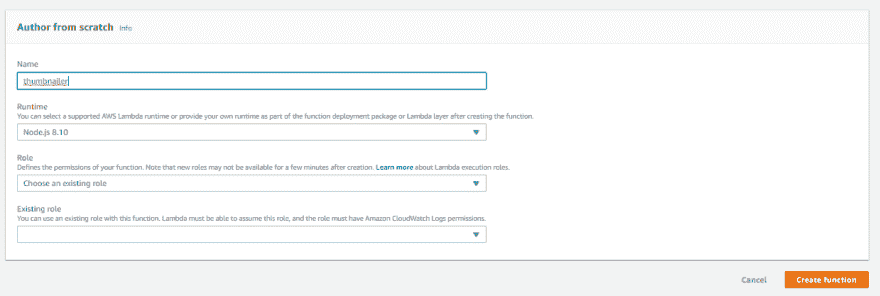
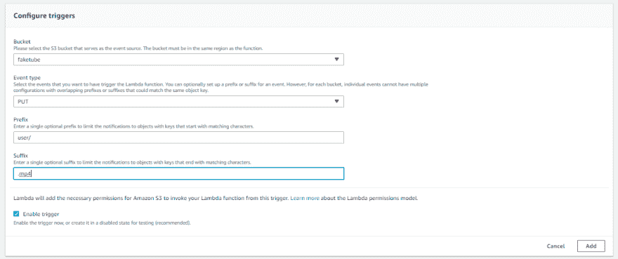
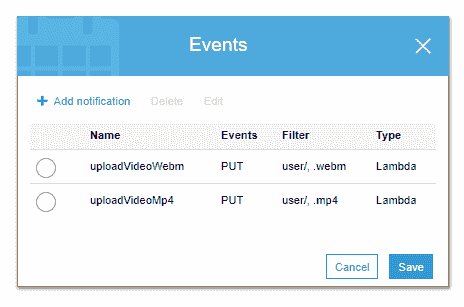
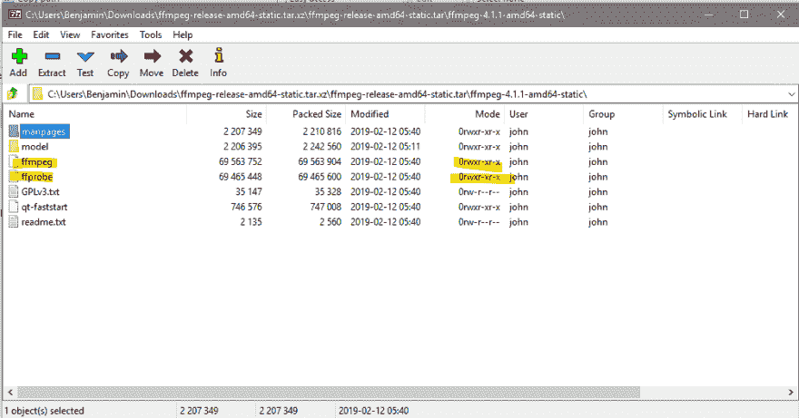
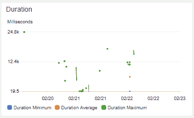
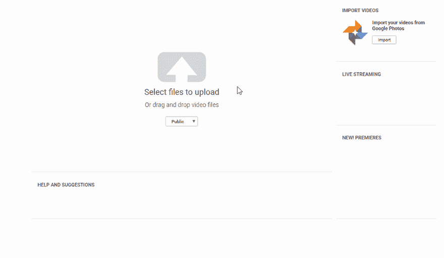

# 上传视频时如何创建缩略图？aws lambda！

> 原文：<https://dev.to/benjaminadk/how-do-i-create-thumbnails-when-i-upload-a-video-aws-lambda-7l4>

好问题。🤔

## 简介

我一直在玩一个被我称为**视频短片**的 **YouTube** 克隆版。我已经设置了视频上传从浏览器发送到 [AWS S3](https://docs.aws.amazon.com/s3/index.html#lang/en_us) 桶，所以视频文件没有触及我的节点后端，这使得服务器端的视频处理无法启动。这让我进退两难，因为我想为每个视频上传生成 3 个缩略图，就像真正的 YouTube 一样。我开始考虑在屏幕外创建一个视频播放器，并使用 canvas 来传输内容。虽然这是可能的，但听起来并不有趣，这也不是我最终要做的。

[](https://res.cloudinary.com/practicaldev/image/fetch/s--z-HN_e_y--/c_limit%2Cf_auto%2Cfl_progressive%2Cq_auto%2Cw_880/https://thepracticaldev.s3.amazonaws.com/i/wi4bngn6jj38fc8e24f5.png)

研究开始了。

我发现 **YouTube** 使用深度神经网络来挑选显示主题或面部或其他吸引注意力的事物的缩略图。他们还捕捉视频的每一秒钟的缩略图，并使用一种算法对每一个进行排序。[YouTube 创作者团队 2015 年撰写的这篇有趣的文章进一步解释了](https://ai.googleblog.com/2015/10/improving-youtube-video-thumbnails-with.html)。在这一点上，我认为仅仅得到 3 张缩略图对我来说就足够了——因为我仍然不知道我在做什么。🤦‍♂️

## 同伴视频

[https://www.youtube.com/embed/0IGRynRhsRE](https://www.youtube.com/embed/0IGRynRhsRE)

## 免责声明

请记住，此代码并不意味着是一个生产就绪的解决方案，它更多的是一个探索或概念证明。有许多可移动的部件，虽然我已经设法在我的本地环境中使用它，但我不能保证它在其他地方也能工作！抱歉。

## λ函数

我发现的第一件事是，我可以使用 AWS Lambda 来外包通常可能发生在服务器上的计算。作为奖励，因为我已经在使用 **S3** ，我可以附加一个事件监听器，当我上传视频文件时触发我的**λ**函数。

创建一个新的 T2 函数很简单。当提示你想选择*从头创建一个函数*并想出一个像样的名字；为我工作。同样，选择 **Node.js 8.10** 运行时。

[](https://res.cloudinary.com/practicaldev/image/fetch/s--NP-Xb1zO--/c_limit%2Cf_auto%2Cfl_progressive%2Cq_auto%2Cw_880/https://thepracticaldev.s3.amazonaws.com/i/nhwm0o9ckkp82ci23nez.png)

### IAM 角色权限

我必须创建一个新的 **IAM** 角色来执行这个功能。这可以通过 [IAM 控制台](https://console.aws.amazon.com/iam/home)中的简单工作流程来完成。给这个角色起你想要的名字，但是要给它`AWSLambdaExecute`权限。这将允许`PUT`和`GET`访问 **S3** 并完全访问 **CloudWatch 日志**。这些都是我们执行和监控我们的`createThumbnail` **Lambda** 函数所需的权限。我必须将这个角色的`arn`添加到我的桶策略中。

[](https://res.cloudinary.com/practicaldev/image/fetch/s--I_GTSwNB--/c_limit%2Cf_auto%2Cfl_progressive%2Cq_auto%2Cw_880/https://thepracticaldev.s3.amazonaws.com/i/di2qepm8xnkylhu3xsd7.png)T3】

```
 {
            "Sid": "Stmt**************",
            "Effect": "Allow",
            "Principal": {
                "AWS": [
                    "arn:aws:iam::**********:role/LambdaRole"
                ]
            },
            "Action": [
                "s3:GetObject",
                "s3:PutObject"
            ],
            "Resource": "arn:aws:s3:::bucket/*"
        } 
```

Enter fullscreen mode Exit fullscreen mode

### 触发器

接下来，我们需要为我们的函数配置触发器。我们希望监听上传视频的桶，并观察`PUT`方法，因为这是用于发送视频的方法。或者，您可以设置一个`prefix`和/或`suffix`来缩小触发范围。我的函数将缩略图保存到这个桶中。在这种情况下，您可以使用`mp4`的`suffix`或`webm`(视频格式)。我的视频将被放入用户文件夹，所以我设置了前缀`user/`,因为这将是任何键的开头。

[](https://res.cloudinary.com/practicaldev/image/fetch/s--b3inUVhd--/c_limit%2Cf_auto%2Cfl_progressive%2Cq_auto%2Cw_880/https://thepracticaldev.s3.amazonaws.com/i/ydo15manffpueez4ocrp.png)

一旦创建了您的函数并配置了其触发器，这些设置将显示在所述触发器引用的 **S3** 桶中。事实上，他们可以从 **S3** 或**λ**控制台进行设置。点击`Properties`选项卡，然后点击 **S3** 控制台中的`Events`框，查看与铲斗相关的事件。

[](https://res.cloudinary.com/practicaldev/image/fetch/s--1mAbyrtT--/c_limit%2Cf_auto%2Cfl_progressive%2Cq_auto%2Cw_880/https://thepracticaldev.s3.amazonaws.com/i/zh1yqmcazh9kstwpvwri.png)

### 获取λ代码

有几种方法可以让代码进入我们的 **Lambda** 函数。如果你的软件包小于 3MB，AWS 提供在线代码编辑器。您也可以将一个 zip 文件形式的包直接上传到 **Lambda** 或上传一个 zip 文件到 **S3** ，然后将其链接到您的函数。这种 zip 格式允许在您的包中包含多个文件，包括典型的`node_modules`依赖项以及可执行文件。

事实上，我们将利用几个可执行文件来帮助处理我们的视频。`ffmpeg`是一个转换多媒体文件的命令行工具，`ffprobe`是一个流分析器。你可以在本地安装这些工具，但是我们需要在 **Lambda** 上使用静态构建。[下载选择可以在这里找到](https://johnvansickle.com/ffmpeg/)。我选择了`https://johnvansickle.com/ffmpeg/releases/ffmpeg-release-amd64-static.tar.xz`。为了解压压缩的内容，我使用了 [7-Zip](https://www.7-zip.org/) 。一旦解压后，我们要分离出文件`ffmpeg`和`ffprobe`，请看图。

[](https://res.cloudinary.com/practicaldev/image/fetch/s--6zL6vAv8--/c_limit%2Cf_auto%2Cfl_progressive%2Cq_auto%2Cw_880/https://thepracticaldev.s3.amazonaws.com/i/ubn937dc3vkx7arbr2ux.png)

请注意，用户、组和全局用户都具有读/执行权限。我使用的是 Windows，保留这些权限时遇到了问题。 [Lambda 权限](https://docs.aws.amazon.com/lambda/latest/dg/deployment-package-v2.html#lambda-zip-package-permission-policies)有点棘手，全局读取对所有文件都很重要。在 **Windows** 上，当我尝试下一步时，问题出现了。

为了把我们的可执行文件放到**λ**中，我们可以用我们的`index.js`(实际的函数脚本)把它们放到一个目录中，然后压缩并上传。这有几个缺点。在 **Windows** 上压缩*中的可执行文件 Windows 资源管理器*在试图调用可执行文件 my function 时剥夺了权限并导致错误。此外，每次我在我的脚本中做了改变，我必须重新上传一个 40MB 的文件。这是可怕的缓慢和消耗数据传输信用。不适合开发，数据传输成本高💲。解决这个问题的第一部分是使用一个`Lambda Layer`。

### λ层

一个[λ层](https://docs.aws.amazon.com/lambda/latest/dg/configuration-layers.html)可以以库、定制运行时或其他依赖的形式保存额外的代码。一旦我们建立了一个`Layer`,它就可以用于多种功能，并且可以编辑和保存为多种版本。非常灵活。

首先，我们需要把我们的`ffmpeg`和`ffprobe`文件放到一个名为`nodejs`的文件夹中——这个名字很重要。我最终使用了【Linux 的 Windows 子系统和`zip`命令来压缩`nodejs`文件夹。这是我发现的保留适当权限的最简单的方法。

从我们的`nodejs`文件夹的父目录中，我运行:

```
zip -r ./layer.zip nodejs 
```

Enter fullscreen mode Exit fullscreen mode

`-r`是递归地将`nodejs`的内容压缩到一个名为`layer.zip`的新文件中。

从**控制台点击`Layers`标签，创建一个新层。创建`Layer`时，确保将 **Node.js 8.10** 设置为兼容的运行时。现在你可以回到功能配置，把我们新的`Layer`添加到`createThumbnail`。**

[](https://res.cloudinary.com/practicaldev/image/fetch/s--Ktjq1fuN--/c_limit%2Cf_auto%2Cfl_progressive%2Cq_auto%2Cw_880/https://thepracticaldev.s3.amazonaws.com/i/9obj6e1yh0f5ea69rw9x.png)

最后，我们得到了代码。😲

## 免责声明

如果有人在这里看到任何可以更好的东西，请评论并让我知道。我花了一段时间从网络的各个角落收集所有这些想法，这是我第一次使用 Lambda。我要说的是我不是专家，但是在我刚开始的时候找到一篇这样的文章会很有帮助。

## 代码

因为我们花时间设置了一个层，并且我们的代码没有其他依赖项，所以我们可以将代码直接输入到行内编辑器中。我在`VSCode`中制作了我的本地副本，只是为了有一个我喜欢的编辑器设置，然后复制并粘贴。

首先我们需要一些我们需要的东西。`aws-sdk`在环境中可用。`child_process`和`fs`是**节点**模块。

```
const AWS = require('aws-sdk')
const { spawnSync, spawn } = require('child_process')
const { createReadStream, createWriteStream } = require('fs') 
```

Enter fullscreen mode Exit fullscreen mode

`spawn`和`spawnSync`将允许我们在节点环境中作为子进程运行我们的可执行文件。

T4 环境提供了一个我们希望使用的目录。我们将把图像数据从`ffmpeg`传输到`/tmp`，然后在上传缩略图时从那里读取。

现在我们可以定义一些我们以后会用到的变量。

```
const s3 = new AWS.S3()
const ffprobePath = '/opt/nodejs/ffprobe'
const ffmpegPath = '/opt/nodejs/ffmpeg'
const allowedTypes = ['mov', 'mpg', 'mpeg', 'mp4', 'wmv', 'avi', 'webm']
const width = process.env.WIDTH
const height = process.env.HEIGHT 
```

Enter fullscreen mode Exit fullscreen mode

我们创建了我们的 **S3** 实例来与我们的桶进行交互。因为我们使用了一个`Layer`,所以我们的可执行文件的路径位于`/opt/nodejs`目录中。我们定义了一组允许的类型。`width`和`height`的设置可以从 **Lambda 控制台**设置为环境变量。我用的是 200x112。

[](https://res.cloudinary.com/practicaldev/image/fetch/s--17-XcyMN--/c_limit%2Cf_auto%2Cfl_progressive%2Cq_auto%2Cw_880/https://thepracticaldev.s3.amazonaws.com/i/xgiebwrn4kh1o8h67wu7.png)

我们实际的函数是用标准的**节点**格式编写的，必须被称为`handler`。可以在控制台中设置自定义名称。

```
module.exports.handler = async (event, context) => {
  const srcKey = decodeURIComponent(event.Records[0].s3.object.key).replace(/\+/g, '  ')
  const bucket = event.Records[0].s3.bucket.name
  const target = s3.getSignedUrl('getObject', { Bucket: bucket, Key: srcKey, Expires: 1000 })
  let fileType = srcKey.match(/\.\w+$/)

  if (!fileType) {
    throw new Error(`invalid file type found for key: ${srcKey}`)
  }

  fileType = fileType[0].slice(1)

  if (allowedTypes.indexOf(fileType) === -1) {
    throw new Error(`filetype: ${fileType} is not an allowed type`)
  }

    // to be continued
} 
```

Enter fullscreen mode Exit fullscreen mode

我们将创建函数`async`,这样我们就可以用一种看起来同步的方式来编写我们的异步代码。首先，我们解析从**传入的事件中的`srcKey`。这是我们的视频文件名，没有桶的网址。我们还抓取了桶名。如果我们设置事件监听器，使我们的函数在上传时不会触发，我们可以将图像保存到与视频相同的桶中。然后我们隔离文件扩展名，并在继续之前运行一些检查以确保它是有效的。** 

```
// inside handler function

  const ffprobe = spawnSync(ffprobePath, [
    '-v',
    'error',
    '-show_entries',
    'format=duration',
    '-of',
    'default=nw=1:nk=1',
    target
  ])

  const duration = Math.ceil(ffprobe.stdout.toString()) 
```

Enter fullscreen mode Exit fullscreen mode

这里我们用`spawnSync`运行`ffprobe`，从`stdout`获取视频的`duration`。使用`toString`，因为输出被缓冲。通过持续时间，我们可以在整个视频中有针对性地捕捉缩略图。我认为以 25%、50%和 75%的比例拍摄缩略图是获得 3 的合理方式。当然，使用以下功能，您可以根据需要拍摄任意多的缩略图。`ffprobe`也可以报告比持续时间更多的数据，但这是我们所关心的。

```
 function createImage(seek) {
    return new Promise((resolve, reject) => {
      let tmpFile = createWriteStream(`/tmp/screenshot.jpg`)
      const ffmpeg = spawn(ffmpegPath, [
        '-ss',
        seek,     
        '-i',
        target,   
        '-vf',
        `thumbnail,scale=${width}:${height}`,
        '-qscale:v',
        '2',
        '-frames:v',
        '1',
        '-f',
        'image2',
        '-c:v',
        'mjpeg',
        'pipe:1'  
      ])

      ffmpeg.stdout.pipe(tmpFile)

      ffmpeg.on('close', function(code) {
        tmpFile.end()
        resolve()
      })

      ffmpeg.on('error', function(err) {
        console.log(err)
        reject()
      })
    })
  } 
```

Enter fullscreen mode Exit fullscreen mode

这里发生了很多事情。该函数采用一个`seek`参数。有了这个，我们就可以输入`Math.round(duration * .25)`了。在拍摄我们的缩略图之前,`-ss`标志后面跟着以秒为单位的时间会将视频搜索到这个位置。我们引用`target`，这是我们的视频文件。我们指定想要使用的尺寸、质量、帧和格式，然后最终我们将输出通过管道传输到一个写入到`/tmp`目录的`writeStream`中。所有这些都被包装在一个`Promise`中，当这个`child_process`关闭时，这个`Promise`就会解析。

准确理解每一个`ffmpeg`输入的作用是令人困惑的，但是 [ffmpeg 文档](https://www.ffmpeg.org/ffmpeg.html)是很不错的，并且也有很多论坛帖子。底线是我们有一个可重复使用的功能，让我们可以随时拍摄缩略图。它在我们的`async/await`流程中也工作得很好。

```
 function uploadToS3(x) {
    return new Promise((resolve, reject) => {
      let tmpFile = createReadStream(`/tmp/screenshot.jpg`)
      let dstKey = srcKey.replace(/\.\w+$/, `-${x}.jpg`).replace('/videos/', '/thumbnails/')

      var params = {
        Bucket: bucket,
        Key: dstKey,
        Body: tmpFile,
        ContentType: `image/jpg`
      }

      s3.upload(params, function(err, data) {
        if (err) {
          console.log(err)
          reject()
        }
        console.log(`successful upload to ${bucket}/${dstKey}`)
        resolve()
      })
    })
  } 
```

Enter fullscreen mode Exit fullscreen mode

现在我们编写一个可重用的函数，将缩略图上传到一个 **S3** 桶。因为我使用了`prefix`和`suffix`滤镜，并且我正在上传视频文件到`/user/videos`，我可以用`thumbnails`替换`videos`，我的功能不会被触发。你可以放入任何你想要的`dstKey`和`bucket`。同样，我们将函数包装在一个`Promise`中，以帮助我们的异步流。

所以我们最终的代码可能看起来像这样:

```
process.env.PATH = process.env.PATH + ':' + process.env['LAMBDA_TASK_ROOT']

const AWS = require('aws-sdk')
const { spawn, spawnSync } = require('child_process')
const { createReadStream, createWriteStream } = require('fs')

const s3 = new AWS.S3()
const ffprobePath = '/opt/nodejs/ffprobe'
const ffmpegPath = '/opt/nodejs/ffmpeg'
const allowedTypes = ['mov', 'mpg', 'mpeg', 'mp4', 'wmv', 'avi', 'webm']
const width = process.env.WIDTH
const height = process.env.HEIGHT
}

module.exports.handler = async (event, context) => {
  const srcKey = decodeURIComponent(event.Records[0].s3.object.key).replace(/\+/g, '  ')
  const bucket = event.Records[0].s3.bucket.name
  const target = s3.getSignedUrl('getObject', { Bucket: bucket, Key: srcKey, Expires: 1000 })
  let fileType = srcKey.match(/\.\w+$/)

  if (!fileType) {
    throw new Error(`invalid file type found for key: ${srcKey}`)
  }

  fileType = fileType[0].slice(1)

  if (allowedTypes.indexOf(fileType) === -1) {
    throw new Error(`filetype: ${fileType} is not an allowed type`)
  }

  function createImage(seek) {
    return new Promise((resolve, reject) => {
      let tmpFile = createWriteStream(`/tmp/screenshot.jpg`)
      const ffmpeg = spawn(ffmpegPath, [
        '-ss',
        seek,
        '-i',
        target,
        '-vf',
        `thumbnail,scale=${width}:${height}`,
        '-qscale:v',
        '2',
        '-frames:v',
        '1',
        '-f',
        'image2',
        '-c:v',
        'mjpeg',
        'pipe:1'
      ])

      ffmpeg.stdout.pipe(tmpFile)

      ffmpeg.on('close', function(code) {
        tmpFile.end()
        resolve()
      })

      ffmpeg.on('error', function(err) {
        console.log(err)
        reject()
      })
    })
  }

  function uploadToS3(x) {
    return new Promise((resolve, reject) => {
      let tmpFile = createReadStream(`/tmp/screenshot.jpg`)
      let dstKey = srcKey.replace(/\.\w+$/, `-${x}.jpg`).replace('/videos/', '/thumbnails/')

      var params = {
        Bucket: bucket,
        Key: dstKey,
        Body: tmpFile,
        ContentType: `image/jpg`
      }

      s3.upload(params, function(err, data) {
        if (err) {
          console.log(err)
          reject()
        }
        console.log(`successful upload to ${bucket}/${dstKey}`)
        resolve()
      })
    })
  }

  const ffprobe = spawnSync(ffprobePath, [
    '-v',
    'error',
    '-show_entries',
    'format=duration',
    '-of',
    'default=nw=1:nk=1',
    target
  ])

  const duration = Math.ceil(ffprobe.stdout.toString())

  await createImage(duration * 0.25)
  await uploadToS3(1)
  await createImage(duration * .5)
  await uploadToS3(2)
  await createImage(duration * .75)
  await uploadToS3(3)

  return console.log(`processed ${bucket}/${srcKey} successfully`)
} 
```

Enter fullscreen mode Exit fullscreen mode

## 提示

*   **Lambda** 允许你为你的函数分配一定数量的内存。我用的是 512MB，一切似乎运行良好。我的函数正在做一些这里描述的事情，每次调用使用大约 400MB。

*   利用 **CloudWatch** 日志和 **AWS** 提供的监控图。我的函数每次调用平均需要 12 秒。请注意，在我尝试重构时，这张图上有很多错误(底部所有的绿点)。

[](https://res.cloudinary.com/practicaldev/image/fetch/s--MAJwnlgG--/c_limit%2Cf_auto%2Cfl_progressive%2Cq_auto%2Cw_880/https://thepracticaldev.s3.amazonaws.com/i/lvjvi6y5w6drfz9sa47i.png)

*   这个版本的代码与上传原始视频的应用程序没有任何联系。解决这个问题的方法是，当处理完成时，从**λ**函数向您的后端发送一个`POST`请求。我发现的另一个选择是给我的视频上传增加 20 秒的延迟，这样就有足够的时间来创建缩略图。当上传视频时，我们知道它去哪里，所以我们知道它最终会有网址。因为我们是基于原始视频键来构建缩略图键的，所以我们也知道这些 URL 是什么。

```
const videoUrl = 'https://s3-us-west-1.amazonaws.com/footube/user/videos/example.mp4'

const imageUrl = 'https://s3-us-west-1.amazonaws.com/footube/user/thumbnails/example-1.jpg' 
```

Enter fullscreen mode Exit fullscreen mode

请注意，在我显示缩略图之前，我允许有额外的 20 秒钟来处理。

[](https://res.cloudinary.com/practicaldev/image/fetch/s--6fjzROWa--/c_limit%2Cf_auto%2Cfl_progressive%2Cq_66%2Cw_880/https://thepracticaldev.s3.amazonaws.com/i/h7ayhzhcawqhoen77y8p.gif)

*   `ffmpeg`可以做得更多。它可以转换格式。当你悬停在视频缩略图上时，它甚至可以生成预览 GIF，就像你在 YouTube 上看到的那样。

## 资源

我觉得有帮助的文章。

*   [在 s3 存储桶中使用 AWS Lambda 创建视频缩略图](https://concrete5.co.jp/blog/creating-video-thumbnails-aws-lambda-your-s3-bucket)
*   [ffprobe 提示](https://trac.ffmpeg.org/wiki/FFprobeTips)
*   [具有 AWS Lambda 层的 NodeJS 运行时环境](https://medium.com/@anjanava.biswas/nodejs-runtime-environment-with-aws-lambda-layers-f3914613e20e)
*   [AWS Lambda 文档](https://docs.aws.amazon.com/lambda/index.html#lang/en_us)

## 结论

这篇文章的结尾比我想象的要长。我想给出一个如何设置这个东西的全面看法。如果我遗漏了什么或做错了什么，请告诉我。