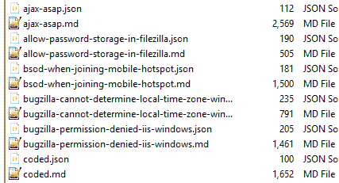

# 封存一个泥巴球(或者，我如何从定制软件转移到 Jekyll)

> 原文：<https://dev.to/stegriff/mothballing-a-mudball-or-how-i-moved-from-custom-software-to-jekyll-e3o>

*原来在[https://stegriff.co.uk/upblog/mothballing-a-mudball/](https://stegriff.co.uk/upblog/mothballing-a-mudball/)T3】*

2014 年，我放弃了 Wordpress，在我的 PHP 开发高峰期，我决定用这些设计目标来开发一些定制的博客软件:

1.  让我写在降价
2.  让我用 FTP 从任何地方上传
3.  让我通过更新帖子来将帖子“提升”到帖子列表的顶部

像 Jekyll 这样的静态站点生成器(SSG)已经存在了。但是当时我仍然被 git 部署流程吓到了，我认为我最了解 PHP 中的动态行为的重要性。

我建立了一个博客，在它近五年的任期内，我写了大约 130 篇文章(通常平均间隔十天)。写博客很容易，因为工作流程符合我想要的工作方式。所以设计目标 1 和 2 对我来说很重要。

另一方面，设计目标 3 被证明是毫无意义的。我没有发现我想要它或者需要它，所以我和软件都忘记了它🙂

## 问题

Upblog 出现了新的问题，特别是性能和安全性。该软件的第 1 版将为每个访问者解析每篇博客文章(来自 source markdown )!一旦有了 10 篇左右的帖子，这就成了一个大问题，所以我引入了一个元数据缓存，比如帖子标题、摘录和链接。当我点击一个特殊的“/load.php”端点时，缓存被重新构建，为我的部署过程增加了一个(小的)额外步骤。

当我看到 100 个帖子左右时，博客(T2 所有帖子的列表)的[主页变得很慢。我对它进行了重构，使用 AJAX 加载帖子摘要(作为 HTML 部分视图)，这样页面就会立即出现，几秒钟后就会显示帖子。](https://stegriff.co.uk/upblog/)

[](https://res.cloudinary.com/practicaldev/image/fetch/s--Iz4zZLH3--/c_limit%2Cf_auto%2Cfl_progressive%2Cq_auto%2Cw_880/https://thepracticaldev.s3.amazonaws.com/i/jteeaejzoh4h7ezcezde.jpg)

然后，我想在我的站点的首页上展示一些帖子，使用稍微不同的数据视图，所以除了现有的 HTML 局部视图之外，我还必须引入一个 JSON 端点。

...所有这些开发任务都是由原始软件的设计和复杂性驱动的，而不是由真正的功能需求驱动的。现在，Upblog 不再帮助我了；它妨碍了我。我的孩子已经长成了一个泥球。

至于安全性，由于我的 PHP 共享主机的基础设施——没有 shell 访问，并且与我的域名主机分离——很难用 LetsEncrypt 添加 HTTPS。所以我坚持使用 HTTP，这需要改变。

与此同时，我用 Jekyll 为工作、教堂和小项目创建了网站，我对 SSGs 和 git 的恐惧已经消失了。

## 迁徙

Upblog 帖子是未经加工的，没有正面内容。当站点编译它们时，会产生一个 JSON 元数据文件(比如 post date)。这两个文件一起告诉你关于帖子的一切。我编写了一个 C#脚本，将每一对文件迁移到一个 Jekyll markdown 文件中；它实际上只是在每个文件名的前面引入了一个“yyyy-MM-dd”日期。仍然没有前沿问题。

[](https://res.cloudinary.com/practicaldev/image/fetch/s--JH-PahRt--/c_limit%2Cf_auto%2Cfl_progressive%2Cq_auto%2Cw_880/https://thepracticaldev.s3.amazonaws.com/i/bsie3t7xi1grpnacnhe6.png)

从这里开始，很容易修改我的 PHP 模板的`require`语法，使用 Liquid `include`来代替。我发现 Jekyll 插件 Ruby Gems 的日期算法与 Upblog 相似，其他插件则消除了对大多数配置的需求:

```
 plugins:
\- jekyll-optional-front-matter
\- jekyll-default-layout
\- jekyll-feed
\- jekyll-timeago
\- jekyll-titles-from-headings

~~~~

## GitHub Pages vs Netlify

I didn't realise at first that you can't run "any old plugin" on GitHub Pages (GHP). GHP is an intentionally limited platform, expected to compile fairly vanilla sites. They don't want to run arbitrary Ruby code on there, and I get it.

Netlify, in contrast, is a more fully-featured container...izer... giving you the liberty to compile whatever the heck you want. So I moved my build process there. I just used the web interface (not the CLI) to set up, and it wasn't hard.

## Legacy and Redirects

I am keen to never break a link. **[The best URLs are the ones that never change][timbl]**.

But I knew that if I pointed <https://stegriff.co.uk> to my Netlify site, it would break a lot of links to old content on my PHP server. The site goes back much further than the Upblog era, with plenty of externally-linked content dating back as far as 2008\. So I have a two step plan:

 1\. Leave the old server up at `files.stegriff.co.uk` and try to give visitors helpful 404 pages which get them back on track to the right resource, and
 2\. Gradually migrate frequently-accessed content to the Netlify site

This introduced a new risk; having two copies of my blog online. Doing that would wreck SEO and also provide a confusing visitor experience (I'd applied a new style to the new version)


As a result, I hamstrung the Upblog software's `index.php` (the file responsible for handling all requests and redirecting you to a rendered post), replacing it with a clever redirect to the *corresponding post* on the new site. Any non-post requests just go to the stegriff index page.

There were a few other things to tweak, like the netlify `_redirects` file, and some DNS-level stuff. With config in so many places, I knew I needed documentation, so I wrote an `infrastructure.md` file in my website repo which tells future Ste anything he needs to know!

[timbl]: https://www.w3.org/Provider/Style/URI

## Outcomes 


Outcomes have been great:

 * I'm on HTTPS
 * Deployment is actually easier than ever (git is pretty much as ubiquitous as FTP, plus no more `/load.php` step)
 * It's easier to add new features
 * Site speed has increased enormously (static HTML is much faster than a ponderous PHP script!)

There were other small wins, like removing jQuery as a dependency, because I no longer load front page posts via AJAX.

## Lessons

 + **Do** try to find a blogging system that fits your mind
 + **Do** invest the time in giving existing systems the benefit of the doubt, and trying them out
 + **Don't** reinvent the wheel!
 + **Do** pause, analyse, and calibrate your choices when possible

As this post is syndicated on dev.to, I wonder what you think? If you've been through a similar journey, link your story in the comments. Have you ever declared URL bankruptcy and just broken every link on your website? What do you think of Netlify and Jekyll?

Thanks for reading my long story!

*Original at <https://stegriff.co.uk/upblog/mothballing-a-mudball/>* 
```

Enter fullscreen mode Exit fullscreen mode