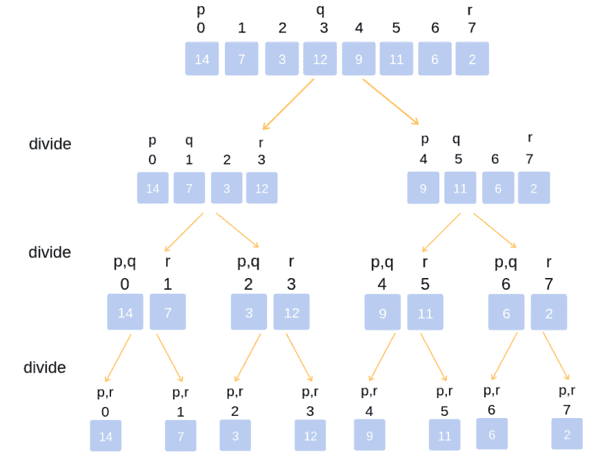

# C #中的合并排序

> 原文：<https://dev.to/_sumeetm/merge-sort-in-c-22ka>

[归并排序](https://www.interviewbit.com/tutorial/merge-sort-algorithm/)是一种分治算法，它递归地对给定的元素集进行排序。

[](https://res.cloudinary.com/practicaldev/image/fetch/s--ALGySXBH--/c_limit%2Cf_auto%2Cfl_progressive%2Cq_auto%2Cw_880/https://s3-us-west-2.amazonaws.com/tutorials-image/merge%2Bsort%2Bworking.png)

## 归并排序的伪代码可以写成如下:

```
//A->array, l->left most index, r->right most index
MERGE-SORT(A, l, r)//function named “MERGE-SORT” to sort the array “A”, with the lower bound “l” and upper bound “r” and splits the array later into two parts.
    if  l < r
        mid = (l+(r-l)/2)
    MERGE-SORT(A, l, mid)// Function call keeps on splitting the left part of the array till single element is achieved.

    MERGE-SORT (A, mid+1, r)// Function call keeps on splitting the right part of the array till single element is achieved..

    MERGE(A, l, mid ,r)
end func

MERGE(A, l, mid, r)
    nL = mid-l+1 //nL tells the max number of elements in the array L
    nR = r-mid //nR tells the max number of elements in the array R
    Create arrays L[1..nL+1] and R[1..nR+1]
    for  i=0 to nL-1
        L[i] = A[l+i]
   end for
    for j=0 to nR-1 // adds elements to the initial array A
        R[j] = A[m+l+j]
    end for

    i=0;  j=0;  k=l;
    while  i < nL and j < nR  // adds elements to the initial array A
        if  L[i] <= R[j]
            A[k]=L[i];  i=i+1;  k=k+1;
        else
            A[k]=R[j];  j=j+1;  k=k+1;
    end while

    while  i < nL  // adds elements to the initial array A
        A[k]=L[i];  i=i+1;  k=k+1;
    end while

    while  j < nR  // adds elements to the initial array A
        A[k]=R[j];  j=j+1;  k=k+1;
    end while
end func 
```

合并排序说明:

[https://www.youtube.com/embed/uOjJPtVA24k](https://www.youtube.com/embed/uOjJPtVA24k)

## C 程序进行归并排序

```
#include<stdlib.h> 
#include<stdio.h> 

// Merges two subarrays of arr[ ]. 
// First subarray is arr[l..m] 
// Second subarray is arr[m+1..r] 
void merge(int arr[ ], int l, int m, int r) 
{ 
    int i, j, k; 
    int n1 = m - l + 1; 
    int n2 = r - m; 

    /* create temp arrays */
    int L[n1], R[n2]; 

    /* Copy data to temp arrays L[ ] and R[ ] */
    for (i = 0; i < n1; i++) 
        L[i] = arr[l + i]; 
    for (j = 0; j < n2; j++) 
        R[j] = arr[m + 1+ j]; 

    /* Merge the temp arrays back into arr[l..r]*/
    i = 0; // Initial index of first subarray 
    j = 0; // Initial index of second subarray 
    k = l; // Initial index of merged subarray 
    while (i < n1 && j < n2) 
    { 
        if (L[i] <= R[j]) 
        { 
            arr[k] = L[i]; 
            i++; 
        } 
        else
        { 
            arr[k] = R[j]; 
            j++; 
        } 
        k++; 
    } 

    /* Copy the remaining elements of L[], if there 
    are any */
    while (i < n1) 
    { 
        arr[k] = L[i]; 
        i++; 
        k++; 
    } 

    /* Copy the remaining elements of R[], if there 
    are any */
    while (j < n2) 
    { 
        arr[k] = R[j]; 
        j++; 
        k++; 
    } 
} 

/* l is for left index and r is right index of the 
sub-array of arr to be sorted */
void mergeSort(int arr[], int l, int r) 
{ 
    if (l < r) 
    { 
        // Same as (l+r)/2, but avoids overflow for 
        // large l and h 
        int m = l+(r-l)/2; 

        // Sort first and second halves 
        mergeSort(arr, l, m); 
        mergeSort(arr, m+1, r); 

        merge(arr, l, m, r); 
    } 
} 

/* UTILITY FUNCTIONS */
/* Function to print an array */
void printArray(int A[ ], int size) 
{ 
    int i; 
    for (i=0; i < size; i++) 
        printf("%d ", A[i]); 
    printf("\n"); 
} 

/* Driver program to test above functions */
int main() 
{ 
    int arr[] = {12, 11, 13, 5, 6, 7}; 
// or you can take input direct from the user itself using scanf function
    int arr_size = sizeof(arr)/sizeof(arr[0]); 

    printf("Given array is \n"); 
    printArray(arr, arr_size); 

    mergeSort(arr, 0, arr_size - 1); 

    printf("\nSorted array is \n"); 
    printArray(arr, arr_size); 
    return 0; 
} 
```