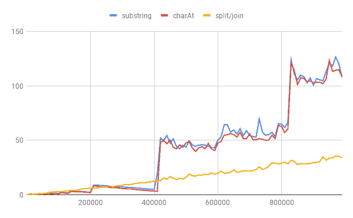
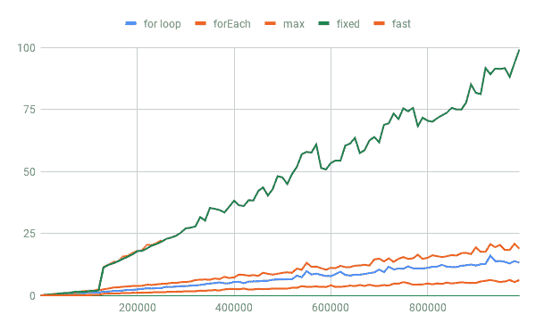

# 常见算法问题的 JavaScript 解决方案的性能测量(第 1 部分)

> 原文：<https://dev.to/detunized/performance-measurement-of-javascript-solutions-to-common-algorithmic-questions-part-1-3ig5>

*原贴于[detunized.net](https://detunized.net/posts/2019-02-21-performance-measurement-of-javascript-solutions-to-common-algorithmic-questions-part-1/)T3】*

我偶然发现了一条[推文](https://twitter.com/emmawedekind/status/1097855481052303360)，然后是[艾玛·韦德金德](https://dev.to/@emmawedekind)的[帖子](https://dev.to/emmawedekind/breaking-down-javascript-solutions-to-common-algorithmic-questions-part-1-1228)。她介绍了一些 JavaScript 职位最常见面试问题的解决方案。有三个不同的问题。对于每一个，她都提供了一个*强力*和一个*优化*的解决方案，后者是一个更短更优雅的版本，通常使用函数式编程风格而不是 C 风格的循环。虽然我不会称他们为*蛮力*和*优化*，而是*幼稚*和*优雅*。

任何人只要掌握了语言的基本概念并理解了问题，就可以写出简单的解决方案。*优雅的*解决方案需要对标准库有更好的了解。代码变得更加清晰和简洁。但这有时会带来性能损失，乍一看并不明显。在这篇文章中，我想回顾一些不太明显的观点。

## 反转一串

拿第一个问题来说:反转一个字符串。为了简单起见，让我们首先假设在我们想要反转的字符串中只有基本的 ASCII 或单码位 UTF-16 字符。如果情况不是这样的话，我稍后会谈到该怎么办。

```
function reverseString(str) {
    let reversedString = '';

    for (let i = str.length - 1; i >= 0; i--) {
        reversedString += str.charAt(i);
    }

    return reversedString;
} 
```

这里我们把原字符串后面的字符一个一个的追加到空字符串的乞求中。这样我们就得到了反向的字符串。这里发生的一件不明显的事情是字符串重新分配。JavaScript 中的字符串是不可变的，这意味着每次我们修改一个字符串，都会创建一个副本。我敢肯定，有一些聪明的优化，不要重新分配太多，不要创建太多无用的副本。但事实是，一些阵列必须增长，一些重新分配和复制必须发生。每次发生重新分配时，都会保留一些新的内存，旧字符串的所有字节都被复制到新的位置。这需要额外的时间，如果你看代码，这是看不见的。最好是预先分配内存，因为我们提前知道需要多少字符。据我所知，在 JavaScript 中没有办法做到这一点。

```
function reverseString(str) {
    return str.split('').reverse().join('');
} 
```

这个解决方案肯定更清晰、更优雅。对代码进行推理要容易得多。这个函数的作用显而易见。

这里隐藏的危险是虚拟机必须分配额外的内存来保存临时内存。这段代码大致相当于以下代码:

```
function reverseString(str) {
    let chars = str.split('');
    let reversed = chars.reverse();
    let result = reversed.join('');
    return result;
} 
```

当像这样写的时候，很明显在执行过程中，我们需要在内存中保存至少两个字符串的副本。第一个`chars`。它必须与最初的`str`共存。下一个`reversed`。在短时间内，它必须与`chars`共存。然后`result`必须和`reversed`共存。所以最坏的情况是 4 倍的内存。假设现在字符串有 1GB 长。并且垃圾收集器在这些调用之间启动，总的运行时间会比看起来长很多。

下面是一些快速而粗略的分析(x 轴是字符串长度，y 轴是毫秒):

[](https://res.cloudinary.com/practicaldev/image/fetch/s--mEv3fpIf--/c_limit%2Cf_auto%2Cfl_progressive%2Cq_auto%2Cw_880/https://i.imgur.com/8szFkSr.png)

这里优雅的解决方案确实是优化的。我猜这是因为所有的工作都是在处理字符串的原生函数中完成的，而不是在虚拟机上运行的 JavaScript 代码。正如您所见，由于底层虚拟机和 CPU 架构的复杂性，前两种解决方案并不是完全线性的。这将需要一篇单独的文章(或几篇)来解释。

我在上面简单提到了字符编码问题。仅仅反转`utf-16`代码点是不安全的。关于 Unicode 文本如何形成有一些非常复杂的规则，一些字符或字素可能多达 6 个码位。看这个[回答](https://stackoverflow.com/questions/958908/how-do-you-reverse-a-string-in-place-in-javascript/16776621#16776621)了解一些细节。长话短说:你需要使用一个特殊的库来处理字符。不要多此一举。

## 最长的单词

原始帖子的第二个问题是关于在单词由空格分隔的字符串中找到最长单词的长度。最初的解决方案是拆分原始字符串，然后在结果数组中循环查找最长的字符串:

```
function findLongestWordLength(str) {
    let maxVal = 0;

    const wordArr = str.split('  ');

    for(let i = 0; i < wordArr.length; i++) {
        let word = wordArr[i];
        if (word.length > maxVal) {
            maxVal = word.length;
        }
    }
    return maxVal;
} 
```

这个版本创建一个临时数组来存储从原始字符串中提取的所有单词。单词本身也需要存储在某个地方。因为字符串是不可变的，所以实际的字节很可能不是真的被复制，而是在原始数组中被引用。但是如果不看 VM 源代码，这很难猜测。事实是需要大量额外的内存。

*优化的*版本使用了更多的功能方法:

```
function findLongestWordLength(str) {
    const arrOfWords = str.split('  ');
    const arrOfLengths = arrOfWords.map(item => item.length);

    return Math.max(...arrOfLengths);
} 
```

在这个版本中，使用了更多的内存。`arrOfLengths`也不得不守在身边。在只有 1 个字母单词的 1GB 输入的情况下(我知道，这有点极端)，我们大约总共会浪费 3GB。

事实上，这东西有点坏了。扩展操作符`...`正在用数组元素替换函数参数。它用一大堆参数进行函数调用。这进而导致已经有 200k 个元素的堆栈溢出异常。不是一个很大的数字。在`node` REPL:

```
> Math.max(...Array(200000))
Thrown:
RangeError: Maximum call stack size exceeded 
```

为了进行基准测试，我这样修改了这个版本:

```
function findLongestWordLengthFixed(str) {
    const arrOfWords = str.split('  ');
    const arrOfLengths = arrOfWords.map(item => item.length);

    let maxLength = 0;
    for (let i = 0; i < arrOfLengths.length; ++i) {
        if (arrOfLengths[i] > maxLength) {
            maxLength = arrOfLengths[i];
        }
    }

    return maxLength;
} 
```

真正优化的解决方案是不创建任何临时数组，而是原地迭代原始字符串并找到最长的单词:

```
function findLongestWordLengthFast(str) {
    let maxLength = 0;
    let currentLength = 0;

    for (let i = 0, l = str.length; i < l; ++i) {
        if (str.charCodeAt(i) === 32) {
            if (currentLength > maxLength) {
                maxLength = currentLength;
            }
            currentLength = 0;
        } else {
            ++currentLength;
        }
    }

    // Account for the last word
    return currentLength > maxLength ? currentLength : maxLength;
} 
```

这个函数将堆分配清零，并且是非常友好的缓存。这里是一个快速配置文件(x 轴是字符串长度，y 轴是毫秒):

[](https://res.cloudinary.com/practicaldev/image/fetch/s--ZHBNS1sb--/c_limit%2Cf_auto%2Cfl_progressive%2Cq_auto%2Cw_880/https://i.imgur.com/P5rc9nT.png)

如你所见，*暴力/幼稚*版本比*优化/优雅*版本表现得好得多。

## 结论，排序

以一种更优雅、更简洁的方式重写代码总是很诱人的。有时候这是有代价的。了解代价是很重要。当然，当你反转 3 个字符的字符串时，任何解决方案都可以，这些都不重要。但是我们经常在开始时不知道系统投入生产的日期有多长。Big-O 分析很重要，但不是一切。O(n)中那些讨厌的常数也很重要。对真实系统非常重要。它们可能会产生很大的影响，比如让你的 AWS 账单翻倍，或者让响应时间延长 5 倍。下次在生产中反转字符串时请记住这一点=)

我使用[这个代码](https://gist.github.com/detunized/17f524d74f9fd567d4be7e4a3bbaf1e6)来分析上面的函数。我在 macOS 上用过`node`。该数字可能因硬件、浏览器和操作系统而异。请记住这一点。