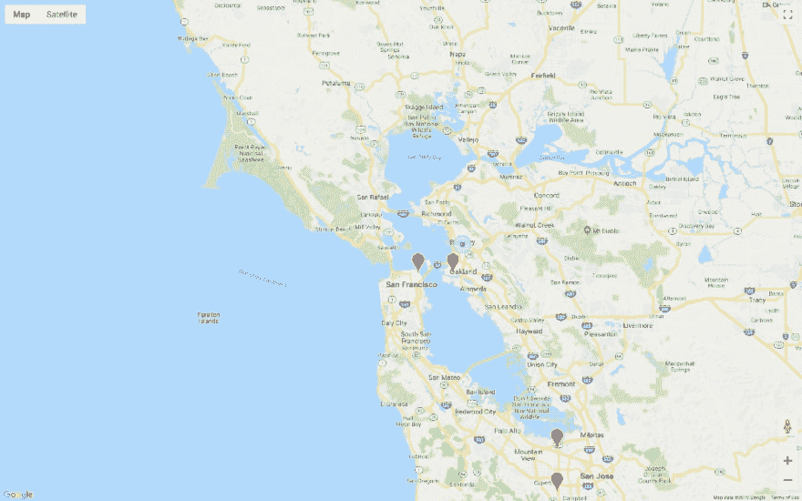

# 自定义元素或:我如何学会不再担心并爱上 Web 组件

> 原文：<https://dev.to/michaelsolati/custom-elements-or-how-i-learned-to-stop-worrying-and-love-web-components-2j7c>

如果你正在阅读这篇文章，并且你是一名网络开发人员，你可能已经在某个时候编写过前端代码。您可能需要制作一些自定义页面以及日期选择器、图像转盘或风格化按钮。作为一名前端开发人员，您可能不得不一遍又一遍地制作这些类型的组件。例如，如果你需要创建风格化的按钮，你可以在 NPM 上找到 1300 多个自定义按钮库！

<figure>[](https://res.cloudinary.com/practicaldev/image/fetch/s--kXs7bVf2--/c_limit%2Cf_auto%2Cfl_progressive%2Cq_auto%2Cw_880/https://cdn-images-1.medium.com/max/922/1%2AzZZqfiGesfAxqLCIUuVnbQ.png) 

<figcaption>确切地说是 1344 个按钮组件库</figcaption>

</figure>

这些按钮中的大多数是特定于框架的，比如 Angular、Vue 或 React，这很好，因为这些是目前 web 上最流行的框架。但是当您发现一个按钮(或另一个组件)与您的框架不兼容时会发生什么呢？

我的典型反应是继续下一个图书馆，直到我找到我喜欢的东西。然而，有些库，如 [Ionic](https://ionicframework.com/) ，实在太好了，不容忽视。问题是，在很长一段时间里，Ionic 只支持 Angular，所以如果你使用任何其他框架，你必须使用一个非官方的包装库。

> 应该有一个框架无关的解决方案！

有三种与框架无关的方法可以解决这个问题。

* * *

### CSS 方法

你可以使用 CSS 库。一个很好的例子就是 [Bootstrap](https://getbootstrap.com/) 。

```
<html>
<head>
 <link href="https://stackpath.bootstrapcdn.com/bootstrap/4.2.1/css/bootstrap.min.css">
</head>
<body>
 <button type="button" class="btn btn-primary">Primary</button>
 <button type="button" class="btn btn-secondary">Secondary</button>
 <button type="button" class="btn btn-success">Success</button>
 <button type="button" class="btn btn-danger">Danger</button>
 <button type="button" class="btn btn-warning">Warning</button>
 <button type="button" class="btn btn-info">Info</button>
 <button type="button" class="btn btn-light">Light</button>
 <button type="button" class="btn btn-dark">Dark</button>
 <button type="button" class="btn btn-link">Link</button>
 <script src="https://code.jquery.com/jquery-3.3.1.slim.min.js"></script>
 <script src="https://cdnjs.cloudflare.com/ajax/libs/popper.js/1.14.6/umd/popper.min.js"></script>
 <script src="https://stackpath.bootstrapcdn.com/bootstrap/4.2.1/js/bootstrap.min.js"></script>
</body>
</html> 
```

Enter fullscreen mode Exit fullscreen mode

如上所示，通过`<head>`中的 CDN 导入 Bootstrap，在`<body>`中有几个不同的按钮，最后，在`<body>`的底部导入几个必要的 JavaScript 库。

<figure>[](https://res.cloudinary.com/practicaldev/image/fetch/s--RcGjD5j---/c_limit%2Cf_auto%2Cfl_progressive%2Cq_auto%2Cw_880/https://cdn-images-1.medium.com/max/1000/0%2Ayv56UoDAAP7bGjxL.png) 

<figcaption>自举按钮</figcaption>

</figure>

最终的结果很好，但它需要几样东西:

1.  为了让 Bootstrap 正常工作，您不仅仅需要引入样式化组件所需的 CSS 和让某些组件具有自定义行为的 JavaScript 文件。自定义 JavaScript 逻辑本身没有问题，但是最终会需要 Bootstrap 的 JavaScript 之外的 JavaScript 库，比如 JQuery 和 Popper。这增加了应用程序必须加载才能运行的膨胀。
2.  你可能会得到一些漂亮的按钮，但是你还记得 Bootstrap 使用的所有类吗？我唯一熟悉的类是与网格相关的类。其他的，我去 [W3Schools](https://www.w3schools.com/bootstrap4/bootstrap_get_started.asp) (虽然我讨厌承认)。😅

好吧，这是一个解决方案，但可能不是最好的解决方案。

* * *

### JavaScript 方法

另一个不同的解决方案是使用纯 JavaScript，你可以在 Google Maps 这样的库中看到。

```
<html>
<head>
 <script src="https://maps.googleapis.com/maps/api/js?callback=initMap" async defer></script>
</head>
<body>
 <div id="map" style="height: 100vh; width: 100vw;"></div>
 <script>
   var map;
   function initMap() {
     map = new google.maps.Map(document.getElementById('map'), {
        center: { lat: -34.397, lng: 150.644 },
        zoom: 8
   });
 }
 </script>
</body>
</html> 
```

Enter fullscreen mode Exit fullscreen mode

使用这个解决方案，您可以在页面的`<head>`中包含 JavaScript 库。然后，您可以使用 DOM 元素来显示组件。

<figure>[](https://res.cloudinary.com/practicaldev/image/fetch/s--Ow9b8GBe--/c_limit%2Cf_auto%2Cfl_progressive%2Cq_auto%2Cw_880/https://cdn-images-1.medium.com/max/1000/0%2ADEetfH5Y1NT8OPSM.png) 

<figcaption>谷歌地图 JS 魔法</figcaption>

</figure>

这个解决方案最终更整洁，作为一个书呆子，它只是感觉很好。尽管如此，还是出现了一些问题:

1.  如果你需要一个基于 JavaScript 的库，比如带有 Angular 和 React 框架的 Google Maps，你可能需要一个包装库来使用它。为什么？现代框架试图为它们的渲染引擎提取对 DOM 的访问，并且不鼓励直接的 DOM 操作。
2.  更糟糕的是，像这样的基于 JavaScript 的库不适合服务器端渲染。

这两种解决方案都是……🤮

那么什么是更好的解决方案呢？

* * *

### Web 组件方法

从[https://www.webcomponents.org](https://www.webcomponents.org/introduction):

> Web 组件是一组 web 平台 API，允许您创建新的自定义的、可重用的、封装的 HTML 标记，以便在网页和 web 应用程序中使用。定制组件和小部件建立在 Web 组件标准的基础上，可以跨现代浏览器工作，并且可以与任何支持 HTML 的 JavaScript 库或框架一起使用。

这些(神奇的)规格是什么？有 4 个:自定义元素、HTML 模板、Shadow DOM、 ~~HTML 导入~~(已弃用)。尽管所有这些规范都很重要，但定制元素是我们感兴趣的(也是最容易混淆什么是 web 组件的)。

[自定义元素规范](https://w3c.github.io/webcomponents/spec/custom/)展示了如何创建新的 HTML 标签以及扩展现有的 HTML 标签。通过扩展内置的 HTMLElement 类，您可以只使用 JavaScript、HTML 和 CSS 构建自己的可重用 DOM 元素。您最终会得到模块化的代码，这些代码易于在您的应用程序中重用，并且需要编写的代码更少。不再需要记住 500 个不同的类名！

如果你不能想象为什么你会想要创建自定义元素，让我问…

*   你必须在 Vue 中重新制作你 3 周前在你的公司还是一家反应商店时制作的同样的按钮吗？还有下个月会不会再换框架？
*   如果你想创建一个像 Ionic 一样的组件库，可以和任何框架一起使用，或者根本不用框架，那又如何呢！？
*   当你在一家大公司工作，每个部门对其产品使用不同的框架，公司决定更新品牌风格指南，会发生什么？每个团队都必须制作相同的按钮、导航条和输入吗？
*   如果你😍90 年代，想要带回`<blink>`标签？

答案是:创建一个自定义元素！

```
// ES6 Class That Extends HTMLElement
class HelloWorld extends HTMLElement {
 // We Can Have Attributes And Listen To Changes
 static observedAttributes = [‘name’];
 attributeChangesCallback(key, oldVal, newVal) {}

// We Can Get And Set Properties
 set name(val) {}
 get name() {}

// We Have Lifecycle Hooks
 connectedCallBack(){}
 disconnectedCallBack(){}

// We Can Also Dispatch Events!!!!
 onClick() {
 this.dispatchEvent(new CustomEvent(‘nameChange’, {}));
 }
}

// Register to the Browser from `customElements` API
customElements.define(‘hello-world’, HelloWorld); 
```

Enter fullscreen mode Exit fullscreen mode

通过扩展 HTML 元素，您可以定义自己的定制元素，并完成大多数您期望从现代框架中得到的东西:

*   为元素定义属性，这些属性是通过 HTML 标记传递给元素的值，比如 id 或类。您也可以根据属性的变更来触发回呼。请记住，您只能传入字符串。
*   元素的属性有 setters 和 getters，可以向元素传递复杂的数据类型(非字符串)。
*   使用生命周期挂钩来创建和销毁元素。
*   基于元素中的交互和其他触发器调度事件。

当所有的工作都完成并且你已经构建了你的漂亮元素，你可以通过传递你想要使用的选择器来注册它，然后把你创建的类传递到`define`方法中。

* * *

### 自定义动作元素

下面是一个正在使用的定制元素的例子:长期被否决的`<blink>`标签。元素的逻辑和将其注册到 DOM 的代码被捆绑到一个 JavaScript 文件中，该文件从`<head>`中的 CDN 加载。然后，在我们的`<body>`中，`<blink>`标签像任何其他 HTML 元素一样被使用。如果你不相信这是一个真正的自定义元素，我邀请你去[检查 TS](https://stackblitz.com/edit/blink-two-demo?file=index.ts) 文件。`<blink>`标签是一个注册元素，可以通过简单的 DOM 操作来创建。

[https://stackblitz.com/edit/blink-two-demo?](https://stackblitz.com/edit/blink-two-demo?)

* * *

如果您有兴趣了解关于定制元素的更多信息，我推荐以下资源:

*   [https://www.webcomponents.org/introduction](https://www.webcomponents.org/introduction)
*   [https://polymer-library . polymer-project . org/3.0/docs/first-element/intro](https://polymer-library.polymer-project.org/3.0/docs/first-element/intro)
*   [https://dev . to/benny powers/let-build-we b-components-part-1-the-standards-3e 85](https://dev.to/bennypowers/lets-build-web-components-part-1-the-standards-3e85)

如果你对`<blink>`标签感兴趣，你可以在 [GitHub](https://github.com/MichaelSolati/blink-two) 上找到我的代码，或者在 [NPM](https://www.npmjs.com/package/blink-two) 上找到这个库的打包版本。

* * *

要了解我正在做的一切，请在 [Twitter](https://twitter.com/MichaelSolati) 上关注我。如果你在想，*“给我看看代码！”你可以在 [GitHub](https://github.com/MichaelSolati) 上找到我。*