# 2019 年网页设计的 19 大趋势

> 原文：<https://dev.to/akshaypai/top-19-trends-of-web-design-for-2019-4ho2>

2019 年即将到来，新年的钟声几乎已经开始响起。随着每一个新年的到来，新的趋势出现在我们生活的不同领域，尤其是技术领域，进化似乎总是在进行中。

随着大多数商业运作转向在线模式，网页设计已经成为商业的重要组成部分。由于网站已经慢慢成为企业在线运营的表面价值，因此出现了让它们在市场中占据优势的趋势。

让我们看看 2019 年将如何展开，并根据您的业务需求带来网页设计的新趋势:

## 1。个性化 UX

[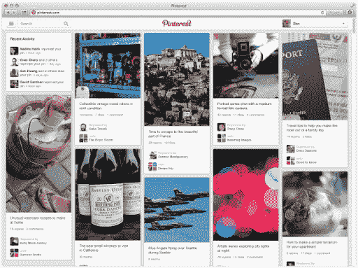](https://res.cloudinary.com/practicaldev/image/fetch/s--QrlHT9im--/c_limit%2Cf_auto%2Cfl_progressive%2Cq_auto%2Cw_880/https://www.lambdatest.com/blog/wp-content/uploads/2018/11/unnamed.png)

用户体验(UX)是庞大客户群的关键。随着大量最新技术的出现，现代用户提高了他们的期望值。现在，用普通的 UX 来吸引他们不再是这样了。这就是为什么企业聘请 UX 专家来了解和迎合他们的最终用户对他们的产品或服务的要求和期望。

随着人工智能的出现，用户体验通过个性化重新定义了自己。现在，使用人工智能，关键是通过向每个用户提供个性化的 UX，让他们成为有特权的客户。

新兴的人工智能使个性化 UX 成为 2019 年的一个主要趋势，这将有助于企业进行客户关系管理和保留活跃的客户群。

## 2。以内容为中心的 UX

[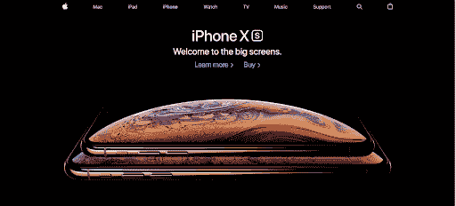](https://res.cloudinary.com/practicaldev/image/fetch/s--Zv3XPvSq--/c_limit%2Cf_auto%2Cfl_progressive%2Cq_auto%2Cw_880/https://www.lambdatest.com/blog/wp-content/uploads/2018/11/unnamed-1.png) 
正如他们正确地说的那样，内容是王道，对于一个更懂技术的现代用户来说，UX 在很大程度上是由内容驱动的。UX 和内容不一样的日子已经一去不复返了。为了给用户提供想要的体验，内容和 ux 的涌入是非常重要的。

这导致了以内容为中心的 UX，在这里，UX 更多地与网站迎合最终用户的内容有关。

有了更复杂的需求，网站就不仅仅是视觉上的吸引力或操作了，它在很大程度上已经成为以某种方式影响最终用户生活的影响者。

内容当联手 UX 将能够带来正确的势头所需的网页设计。从而使这种强大的合作成为 2019 年新兴的网页设计趋势。

## 3。极简主义和大胆的字体设计

[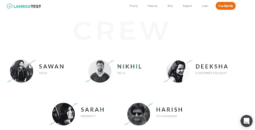](https://res.cloudinary.com/practicaldev/image/fetch/s--JmiPnKg9--/c_limit%2Cf_auto%2Cfl_progressive%2Cq_auto%2Cw_880/https://www.lambdatest.com/blog/wp-content/uploads/2018/11/unnamed-2.png)

如今，简约、干净和前卫的网站很大程度上受到终端用户的青睐，因为它们能够专注于最重要的事情，而不是在无关紧要的混乱中分心。

随着大量的信息已经无处不在，现代用户寻找一个干净的和中肯的信息，而不是每次都拐弯抹角。

而堆积了大量元素的网站，不仅分散了用户获取所需信息的注意力，还成功地推迟了它们。因为在一个充斥着各种元素的网站上寻找他们真正想要的是一项任务，这也是他们推迟的主要原因。

另一方面，一个简洁、干净、前卫、字体大胆的网站，可以帮助用户通过深思熟虑的努力很快找到所需的信息。以这种方式使用负空间，以网站的设计美学与极简主义的遗志。

这里有一个来自 LambdaTest 网站的干净和前卫的极简主义页面，它给出了清晰的信息而没有造成混乱。

## 4。增强现实

[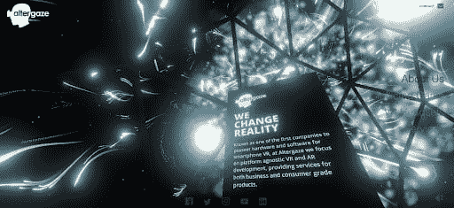](https://res.cloudinary.com/practicaldev/image/fetch/s--Glol57Se--/c_limit%2Cf_auto%2Cfl_progressive%2Cq_auto%2Cw_880/https://www.lambdatest.com/blog/wp-content/uploads/2018/11/unnamed-3.png) 
增强现实(Augmented Reality)，俗称 AR，是利用计算机生成的永久信息，通过增强现实世界的物体来修改现实世界的环境。这包括修改多种感官模式，如视觉、听觉、触觉等。

AR 帮助用户无缝地可视化和感受想象力的创造力。这将极大地增强终端用户的体验，让他们拥有强大的想象力。

这将有助于特别涉及想象力和创造力的企业，使他们能够通过他们的网站向最终用户无缝地展示他们的设计和想象力。

增强现实(AR)是一种弥合创造力和现实之间差距的技术。

## 5。gif

图形交换格式为网站提供了一个交互式用户界面(UI ),使其对最终用户更具吸引力。随着最终用户在日常生活中使用 gif 和表情符号，让它们成为网站的一部分来解释小步骤程序是网页设计的一个好主意。

在一个类似的案例中，LambdaTest 在其主页中使用了下面的 GIF 来说明 LambdaTest 如何对给定的 URL 执行实时测试的一个小的多步骤过程。
[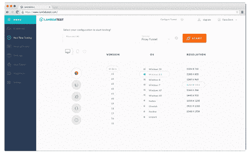T3】](https://res.cloudinary.com/practicaldev/image/fetch/s--K4LlPU_P--/c_limit%2Cf_auto%2Cfl_progressive%2Cq_66%2Cw_880/https://www.lambdatest.com/blog/wp-content/uploads/2018/11/unnamed.gif)

由于其吸引用户和建立互动的能力，GIF 是 2019 年最酷的网页设计趋势之一。

## 6。CSS3 动画

CSS3 引入了一些很酷的动画，比如使用旋转、延时、迭代、特定方向的运动等来实现上升和下降。这些 CSS3 动画可以让你的网站看起来更酷，给人一种未来科技感和科幻感。

这样的视觉效果不仅能吸引用户，还能给网站带来前卫的现代感。对于更懂技术的最终用户来说，设计一个具有现代视觉吸引力的网站会使网站与众不同。

如果你期待制作一个具有未来风格的网站来吸引你的最终用户，那么 CSS3 动画是 2019 年你必须关注的趋势。

## 7。粘性元素

 
即使在滚动时，粘性元素仍保留在页面上。这使得用户即使在滚动页面的不同部分时，也能在可及范围内始终看到重要信息。

这有助于用户，尤其是当导航栏是一个粘性元素时，帮助用户在任何时间点导航，而不用滚回页面顶部。

像 LambdaTest 这样的网站已经在他们的导航栏中使用了粘性元素，将选项放在终端用户附近。

毫无疑问，粘性元素将为最终用户带来无缝的、更好的用户体验，让用户轻松选择。

## 8。聊天机器人

[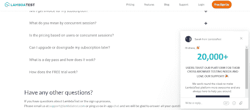](https://res.cloudinary.com/practicaldev/image/fetch/s--4BwiTdIa--/c_limit%2Cf_auto%2Cfl_progressive%2Cq_auto%2Cw_880/https://www.lambdatest.com/blog/wp-content/uploads/2018/11/unnamed-6.png)

聊天机器人使用户能够从团队获得即时帮助，增强了用户体验，使其无缝。通过网站中的聊天机器人，您的最终用户可以立即与您的团队联系。

聊天机器人在向现有客户提供支持的同时，在接纳新客户和有效处理查询方面非常有用。

像 Product Hunt 和 LambdaTest 这样的网站一直在使用聊天机器人来帮助他们的客户进行实时聊天，从而将最终用户的体验提高了许多倍。

这种顾客的惊奇和用户的友好使聊天机器人成为网页设计中不可或缺的一部分，特别是对 SaaS 公司来说。

## 9。进度谱

[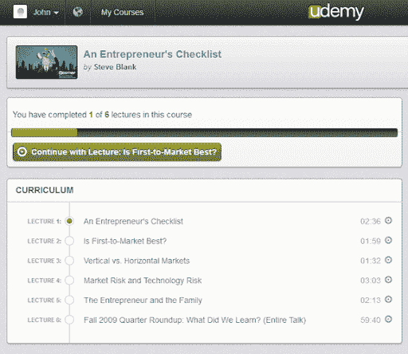](https://res.cloudinary.com/practicaldev/image/fetch/s--XifPzdvR--/c_limit%2Cf_auto%2Cfl_progressive%2Cq_auto%2Cw_880/https://www.lambdatest.com/blog/wp-content/uploads/2018/11/unnamed-7.png)

进度谱显示程序的进度。这有助于用户了解还有多少工作要做，从而估计出完成该过程所需的时间。

通常，在需要遵循多步骤流程的电子商务网站中，progress spectrum 会引导用户并让他们知道他们在流程中已经完成了多少。

它还为用户提供了他们所遵循的程序的可视状态，通过提供清晰的进展增强了最终用户的体验。

对于一个最终用户有权遵循多步骤程序的网站，进度谱是一个必须保持的元素。

## 10。不对称布局

[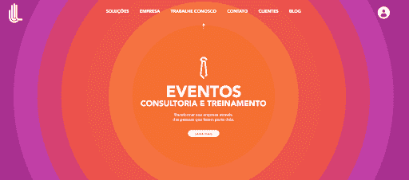](https://res.cloudinary.com/practicaldev/image/fetch/s--4XzbVr91--/c_limit%2Cf_auto%2Cfl_progressive%2Cq_auto%2Cw_880/https://www.lambdatest.com/blog/wp-content/uploads/2018/11/unnamed-8.png)

对称布局被认为是网页设计中一个非常流行的趋势的日子已经一去不复返了。不对称的布局或破碎的网格，是 2019 年必须遵循的网页设计趋势。

虽然网格带来了更清晰和尖锐的外观，但不对称的布局或破碎的网格成功地吸引了用户并获得了他们的注意。

由于脱颖而出的更高参与度，不对称布局是 2019 年网站设计的必然趋势，让你的网站变得很酷。

## 11。单页设计

[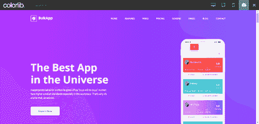](https://res.cloudinary.com/practicaldev/image/fetch/s--IFriGRfB--/c_limit%2Cf_auto%2Cfl_progressive%2Cq_auto%2Cw_880/https://www.lambdatest.com/blog/wp-content/uploads/2018/11/unnamed-9.png)

随着用户忙于浏览网站的时间越来越少，简洁的单页设计是一种有效的表达方式。单页面设计的最大优点是加载速度快，可以将用户体验提高很多倍。

与此同时，它的简洁有助于获得用户的关注，使其成为 2019 年流行趋势中一个有效和有影响力的网页设计。

## 12。微型动画

[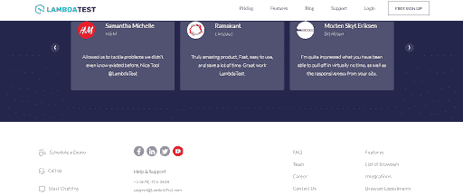](https://res.cloudinary.com/practicaldev/image/fetch/s--zob2d4Ed--/c_limit%2Cf_auto%2Cfl_progressive%2Cq_auto%2Cw_880/https://www.lambdatest.com/blog/wp-content/uploads/2018/11/unnamed-10.png)

用户爱动画！通过微型动画来说明，不仅使你的网站看起来很酷，而且使它非常用户友好，给它一个超越单调网站的优势。

这种视觉享受将帮助用户更容易理解内容，并在他们的记忆中保留更长的时间。从而帮助用户在他们的脑海中建立你的网站的品牌形象。

同时，它通过帮助用户来帮助他们，增强整体用户体验。微型动画，而不是使用冗长和严格的文本，是 2019 年高效网页设计的主要趋势之一。

## 13。卡片布局

[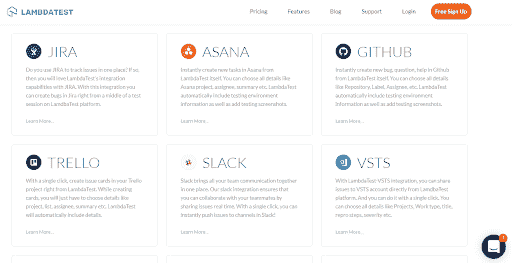](https://res.cloudinary.com/practicaldev/image/fetch/s--m3-I7PzD--/c_limit%2Cf_auto%2Cfl_progressive%2Cq_auto%2Cw_880/https://www.lambdatest.com/blog/wp-content/uploads/2018/11/unnamed-11.png)

使用卡片布局来描述页面上的多个元素是描述网站内容的有效方式。它为用户提供了对元素的广泛概述，并提供了选择并展开每个元素以了解更多元素的选项。

卡片布局是一种有效的方式，可以在一页上简洁地给出信息的一个更宽的视角，让整个信息在用户的指尖上。从而方便用户在较短的时间内浏览大量信息。

LambdaTest 使用卡片布局让他们的用户知道 LambdaTest 提供给他们的集成选项。

这种用户友好性使卡片布局成为 2019 年应该遵循的网页设计的顶级趋势。
[T3】](https://goo.gl/JgCPrZ)

## 14。投影和深度

[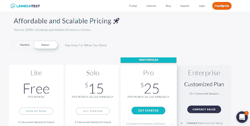](https://res.cloudinary.com/practicaldev/image/fetch/s--9JdZrS6x--/c_limit%2Cf_auto%2Cfl_progressive%2Cq_auto%2Cw_880/https://www.lambdatest.com/blog/wp-content/uploads/2018/11/unnamed-13.png)

给网页上的不同元素添加阴影和深度，帮助用户立即关注它。通过强调所需的元素或块，这已经成功地引起了用户的注意。

它还为设计提供了优势，使其在视觉上对最终用户更具吸引力。

下面是 LambdaTest 如何使用投影和深度来突出他们最受欢迎的计划。

由于这种强调和视觉吸引力，为用户提供增强的用户界面，阴影和深度已成为 2019 年网页设计的 19 大趋势之一。

## 15。鲜艳的饱和配色方案

[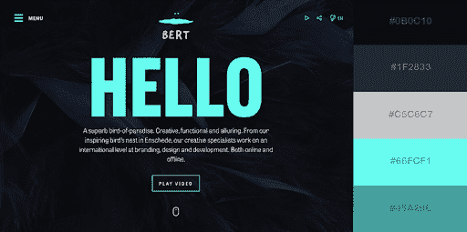](https://res.cloudinary.com/practicaldev/image/fetch/s--MBdbdHin--/c_limit%2Cf_auto%2Cfl_progressive%2Cq_auto%2Cw_880/https://www.lambdatest.com/blog/wp-content/uploads/2018/11/unnamed-12.png)

充满活力的饱和配色方案能够毫不费力地吸引用户的注意力，具有高端的视觉吸引力。这不仅增强了网站的美感和视觉吸引力，还改善了用户界面，提高了用户交互的速度。

一个充满活力的饱和色彩的明亮色调的网站将能够吸引更多的用户。

## 16。自定义插图

[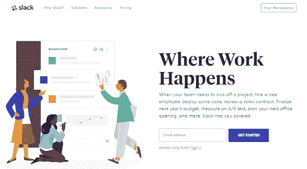](https://res.cloudinary.com/practicaldev/image/fetch/s--pfy3DSGA--/c_limit%2Cf_auto%2Cfl_progressive%2Cq_auto%2Cw_880/https://www.lambdatest.com/blog/wp-content/uploads/2018/11/unnamed-14.png)

在你的网站上有自定义插图有助于建立用户熟悉的品牌形象。通过定制插图，您可以让您的网站以其独特的品牌形象在市场上的其他竞争者中脱颖而出。

这就是 slack 如何在他们的网站上使用自定义插图来制作他们独特的品牌标识。

如果你正在为你的网站寻找一个独特的品牌标识，那么抛弃那些普通的图片，使用定制的插图。

## 17。2D 插图

[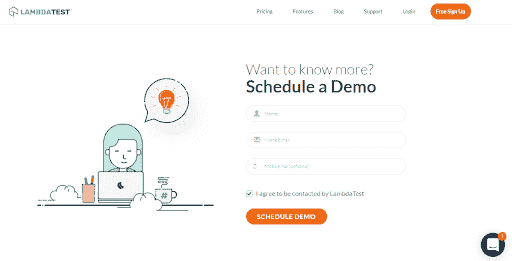](https://res.cloudinary.com/practicaldev/image/fetch/s--y4vXSHN2--/c_limit%2Cf_auto%2Cfl_progressive%2Cq_auto%2Cw_880/https://www.lambdatest.com/blog/wp-content/uploads/2018/11/unnamed-15.png)

在你的网站上使用 2D 插图，通过给最终用户创造视觉冲击，更有效地传达你的内容。一幅 2D 插图不仅能给你的最终用户带来视觉享受，还能让信息更容易理解，从而帮助他们更长时间地记住信息。

LambdaTest 在其网站的不同部分使用 2D 插图，为最终用户创造更好的影响。

因此，对于一个视觉上更具吸引力的网站来说，遵循 2019 年 2D 插画网页设计趋势是非常有益的。

## 18。多彩的白色

[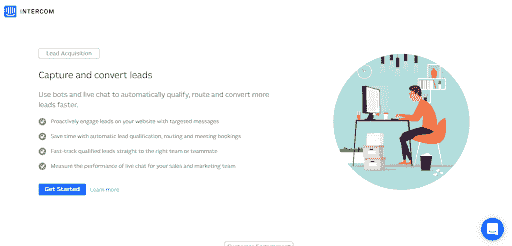](https://res.cloudinary.com/practicaldev/image/fetch/s--UC0lmU_F--/c_limit%2Cf_auto%2Cfl_progressive%2Cq_auto%2Cw_880/https://www.lambdatest.com/blog/wp-content/uploads/2018/11/unnamed-16.png)

保持你的网页设计色彩鲜艳的白色，给它一个干净和前卫的外观。这使得网站上的信息对最终用户来说更加清晰易懂，从而大大增强了用户体验。

五颜六色的白色网站，如 Asana、LambdaTest、Slack 和 Intercom，有助于用户轻松掌握网站上的信息和细节，并在视觉记忆中保留更长时间。这使得多彩白成为 2019 年网页设计的顶级趋势之一。

## 19。响应式设计

设计不同手机版本网站的日子已经一去不复返了。通过网站的响应式设计，您的最终用户可以在不同设备上无缝体验网站，而不会出现任何错位。这种设计有助于网站以灵活而恰当的方式呈现内容，这种呈现方式基于网站所依赖的设备和操作系统。

随着时间的推移，响应式设计为精通技术的最终用户提供了在不同屏幕分辨率的不同设备上访问网站的灵活性。因此，如果你期待提供灵活无缝的用户体验，响应式设计是 2019 年必须遵循的网页设计趋势。

为你提供了一个平台，你可以在 44 个不同的设备上一次性测试你的 RWD(响应式网页设计)!

有了这些网页设计的 19 大趋势，你就可以通过多重折叠来提升网站的用户体验和视觉美感。因此，这将有助于提高您的业务，提高客户满意度，并在市场上树立更好的品牌形象。在下面的评论区让我们知道你最喜欢哪个网页设计。如果你觉得你最喜欢的趋势不见了，也不要提建议。

原文出处:[lambdatest.com](https://goo.gl/uCzq7X)

**相关帖子**

1.  [网站管理员的 6 大 HTML5 趋势](https://goo.gl/2QTPZE)
2.  [用 LambdaTest 测试渐进式 Web 应用程序](https://goo.gl/iF1tnF)
3.  [克服探索性测试中面临的挑战](https://goo.gl/DYp841)